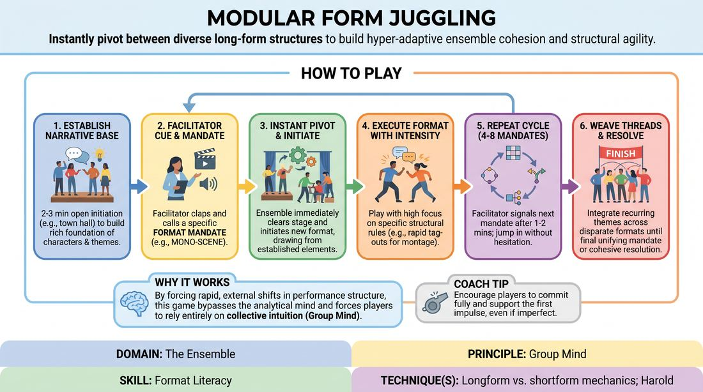

# Modular Format Juggling

{ .game-hero }

> Instantly pivot between diverse long-form structures to build hyper-adaptive ensemble cohesion and structural agility.

## Overview
An advanced training exercise where an ensemble must rapidly transition between distinct improvisational formats on a facilitator's cue. Starting from a shared narrative base, players instantly adapt their staging, pacing, and comedic focus to execute specific structural mandates. The experience is high-energy, demanding intense focus, rapid-fire editing, and deep collective trust.

## What It Trains
- **Domain:** D4 — The Ensemble
- **Principle(s):** Group Mind; Follow the Follower; Serve the Piece; Make Your Partner a Genius
- **Skill(s):** Format Literacy; Peripheral Awareness; Support Work; Pacing & Rhythm; Thematic Synthesis; Game Identification
- **Technique(s):** Longform vs. shortform mechanics; Harold; Armando; Montage; Edits (Sweep, Tag-Out, Sound/Light); Timing exercises
- **Focus:** skill_drill

**Objective:** To develop advanced format literacy and group mind by training players to instantly recognize, execute, and transition between different long-form and short-form structural mechanics under pressure.

## Setup
An open stage space with 4 to 8 proficient players standing on the back line. One facilitator stands off-stage with a clear signaling device (like a handclap or a bell) to call out structural mandates. No props or chairs are required.

## How to Play
1. Begin with a 2-to-3 minute open narrative initiation (such as a town hall or a multi-character relationship scene) to establish a rich baseline of characters, locations, themes, and conflicts.
2. Once a solid foundation of source material is established, the facilitator signals an edit with a sharp clap and calls out a specific Format Mandate (such as Montage on Theme or Armando Monologue).
3. The ensemble must instantly clear the stage and initiate the mandated format, drawing directly from the characters, relationships, or themes established in the opening phase.
4. Execute the mandated format with high intensity and concise choices, focusing on the specific structural rules of that format (such as rapid tag-outs for a montage, or finding a clear game of the scene for a Harold beat).
5. After 1 to 2 minutes of play, the facilitator will signal another edit and call out a completely different Format Mandate, requiring an immediate, collective pivot.
6. Players must jump into the new format without hesitation, self-correcting and supporting whoever takes the lead to establish the new structural framework.
7. Continue this cycle of rapid-fire transitions through 4 to 8 different mandates, weaving recurring thematic threads and character callbacks across the disparate structures.
8. The facilitator brings the exercise to a close by calling scene after a final, unifying mandate or when the ensemble achieves a highly cohesive structural resolution.

## Facilitation Notes
- Pacing the Edits: Call the next mandate just as a module reaches its peak energy or when players begin to over-complicate the narrative. Keep each module between 45 seconds and 2 minutes to maintain high urgency.
- Varying the Mandates: Curate a diverse sequence of mandates that contrast in energy and style (e.g., follow a high-energy Montage with a slow, grounded Armando Monologue, or a physical Sound and Movement Score).
- Pitfall - Hesitation: If players freeze or negotiate verbally during a transition, pause the game and remind them to follow the follower. The first physical initiation on stage dictates how the group interprets the mandate.
- Pitfall - Losing the Thread: Ensure players are actively recycling the characters and themes from the opening initiation rather than inventing entirely new premises for every single mandate.
- Coaching Cue: Use side-coaching phrases like 'Commit to the structure immediately!', 'Who is leading? Support them!', and 'Bring back the relationship from the opening!'

## Variations
- Ensemble-Driven Transitions: Remove the facilitator. The ensemble must collectively decide when to transition and which format to execute next using non-verbal cues, physical shifts, or organic stage edits.
- Stylistic Modifiers: Layer genre or tonal constraints onto the structural mandates (e.g., 'Harold Game, but as a Shakespearean tragedy' or 'Montage, but in the style of film noir').
- Thematic Callbacks: Challenge players to take a specific, minor detail from an early module and make it the central focus of a completely different structural module later in the run.

## Debrief
- How did the rapid shifting of formats affect your reliance on narrative versus your reliance on your scene partners?
- What non-verbal cues did we use to instantly agree on who was leading a new module?
- Which format transitions felt seamless, and what made those specific transitions successful?
- How did we balance executing the strict rules of a format while keeping the overall thematic thread alive?

## Safety & Inclusion
Ensure the physical space is clear of obstacles, as transitions can be rapid and highly physical. Encourage players to use clear, deliberate physical staging to signal their entrances and exits safely, and allow players to self-select out of high-physicality modules (like Sound and Movement) by taking supporting off-stage roles.

## Why It Works
By forcing rapid, external shifts in performance structure, this game bypasses the analytical mind and forces players to rely entirely on collective intuition (Group Mind). It treats complex long-form formats as modular building blocks, demystifying their mechanics and training players to prioritize the structural needs of the overall piece over individual narrative agendas.
