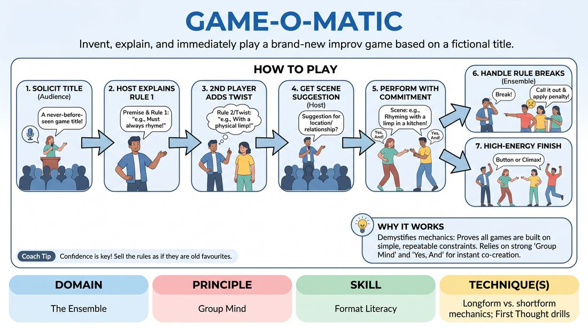

# Instant Game Generator

{ .game-hero }

> Invent, explain, and immediately play a brand-new improv game based on a fictional title.

## Overview
In this high-stakes performance game, players solicit a completely made-up game title from the audience, instantly co-create its rules on stage, and then execute it as if it were a classic, well-rehearsed format. It is a thrilling exercise in collective confidence, spontaneous rule-making, and format literacy under pressure.

## What It Trains
- **Domain:** D4 — The Ensemble
- **Principle(s):** Group Mind; The First Thought Is a Gift; Yes, And; The Audience Is the Final Scene Partner
- **Skill(s):** Format Literacy; Unfiltered Spontaneity; Offer Reception; Room Reading
- **Technique(s):** Longform vs. shortform mechanics; First Thought drills; Yes, And… sentence games; Reading the suggestion's intent
- **Focus:** comedy_game

**Objective:** Develops deep group mind, format literacy, and the ability to instantly establish and commit to structural constraints (shortform vs. longform mechanics) on the fly.

## Setup
An in-person performance space with an audience. A group of 4 to 8 players stands in a line-up or semi-circle facing the audience. No props or materials are required.

## How to Play
1. Step forward and ask the audience for the title of an improv game that has never existed before.
2. Once a title is received, one player immediately steps forward as the 'Host' and confidently explains the basic premise and the first rule of this 'classic' game.
3. A second player steps forward to add a crucial second rule, twist, or physical constraint, solidifying the format's mechanics.
4. The Host asks the audience for a standard scene suggestion (e.g., a location or relationship) to initiate the game.
5. The players immediately begin performing a scene, strictly adhering to the newly established rules with absolute commitment.
6. If a player accidentally breaks one of the newly invented rules, the ensemble must call it out in character or apply a playful, spontaneous penalty.
7. The scene concludes naturally with a high-energy button or when the structural gimmick reaches its logical climax.

## Facilitation Notes
- Coaching cue: 'Commit to the rules as if they are ancient laws of theater!' Absolute commitment makes even absurd rules hilarious.
- Pitfall: Overcomplicating the rules. Fix: Keep the rules to two simple constraints—usually one physical constraint and one verbal or structural constraint.
- Coaching cue: 'Listen to your teammates' rule additions—do not contradict them, yes-and them.'
- If players forget the rules during play, have an off-stage player or the host loudly call out reminders or 'penalties' to keep the game on track.

## Variations
- The Director's Cut: A designated director stands off-stage and pauses the game to add new rules mid-scene as the players adapt.
- Competitive Mode: Divide the players into two teams who must both play the newly invented game, with the audience voting on who followed the rules better.
- Silent Rules: The players invent the rules silently through physical play, and the audience has to guess what the rules are at the end.

## Debrief
- How did we use 'Group Mind' to ensure we were all playing the same game?
- What made the invented rules successful or difficult to follow?
- How does understanding standard shortform mechanics help us invent new ones on the fly?

## Safety & Inclusion
Ensure that physical constraints invented on the fly respect all players' physical boundaries and accessibility needs. If a rule involves physical contact or high mobility, players should adapt it instantly to be inclusive.

## Why It Works
It forces players to demystify game mechanics. By instantly creating and executing a format, players realize that all improv games are built on simple, repeatable constraints. It relies heavily on 'Group Mind' and 'Yes, And' to make the invented structure feel deliberate and polished to the audience.
