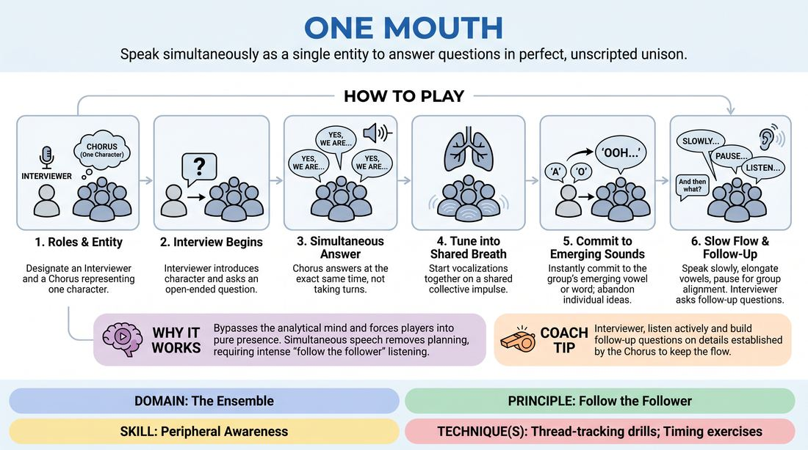

# The Single Voice

{ .game-hero }

> Speak simultaneously as a single entity to answer questions in perfect, unscripted unison.

## Overview
In this exercise, one player acts as an interviewer while the remaining players form a tight-knit chorus representing a single character. The chorus must answer questions in real-time unison, blending their voices, pacing, and ideas without a designated leader. The result is a powerful experience of group mind where players must listen deeply to the collective breath and micro-movements of the ensemble.

## What It Trains
- **Domain:** D4 — The Ensemble
- **Principle(s):** Follow the Follower; Group Mind; Yes, And; The First Thought Is a Gift
- **Skill(s):** Peripheral Awareness; Pacing & Rhythm; Active Listening; Unfiltered Spontaneity
- **Technique(s):** Thread-tracking drills; Timing exercises; Last Word Response; First Thought drills
- **Focus:** connection

**Objective:** To develop deep peripheral awareness, active listening, and the ability to 'follow the follower' by matching vocal rhythm, pitch, and intent in real time.

## Setup
An in-person playing space. One player is designated as the Interviewer and stands facing the rest of the group. The remaining players (the Chorus, ideally 3 to 7 people) stand shoulder-to-shoulder in a tight semi-circle or line, maintaining close physical proximity to maximize peripheral vision and auditory connection.

## How to Play
1. Designate one player as the Interviewer and the remaining players as the Chorus, who collectively represent a single character.
2. The Interviewer begins by introducing the character and asking a simple, open-ended question.
3. The Chorus must answer the question simultaneously, speaking at the exact same time rather than taking turns or speaking word-by-word.
4. To achieve unison, players must tune into the collective breath, starting their vocalizations together on a shared impulse.
5. If a player hears a specific vowel sound or word emerging from the group, they must instantly commit to that choice, abandoning their own individual ideas to support the collective direction.
6. The Chorus should speak slowly, elongating vowels and pausing naturally between words to allow the group mind to align on the next syllable.
7. The Interviewer listens actively, asking follow-up questions that build on the details established by the Chorus, keeping the conversation flowing for 3 to 5 minutes.

## Facilitation Notes
- Side-coaching cue: 'Breathe together.' Encourage the Chorus to take a collective breath before starting any sentence to synchronize their timing.
- Side-coaching cue: 'Lean into the vowel.' Elongating the first sound of a word gives the rest of the group a fraction of a second to lock onto the same word.
- Pitfall: One dominant player steamrolls the group with their own pre-planned answers. Fix: Instruct the dominant player to focus entirely on matching the pitch and volume of the person next to them, or physically move them to the edge of the lineup.
- Pitfall: The group hesitates and falls into silence out of fear of making a mistake. Fix: Remind them that 'the first thought is a gift'—any sound made by anyone is the correct sound, and everyone must immediately jump on it.

## Variations
- Physical Unison: Have the Chorus match physical gestures and posture shifts in real-time alongside their synchronized speech.
- Emotional Shifts: The Interviewer can call out emotional states (e.g., 'Now you are terrified' or 'Answer with extreme joy') to force the Chorus to shift their vocal quality in unison.
- The Oracle: Instead of an interview, the Chorus acts as an ancient oracle answering profound or absurd questions from a line of seekers.

## Debrief
- How did it feel to let go of your individual ideas in order to support the emerging voice of the group?
- What physical or auditory cues did you rely on to stay in sync with your fellow players?
- When the unison faltered, how did you recover and find the collective rhythm again?

## Safety & Inclusion
Ensure players stand close enough to feel the group's presence but respect personal space boundaries. If standing for long periods is difficult, the Chorus can perform the exercise seated in a tight semi-circle, focusing on vocal and breath cues.

## Why It Works
This game works because it bypasses the analytical mind and forces players into a state of pure presence. By requiring simultaneous speech, it removes the possibility of planning ahead. Players must practice 'follow the follower'—constantly shifting between leading a syllable and instantly yielding to another's impulse, relying entirely on peripheral awareness and shared rhythm.
