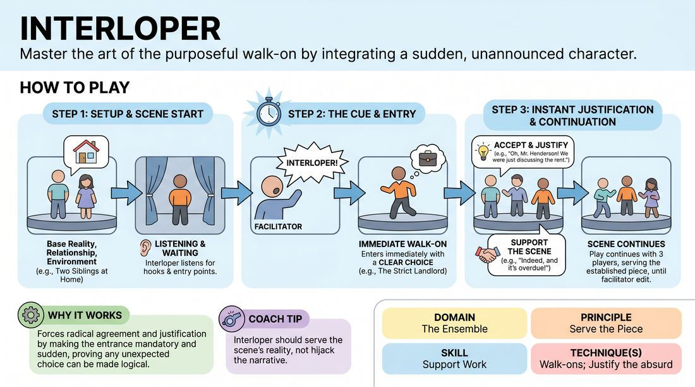

# The Interloper

{ .game-hero }

> Master the art of the purposeful walk-on by integrating a sudden, unannounced character.

## Overview
Two players initiate a grounded, relationship-focused scene while a third player waits offstage. At a sudden cue from the facilitator, the offstage player must immediately enter the scene, forcing all players to instantly justify the intrusion and seamlessly weave the new character into the existing narrative.

## What It Trains
- **Domain:** D4 — The Ensemble
- **Principle(s):** Serve the Piece; Base Reality First
- **Skill(s):** Support Work; Justification
- **Technique(s):** Walk-ons; Justify the absurd
- **Focus:** skill_drill

**Objective:** Develops active listening, rapid justification, and the ability to execute supportive walk-ons that serve the established scene rather than disrupting it.

## Setup
A clear performance space with designated onstage and offstage (wing) areas. No props or chairs are required.

## How to Play
1. Assign two players to start on stage and one player to wait in the wings as the designated Interloper.
2. The onstage players begin a scene based on a simple suggestion, focusing on establishing a clear base reality, relationship, and environment.
3. The offstage Interloper listens closely to the scene, looking for narrative hooks, relationship dynamics, and logical entry points.
4. At a moment of their choosing, the facilitator calls out 'Interloper!'
5. Upon hearing the cue, the offstage player must immediately enter the scene with a clear physical or character choice.
6. The onstage players must instantly accept the new arrival, immediately justifying who this person is and why their presence makes perfect sense in this moment.
7. The Interloper focuses on supporting the existing scene dynamics, serving the piece rather than hijacking the narrative.
8. The scene continues with all three players until the facilitator edits.

## Facilitation Notes
- Side-coach the onstage players to avoid denial: 'Don't ask who they are; tell them who they are!'
- Encourage the Interloper to enter with a clear relationship to the characters or the space, rather than entering as a random stranger.
- Common Pitfall: The Interloper enters and completely derails the existing scene. Fix: Remind the entering player that their job is to support and heighten the established base reality, not replace it.
- If the onstage players freeze upon the entrance, side-coach: 'How does this person's arrival help or complicate your current situation?'

## Variations
- Silent Interloper: The entering player must not speak upon entry, forcing the onstage players to do all the verbal justification based on the Interloper's physical choices.
- Self-Cued Interloper: Remove the facilitator's cue. The offstage player must read the scene and choose their own perfect moment to initiate the walk-on.
- Multi-Interloper: The facilitator can call 'Interloper!' multiple times, bringing in a fourth and fifth player sequentially to practice managing larger group dynamics.

## Debrief
- For the onstage players, what helped you instantly accept and justify the new character's arrival?
- For the Interloper, how did listening to the base reality before your entrance shape your character choice?
- How does a successful justification of a walk-on serve the overall piece rather than just individual comedic choices?

## Safety & Inclusion
Ensure the offstage entry pathways are completely clear of physical hazards, chairs, or cables so the Interloper can enter the stage quickly and safely.

## Why It Works
This game strips away the hesitation often associated with walk-ons by making the entrance mandatory and sudden. It forces players to practice radical agreement and justification, proving that any unexpected choice can be made logical and satisfying if the ensemble commits to serving the scene.
