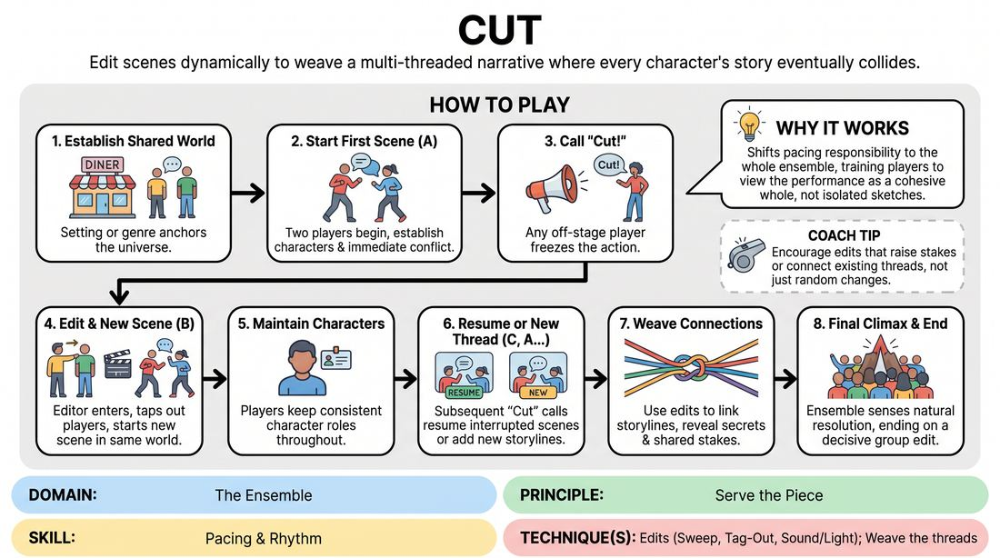

# Cut and Splice

{ .game-hero }

> Edit scenes dynamically to weave a multi-threaded narrative where every character's story eventually collides.

## Overview
In this dynamic long-form narrative game, players build an interconnected, multi-character world by actively interrupting and resuming scenes. By calling out 'Cut,' off-stage players edit the action, introducing new storylines or reviving previous ones to weave a cohesive, soap-opera-style tapestry.

## What It Trains
- **Domain:** D4 — The Ensemble
- **Principle(s):** Serve the Piece; Group Mind; Serve the Story
- **Skill(s):** Pacing & Rhythm; Thematic Synthesis; Narrative Architecture
- **Technique(s):** Edits (Sweep, Tag-Out, Sound/Light); Weave the threads
- **Focus:** narrative

**Objective:** Develops active editing skills, narrative pacing, and thematic synthesis by training players to track multiple storylines and edit at high-impact moments.

## Setup
Players stand or sit in a semi-circle facing a clear performance space. No props or materials are required. The group agrees on a shared setting or genre to anchor the narrative universe.

## How to Play
1. Establish a shared setting or genre, such as a small-town diner, a high-stakes hospital, or a family-run business, to anchor the world.
2. Two players step into the performance space to initiate the first scene, establishing their characters, relationship, and an immediate conflict.
3. At any point during the scene, any player waiting on the sidelines can call out 'Cut!' to freeze the active players.
4. The editing player immediately enters the space, taps one or more players to remain or exit, and initiates a new scene within the same universe.
5. Players must maintain consistent characters throughout the entire game; once a character is established, that player represents that character whenever they are on stage.
6. Subsequent 'Cut' calls can either introduce brand-new storylines or resume previously interrupted scenes, picking up exactly where they left off or jumping forward in time.
7. As the narrative progresses, players should use their edits to weave the different storylines together, revealing hidden connections, secrets, and shared stakes.
8. The game concludes when the ensemble senses a natural climax or resolution that ties the major narrative threads together, ending on a final, decisive group edit.

## Facilitation Notes
- Coaching cue: 'Edit on a high note! Don't wait for a scene to lose steam; cut when the tension or comedy is at its peak.'
- Pitfall: Players editing too quickly before a scene has established its platform. Fix: Encourage players to let the initial relationship and environment breathe for at least 30 seconds before the first edit.
- Coaching cue: 'Look for the threads. How does the character in the current scene relate to the character we saw two scenes ago?'
- Pitfall: Forgetting previous storylines and only starting new ones, leading to a fragmented narrative. Fix: Remind players to actively listen from the sidelines and deliberately bring back unresolved scenes to advance their plots.

## Variations
- The Director's Cut: A designated facilitator acts as an external director, calling 'Cut!' and offering specific prompts, time jumps, or stylistic directions to guide the narrative pacing.
- Split Screen: Instead of completely replacing the active scene, a 'Cut' freezes one half of the stage while a parallel scene plays out on the other half, highlighting thematic connections.
- Genre Shift: Apply specific genre tropes, such as film noir, sci-fi, or Victorian melodrama, to dictate the style of edits and character archetypes.

## Debrief
- How did editing on high-tension moments affect the overall energy and pacing of the piece?
- What strategies did you use to track the different storylines and find natural connections between them?
- How did it feel to have your scene interrupted, and how did you maintain your character's momentum when returning to it later?

## Safety & Inclusion
Ensure that when players are edited into or out of scenes, physical contact is limited to light, consensual shoulder taps, or managed entirely through verbal cues and eye contact.

## Why It Works
By giving every player the power to edit, the game shifts the responsibility of pacing from the active performers to the entire ensemble. It trains players to view the performance as a cohesive whole rather than a series of isolated sketches, fostering deep listening, narrative patience, and collaborative storytelling.
