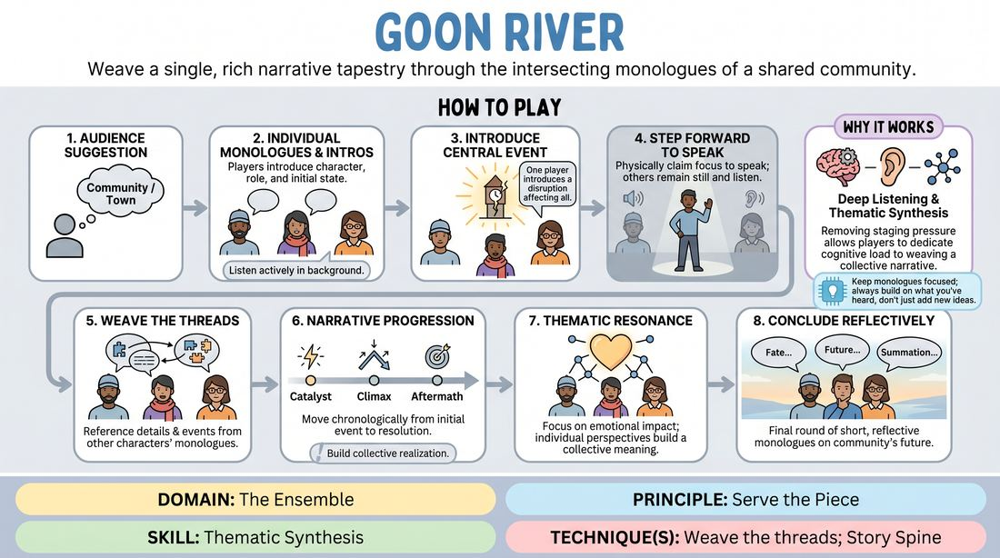

# Echoes of the Valley

{ .game-hero }

> Weave a single, rich narrative tapestry through the intersecting monologues of a shared community.

## Overview
In this long-form narrative format, three to five players portray distinct members of a single community. Instead of acting out scenes, players step forward individually to deliver monologues that reveal their personal perspectives on a shared, unfolding event. The magic of the game lies in how these separate voices cross-reference, build upon, and synthesize each other's details to create a unified, deeply textured story.

## What It Trains
- **Domain:** D4 — The Ensemble
- **Principle(s):** The First Thought Is a Gift; Serve the Story; Serve the Piece
- **Skill(s):** Unfiltered Spontaneity; Active Listening; Narrative Architecture; Thematic Synthesis
- **Technique(s):** Story Spine; Reincorporation-as-justification; Weave the threads
- **Focus:** narrative

**Objective:** To develop thematic synthesis and ensemble cohesion by training players to actively listen to disparate narrative threads and weave them into a singular, emotionally resonant story.

## At a Glance
| Aspect | Detail |
|---|---|
| Players | 3–5 (ideal 3-5) |
| Time | ~20 min |
| Complexity | 4/5 |
| Skill level | competent |
| Energy | medium |
| Physicality | low |
| Modality | in_person |
| Space | minimal |
| Props | none |
| Audience | required |

## Setup
Players stand in a straight line facing the audience. The space is clear. The facilitator obtains a single suggestion of a location (e.g., 'a coastal town,' 'a fading mining outpost') or a central event (e.g., 'the day the clock tower stopped').

## How to Play
1. Obtain a suggestion of a specific community, town, or shared environment from the audience.
2. Each player, one by one, steps forward to deliver a brief opening monologue introducing their character, their role in the community, and their initial state of mind.
3. As the monologues progress, one player introduces a central event, mystery, or disruption affecting the entire community.
4. Players do not speak over each other; instead, a player steps forward physically to claim the focus, while the others remain still and listen intently in the background line.
5. In subsequent monologues, players must actively reference details, names, and events established by the other characters, showing how their own character is affected by or connected to those elements.
6. Allow the narrative to progress chronologically through the monologues, moving from the initial catalyst to the climax and eventual aftermath.
7. Focus on the emotional and thematic resonance of the shared event, ensuring that the individual perspectives build toward a collective realization or resolution.
8. Conclude the piece with a final round of short, reflective monologues from each character, offering a poetic summation of their fate or the community's future.

## Facilitation Notes
- Coaching Cue: 'Listen for the echoes! If someone mentions a red scarf or a broken fence, find a way for your character to have seen it, caused it, or felt its impact.'
- Pitfall: Players telling isolated stories that never intersect. Fix: Remind players that they are not in separate universes; they must actively use at least one detail established by the previous speaker in their next monologue.
- Coaching Cue: 'Step forward with conviction.' Encourage physical commitment to taking focus so the audience and ensemble know exactly who is speaking.
- Pitfall: Rushing the plot. Fix: Encourage players to focus on character depth and sensory details rather than just driving the action forward.

## Variations
- The Ghostly Retrospective: All characters are speaking from beyond the grave, reflecting on the final days of their community or a tragedy that befell them.
- Object Pass: A physical object is introduced in the first monologue and must be passed from character to character throughout the narrative, changing meaning with each handoff.
- The Interrogation: The monologues are framed as testimonies to an unseen investigator, adding a layer of mystery and conflicting truths.

## Debrief
- How did it feel to build a story entirely through monologue without direct scene work?
- What was the most satisfying moment of reincorporation or thread-weaving you noticed?
- How did listening to others change the trajectory of your own character's arc?

## Safety & Inclusion
Ensure players establish clear boundaries regarding heavy themes (like tragedy or community loss) before starting, using a pre-show check-in or 'out of character' pause if the narrative veers into sensitive territory.

## Why It Works
By removing the immediate pressure of physical staging and rapid-fire dialogue, players can dedicate their cognitive load to deep listening and thematic synthesis. The step-forward mechanic creates a clean focus, allowing the ensemble to treat every spoken word as a 'gift' to be cataloged and woven back into the larger narrative tapestry.
