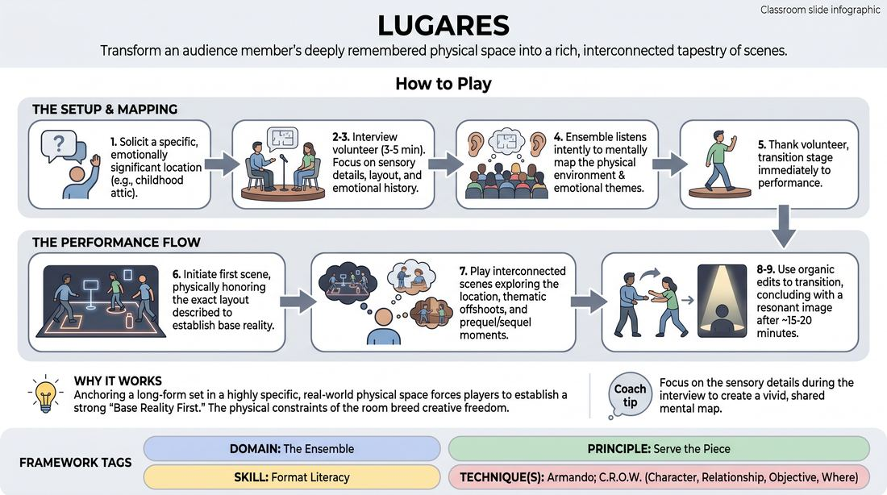

# The Memory Map

{ .game-hero }

> Transform an audience member's deeply remembered physical space into a rich, interconnected tapestry of scenes.

## Overview
This is an ensemble-driven long-form format where players interview an audience member about a specific, emotionally significant location from their past. The cast meticulously maps out the physical layout and emotional history of this space, then uses these details as the foundation for a series of interconnected, thematic scenes. The result is a deeply grounded performance that balances physical precision with imaginative storytelling.

## What It Trains
- **Domain:** D4 — The Ensemble
- **Principle(s):** Serve the Piece; Base Reality First; The Audience Is the Final Scene Partner
- **Skill(s):** Format Literacy; World-Building; Thematic Synthesis; Room Reading
- **Technique(s):** Armando; C.R.O.W. (Character, Relationship, Objective, Where); Weave the threads
- **Focus:** mixed

**Objective:** Develops format literacy, active listening, and thematic synthesis by translating real-world architectural and emotional details into a cohesive, multi-scene long-form piece.

## At a Glance
| Aspect | Detail |
|---|---|
| Players | 4+ (ideal 6-10) |
| Time | ~25 min |
| Complexity | 4/5 |
| Skill level | proficient |
| Energy | medium |
| Physicality | medium |
| Modality | in_person |
| Space | moderate |
| Props | none |
| Audience | required |

## Setup
A semi-circle of chairs upstage for the ensemble, two chairs placed downstage center for the interviewer and the audience guest, and a clear performance space. No props are required.

## How to Play
1. Solicit a suggestion from the audience for a specific location from their past that holds strong personal or emotional significance, such as a childhood attic, a grandparent's kitchen, or a first apartment.
2. Invite the volunteer who suggested the location onto the stage and seat them downstage next to a designated interviewer from the ensemble.
3. Conduct a 3-to-5-minute interview focusing on sensory details, physical layout (where are the doors, windows, furniture, and hidden spots?), and the emotional memories or secrets associated with the space.
4. Ensure the rest of the ensemble sits upstage, listening intently to mentally map the physical environment and note recurring emotional themes.
5. Thank the volunteer and escort them back to their seat, transitioning the stage immediately into the performance phase.
6. Initiate the first scene by physically stepping into the mapped space, honoring the exact layout described by the volunteer to establish a strong, grounded base reality.
7. Play a series of interconnected scenes where some take place directly in the described location, while others explore thematic offshoots, prequel/sequel moments, or characters inspired by the interview.
8. Use organic edits, such as sweep edits or tag-outs, to transition between scenes, ensuring that every piece of the performance serves the overarching themes established in the interview.
9. Conclude the long-form set after approximately 15 to 20 minutes by returning to a resonant image or theme from the original location, bringing the piece to a natural, satisfying close.

## Facilitation Notes
- Coaching Cue: 'Listen for the secrets, not just the furniture.' Remind players to capture the emotional undertones of the interview, not just the physical layout.
- Pitfall: Players ignoring the physical map. Fix: Side-coach players to actively use the doors, windows, and objects exactly where the interviewee placed them to honor the source material.
- Coaching Cue: 'Let the inspiration breathe.' Remind the ensemble that they do not have to play the actual interviewee; they should create fictional characters inspired by the emotional truths revealed.
- Pitfall: The interview goes too long or becomes overly heavy. Fix: Keep the interview focused, warm, and structured, steering away from deeply traumatic topics while keeping it emotionally honest.

## Variations
- The Split-Screen: Play two scenes simultaneously on stage—one showing the past history of the room, and the other showing the present day in the exact same space.
- The Ghost Walk: Have one player play the 'spirit' or 'essence' of the room itself, narrating transitions between scenes based on the physical objects left behind.
- The Monologue Hybrid: Instead of an audience interview, have multiple cast members deliver short, true monologues about their own real-life emotional spaces to inspire the scenes.

## Debrief
- How did honoring the physical layout of the room ground our scene work and choices?
- How did we balance literal representation of the interview with creative, thematic leaps?
- What did you notice about how the audience connected to the performance when their peer's real life was the source material?

## Safety & Inclusion
Ensure the interviewer establishes a warm, consensual boundary with the audience volunteer. Explicitly state that the guest only needs to share what they are comfortable sharing, and avoid probing into deep trauma. If the guest seems uncomfortable, gently pivot to lighter physical details of the space.

## Why It Works
By anchoring a long-form set in a highly specific, real-world physical space, players are forced to establish a strong 'Base Reality First.' The physical constraints of the room breed creative freedom, while the emotional truth of the interview provides a rich thematic spine that naturally helps the ensemble 'Serve the Piece.'
