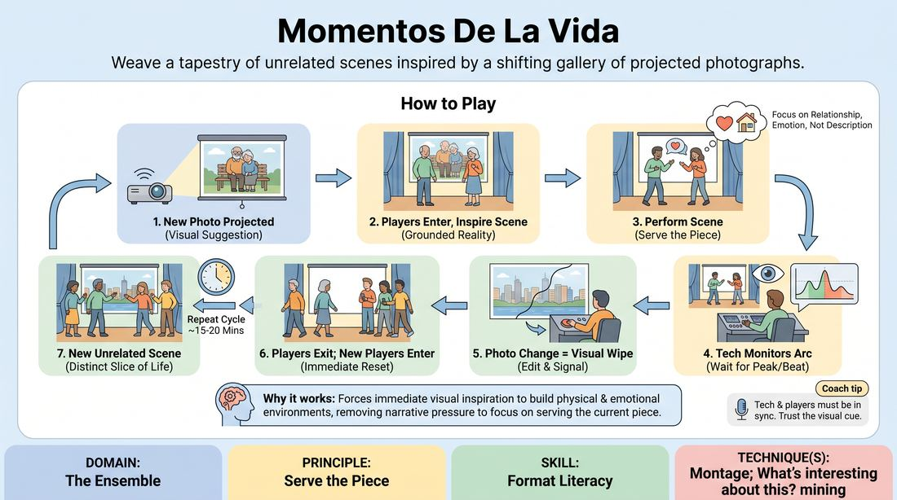

# Captured Moments

{ .game-hero }

> Weave a tapestry of unrelated scenes inspired by a shifting gallery of projected photographs.

## Overview
Captured Moments is a long-form montage format where players perform a series of independent, unconnected scenes, each initiated by a new photograph projected onto a screen. The ensemble must instantly establish a grounded base reality inspired by the visual prompt, playing out the moment until the next image appears to sweep them into a new world.

## What It Trains
- **Domain:** D4 — The Ensemble
- **Principle(s):** Serve the Piece; Base Reality First
- **Skill(s):** Format Literacy; Suggestion Deconstruction (A-to-C); World-Building
- **Technique(s):** Montage; What's interesting about this? mining; C.R.O.W. (Character, Relationship, Objective, Where)
- **Focus:** mixed

**Objective:** To develop format literacy, montage transitions, and rapid world-building by using visual suggestions to establish a strong base reality and serve the overall flow of the piece.

## At a Glance
| Aspect | Detail |
|---|---|
| Players | 4+ (ideal 6-12) |
| Time | ~25 min |
| Complexity | 4/5 |
| Skill level | competent |
| Energy | medium |
| Physicality | medium |
| Modality | in_person |
| Space | moderate |
| Props | Projector, Photographs, Screen |
| Audience | required |

## Setup
Set up a projector and screen on stage, clearly visible to both the players and the audience. Prepare a curated slideshow of diverse, evocative photographs (e.g., landscapes, portraits, unusual situations, historical moments) controlled by a tech operator or facilitator. Players stand in the wings or off-stage, ready to enter.

## How to Play
1. The facilitator or tech operator projects the first photograph onto the screen to begin the performance.
2. Two or more players step onto the stage, using the photograph as an immediate visual suggestion to establish a grounded base reality.
3. The players perform a scene, focusing on relationship, environment, and the emotional truth suggested by the image rather than just describing what is in the photo.
4. The tech operator monitors the scene's arc, looking for a natural peak, a strong emotional beat, or a clean punchline.
5. When the scene reaches its natural conclusion, the tech operator projects a new photograph onto the screen.
6. The projection of the new photograph acts as an edit (a visual wipe), signaling the current players to exit the stage immediately.
7. A new set of players steps forward to initiate a completely unrelated scene inspired by the new image.
8. This cycle continues for a set duration of approximately 15 to 20 minutes, creating a fluid montage of distinct, unconnected slices of life.

## Facilitation Notes
- Coaching cue: 'Don't just describe the photo; inhabit the world it implies.' Encourage players to find the emotional core of the image.
- Common pitfall: Players trying to connect all the scenes into a single narrative. Fix: Remind them that this is a montage of distinct, independent moments; let each photo stand on its own.
- Coaching cue: 'Let the image dictate the tone.' Some photos suggest quiet, dramatic moments, while others invite high-energy comedy.
- Common pitfall: The tech operator changing slides too quickly or too slowly. Fix: Coach the tech operator to look for the natural climax or resolution of the scene's main relationship beat before editing.

## Variations
- Thematic Thread: Although the scenes are narrative-independent, players can carry over a subtle thematic or emotional thread from the previous scene into the next.
- The Human Slide: If a projector is unavailable, off-stage players can step forward and freeze in a physical tableau to act as the 'photograph' for the next scene.
- A-to-C Leap: Instead of literal interpretation, players must use the photograph to inspire a completely different setting or concept that is two associative leaps away.

## Debrief
- How did the visual prompt help you establish a base reality more quickly than a verbal suggestion?
- What did you notice about the pacing and transitions when the edit was controlled by an external visual cue?
- How did we serve the overall piece by letting go of narrative connection and focusing on individual, high-quality moments?

## Safety & Inclusion
Ensure the curated photographs do not contain triggering, graphic, or culturally insensitive imagery. Advise players to respect physical boundaries when entering and exiting the stage quickly during visual transitions.

## Why It Works
It forces players to rely on immediate visual inspiration to build a physical and emotional environment. By removing the pressure to connect scenes narratively, players can focus entirely on serving the immediate piece and mastering the montage format.
