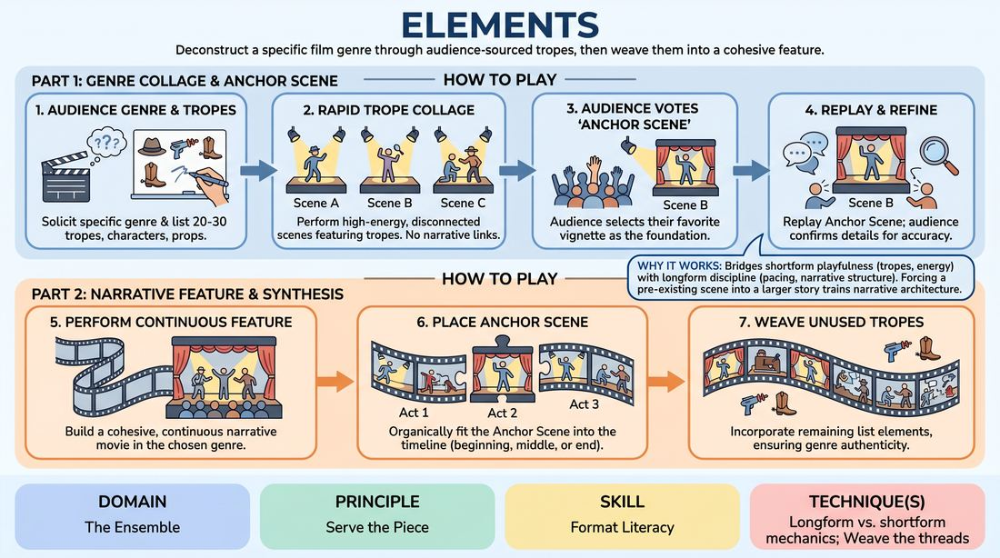

# The Genre Blueprint

{ .game-hero }

> Deconstruct a specific film genre through audience-sourced tropes, then weave them into a cohesive feature.

## Overview
This is a two-part longform format that explores genre conventions and narrative structure. Players first generate a rapid collage of disconnected, trope-heavy scenes based on a highly specific cinematic style, then synthesize these elements into a fully realized, continuous narrative centered around an audience-selected favorite scene.

## What It Trains
- **Domain:** D4 — The Ensemble
- **Principle(s):** Serve the Piece; Serve the Story; The Audience Is the Final Scene Partner
- **Skill(s):** Format Literacy; Thematic Synthesis; Narrative Architecture; Room Reading
- **Technique(s):** Longform vs. shortform mechanics; Weave the threads; Story Spine; Reading the suggestion's intent
- **Focus:** narrative

**Objective:** Develops format literacy, thematic synthesis, and narrative architecture by balancing shortform-style trope play with longform narrative patience.

## At a Glance
| Aspect | Detail |
|---|---|
| Players | 4+ (ideal 6-10) |
| Time | ~45 min |
| Complexity | 4/5 |
| Skill level | proficient |
| Energy | medium |
| Physicality | medium |
| Modality | in_person |
| Space | moderate |
| Props | Whiteboard or flipchart, Markers |
| Audience | required |

## Setup
Set up a whiteboard or flipchart visible to both the players and the audience. Have markers ready. Arrange the stage with a clear performance area and an offstage space for the ensemble.

## How to Play
1. Ask the audience for a highly specific film genre or director style (e.g., '1950s Noir,' 'Sci-Fi Space Opera,' or 'Coen Brothers Dark Comedy'), avoiding overly broad categories like 'Action.'
2. Solicit 20 to 30 specific tropes, character archetypes, iconic props, and classic situations typical of that genre from the audience, writing them clearly on the whiteboard.
3. Perform Part One: a rapid, high-energy collage of disconnected scenes where each vignette must heavily feature one or more of the brainstormed elements from the board.
4. Ensure that the scenes in Part One do not connect narratively; they should exist solely to showcase the genre's vocabulary and establish distinct comedic or dramatic moments.
5. At the end of Part One, ask the audience to vote on their favorite scene from the collage to serve as the 'Anchor Scene.'
6. Begin Part Two by replaying the Anchor Scene, encouraging the audience to call out any missed details or dialogue to ensure collaborative accuracy.
7. Perform a continuous, cohesive narrative 'movie' in the chosen genre, organically building a story where the Anchor Scene fits logically into the timeline (e.g., as the inciting incident, the midpoint, or the climax) rather than just starting the show from it.
8. Throughout the feature, weave in the remaining unused elements from the whiteboard, ensuring the narrative feels authentic to the chosen genre.

## Facilitation Notes
- Coaching Cue: 'Don't rush to connect the dots in Part One. Let each scene be its own isolated vignette.'
- Pitfall: Players try to make Part One a continuous story. Fix: Remind them that Part One is a buffet of ideas, not a linear plot. Use edit sweeps aggressively to cut scenes before they try to link up.
- Coaching Cue: 'Find where the Anchor Scene fits. Is it the crime that started it all, or the final showdown?'
- Pitfall: The Anchor Scene is placed at the very beginning of Part Two, turning it into a standard linear continuation. Fix: Encourage the players to start Part Two before or after the Anchor Scene's timeline, building anticipation for its arrival.

## Variations
- The Director's Cut: Introduce a 'Director' player who can pause the action in Part Two to add cinematic transitions, voiceovers, or split-screen effects.
- The Deleted Scenes: Allow players to pull 'deleted scenes' from Part One into Part Two as flashbacks or parallel storylines.
- Blind Elements: The audience writes elements on slips of paper, and players must draw and incorporate them mid-scene during Part One.

## Debrief
- How did separating the trope-gathering (Part One) from the narrative-building (Part Two) affect your patience in storytelling?
- What strategies did you use to organically build up to or away from the Anchor Scene without making it feel forced?
- How did having a visual blueprint (the whiteboard) help the ensemble stay aligned on the genre's tone?

## Safety & Inclusion
Ensure the chosen genre and brainstormed elements do not rely on harmful stereotypes or offensive tropes. The facilitator should actively steer the audience away from punching down or selecting genres that rely on cultural caricature.

## Why It Works
It bridges shortform playfulness (tropes, high energy, audience interaction) with longform discipline (pacing, narrative architecture, thematic synthesis). By forcing players to place a pre-existing scene somewhere in a larger narrative, it trains them to look at the macro-structure of a show rather than just the immediate moment.
