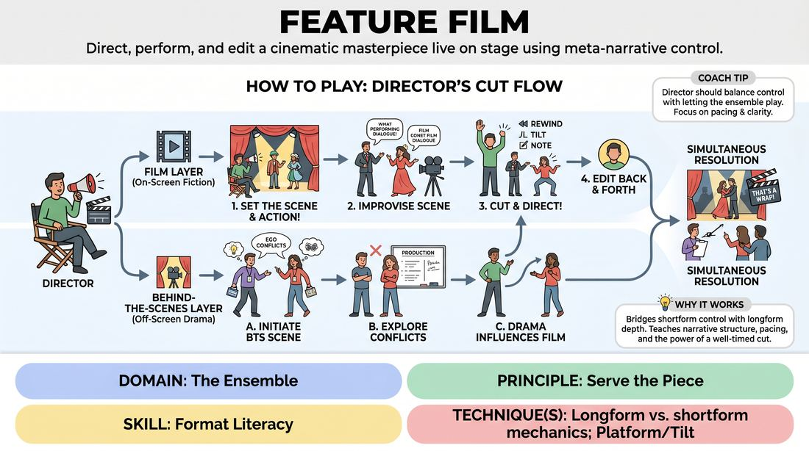

# The Director's Cut

{ .game-hero }

> Direct, perform, and edit a cinematic masterpiece live on stage using meta-narrative control.

## Overview
The Director's Cut is a multi-layered longform game where players improvise both the scenes of a fictional movie and the chaotic behind-the-scenes drama of making it. Guided by an on-stage Director who can pause, rewind, and adjust the action, the ensemble collaborates to build a cohesive, dual-narrative story. It is a high-energy exercise in format literacy that balances performance with active, real-time editing.

## What It Trains
- **Domain:** D4 — The Ensemble
- **Principle(s):** Serve the Piece; Serve the Story
- **Skill(s):** Format Literacy; Narrative Architecture; Pacing & Rhythm
- **Technique(s):** Longform vs. shortform mechanics; Platform/Tilt; Edits (Sweep, Tag-Out, Sound/Light)
- **Focus:** narrative

**Objective:** To develop format literacy and narrative architecture by teaching players how to manage pacing, transition between different narrative layers, and serve the broader structure of a piece.

## At a Glance
| Aspect | Detail |
|---|---|
| Players | 4+ (ideal 6-10) |
| Time | ~25 min |
| Complexity | 4/5 |
| Skill level | competent |
| Energy | medium |
| Physicality | medium |
| Modality | in_person |
| Space | moderate |
| Props | none |
| Audience | required |

## Setup
An open performance space with a designated stage area. Place one chair downstage left or right for the Director, facing the stage at an angle so they can see both the actors and the audience. No props are required.

## How to Play
1. Assign one player to be the Director, who sits in the Director's chair and acts as the primary narrator, editor, and meta-commentator.
2. The remaining players form the acting ensemble, standing off-stage ready to enter as characters in the film or as the 'real-life' actors and crew.
3. Obtain a suggestion from the audience, such as a fictional movie title, a bizarre genre combination, or a movie logline.
4. The Director begins the show by setting the first scene, describing the cinematic shot, the setting, and which characters are discovered on camera.
5. The actors step onto the stage and improvise the scene, adhering to the Director's stylistic choices and genre conventions.
6. At any point, the Director can call 'Cut!' to pause the action, offer feedback, demand a replay of a line with a specific 'tilt' (e.g., 'more subtext,' 'as a musical'), or fast-forward the narrative.
7. Players can also initiate 'Behind-the-Scenes' scenes, stepping out of the movie's fiction to show the actors' personal conflicts, ego clashes, or production disasters.
8. The Director edits back and forth between the 'film' and the 'making-of' layers, ensuring that off-screen drama directly influences how the on-screen characters are played.
9. The performance culminates in a final, climactic sequence where both the movie's plot and the behind-the-scenes conflicts reach a simultaneous resolution.

## Facilitation Notes
- Coaching cue: 'Director, don't just watch—edit! Use your voice to control the rhythm and transition before scenes wear out.'
- Pitfall: The Director over-directs, micro-managing every single line and suffocating the actors' choices. Fix: Remind the Director to let scenes breathe for 30-45 seconds before intervening.
- Pitfall: The behind-the-scenes drama becomes completely disconnected from the movie's plot. Fix: Encourage players to let their off-screen relationships mirror or ironically contrast their on-screen characters.
- Coaching cue: 'Actors, accept the Director's notes instantly and enthusiastically, treating every correction as a gift that elevates the comedy.'

## Variations
- The Award Ceremony: Start the game at a prestigious awards show where the cast wins an award, then flash back to show the disastrous making of the film.
- The Writer's Room: Add a second meta-character (the Screenwriter) who sits on the opposite side of the stage, typing and narrating script changes that conflict with the Director's vision.
- Studio Interference: The facilitator occasionally shouts out 'Studio Notes' (e.g., 'Make it appeal to teenagers!' or 'Cut the budget!'), forcing the Director to immediately pivot the film's direction.

## Debrief
- How did having an active editor (the Director) change how you paced your scenes compared to standard longform?
- How did the behind-the-scenes layer affect the choices you made inside the fictional movie scenes?
- What did it feel like to yield narrative control to a single director, and how did that serve the overall piece?

## Safety & Inclusion
Ensure that the 'behind-the-scenes' interpersonal drama remains playful and professional, avoiding real-world bullying dynamics. Establish clear physical boundaries before play, as the Director may call for high-intensity physical action or stunts.

## Why It Works
This game bridges the gap between shortform control mechanics and longform narrative depth. By giving one player editing power, it teaches the entire ensemble how to recognize narrative structure, pacing, and the power of a well-timed cut, ultimately building format literacy through active collaboration.
