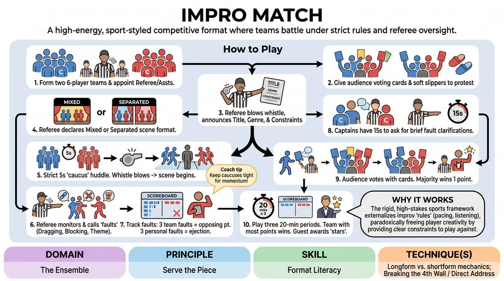

# The Rink Match

{ .game-hero }

> A high-energy, sport-styled competitive format where teams battle under strict rules and referee oversight.

## Overview
This is a highly structured, theatrical competition format modeled after a sports match. Two teams of improvisers face off in a series of fast-paced scenes governed by a strict referee who calls technical fouls, while the audience holds ultimate power through voting cards and soft projectiles. The experience is electric, combining the spontaneous joy of improv with the high-stakes tension of a live sporting event.

## What It Trains
- **Domain:** D4 — The Ensemble
- **Principle(s):** Serve the Piece; The Audience Is the Final Scene Partner; Serve the Story
- **Skill(s):** Format Literacy; Audience-Energy Management; Game Identification
- **Technique(s):** Longform vs. shortform mechanics; Breaking the 4th Wall / Direct Address; Finding & Playing the Game
- **Focus:** mixed

**Objective:** To develop format literacy, rapid game identification, and the ability to serve the overall piece under strict stylistic constraints and high-pressure performance conditions.

## Setup
Set up a large, open performance space with a clearly defined central 'rink' or playing area. Place two team benches on opposite sides of the rink, with a referee station and a visible scoreboard at the back. Prepare the following props: soft plush slippers (or foam blocks) for the audience, colored voting cards (matching the two team colors) for every audience member, a whistle and referee uniform, a set of fault cards/cheat sheets, and a bucket containing scene prompts.

## How to Play
1. Divide the players into two equal teams of six, each with a designated team captain, and appoint a Referee and two Assistant Referees to run the match.
2. Distribute colored voting cards and soft slippers to the audience, explaining that they will vote on every scene and can throw slippers at the Referee to protest unpopular decisions.
3. The Referee begins the round by blowing the whistle and drawing a challenge card containing a Title, a Category/Genre (e.g., Silent, Shakespearean, Sci-Fi), the Player Count, and the Duration (ranging from 30 seconds to 5 minutes).
4. The Referee announces whether the scene is 'Mixed' (players from both teams share the stage simultaneously) or 'Separated' (each team performs their own independent version of the prompt sequentially).
5. Give the teams a strict 5-second 'caucus' to huddle and decide who is entering the rink, then blow the whistle to immediately begin the scene.
6. During play, the Referee monitors the scene and blows the whistle to call 'faults' (such as 'Dragging' for slow pacing, 'Blocking' for denying offers, or 'Theme Violation' for ignoring the prompt), signaling each with a specific physical gesture.
7. Track faults on the scoreboard: if a team accumulates three team faults, the opposing team is awarded a point; if an individual player receives three personal faults, they are sent to the penalty box for 5 minutes.
8. At the end of the scene, allow team captains 15 seconds to ask the Referee for brief clarifications on any called faults.
9. Call for the audience vote: audience members raise their colored cards, the Assistant Referees count the majority, and the winning team is awarded one point on the scoreboard.
10. Play three 20-minute periods, and declare the team with the most points at the end of the third period the winner, concluding with an honorary guest awarding 'stars of the match' to the top three individual performers.

## Facilitation Notes
- Coaching Cue: The Referee must play a strict, slightly antagonistic character to give the audience a fun 'villain' to react to, but they must remain absolutely fair in their actual rule enforcement to maintain the integrity of the game.
- Common Pitfall: Players becoming genuinely hyper-competitive and blocking each other in mixed scenes. Fix: Remind players that the audience votes for the best *scene*, not the loudest player. Selfish play almost always results in losing the vote.
- Coaching Cue: Keep the transitions incredibly fast. The gap between drawing a card, the 5-second caucus, and the whistle starting the scene should feel like a rapid-fire sports broadcast.
- Common Pitfall: The audience throwing slippers onto the stage during active play, creating a tripping hazard. Fix: Have the Assistant Referees immediately and aggressively sweep the slippers out of the playing area while play continues.

## Variations
- The Continuation Challenge: In a separated scene, Team B must start their performance in the exact physical freeze-frame that Team A ended in, continuing the narrative line rather than starting fresh.
- Coach's Timeout: Allow each team's coach to call one 30-second timeout per period to pull their players into a huddle and give tactical adjustments.
- The Blind Category: The Referee draws the category but does not reveal it to the players; instead, they must discover the genre through physical clues provided by the first player to enter the space.

## Debrief
- How did the strict rules and the threat of receiving a 'fault' affect your creative choices? Did it restrict you, or did it force you to be cleaner and more supportive?
- In the mixed scenes, how did you balance the desire to win points for your team with the necessity of serving the overall quality of the scene?
- How did the immediate feedback of the audience (the voting cards and the thrown slippers) change your energy and pacing on stage?

## Safety & Inclusion
Ensure the 'slippers' are made of extremely soft, lightweight plush material or foam to prevent any physical injury. Establish a strict boundary during the introduction that throwing items at players' faces is prohibited, and that all throws must be aimed at the floor or the Referee's feet. Keep the playing surface clear of debris during active scenes to prevent slips and trips.

## Why It Works
This format works because the rigid, sports-like framework creates a high-stakes environment that paradoxically frees the players' creativity. By externalizing the 'rules' of good improv (pacing, listening, platform building) into formal referee 'faults,' players become hyper-aware of format mechanics. It teaches them to 'serve the piece' because selfish play or poor narrative hygiene is instantly penalized by both the referee and the audience.
