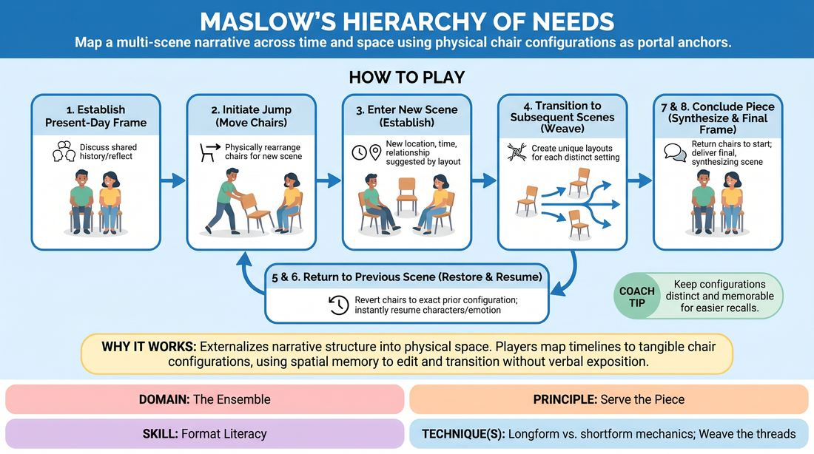

# Spatial Anchors

{ .game-hero }

> Map a multi-scene narrative across time and space using physical chair configurations as portal anchors.

## Overview
Spatial Anchors is a longform narrative format where players use the physical arrangement of chairs to represent different locations and eras in their characters' lives. By physically resetting the stage to specific chair configurations, players instantly teleport the audience back to those exact narrative moments. The performance begins and ends in a central, reflective frame, creating a satisfying, self-contained story arc.

## What It Trains
- **Domain:** D4 — The Ensemble
- **Principle(s):** Serve the Piece; Serve the Story
- **Skill(s):** Format Literacy; Thematic Synthesis; Narrative Architecture; World-Building
- **Technique(s):** Longform vs. shortform mechanics; Weave the threads; C.R.O.W. (Character, Relationship, Objective, Where)
- **Focus:** narrative

**Objective:** To develop format literacy and narrative architecture by using physical staging as a structural editing tool, helping players track complex timelines and thematic threads.

## At a Glance
| Aspect | Detail |
|---|---|
| Players | 2+ (ideal 2-4) |
| Time | ~20 min |
| Complexity | 4/5 |
| Skill level | competent |
| Energy | medium |
| Physicality | low |
| Modality | in_person |
| Space | moderate |
| Props | chairs |
| Audience | required |

## Setup
Two to four chairs placed on an open stage. An audience is seated facing the performance space. No other props are required.

## How to Play
1. Two players begin the performance seated in two chairs placed center-stage, establishing a 'present-day' or reflective frame where they discuss shared history or past events.
2. Either player can initiate a jump to a new scene (a flashback, flash-forward, or parallel location) by physically moving the chairs into a new, distinct configuration elsewhere on stage.
3. The players immediately enter this new scene, establishing the new location, relationship, and time period suggested by the new physical layout of the chairs.
4. To transition to subsequent scenes, players continue to move the chairs into new, unique arrangements, with each configuration representing a distinct setting in the story's universe.
5. To return to a previously established scene or time period, players must physically restore the chairs to the exact configuration and stage position of that specific location.
6. When returning to a previous configuration, players must instantly resume the characters, emotional states, and narrative threads of that specific setting.
7. As the narrative progresses, players weave these different timelines together, synthesizing themes and resolving conflicts across the various locations.
8. To conclude the piece, the players must return the chairs to their original center-stage configuration, stepping back into the opening frame to deliver a final, resonant resolution to the entire story.

## Facilitation Notes
- Coaching Cue: 'Commit to the geometry.' Remind players that the audience reads the physical layout of the chairs as a visual contract; precision in chair placement is key to clear narrative transitions.
- Pitfall: Getting lost in too many locations. Fix: Limit the initial run to 3 distinct chair configurations (including the home frame) so players can master the mechanics of returning and resolving before scaling up.
- Coaching Cue: 'Let the physical reset dictate your emotion.' Encourage players to let the physical act of sitting back in a specific chair configuration instantly trigger the corresponding character voice and emotional stakes.
- Pitfall: Forgetting the relationship in the home frame. Fix: Ensure the opening scene establishes a strong, unresolved emotional dynamic, giving the flashbacks a clear purpose to explore and resolve.

## Variations
- The Ensemble Expansion: Introduce a third or fourth player who can enter existing scenes or initiate their own chair configurations, requiring the ensemble to collectively track and respect the spatial map.
- Silent Transitions: Perform all chair movements in complete silence, using the physical transition as a theatrical beat to build anticipation for the next scene.
- The Object Anchor: Instead of chairs, use specific physical objects or items of clothing left on stage to anchor different timelines and locations.

## Debrief
- How did the physical act of moving the chairs help you track the narrative structure and timeline?
- What did you notice about the audience's reaction when you returned to a previously established chair configuration?
- How did the opening and closing 'home frame' give deeper meaning to the scenes that took place in the past?

## Safety & Inclusion
Ensure the stage floor is clear of tripping hazards. Players should lift chairs safely rather than dragging them if the noise is disruptive, and modifications should be made for players with mobility considerations (e.g., using hand gestures, gaze directions, or lighter props as spatial markers instead of heavy chairs).

## Why It Works
This game works because it externalizes narrative structure into physical space. By mapping timelines to tangible chair configurations, players bypass the cognitive load of verbal exposition and use spatial memory to edit and transition. This physical constraint forces a commitment to narrative economy, ensuring that every scene has a clear beginning, middle, and return.
