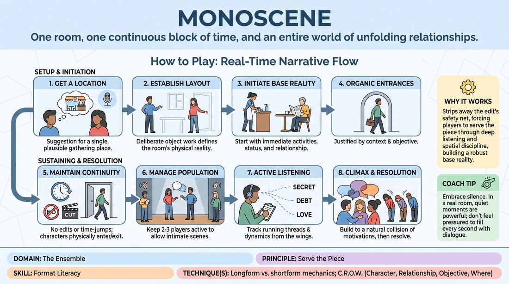

# The Monoscene

{ .game-hero }

> One room, one continuous block of time, and an entire world of unfolding relationships.

## Overview
A longform improvisation format where a cast of players explores a single, unchanging location in real-time. Without edits, time jumps, or scene cuts, players must rely on organic entrances, exits, and deep character relationships to sustain a cohesive, multi-layered narrative.

## What It Trains
- **Domain:** D4 — The Ensemble
- **Principle(s):** Serve the Piece; Base Reality First; Serve the Story
- **Skill(s):** Format Literacy; World-Building; Narrative Architecture; Pacing & Rhythm
- **Technique(s):** Longform vs. shortform mechanics; C.R.O.W. (Character, Relationship, Objective, Where); Edits (Sweep, Tag-Out, Sound/Light)
- **Focus:** mixed

**Objective:** To master longform pacing, spatial consistency, and ensemble-driven narrative architecture by sustaining a single, continuous environment without external edits.

## Setup
A performance space with a designated stage area representing the single location. A few chairs can be placed to represent furniture, but otherwise, the space is empty. The rest of the ensemble sits or stands in the wings, ready to enter.

## How to Play
1. Get a suggestion of a single, plausible location where multiple people might naturally gather, linger, or pass through.
2. Establish the physical layout of the room immediately through deliberate object work and spatial awareness by the first two players who enter.
3. Initiate the scene with a strong base reality, focusing on the characters' immediate activities, status, and relationship to the space.
4. Introduce new characters organically from the wings, ensuring each entrance is justified by the location's context and the character's specific objective.
5. Maintain a continuous timeline; there are no sweep edits, tag-outs, or time-jumps—if a character leaves, they must physically walk out of the designated room boundaries.
6. Manage the stage population dynamically, keeping the active group size to two or three players to prevent overcrowding and allow intimate conversations to breathe.
7. Listen actively from the wings to track running threads, secrets, and character dynamics, preparing to re-enter to advance established storylines.
8. Build the narrative arc toward a natural climax where the various character motivations collide, then find an organic, satisfying resolution to bring the piece to a close.

## Facilitation Notes
- Coaching cue: 'Keep the space alive!' Remind players to maintain their object work, like washing dishes or organizing papers, even when they are not speaking.
- Pitfall: The 'cluttered room' where everyone stays on stage. Fix: Side-coach players to find reasons to exit, such as checking the mail or getting a coffee, to clear the stage for two-person dynamics.
- Coaching cue: 'Justify your entrance.' Ensure players do not just walk in because they are bored; they must have a clear, character-driven reason to enter the room.
- Pitfall: Forgetting the physical layout. Fix: If a player walks through an established counter or door, gently call out 'physics check' or have another character react to the mistake.

## Variations
- The Waiting Room: A high-tension variation where characters are trapped in a space they cannot easily leave, forcing high-stakes interpersonal friction.
- The Silent Observer: One character remains on stage the entire time, acting as a silent anchor while other characters rotate around them.
- The Split-Focus Room: A larger space where two separate conversations can happen simultaneously on different sides of the stage, with focus shifting back and forth.

## Debrief
- How did the lack of edits change how you listened and paced your character choices?
- What strategies did you use to exit a scene naturally without a sweep edit to save you?
- How did maintaining a consistent physical environment help or challenge your storytelling?

## Safety & Inclusion
Ensure the physical boundaries of the room are clearly marked and free of tripping hazards. Since players are entering and exiting from the wings in real-time, keep the backstage pathways clear. Encourage players to communicate physical boundaries if scenes become physically intense.

## Why It Works
The Monoscene strips away the safety net of the edit, forcing players to serve the piece through deep listening and spatial discipline. By anchoring the performance to a single location, players must build a robust base reality and rely on character-driven narrative architecture rather than quick-cut novelty to sustain the audience's interest.
