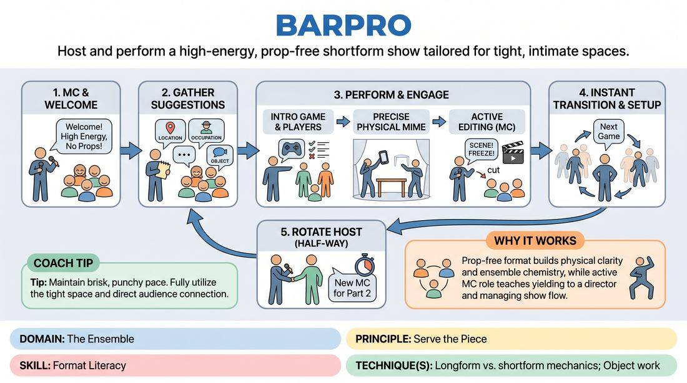

# The Intimate Showcase

{ .game-hero }

> Host and perform a high-energy, prop-free shortform show tailored for tight, intimate spaces.

## Overview
This format is a streamlined, fast-paced shortform showcase designed for small venues and close audience contact. A small ensemble of players takes turns hosting, directing, and performing a series of rapid-fire games without relying on sets, props, or complex tech. The focus is on high-energy delivery, precise physical mime, and direct, playful engagement with the crowd.

## What It Trains
- **Domain:** D4 — The Ensemble
- **Principle(s):** Serve the Piece; The Audience Is the Final Scene Partner
- **Skill(s):** Physicality & Space Work; Format Literacy; Stage Presence & Clarity
- **Technique(s):** Object work; Longform vs. shortform mechanics
- **Focus:** mixed

**Objective:** Develops format literacy by contrasting shortform and longform mechanics, specifically focusing on hosting duties, rapid game setups, tight physical space work, and serving the overall momentum of a showcase.

## Setup
An intimate performance space with the audience seated close to the stage area. No props, chairs, or set pieces are used; players stand at the sides or back of the stage when not in a scene. Prepare a list of four to five classic shortform games that require minimal setup.

## How to Play
1. Designate one player as the Master of Ceremonies (MC) for the first half, or establish a rotation where players take turns hosting.
2. The MC steps forward to welcome the audience, establish the high-energy tone, and explain the intimate, prop-free nature of the show.
3. The MC solicits a series of suggestions from the audience (such as locations, occupations, or unusual objects) to use throughout the set.
4. The MC introduces the first shortform game, explaining the rules briefly to the audience while calling up the necessary players.
5. Players perform the game, utilizing precise object work and physical mime to compensate for the lack of physical props and tight stage boundaries.
6. The MC actively edits the scenes, calling 'Scene!' or 'Freeze!' to maintain a brisk, punchy pace and prevent games from overrunning.
7. Between games, the ensemble supports the transition instantly, clearing the stage while the MC steps up to set up the next game.
8. Rotate the MC role halfway through the session to give other players experience in hosting, directing, and managing show flow.

## Facilitation Notes
- Coaching Cue: 'Keep the edits tight!' Remind the MC that shortform relies on high-momentum endings rather than letting scenes drift into longform exploration.
- Pitfall: Players crowding the small stage. Fix: Enforce a strict off-stage boundary where non-active players stand completely still and silent to keep focus on the active players.
- Coaching Cue: 'Exaggerate the mime!' Because there are no props, physical clarity must be one hundred percent precise so the audience can follow the environment.
- Encourage the MC to treat the audience as an active scene partner, checking in with them, reacting to their energy, and keeping them involved.

## Variations
- The Tag-Team Host: Two players co-host the show, playing off each other's energy and splitting the duties of explaining rules and editing scenes.
- The Hat Draw: Write game names and audience suggestions on slips of paper, drawing them live from a hat to increase the spontaneous, chaotic energy.
- The Genre Shift: Run the entire showcase under a specific thematic umbrella (such as a noir or sci-fi theme) to practice thematic cohesion within shortform mechanics.

## Debrief
- How did the physical limitations of a small, prop-free space force you to be more precise with your physicality and object work?
- What are the key differences in energy and pacing when performing shortform mechanics versus a slower longform piece?
- As an MC, how did you balance serving the players' needs with keeping the audience engaged and entertained?
- How does supporting your ensemble members differ when you are standing on the sidelines of a fast-paced shortform show?

## Safety & Inclusion
Because of the close proximity to the audience and other players in a small space, establish clear physical boundaries before starting. Ensure players have a designated, safe path to enter and exit the performance area without tripping over audience members or equipment.

## Why It Works
By stripping away the safety nets of props, sets, and complex tech, this format forces players to rely entirely on their physical clarity and ensemble chemistry. The presence of an active MC teaches players how to yield control to a director, while the rapid-fire game structure builds format literacy by highlighting the importance of quick setups, clear comedic premises, and decisive edits.
