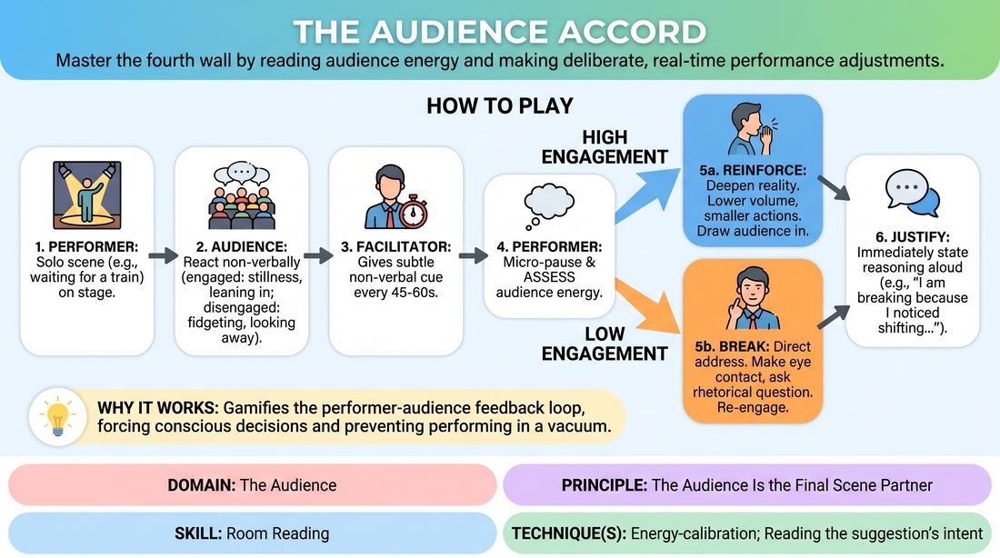

# The Fourth Wall Accord

{ .game-hero }

> Master the fourth wall by reading audience energy and making deliberate, real-time performance adjustments.

## Overview
A structured performance drill where a solo player runs a simple scene while actively monitoring the audience's engagement. At regular intervals, the player must assess the room's energy and make a conscious choice to either tighten the fourth wall to draw the audience in, or break it to directly re-engage them, immediately justifying their choice aloud.

## What It Trains
- **Domain:** D5 — The Audience
- **Principle(s):** The Audience Is the Final Scene Partner; Play for the Back Row
- **Skill(s):** Room Reading; Audience-Energy Management; Stage Presence & Clarity
- **Technique(s):** Energy-calibration; Reading the suggestion's intent; Tag-running (riding a laugh wave); Landing/cushioning a beat; Breaking the 4th Wall / Direct Address; Cheating out; Projection; Make the choice readable
- **Focus:** skill_drill

**Objective:** To develop active room-reading skills and intentional energy-calibration, training improvisers to treat the audience as an active scene partner whose non-verbal cues dictate staging and engagement choices.

## At a Glance
| Aspect | Detail |
|---|---|
| Players | 3+ (ideal 6-15) |
| Time | ~15 min |
| Complexity | 3/5 |
| Skill level | competent |
| Energy | medium |
| Physicality | low |
| Modality | in_person |
| Space | moderate |
| Props | none |
| Audience | required |

## Setup
A clear stage area for the performer and a seated audience area. No props are required, though a single chair can be used. The facilitator stands near the audience to observe both the performer and the crowd.

## How to Play
1. Select one performer to take the stage and have the rest of the group act as the live audience.
2. Instruct the audience to react naturally but entirely non-verbally, showing genuine engagement (leaning in, smiling, stillness) or disengagement (fidgeting, looking away, shifting).
3. Give the performer a simple, low-action solo scene premise, such as waiting for a late train or trying to fix a broken watch.
4. The performer begins the scene, focusing on clear physical actions, strong vocal projection, and maintaining a standard fourth wall.
5. Every 45 to 60 seconds, the facilitator gives a subtle, pre-arranged non-verbal cue, such as a nod.
6. Upon seeing the cue, the performer must pause for a micro-beat, assess the audience's current energy level, and choose one of two adjustments: Reinforce or Break.
7. If the audience is highly engaged, the performer chooses Reinforce to deepen the scene's internal reality, lowering their volume slightly to make the audience lean in further while keeping actions clear.
8. If the audience seems restless or disengaged, the performer chooses Break to directly address the audience, making eye contact, asking a rhetorical question, or commenting on their internal state to pull them back in.
9. Immediately after making the adjustment, the performer must briefly state their reasoning aloud to the room (e.g., 'I am breaking because I noticed shifting in the front row') and then instantly resume the scene under the new dynamic.
10. Repeat this cycle three to four times before ending the scene and rotating players.

## Facilitation Notes
- Coaching Cue: 'Read the room, don't just guess.' Remind performers to look for specific physical cues like posture, eye contact, and stillness rather than assuming how the audience feels.
- Pitfall & Fix: Performers may lose their character's reality when they state their justification. Fix: Instruct them to deliver the justification in a neutral, matter-of-fact voice, then snap immediately back into the emotional state of the scene.
- Coaching Cue: 'Play to the back row.' Even when reinforcing the fourth wall and drawing the audience in, the performer must maintain vocal clarity and physical projection so the entire room can follow the shift.
- Pitfall & Fix: The audience might over-exaggerate their reactions. Fix: Remind the audience before starting that they must remain authentic; fake boredom or forced laughter ruins the calibration training.

## Variations
- The Multi-Player Accord: Run the exercise with two players in a scene. When the signal is given, both players must silently agree on the room's energy and execute the same adjustment (either both reinforcing or both breaking).
- The Silent Calibration: Remove the verbal justification step. The performer must make the adjustment purely through physical and vocal shifts, and the audience must guess which choice was made during the debrief.

## Debrief
- How did it feel to actively look at the audience for data while trying to maintain your scene's narrative?
- For the audience, did the performer's choice to 'Reinforce' actually make you lean in, or did it feel like they were shutting you out?
- How did the 'Break' adjustment alter the energy of the room, and did it successfully re-engage your attention?
- What specific non-verbal cues were the easiest to read, and which ones were deceptive?

## Safety & Inclusion
Ensure that when performers 'Break' the fourth wall, they do not physically invade the personal space of audience members or put individual audience members on the spot in a way that causes distress. Direct address should feel like a general invitation or a shared confidence rather than an interrogation.

## Why It Works
This game works because it gamifies the feedback loop between performer and audience. By forcing a conscious decision cycle and requiring immediate verbal justification, it breaks the habit of performing in a vacuum. It teaches players that the audience's energy is a dynamic variable that can be managed and calibrated in real time, transforming the audience from passive observers into active scene partners.
