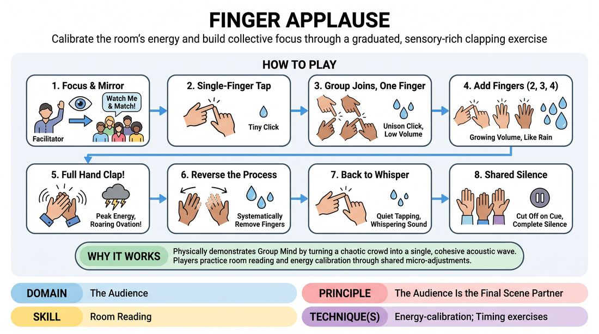

# Finger Applause

{ .game-hero }

> Calibrate the room's energy and build collective focus through a graduated, sensory-rich clapping exercise.

## Overview
This high-impact group warm-up guides an audience or ensemble to transition from silent anticipation to a roaring ovation using incremental finger-tapping. By mimicking the sound of a gathering rainstorm, it transforms a passive crowd into an active, highly-attuned collective.

## What It Trains
- **Domain:** D5 — The Audience
- **Principle(s):** The Audience Is the Final Scene Partner; Group Mind
- **Skill(s):** Room Reading; Pacing & Rhythm
- **Technique(s):** Energy-calibration; Timing exercises
- **Focus:** connection

**Objective:** To develop room reading, energy calibration, and collective rhythm, establishing the audience as an active, responsive partner in the performance space.

## Setup
The facilitator stands at the front of the room facing the participants. No props or special staging are required; players can be seated or standing.

## How to Play
1. Instruct the entire group to focus their attention on the facilitator and prepare to mirror their physical actions exactly.
2. Begin by tapping a single index finger of the right hand against the palm of the left hand, creating a tiny, rhythmic clicking sound.
3. Encourage the group to join in, matching the exact speed and light pressure of the single-finger tap.
4. Gradually transition to tapping two fingers (index and middle) against the palm, noting the subtle increase in volume and texture.
5. Progressively add a third finger, then a fourth, allowing the sound to swell naturally like a rising rainstorm.
6. Bring the movement to a full-hand clap, encouraging the group to match the peak energy and tempo of the facilitator's applause.
7. Reverse the process, systematically removing fingers one by one to bring the sound back down to a whisper, before cutting the sound off entirely on a shared, silent cue.

## Facilitation Notes
- Coaching cue: 'Listen to the collective sound, not just your own hands. We are one instrument.'
- Pitfall: Players rushing the progression. Fix: Hold each stage (1 finger, 2 fingers) for at least 10 to 15 seconds to let the group calibrate and find a unified rhythm.
- Coaching cue: 'Watch the conductor's hands. Let your eyes and ears work together to match the exact volume.'
- Pitfall: Lack of physical commitment leading to a muddy sound. Fix: Encourage crisp, deliberate contact between fingers and palm.

## Variations
- The Neighbor Clap: Have players raise their left hand palm-up and right hand palm-down, clapping their right hand into their neighbor's left hand to create a giant, interconnected chain of applause.
- The Wave: Pass the graduated applause across the room from left to right, with one side starting at one finger while the other side is at a full clap.
- Vocal Wind: Add a soft wind sound (shhh) that rises and falls in perfect synchronization with the volume of the clapping.

## Debrief
- How did the quality of our collective focus change as the volume shifted from a single finger to a full hand?
- What did you have to pay attention to in order to keep the group's rhythm synchronized?
- How does this exercise show that the audience and performers are constantly calibrating their energy together?

## Safety & Inclusion
Ensure participants with physical limitations or hand/wrist sensitivities know they can participate by tapping a foot, nodding, or mimicking the rhythm visually without forceful contact.

## Why It Works
It physically and aurally demonstrates Group Mind by turning a chaotic crowd into a single, cohesive acoustic wave. By focusing on micro-adjustments in volume and rhythm, players practice room reading and energy calibration, learning to treat the audience's collective presence as an active, living partner.
