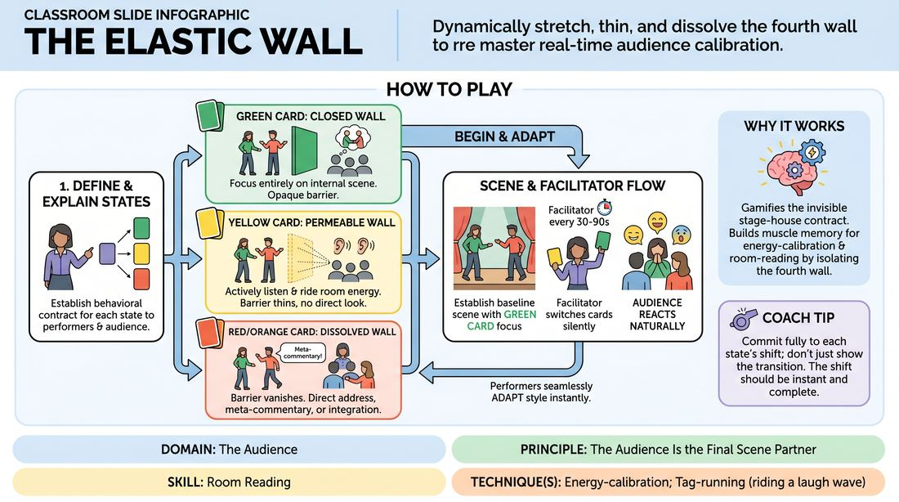

# The Elastic Membrane

{ .game-hero }

> Dynamically stretch, thin, and dissolve the fourth wall to master real-time audience calibration.

## Overview
A structured performance drill where players execute a scene or monologue while a facilitator dynamically alters the permeability of the fourth wall using colored cards. Performers must instantly shift their relationship with the audience, moving from total isolation to subtle energetic listening, meta-commentary, and direct character integration. This creates a highly responsive, fluid connection between the stage and the house.

## What It Trains
- **Domain:** D5 — The Audience
- **Principle(s):** The Audience Is the Final Scene Partner; Play for the Back Row
- **Skill(s):** Room Reading; Audience-Energy Management; Stage Presence & Clarity; Physicality & Space Work; Vocal Craft
- **Technique(s):** Energy-calibration; Tag-running (riding a laugh wave); Landing/cushioning a beat; Breaking the 4th Wall / Direct Address; Cheating out; Projection; Make the choice readable
- **Focus:** skill_drill

**Objective:** To develop advanced room-reading and energy-calibration skills, training performers to treat the fourth wall as a flexible tool rather than a rigid barrier, thereby treating the audience as an active, living scene partner.

## Setup
An in-person performance space with a clear stage area and an audience area. The facilitator stands in the audience holding three distinct colored cards: Green (Invisible Wall), Yellow (Permeable Wall), and Red/Orange (Dissolved Wall). The remaining workshop participants sit in the audience, primed to act as a responsive sounding board.

## How to Play
1. Explain the three distinct states of the fourth wall to both the performers and the audience, establishing the specific behavioral contract for each state.
2. Define the Green Card (Closed Wall): Performers act as if an opaque barrier separates them from the house. They focus entirely on internal scene work, projecting energy through the wall without acknowledging any audience response.
3. Define the Yellow Card (Permeable Wall): The barrier thins. Performers do not look directly at the audience or break character, but they actively listen to the room's energy, adjusting their physical pacing, vocal volume, and emotional beats to ride the audience's laughter or tension.
4. Define the Red/Orange Card (Dissolved Wall): The barrier vanishes. Performers can either step out of character briefly for meta-commentary on the performance itself, or directly cast the audience as characters in the scene (e.g., a jury, a classroom) and address them face-to-face.
5. Cast one or two competent performers to step onto the stage and provide them with a simple, open-ended scenario or monologue prompt (e.g., explaining a complex plan or recounting a dramatic memory).
6. Begin the scene with the Green Card raised. Performers establish the baseline reality of their scene with standard theatrical focus.
7. Every 30 to 90 seconds, the facilitator silently raises a different colored card. Performers must immediately and seamlessly adapt their performance style and audience relationship to match the new card's contract.
8. Instruct the audience to react naturally and honestly, providing a genuine energetic field for the performers to read and calibrate against.

## Facilitation Notes
- Side-coaching cue: 'Feel the room, don't just look at it.' Remind players during Yellow card phases to use their peripheral vision and auditory senses rather than making direct eye contact.
- Common Pitfall: Performers staying in 'Green' mode even when 'Yellow' or 'Red/Orange' is called because they are too inside their own heads. Fix: Gently call out 'Calibrate!' and encourage them to physically open their body posture (cheat out) toward the house.
- Side-coaching cue: 'Ride the wave.' When the Red/Orange card is up, encourage performers to pause for laughs (tag-running) or cushion dramatic beats based on immediate audience feedback.
- Common Pitfall: The audience becoming too passive or over-participatory. Fix: Remind the audience before starting that they are the final scene partner; their job is to react honestly, not to hijack the scene or freeze up.

## Variations
- The Silent Shift: Run the exercise without colored cards. The performers must organically shift the wall's permeability based solely on their own artistic intuition and the natural energy shifts of the room.
- The Tug-of-War: Two performers on stage are assigned different cards simultaneously (e.g., Player A is Green, Player B is Red/Orange), forcing them to negotiate a scene where one is completely isolated and the other is highly meta-aware.

## Debrief
- How did your physical posture and vocal projection naturally adapt when shifting from the closed Green state to the permeable Yellow state?
- In the Red/Orange state, did you feel like you were manipulating the audience, or co-creating the moment with them?
- As an audience member, what specific physical or vocal adjustments made a performer's transition between states feel clean and readable?

## Safety & Inclusion
Ensure that when the Red/Orange card is active, performers do not physically enter the audience's personal space or force individual audience members to speak unless they have enthusiastically consented to participate.

## Why It Works
This game works because it gamifies the invisible contract between the stage and the house. By isolating the fourth wall as a dynamic variable, performers build muscle memory for energy-calibration and room-reading. It strips away the anxiety of breaking the fourth wall by turning it into a controlled, technical choice, helping players realize that the audience's energy is a resource to be integrated rather than ignored.
