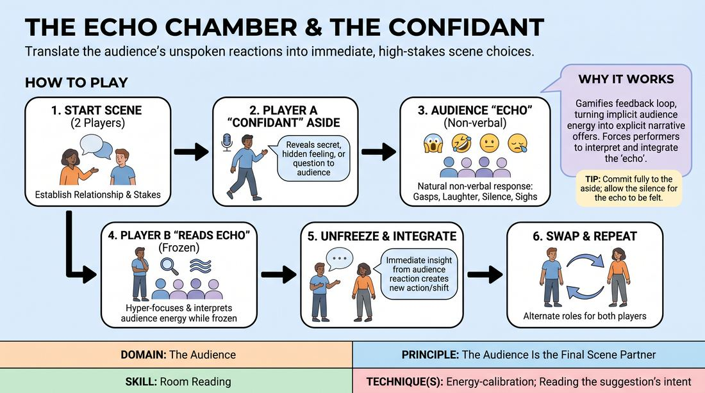

# The Confidant's Echo

{ .game-hero }

> Translate the audience's unspoken reactions into immediate, high-stakes scene choices.

## Overview
In this scene-based exercise, players alternate between breaking the fourth wall to share confidential asides and reading the audience's non-verbal reactions. The off-side player must treat the audience's collective response as a physical, emotional, or narrative truth, immediately integrating it into the scene's reality. This creates a tight, responsive feedback loop where the audience acts as an active, silent scene partner.

## What It Trains
- **Domain:** D5 — The Audience
- **Principle(s):** The Audience Is the Final Scene Partner; Play for the Back Row; Yes, And
- **Skill(s):** Room Reading; Audience-Energy Management; Stage Presence & Clarity; Active Listening; Offer Reception
- **Technique(s):** Energy-calibration; Reading the suggestion's intent; Tag-running (riding a laugh wave); Landing/cushioning a beat; Breaking the 4th Wall / Direct Address; Cheating out; Projection; Make the choice readable
- **Focus:** mixed

**Objective:** To develop advanced room-reading and energy-calibration skills by treating non-verbal audience feedback as a mandatory, actionable scene offer.

## Setup
Arrange the space with a clear stage area and an audience seating area. The game requires at least two active performers on stage, with the remaining workshop participants acting as the live audience. No props or materials are needed.

## How to Play
1. Begin a standard two-person scene based on a simple relationship prompt, establishing clear characters and stakes.
2. At any point, Player A (the Confidant) may freeze the scene's physical action by stepping forward, cheating out, and making direct eye contact with the audience.
3. Player A delivers a brief, in-character direct address or confidential aside to the audience, revealing a secret motivation, a hidden feeling, or a rhetorical question.
4. The audience responds naturally but strictly non-verbally, using reactions like gasps, laughter, tense silence, or collective sighs.
5. While Player A is speaking, Player B remains frozen on stage but hyper-focuses on the audience, actively reading their physical and auditory 'echo' to interpret its underlying emotional meaning.
6. Player A steps back into the scene and unfreezes the action, returning to the established reality.
7. Immediately upon unfreezing, Player B must speak first, integrating their interpretation of the audience's reaction as a direct, intuitive insight or a shift in the scene's dynamic.
8. Continue the scene, allowing players to swap roles so both have opportunities to break the fourth wall and to interpret the audience's echo.

## Facilitation Notes
- Coaching Cue: 'Play to the back row!' Remind the Confidant to project, make eye contact with the entire room, and physically open up their body when addressing the audience.
- Pitfall: The off-side player ignores the audience's reaction and continues their pre-planned line of dialogue. Fix: Side-coach them to pause, breathe, and explicitly name the energy they just felt in the room before speaking.
- Coaching Cue: 'Read the subtext, not just the sound.' Help players interpret silence as tension or focus, and laughter as either relief, recognition, or absurdity, translating that specific flavor into the scene.
- Pitfall: The audience becomes too self-conscious and stops reacting. Fix: Before starting, explicitly instruct the audience that their natural, non-verbal reactions are the fuel for the scene, and encourage them to be expressive.
- Coaching Cue: 'Cushion the transition.' Ensure the transition back into the scene is smooth; the unfreezing should feel like a seamless continuation where the internal shift is immediately voiced.

## Variations
- Orchestrated Echoes: The facilitator silently cues the audience behind the performers' backs to react with a specific non-verbal energy (such as extreme skepticism, deep sympathy, or boredom) to test the performers' room-reading accuracy.
- Three-Way Echo: Run the scene with three players on stage. When the Confidant speaks, the other two players must both integrate the audience's reaction, building on each other's interpretations.

## Debrief
- How did it feel to step out of the scene and treat the audience as your direct confidant? Did you feel their energy shift?
- For the interpreters: What specific physical or auditory cues from the audience tipped you off to their reaction, and how did you translate that into a character choice?
- Audience members: Did you feel like your silent reactions were accurately read and honored by the performers on stage?
- How does actively listening to the room's energy change the pacing and stakes of a scene compared to ignoring the fourth wall?

## Safety & Inclusion
Ensure the audience understands that non-verbal feedback should remain respectful and supportive. If a player has visual or auditory processing differences, the facilitator or other players can gently amplify or verbally mirror the audience's physical reactions (e.g., saying 'The room just went completely silent') to ensure accessibility.

## Why It Works
This game works because it gamifies the performer-audience feedback loop, turning implicit audience energy into explicit narrative offers. By forcing the non-addressing player to interpret and integrate the 'echo,' it prevents performers from getting stuck in their heads and demands active, real-time room reading. It teaches players that the audience is not a passive observer, but a dynamic partner whose energy directly shapes the scene's reality.
