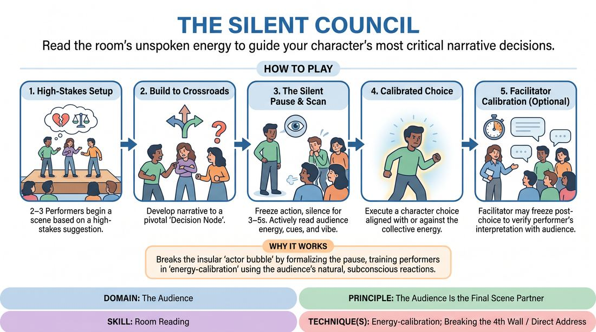

# The Silent Council

{ .game-hero }

> Read the room's unspoken energy to guide your character's most critical narrative decisions.

## Overview
The Silent Council is a high-tension narrative scene-work game where performers pause at pivotal crossroads to gauge the audience's silent physical and emotional energy. By treating the room as an unspoken collective consciousness, players calibrate their character choices to the live atmosphere. This transforms passive observers into active narrative co-authors, breaking the insular actor bubble.

## What It Trains
- **Domain:** D5 — The Audience
- **Principle(s):** The Audience Is the Final Scene Partner; Truth Over Pandering; Serve the Story
- **Skill(s):** Room Reading; Audience-Energy Management; Stage Presence & Clarity; Silence & Stillness; Stakes / The 'Want'
- **Technique(s):** Energy-calibration; Breaking the 4th Wall / Direct Address; Cheating out; Hold-the-beat reps
- **Focus:** mixed

**Objective:** To develop advanced room-reading and energy-calibration skills, training performers to use silence, stillness, and stage presence to interpret and integrate the audience's collective focus directly into their narrative decision-making.

## At a Glance
| Aspect | Detail |
|---|---|
| Players | 5+ (ideal 10-30) |
| Time | ~15 min |
| Complexity | 3/5 |
| Skill level | competent |
| Energy | medium |
| Physicality | low |
| Modality | in_person |
| Space | moderate |
| Props | none |
| Audience | required |

## Setup
An in-person performance space with a clear stage area and an audience seated directly opposite. For virtual play, a video conferencing platform with gallery view enabled is required. No props are needed, but a clear physical boundary between the stage and the audience must be established.

## How to Play
1. Cast two to three players to perform a scene, while the remaining players act as the audience (The Silent Council).
2. Obtain a narrative suggestion that establishes a high-stakes relationship or a situation ripe with moral dilemmas.
3. Instruct the performers to initiate a standard narrative scene, building toward a critical crossroads or 'Decision Node' where a character must make a pivotal choice.
4. Upon reaching this Decision Node, the active performer must freeze their physical action and dialogue, turning their focus outward to scan the audience.
5. During this 3-to-5-second silent pause, the performer must actively read the room's energy, looking for subtle physical cues such as leaning forward, holding breath, shifting weight, or facial expressions.
6. The performer then internalizes this collective 'vibe' and immediately executes a character choice that aligns with or deliberately plays against the audience's silent consensus.
7. To calibrate this skill, the facilitator may occasionally freeze the scene immediately after a choice is made, allowing the performer to briefly step out of the scene and articulate what energy they sensed.
8. The facilitator then asks the audience to confirm if the performer's interpretation of their collective tension or anticipation was accurate, before resuming the scene.

## Facilitation Notes
- To prevent momentum from dying during the pause, ensure the active player maintains their physical posture and emotional intensity. The pause should feel like a theatrical slow-motion zoom or a high-stakes internal monologue, not a drop in character energy. The partner on stage must also hold their reaction, maintaining the tension like a stretched rubber band.
- Coaching Cue: Encourage players to embrace the silence during the consultation. A common pitfall is rushing the pause out of discomfort; remind them that stillness builds dramatic tension.
- Pitfall: Performers projecting their own pre-planned narrative choices onto the audience. Fix: Have the facilitator call out 'What did you actually see?' during the post-choice confession to force objective observation.
- Coaching Cue: Remind the audience to remain silent but physically honest. They should not try to 'act' or pantomime advice, but simply react naturally to the unfolding story.
- Pitfall: Breaking character completely during the consultation. Fix: Instruct players to maintain their character's emotional stakes and physical posture while scanning the room, treating the gaze as an internal monologue made visible.

## Variations
- The Digital Council (Virtual Adaptation): Play on a video call where the active player scans the gallery view. Audience members use physical proximity to their webcams (leaning in close for high tension, leaning back for low tension) or turn their cameras on/off to signal collective investment.
- The Guided Council: For early training, the facilitator secretly instructs the audience beforehand to adopt a specific physical posture (e.g., leaning forward for 'risk', leaning back for 'caution') to give the performer a clearer signal to read.
- The Split Council: Divide the audience into two halves. The performer must look at both sides, identify a conflict in their energies, and make a choice that resolves or heightens that division.

## Debrief
- How did you maintain the scene's dramatic tension and momentum during the silent pause without letting the energy drop?
- What specific physical cues from the audience were the easiest or hardest to interpret, and how did you calibrate your choice to them?
- How did it feel as an audience member to realize your silent attention was actively shaping the story?
- How do we balance serving the story with responding to the audience's energy without pandering to them?

## Safety & Inclusion
Ensure players know they can blink, breathe, and adjust their posture during freezes to avoid physical strain. For visually impaired players, the audience can transition from visual cues to subtle auditory cues (collective deep breaths, soft humming, or shifting weight in chairs). Establish a clear 'cut' signal if the silent focus feels overwhelming or invasive for any performer.

## Why It Works
By formalizing the pause before a major decision, this game forces players to slow down and look outward, breaking the insular 'actor bubble.' It teaches energy-calibration by turning the audience's natural, subconscious reactions into a readable feedback loop, proving that the audience is indeed the final scene partner.
