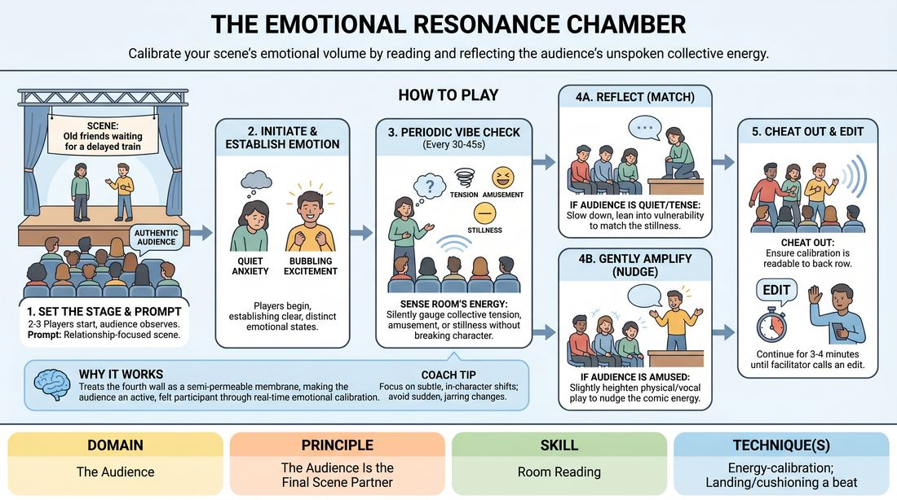

# The Resonance Chamber

{ .game-hero }

> Calibrate your scene's emotional volume by reading and reflecting the audience's unspoken collective energy.

## Overview
In this exercise, players perform a standard scene while maintaining a porous fourth wall to sense the room's collective temperature. Without breaking character or directly addressing the crowd, players subtly adjust their emotional intensity to mirror or gently amplify the audience's energy. The result is a highly responsive performance where the audience becomes an active, felt participant in the scene's development.

## What It Trains
- **Domain:** D5 — The Audience
- **Principle(s):** The Audience Is the Final Scene Partner; Play for the Back Row
- **Skill(s):** Room Reading; Audience-Energy Management; Stage Presence & Clarity; Emotional Fluidity
- **Technique(s):** Energy-calibration; Landing/cushioning a beat; Cheating out; Make the choice readable; The Emotional Dial (1→10)
- **Focus:** connection

**Objective:** To develop advanced room-reading and energy-calibration skills, training improvisers to treat the audience's collective mood as a live, dynamic scene partner and adjust their emotional output accordingly.

## Setup
Set up a clear stage area with the remaining workshop participants seated as the audience. No props are required. The facilitator briefs the audience to react naturally without trying to 'help' or force reactions, and briefs the players on maintaining their characters while conducting silent 'vibe checks.'

## How to Play
1. Two to three players take the stage, while the rest of the group acts as an authentic audience.
2. The facilitator provides a simple, relationship-focused scene prompt, such as two old friends waiting for a delayed train.
3. Players initiate the scene, each establishing a distinct, clear, and readable emotional state like quiet anxiety, bubbling excitement, or heavy exhaustion.
4. As the scene progresses, players must periodically conduct silent 'vibe checks' every 30 to 45 seconds, sensing the room's collective tension, amusement, or stillness.
5. Based on this sensory scan, players make an in-character choice to either 'reflect' (match the room's current energy level) or 'gently amplify' (nudge the room's energy up or down a notch).
6. If the audience is tense and quiet, a player might slow down their dialogue and lean into their character's vulnerability to reflect that stillness.
7. If the audience shows a spark of amusement, a player might slightly heighten their physical gestures or vocal play to amplify that comic energy without breaking the reality of the scene.
8. Throughout these adjustments, players must 'cheat out' physically and vocally, ensuring their calibrated emotional choices are fully readable to the back row.
9. The scene runs for approximately 3 to 4 minutes before the facilitator calls an edit.

## Facilitation Notes
- Side-coaching cue: 'Feel the room, don't just look at it.' Remind players to use their peripheral senses and auditory cues rather than staring directly at audience members.
- Watch out for players abandoning their character's logic to chase a laugh. If a player shifts from a somber character to a goofy one just because the room laughed, pause and coach them to filter the audience's energy through their existing character's perspective.
- Encourage players to 'play for the back row' by making their subtle emotional shifts physically and vocally distinct. Nuance must still be projected.
- Ensure the training audience remains natural. If they start over-laughing or forcing reactions to 'help' the players, remind them to simply exist as a normal, honest audience.

## Variations
- The Contrast Dial: Instead of reflecting or amplifying, players must actively play the exact opposite energy of the room (e.g., if the room is highly energetic and laughing, the players must ground the scene in heavy, quiet tension).
- The Silent Chamber: Run the scene entirely in gibberish or non-verbal physical theater, forcing players to rely solely on physical energy-calibration and audience breath/movement cues.

## Debrief
- For the players: At what moments did you feel a shift in the room's energy, and how did you translate that into your character's behavior?
- For the audience: Did you feel like the scene was responding to you? When did you feel the most connected or 'seen' by the performers?
- For everyone: How does treating the audience's energy as a physical presence change the way we project and pace our scenes?

## Safety & Inclusion
Since this game relies heavily on reading emotional energy, ensure players feel safe to explore low-energy or high-tension states without feeling pressured to perform 'happiness.' Establish that silence and tension are valid, successful audience responses.

## Why It Works
This game works because it treats the fourth wall not as a brick barrier, but as a semi-permeable membrane. By forcing players to calibrate their emotional output based on real-time audience feedback, it operationalizes the principle that the audience is the final scene partner. It teaches players to read the room organically, preventing insular play and building a deep, reciprocal relationship with the crowd.
