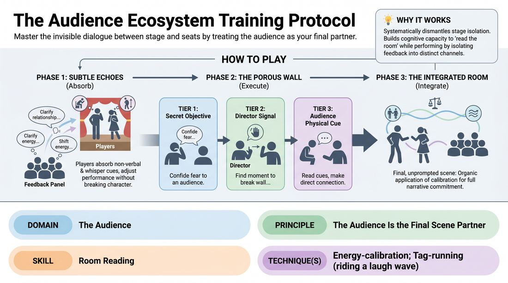

# Acoustic Calibration

{ .game-hero }

> Master the invisible dialogue between stage and seats by treating the audience as your final partner.

## Overview
A structured, three-phase training drill designed to heighten a performer's sensitivity to the room's energy. Players progress from absorbing subtle, non-verbal audience feedback to executing deliberate, justified fourth-wall breaks, culminating in a fully integrated performance where the audience's presence actively shapes the scene's pacing and emotional truth.

## What It Trains
- **Domain:** D5 — The Audience
- **Principle(s):** The Audience Is the Final Scene Partner; Truth Over Pandering; Make Your Partner a Genius
- **Skill(s):** Room Reading; Audience-Energy Management; Stage Presence & Clarity; Active Listening
- **Technique(s):** Energy-calibration; Tag-running (riding a laugh wave); Landing/cushioning a beat; Breaking the 4th Wall / Direct Address; Cheating out; Projection; Make the choice readable
- **Focus:** skill_drill

**Objective:** To develop advanced room-reading and energy-calibration skills, allowing performers to dynamically adjust their performance based on real-time audience feedback without breaking the scene's reality or pandering.

## Setup
An in-person performance space with a clear stage area and seating for an audience. No props are required. Divide the group so that 2-3 players are on stage, 3-5 players form a dedicated 'Feedback Panel' sitting in the front row, and the remaining players act as the general audience.

## How to Play
1. Phase 1 (Subtle Echoes): Begin with a standard two- or three-person scene. Instruct the Feedback Panel in the front row to react genuinely but non-verbally to the scene's progression (e.g., leaning in, nodding, or showing confusion).
2. During Phase 1, panel members occasionally whisper their immediate, unfiltered internal thoughts aloud (e.g., 'I don't understand their relationship' or 'This feels tense') just loudly enough for the actors to hear.
3. The performing players must absorb these whispers and non-verbal cues, adjusting their performance (e.g., clarifying a relationship, shifting energy) without ever breaking character or acknowledging the panel directly.
4. Phase 2 (The Porous Wall): Start a new scene. The facilitator or a designated 'Director' stands in the audience. The performing players must now practice intentional, justified direct address to the audience.
5. Introduce Tier 1 of Phase 2: Give one actor a secret objective before the scene starts (e.g., 'confide your deepest fear to the audience'). The actor must find a natural, justified moment to break the fourth wall and deliver this confession.
6. Introduce Tier 2 of Phase 2: During the scene, the Director uses a subtle hand signal to prompt an actor to break the fourth wall. The actor must immediately find an in-character justification to address the audience directly, then transition smoothly back into the scene.
7. Introduce Tier 3 of Phase 2: The general audience is instructed to give physical cues when they want connection (e.g., leaning forward). The actors must read these cues and choose when to break the fourth wall to satisfy that audience desire.
8. Phase 3 (The Integrated Room): Run a final, unprompted scene. Performers must play with full narrative commitment while organically applying the calibration and strategic direct-address skills practiced in the previous phases.

## Facilitation Notes
- Coaching Cue: 'Let the whisper land inside your character.' Remind actors not to panic or break character when they hear a whisper, but to let it influence their character's internal state.
- Pitfall: Actors pandering to the audience or breaking the fourth wall just for a cheap laugh. Fix: Side-coach them to maintain 'Truth Over Pandering'—every direct address must be emotionally justified by the character's current stakes.
- Coaching Cue: 'Cushion the landing.' When returning to the scene after a fourth-wall break, ensure the actor takes a beat to re-engage with their scene partner rather than rushing back in.
- Pitfall: The Feedback Panel becoming too performative or loud with their whispers. Fix: Instruct the panel to keep whispers brief, authentic, and quiet, acting as an 'internal monologue' of the room rather than active critics.

## Variations
- The Silent Thermometer: In Phase 1, eliminate the whispers entirely. Performers must rely solely on micro-expressions, posture shifts, and the physical tension of the audience to calibrate their energy.
- The Shared Confidant: In Phase 2, both actors on stage must tag-team the fourth-wall break, sharing a secret with the audience behind the other character's back, requiring precise physical staging and timing.

## Debrief
- How did hearing the whispered thoughts of the audience change your physical presence and pacing on stage?
- What did it feel like to justify a fourth-wall break in response to a physical cue from the audience versus a director's prompt?
- How did you balance maintaining the reality of the scene with being porous to the room's energy?

## Safety & Inclusion
Ensure the Feedback Panel's whispers focus strictly on the narrative and character choices, never on the personal attributes of the performers. If a performer feels overwhelmed by the auditory feedback, they can use a pre-arranged non-verbal signal to pause the whispers.

## Why It Works
This game works because it systematically dismantles the isolation of the stage. By isolating audience feedback into distinct auditory and visual channels, performers build the cognitive capacity to 'read the room' while simultaneously maintaining scene integrity. It teaches that the audience is not a passive observer, but an active, living partner whose energy must be calibrated with, rather than ignored or pandered to.
