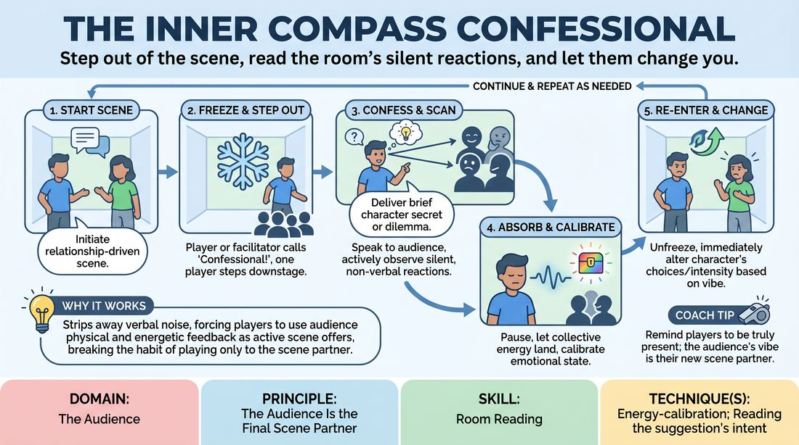

# The Silent Confessional

{ .game-hero }

> Step out of the scene, read the room's silent reactions, and let them change you.

## Overview
A dynamic scene-work exercise where players temporarily freeze the action to share their character's secret thoughts or dilemmas directly with the audience. By reading the room's silent, non-verbal feedback, the player must immediately adapt their character's choices upon stepping back into the scene. This creates a live, reciprocal loop where the audience acts as an active, silent scene partner.

## What It Trains
- **Domain:** D5 — The Audience
- **Principle(s):** The Audience Is the Final Scene Partner; Play for the Back Row; Vulnerability
- **Skill(s):** Room Reading; Audience-Energy Management; Stage Presence & Clarity; Justification; Unfiltered Spontaneity
- **Technique(s):** Energy-calibration; Reading the suggestion's intent; Tag-running (riding a laugh wave); Landing/cushioning a beat; Breaking the 4th Wall / Direct Address; Cheating out; Projection; Make the choice readable; Reincorporation-as-justification
- **Focus:** mixed

**Objective:** To develop advanced room-reading and energy-calibration skills, training players to treat the audience's physical presence and non-verbal cues as active, actionable offers that shape character choices and narrative direction.

## Setup
A clear performance space with a designated 'confessional zone' slightly downstage of the main playing area. The remaining workshop participants sit close together to form a concentrated audience. Instruct the audience that they must remain completely silent (no speaking or shouting) but are highly encouraged to react physically and facially—using nods, head shakes, gasps, leaning forward, or furrowed brows.

## How to Play
1. Two players step into the playing space and initiate a standard, relationship-driven scene based on a simple suggestion.
2. At any point during the scene, either player (or the facilitator calling 'Confessional!') can freeze the action by physically stepping downstage into the designated confessional zone.
3. The stepping player breaks the fourth wall, looks directly at the audience, and delivers a brief, honest confession or a pressing dilemma from their character's perspective.
4. While speaking, the player must actively scan the audience, observing their silent, non-verbal reactions such as leaning in, nodding, gasping, or looking disapproving.
5. The player pauses for a clear beat to let the audience's collective physical energy land and settle, calibrating their own emotional state to the room's vibe.
6. The player then steps back into the scene, unfreezing the action, and must immediately alter their character's behavior, emotional intensity, or choices based on the audience's silent feedback.
7. The scene continues with this new energy, allowing either player to step out for subsequent confessionals as the narrative unfolds.

## Facilitation Notes
- Side-coach players to make direct eye contact with individual audience members during the confessional, rather than staring into a blank space above their heads.
- If the audience's reaction is mixed or subtle, coach the player to pick one clear physical offer (like a single person shaking their head) and run with it as their justification.
- Pitfall: Players stepping back into the scene and ignoring the audience's reaction. Fix: Freeze the scene and ask, 'What did you see the audience do, and how does that change your next line?'
- Encourage the off-stage audience to be highly expressive with their bodies and faces; if they are too passive, pause and remind them that their physical energy is the player's fuel.

## Variations
- The Double Confessional: Both players step downstage simultaneously, sharing conflicting secrets to the audience while reading different sides of the room.
- The Blind Confessional: The player downstage closes their eyes while confessing, and opens them only for a split second to catch a snapshot of the audience's physical posture before stepping back in.
- The High-Stakes Dilemma: The facilitator pauses the scene and dictates a specific, high-stakes moral choice the character must present to the audience, forcing rapid energy-calibration.

## Debrief
- How did it feel to treat the audience's silent physical reactions as a direct, actionable improv offer?
- What specific non-verbal cues (e.g., a lean, a frown, a nod) were the easiest to read and translate into a character choice?
- How did breaking the fourth wall change the pacing and emotional depth of the scene when you returned to it?

## Safety & Inclusion
Ensure players feel safe sharing character-based 'secrets' without crossing personal boundaries. Remind the group that confessions must remain in-character and aligned with the established scene, avoiding real-world personal disclosures unless explicitly negotiated beforehand.

## Why It Works
This game works because it strips away verbal noise, forcing players to rely entirely on visual and energetic feedback from the room. By treating the audience's physical posture and facial expressions as active scene offers, it breaks the habit of performing 'at' an audience and instead establishes a genuine, reciprocal dialogue. This builds the muscle of energy-calibration, making players highly sensitive to the room's temperature.
