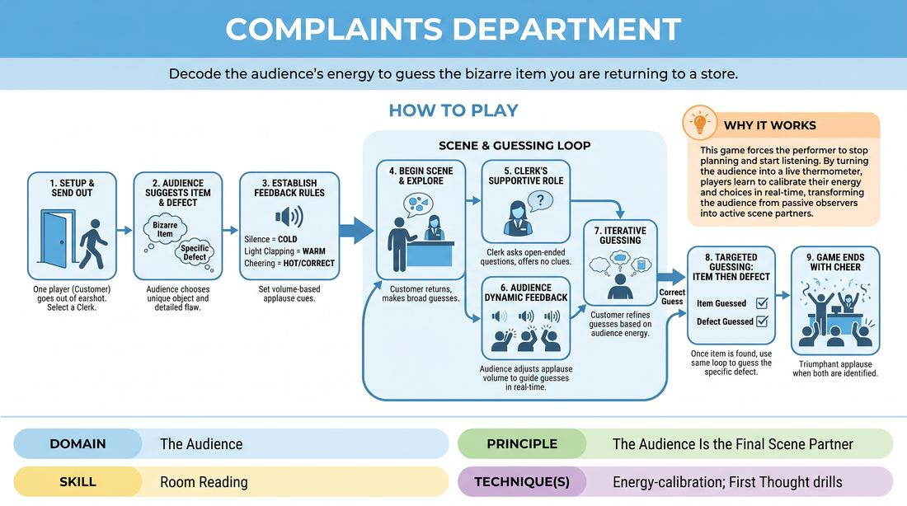

# Complaints Department

{ .game-hero }

> Decode the audience's energy to guess the bizarre item you are returning to a store.

## Overview
One player acts as a customer returning an unusual item with a highly specific defect. While they are out of the room, the audience decides on the item and the defect. When the player returns, they must guess both elements solely by reading the audience's auditory feedback as they pitch ideas.

## What It Trains
- **Domain:** D5 — The Audience
- **Principle(s):** The First Thought Is a Gift; The Audience Is the Final Scene Partner
- **Skill(s):** Unfiltered Spontaneity; Room Reading
- **Technique(s):** First Thought drills; Energy-calibration
- **Focus:** comedy_game

**Objective:** Develops room reading and energy-calibration by training players to treat the audience's physical and vocal reactions as an active, live scene partner.

## At a Glance
| Aspect | Detail |
|---|---|
| Players | 3+ (ideal 6-20) |
| Time | ~10 min |
| Complexity | 2/5 |
| Skill level | novice |
| Energy | medium |
| Physicality | low |
| Modality | in_person |
| Space | minimal |
| Props | none |
| Audience | required |

## Setup
One player (the Customer) steps out of the room. Another player (the Clerk) stands behind an imaginary counter. The remaining players act as the Audience.

## How to Play
1. Select one player to be the Customer and another to be the Clerk, then send the Customer out of earshot.
2. Ask the Audience to suggest a specific, mundane or bizarre item and a highly specific defect.
3. Establish the feedback rules: the Audience will use volume-based feedback, where silence means cold, light clapping means warm, and enthusiastic cheering means hot.
4. Bring the Customer back into the room to begin the scene at the return counter.
5. The Customer initiates the scene by explaining they want to return an item, making broad, exploratory guesses about what it is.
6. The Clerk acts as a supportive foil, asking open-ended questions to prompt the Customer without giving away clues.
7. The Audience dynamically adjusts their applause volume to guide the Customer's guesses in real-time.
8. Once the Customer successfully guesses the item, they transition to guessing the specific defect using the same feedback loop.
9. The game ends with a triumphant cheer when both the item and the defect are correctly identified.

## Facilitation Notes
- Side-coach the Customer: 'Listen to the room! If the clapping drops, pivot your guess immediately.'
- Side-coach the Clerk: 'Keep the scene grounded. Don't give verbal clues; let the audience do the work.'
- If the Customer gets stuck, remind them of the principle 'The First Thought Is a Gift'—blurt out the next random thing that comes to mind to test the audience's reaction.
- If the audience gets too quiet or too loud too quickly, the facilitator can briefly act as a conductor to calibrate the volume scale.

## Variations
- Double Trouble: Two customers return a joint item, needing to coordinate their guesses and read the room together.
- Emotional Returns: The customer must adopt different emotional states while guessing, calibrating their energy to match the audience's response.
- Gibberish Counter: The clerk and customer must speak entirely in gibberish, relying purely on physical gestures and audience volume to communicate.

## Debrief
- How did it feel to treat the audience's noise level as a direct physical cue in your scene?
- What did you notice about the transition from guessing wildly to narrowing down based on the room's energy?
- How can we apply this level of audience-awareness to regular, non-guessing scenes?

## Safety & Inclusion
Ensure the physical space allows the returning player to easily exit and re-enter. If a player has auditory sensitivities, the audience can use visual cues like waving hands wildly for 'hot' and keeping hands still for 'cold' instead of loud clapping.

## Why It Works
This game forces the performer to stop planning and start listening. By turning the audience into a live thermometer, players learn to calibrate their energy and choices in real-time, transforming the audience from passive observers into the final, active scene partner.
