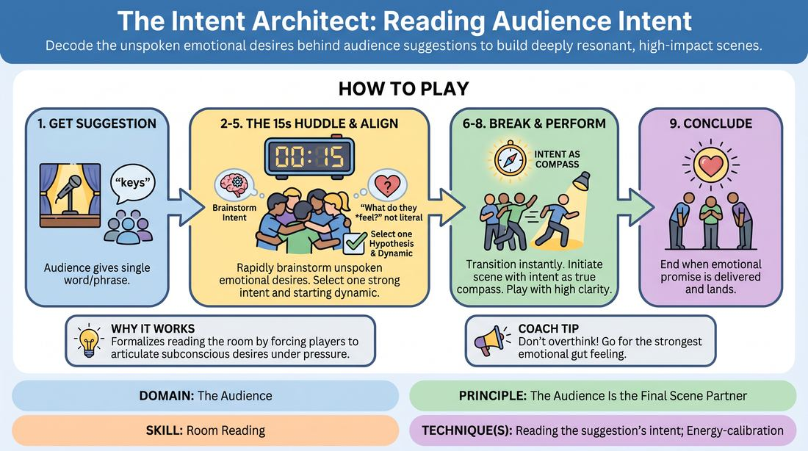

# The Intent Architect

{ .game-hero }

> Decode the unspoken emotional desires behind audience suggestions to build deeply resonant, high-impact scenes.

## Overview
This exercise trains players to look past the literal definition of an audience suggestion and uncover its underlying emotional or thematic promise. By holding a rapid, highly structured 15-second huddle before the scene starts, the team aligns on what the audience subconsciously wants to experience, then performs a scene designed to fulfill that specific expectation. It transforms the audience from a passive source of random words into an active, respected creative partner.

## What It Trains
- **Domain:** D5 — The Audience
- **Principle(s):** The Audience Is the Final Scene Partner; Play for the Back Row; Yes, And
- **Skill(s):** Room Reading; Audience-Energy Management; Stage Presence & Clarity; World-Building
- **Technique(s):** Reading the suggestion's intent; Energy-calibration; Landing/cushioning a beat; Breaking the 4th Wall / Direct Address; Make the choice readable
- **Focus:** mixed

**Objective:** To develop the skill of reading a suggestion's intent and room reading, helping players move beyond superficial, literal interpretations of prompts to deliver emotionally satisfying, high-clarity scenes that honor the performer-audience contract.

## At a Glance
| Aspect | Detail |
|---|---|
| Players | 3+ (ideal 4-6) |
| Time | ~15 min |
| Complexity | 3/5 |
| Skill level | competent |
| Energy | medium |
| Physicality | low |
| Modality | in_person |
| Space | moderate |
| Props | none |
| Audience | not required |

## Setup
An in-person playing space with a clear stage area and an audience area (which can be populated by other workshop participants). No props or materials are required. For virtual play, ensure all players have functioning microphones and cameras, with a designated facilitator to manage timing.

## How to Play
1. Gather a group of 4 to 6 players on stage and solicit a single-word or short-phrase suggestion from the audience.
2. Immediately enter a tight, visible huddle on stage. The facilitator starts a strict 15-second timer.
3. In the huddle, rapidly brainstorm the subconscious emotional, thematic, or stylistic desires behind the suggestion, asking what the audience actually wants to feel or see when they hear this word.
4. Select one strong Audience Intent Hypothesis, moving away from literal interpretations toward emotional or thematic dynamics (e.g., if the suggestion is 'keys', the intent might be 'the anxiety of being locked out' or 'the thrill of gaining access').
5. Quickly agree on a starting dynamic, such as a two-person relationship scene or a high-energy group game, that best serves this identified intent.
6. Break the huddle immediately when the 15-second timer expires, transitioning instantly into the scene.
7. Initiate the scene, using the literal suggestion only as a launching pad while treating the agreed-upon audience intent as the true compass.
8. Play the scene with high clarity and strong stage presence, ensuring that the choices made are highly readable and directly address the chosen emotional or thematic arc.
9. Conclude the scene when the core emotional promise or thematic arc has been clearly delivered and landed with the room.

## Facilitation Notes
- Enforce the 15-second huddle limit strictly. Use a physical buzzer, a verbal countdown, or a clap to break the huddle, which keeps the energy high and prevents over-planning.
- If players start planning specific plot points or lines in the huddle, interrupt them and redirect: 'Focus on the feeling or the dynamic the audience wants, not the plot!'
- Encourage players to play for the back row by making their chosen intent bold and readable from the very first line of the scene.
- Watch out for literal representation. If the suggestion is 'dentist' and they perform a literal dental exam without any emotional subtext, pause the scene and ask: 'What is the emotional core of a dentist visit that we can play instead?'
- Coach players to respect the audience's intelligence by committing to the emotional truth of the chosen intent rather than pandering for cheap, superficial laughs.

## Variations
- The Virtual Huddle: In online play, players use a designated 'hot mic' huddle where they lean close to their cameras and whisper, or use a rapid 15-second private chat blast to align on the intent before turning their cameras on to start the scene.
- The Blind Intent: One player leaves the room (or enters a virtual waiting room) while the audience and the remaining players agree on the suggestion and its underlying intent. The returning player must discover and adapt to the chosen intent purely through room reading and scene work.
- The Silent Huddle: Instead of talking, the players have 15 seconds of silent eye contact in the huddle to non-verbally align on the energy and emotional tone they will bring to the suggestion.

## Debrief
- How did shifting your focus from what is funny about this word to what the audience wants to feel change your initial scene choices?
- For the audience: Did the scene successfully tap into an unspoken expectation or desire you had when you gave the suggestion?
- What techniques did you use to make your chosen intent clear and readable to the back row without explicitly stating it?

## Safety & Inclusion
Ensure the huddle remains a supportive, low-pressure space where all ideas are welcomed rapidly. If players have physical or sensory boundaries, adapt the huddle formation so everyone can comfortably hear and contribute without physical crowding. For hearing-impaired players, the huddle can be conducted using rapid hand gestures, a shared whiteboard, or a text chat in virtual settings.

## Why It Works
This game works because it formalizes the subconscious process of reading the room and interpreting suggestions. By forcing players to articulate the audience's emotional desires out loud under a strict 15-second time constraint, it breaks the habit of literal, surface-level play and prevents intellectual over-thinking. It treats the audience as an active, respected partner in the creative process, leading to scenes with higher emotional stakes, clearer narrative direction, and stronger audience connection.
