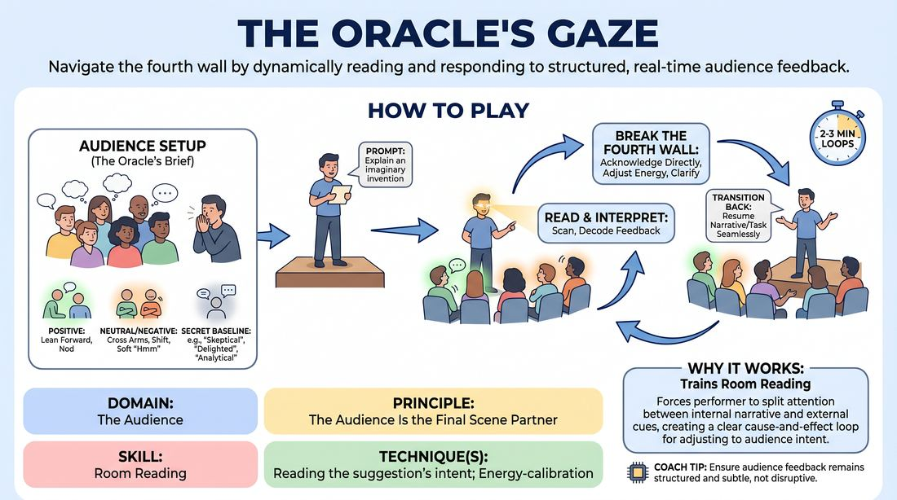

# The Oracle's Eye

{ .game-hero }

> Navigate the fourth wall by dynamically reading and responding to structured, real-time audience feedback.

## Overview
A solo performer executes a simple, open-ended monologue or task while the remaining players act as an active, cue-giving audience. By delivering structured non-verbal and subtle verbal feedback, this 'Oracle' forces the performer to constantly scan the room, interpret audience intent, and break the fourth wall to adjust their performance in real time.

## What It Trains
- **Domain:** D5 — The Audience
- **Principle(s):** The Audience Is the Final Scene Partner; Play for the Back Row
- **Skill(s):** Room Reading; Audience-Energy Management; Stage Presence & Clarity
- **Technique(s):** Energy-calibration; Reading the suggestion's intent; Tag-running (riding a laugh wave); Landing/cushioning a beat; Breaking the 4th Wall / Direct Address; Cheating out; Projection; Make the choice readable
- **Focus:** skill_drill

**Objective:** To develop advanced room-reading skills, master the purposeful navigation of the fourth wall, and treat the audience as an active, live scene partner whose energy must be managed and integrated.

## Setup
An in-person performance space with one clear stage area and a seated audience area. No props are required. The facilitator prepares a list of structured audience cues (e.g., leaning forward for interest, rubbing chin for confusion) to brief the audience beforehand.

## How to Play
1. Select one player to step up as the active performer, while the rest of the group forms the 'Oracle Audience' in the seating area.
2. Brief the Oracle Audience (out of earshot of the performer, or as a group beforehand) on their structured cues: leaning forward/nodding for positive engagement, rubbing chins/frowning for confusion, leaning back/sighing for disengagement, and subtle thumbs up/down for approval.
3. Assign the Oracle Audience a secret baseline attitude for the round, such as 'initially skeptical,' 'easily delighted,' or 'highly analytical.'
4. Give the solo performer a simple, open-ended prompt that requires internal focus or explanation (e.g., 'Explain a highly complex, imaginary invention' or 'Search a room for a hidden, delicate object').
5. The performer begins their monologue or task, maintaining their character and objective while actively scanning the audience's physical and vocal feedback.
6. The Oracle Audience reacts honestly but expressively to the performer's choices using only the pre-briefed non-verbal and subtle verbal cues.
7. The performer must actively acknowledge and integrate these cues by breaking the fourth wall—using direct address, adjusting their physical energy, clarifying confusing points, or leaning into successful beats.
8. The performer must seamlessly transition back into their internal scene after each fourth-wall break, keeping the narrative or task moving forward.
9. Run the scene for 2 to 3 minutes, then rotate a new performer onto the stage with a different prompt and a new audience baseline attitude.

## Facilitation Notes
- Side-coach the performer to keep their eyes up and active; a common pitfall is looking at the floor or getting trapped in internal thoughts instead of scanning the room.
- Remind the Oracle Audience to keep their cues physical and subtle; they should not shout out or hijack the scene, but rather act as a collective barometer.
- If the performer misses a cue, side-coach them with 'What is the room telling you right now?' to prompt an immediate fourth-wall break.
- Ensure the performer is 'cheating out' and playing to the back row, making their reactions and adjustments visible to the entire space.

## Variations
- The Emotional Mirror: The Oracle Audience's cues represent specific emotional states (e.g., fear, joy, suspicion) that the performer must instantly adopt in their monologue.
- The Silent Partner: The performer is completely silent, executing a physical task (like painting a masterpiece), and must adjust their physical comedy and object work solely based on the audience's non-verbal cues.
- The Two-Player Split: Run the game with two performers in a scene, where only one performer is permitted to break the fourth wall and translate the audience's cues to their oblivious partner.

## Debrief
- Performer: How did it feel to treat the audience's physical reactions as direct dialogue or offers?
- Audience: At what points did you feel the performer truly read your intent versus just reacting to noise?
- How did breaking the fourth wall help or hinder the momentum of your solo task, and how did you manage that transition?

## Safety & Inclusion
Ensure the Oracle Audience's cues remain respectful and non-threatening. Establish that physical cues should not cross personal boundaries, and performers can choose to ignore any cue that makes them feel genuinely uncomfortable.

## Why It Works
This game strips away the safety of a closed fourth wall, forcing the performer to split their attention between their internal narrative and the external room. By structuring the audience's feedback, it creates a clear cause-and-effect loop where the performer learns that the audience is not a passive observer, but the final, most influential scene partner in the room.
