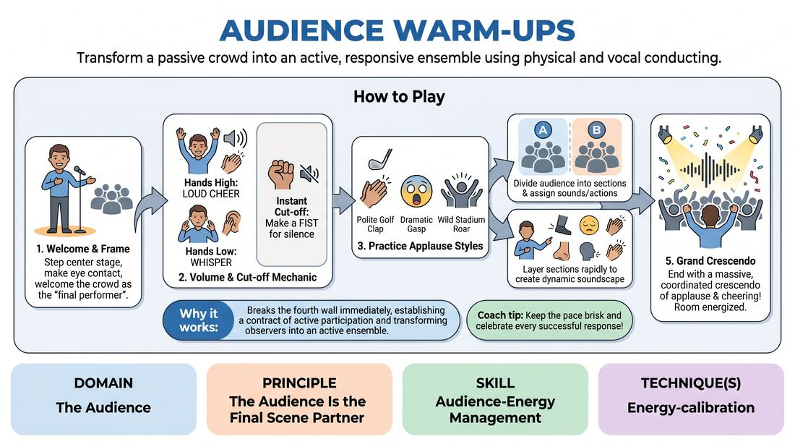

# Audience Orchestration

{ .game-hero }

> Transform a passive crowd into an active, responsive ensemble using physical and vocal conducting.

## Overview
This high-energy warm-up turns the audience into an active performance partner before the main show begins. By acting as a conductor, the facilitator guides the crowd through physical and vocal exercises, establishing a shared vocabulary of play. The experience lowers inhibitions, builds a unified group mind, and primes the room for high-energy engagement.

## What It Trains
- **Domain:** D5 — The Audience
- **Principle(s):** The Audience Is the Final Scene Partner
- **Skill(s):** Audience-Energy Management; Room Reading; Pacing & Rhythm
- **Technique(s):** Energy-calibration
- **Focus:** connection

**Objective:** Develops audience-energy management, room reading, and pacing by establishing a direct, playful feedback loop between the stage and the house.

## Setup
The facilitator stands on stage facing the audience. The audience remains in their seats or stands in the house. No props are required, but a clear line of sight between the facilitator and the entire crowd is essential.

## How to Play
1. Step center stage, make direct eye contact with the entire room, and warmly welcome the audience, framing them as the final and most important performer of the night.
2. Introduce the 'volume dial' mechanic: raise your hands high to cue a loud cheer and applause, and lower your hands to bring the volume down to a whisper.
3. Practice the 'instant cut-off' by closing your hands into fists, coaching the audience to transition from a roar to absolute silence in a split second.
4. Introduce and rehearse specific applause styles for different show moments, such as the polite golf clap, the dramatic gasp, and the wild stadium roar.
5. Divide the audience into two or three distinct sections and assign each section a unique sound or physical action, such as a foot stomp, a collective sigh, or a specific syllable.
6. Conduct the sections in rapid succession, layering the sounds to create a rhythmic, dynamic soundscape that requires the audience's absolute focus.
7. End the orchestration with a massive, coordinated crescendo of applause and cheering, leaving the room energized and ready for the performance.

## Facilitation Notes
- Coaching cue: Use big, clear, theatrical physical gestures. If your conducting is tentative, the audience's response will be tentative.
- Pitfall: The audience is sluggish or self-conscious. Fix: Start with very low-stakes, silly sounds like a simple collective yawn, and praise their effort immediately to build safety.
- Coaching cue: Keep your eyes moving across the entire room so every section feels seen and included in the orchestration.
- Pitfall: The crowd gets too chaotic and fails to stop on the cut-off cue. Fix: Turn the cut-off into a game, doing rapid-fire sound-on and sound-off drills until they hit silence instantly.

## Variations
- The Sound Effects Story: The facilitator tells a short, improvised story and cues the different audience sections to provide live, synchronized sound effects on demand.
- The One-Voice Answer: The facilitator asks the audience a simple question, and the entire crowd must shout their individual answers at the exact same time on a count of three, creating a unified wall of sound.
- The Energy Wave: Initiate a physical wave that travels from the front row to the back row, incorporating both a physical stand-and-reach and a vocal crescendo.

## Debrief
- How did your relationship to the stage change once you started actively responding to the physical cues?
- As a performer, how does having an audience that is physically and vocally warmed up change your energy before you even step on stage?
- What did you notice about the transition from individual audience members to a single, unified crowd?

## Safety & Inclusion
Ensure all physical prompts, such as standing up or waving arms, are presented as optional, offering seated or vocal-only alternatives so that individuals with mobility limitations can fully participate. Avoid prompts that force physical contact between strangers, opting instead for high-fives, waves, or simple verbal greetings to respect personal boundaries.

## Why It Works
This activity works because it breaks the fourth wall immediately and sets a contract of active participation. By teaching the audience how to respond to physical cues, it transforms them from passive observers into an active ensemble. It calibrates the room's energy, giving the facilitator a real-time diagnostic of the crowd's responsiveness while giving the audience permission to be loud, playful, and expressive.
