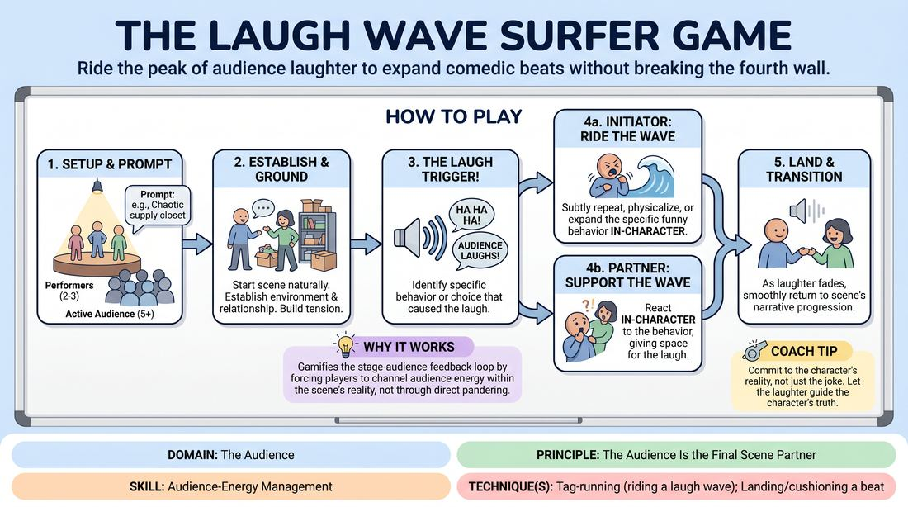

# Surfing the Laugh Wave

{ .game-hero }

> Ride the peak of audience laughter to expand comedic beats without breaking the fourth wall.

## Overview
A focused scene-work drill where performers treat audience laughter as an active, physical force. Players learn to identify the exact trigger of a laugh and subtly expand upon it within the scene's reality. The experience is a high-focus exercise in listening to the room while maintaining a grounded, believable stage world.

## What It Trains
- **Domain:** D5 — The Audience
- **Principle(s):** The Audience Is the Final Scene Partner
- **Skill(s):** Room Reading; Audience-Energy Management; Stage Presence & Clarity; Game Identification; Heightening & Exploration
- **Technique(s):** Tag-running (riding a laugh wave); Landing/cushioning a beat; Make the choice readable; Finding & Playing the Game
- **Focus:** skill_drill

**Objective:** To develop advanced audience-energy management and room-reading skills. Performers learn the technique of tag-running (riding a laugh wave) and landing/cushioning beats, treating the audience's vocal reactions as a dynamic scene partner without breaking character or direct address.

## At a Glance
| Aspect | Detail |
|---|---|
| Players | 7+ (ideal 8-15) |
| Time | ~15 min |
| Complexity | 3/5 |
| Skill level | competent |
| Energy | medium |
| Physicality | low |
| Modality | in_person |
| Space | moderate |
| Props | none |
| Audience | required |

## Setup
An in-person performance space with a clear stage area and seating for an audience of at least 5-12 active observers (the rest of the workshop group). No props or special materials are required. The facilitator stands near the audience to observe and offer minimal, silent physical cues if needed.

## How to Play
1. Divide the group so that 2 to 3 players are on stage as performers, while the remaining 5 or more participants act as the active audience.
2. Instruct the audience to react naturally, vocally, and generously to anything they find genuinely amusing during the scene.
3. Provide the on-stage players with a simple, character-driven relationship prompt (e.g., two coworkers organizing a chaotic supply closet).
4. Begin the scene normally, establishing grounded characters, a clear environment, and a relatable point of tension.
5. As soon as the audience laughs, the performers must instantly identify the specific comedic choice or behavior that triggered the reaction.
6. The performer who initiated the funny moment must 'ride the wave' by subtly repeating, physicalizing, or expanding that specific behavior within their character's logic.
7. The scene partner must support this wave by reacting in-character to the behavior, giving the audience space to fully enjoy and extend the laugh.
8. As the laughter begins to subside, the performers must 'cushion the landing' by smoothly transitioning back into the narrative progression of the scene, avoiding self-indulgent repetition.
9. Run the scene for 4 to 5 minutes, allowing multiple laugh waves to be ridden and landed, before the facilitator calls 'scene'.

## Facilitation Notes
- Side-coaching cue: 'Ride it, don't repeat it!' Remind players to expand the behavior or emotion behind the laugh, rather than just repeating a verbal punchline verbatim.
- Pitfall: Breaking the fourth wall. Players often look directly at the audience or wink when they get a laugh. Fix: Coach them to keep their eyes locked in the scene's environment, letting the character's internal state absorb the energy instead.
- Side-coaching cue: 'Cushion the landing.' When the laugh dies down, immediately introduce a new line or action to pull the audience back into the story's momentum.
- Pitfall: Over-milking the joke. Players sometimes ride a wave for too long, stalling the scene's narrative. Fix: Remind them that a wave has a peak and a trough; they must move forward once the energy dips.
- Facilitator Tip: Use a subtle, silent hand gesture (like a gentle upward wave) to prompt players to hold and expand a moment when they miss an organic laugh wave.

## Variations
- The Silent Surf: Run the scene where the audience is instructed to only smile or show physical amusement without making sound, forcing performers to read visual room energy.
- The Freeze-Frame Check: The facilitator calls 'Freeze' right at the peak of a laugh wave and asks the active performer to name exactly what choice the audience is laughing at, before calling 'Unfreeze' to let them ride it.

## Debrief
- How did it feel to treat the audience's laughter as a physical cue to slow down and expand, rather than rushing to the next line?
- What was the difference between a successful 'wave ride' and an indulgent 'milking' of a joke?
- How did you identify the exact trigger of the laugh, and how did that guide your next physical or verbal choice?
- As an audience member, when did you feel the performers successfully cushioned a landing and kept you engaged in the story?

## Safety & Inclusion
Ensure the audience understands that their role is to support the performers with genuine reactions, not to heckle or intentionally withhold laughter. For players with hearing sensitivities, the facilitator can use visual hand signals to represent the rise and fall of the laugh wave.

## Why It Works
This game works because it gamifies the feedback loop between the stage and the house. By enforcing the strict boundary of the fourth wall, it prevents cheap, direct-address pandering and instead forces players to channel audience energy directly into character depth and physical commitment. This builds a sophisticated muscle memory for timing, pacing, and comedic patience.
