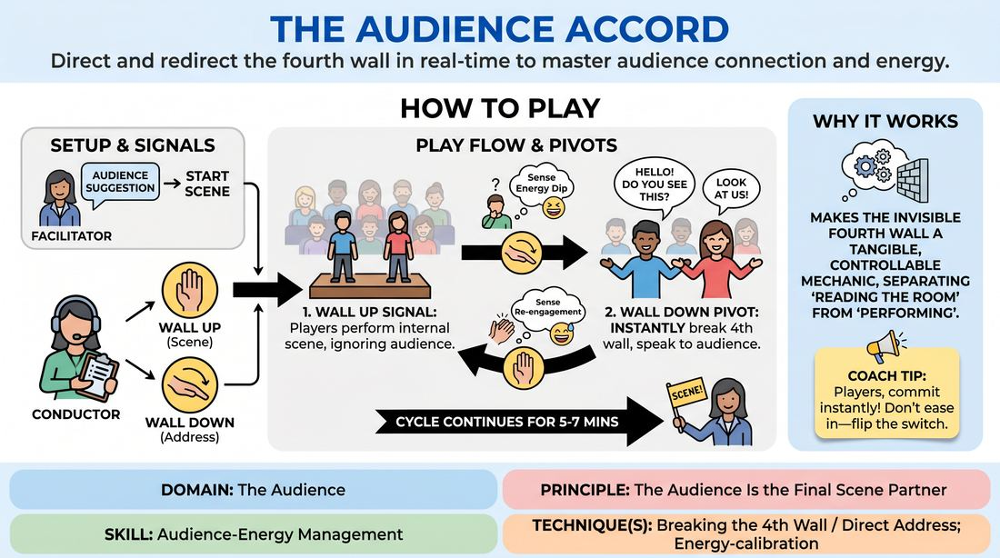

# The Fourth Wall Conductor

{ .game-hero }

> Direct and redirect the fourth wall in real-time to master audience connection and energy.

## Overview
In this dynamic exercise, a designated 'Conductor' stands offstage, reading the room's energy and using physical hand signals to raise or lower an imaginary fourth wall. Onstage players must instantly pivot between standard, self-contained scene work and direct, high-energy audience address. This creates a live feedback loop where the audience's engagement directly dictates the performance's presentation style.

## What It Trains
- **Domain:** D5 — The Audience
- **Principle(s):** The Audience Is the Final Scene Partner; Play for the Back Row
- **Skill(s):** Room Reading; Audience-Energy Management; Stage Presence & Clarity; Physicality & Space Work; Vocal Craft
- **Technique(s):** Energy-calibration; Reading the suggestion's intent; Tag-running (riding a laugh wave); Landing/cushioning a beat; Breaking the 4th Wall / Direct Address; Cheating out; Projection; Make the choice readable
- **Focus:** mixed

**Objective:** To develop advanced audience-energy management and room-reading skills, training players to treat the audience as an active scene partner by seamlessly breaking and re-establishing the fourth wall.

## Setup
An audience sits facing a clear performance space. One player is designated as the Conductor and stands downstage-side (left or right) where they have a clear view of both the stage and the entire audience. Two to three players stand center stage ready to begin a scene. No props are required.

## How to Play
1. The facilitator obtains a simple scene suggestion from the audience to kick off the improvisation.
2. The Conductor begins the scene with the 'Wall Up' signal (holding a flat hand vertically, palm facing outward like a barrier), indicating a traditional, self-contained scene.
3. The onstage players begin their scene, focusing entirely on their characters and internal narrative, acting as if the audience is not there.
4. The Conductor continuously scans the audience, looking for physical and vocal cues such as laughter, leaning forward, shifting in seats, or moments of quiet distraction.
5. When the Conductor senses a dip in energy, a comedic peak to exploit, or a need for narrative clarity, they switch to the 'Wall Down' signal (sweeping an open hand outward toward the audience).
6. Upon seeing the 'Wall Down' signal, the onstage players must instantly pivot to direct address, breaking character boundaries to speak directly to the audience as their characters.
7. While the wall is down, players must physically open up their body positions toward the audience, project their voices to the back row, and actively ride any laughter or reactions before continuing.
8. Once the audience is re-engaged or the comedic beat has landed, the Conductor raises the wall again with the 'Wall Up' signal.
9. The players immediately drop the direct address and return to the internal reality of the scene, treating their previous audience interactions as private, unspoken thoughts.
10. The cycle continues for 5 to 7 minutes, shifting back and forth multiple times, before the facilitator calls 'Scene!'

## Facilitation Notes
- Coaching Cue: Remind the Conductor to watch the audience, not just the players. Their primary job is reading the room, not directing the plot.
- Pitfall: Players dropping their character's point of view when addressing the audience. Fix: Remind them to break the wall in character—a nervous character should address the audience nervously, not as the actor.
- Coaching Cue: 'Play to the back row!' Encourage players to physically open up their bodies (cheat out) and boost their vocal projection the moment the wall drops.
- Pitfall: The Conductor switching the wall too rapidly, causing whiplash. Fix: Instruct the Conductor to let each state breathe for at least 30-45 seconds so players can establish a rhythm.
- Coaching Cue: 'Ride the wave!' Teach players to pause and make eye contact when the audience laughs or gasps during direct address, rather than rushing past the reaction.

## Variations
- The Whisper Wall: When the wall is down, players must deliver their direct addresses as quiet, conspiratorial whispers, forcing the audience to lean in.
- Audience Vote: When the wall is down, players can ask the audience a quick binary choice question to dictate the next plot point before the wall goes back up.
- Dual Conductors: Two offstage conductors manage different halves of the audience, requiring onstage players to balance different wall states depending on which side of the stage they are on.

## Debrief
- For the Conductor: What specific physical cues in the audience told you it was time to lower or raise the wall?
- For the Players: How did your physical presence and vocal projection change when transitioning from internal scene work to direct address?
- For the Players: What strategies did you use to keep your direct addresses grounded in your character's perspective rather than breaking into meta-commentary?
- For the Audience: How did it feel to be actively pulled into the scene's reality versus watching it from behind the wall?

## Safety & Inclusion
Ensure the audience space is well-lit enough for the Conductor to read faces safely. If any audience members show physical signs of discomfort with direct eye contact, players should gently redirect their address to more receptive sections of the room.

## Why It Works
This game works because it externalizes the invisible boundary of the fourth wall, turning it into a tangible, mechanical tool. By separating the task of 'reading the room' (given to the Conductor) from 'performing' (given to the players), it allows players to experience the immediate, powerful impact of direct address without having to split their focus. Over time, this builds an instinctual muscle for when and how to invite the audience into a scene as an active partner.
