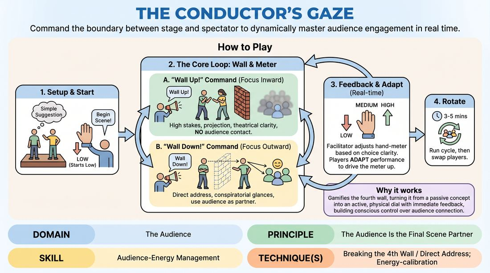

# The Fourth Wall Conductor

{ .game-hero }

> Command the boundary between stage and spectator to dynamically master audience engagement in real time.

## Overview
In this dynamic training drill, players perform a standard scene while a facilitator acts as an active conductor of audience energy. By responding to real-time hand signals representing audience engagement and sudden verbal commands to raise or lower the fourth wall, performers learn to consciously manipulate their relationship with the room. The experience is a fast-paced, high-focus exercise in balancing narrative immersion with direct spectator connection.

## What It Trains
- **Domain:** D5 — The Audience
- **Principle(s):** The Audience Is the Final Scene Partner; Play for the Back Row
- **Skill(s):** Room Reading; Audience-Energy Management; Stage Presence & Clarity; Vocal Craft; Physicality & Space Work
- **Technique(s):** Energy-calibration; Reading the suggestion's intent; Tag-running (riding a laugh wave); Landing/cushioning a beat; Breaking the 4th Wall / Direct Address; Cheating out; Projection; Make the choice readable
- **Focus:** skill_drill

**Objective:** To develop the ability to read a room and consciously control the fourth wall, shifting fluidly between deep scene immersion and direct audience address to manage energy and maintain high engagement.

## At a Glance
| Aspect | Detail |
|---|---|
| Players | 3+ (ideal 6-12) |
| Time | ~15 min |
| Complexity | 3/5 |
| Skill level | competent |
| Energy | medium |
| Physicality | medium |
| Modality | in_person |
| Space | moderate |
| Props | none |
| Audience | not required |

## Setup
Arrange the group with 2 to 3 players on stage and the remaining participants sitting as the audience. The facilitator stands or sits clearly visible in the front row, acting as the 'Conductor'. No props or materials are required, though a clear line of sight between the stage and the facilitator is essential.

## How to Play
1. Select two or three players to begin a scene on stage, obtaining a simple relationship or location suggestion to establish the platform.
2. The facilitator acts as the Conductor, using a continuous hand gesture (the 'Engagement Meter') to represent the audience's current level of interest: hand low means low engagement or confusion, hand at chest level means moderate interest, and hand held high means high engagement and laughter.
3. The performers begin the scene normally, aiming to establish clear characters, strong vocal projection, and readable physical choices to immediately drive the Engagement Meter upward.
4. At any point, the facilitator will call out 'Wall Up!' which requires the performers to instantly seal the fourth wall, ignoring the audience completely and focusing entirely on the internal reality of the scene.
5. During 'Wall Up' phases, players must maintain high engagement solely through theatrical clarity, heightened stakes, physical commitment, and vocal projection—playing for the back row without ever looking at the audience.
6. The facilitator may then call out 'Wall Down!' which commands the performers to instantly break the fourth wall, using direct eye contact, conspiratorial whispers, or meta-commentary to engage the audience directly.
7. During 'Wall Down' phases, players must actively use the audience as their final scene partner, using direct address to cushion comedic beats, explain inner thoughts, or calibrate the room's energy.
8. The facilitator continuously adjusts the hand-meter based on the clarity and impact of the players' choices, forcing them to constantly adapt their performance style to keep the meter high.
9. Run the scene for three to five minutes, cycling through several wall transitions, before rotating new players onto the stage.

## Facilitation Notes
- As the Conductor, be honest and highly responsive with your hand signals; do not leave your hand high if the scene's energy or clarity dips, as players need accurate feedback to learn.
- Side-coach players who struggle during 'Wall Up' by reminding them to project and use bold physical choices to tell the story, rather than shrinking their performance.
- If players overuse cheap meta-jokes during 'Wall Down' phases, challenge them to use direct address to reveal genuine character vulnerability or narrative secrets instead.
- Watch out for 'cue dependency' where players stare constantly at the facilitator's hand instead of looking at their scene partner or the broader audience; remind them to read the room globally, using the hand signal as a secondary guide.

## Variations
- Targeted Energy: The facilitator challenges the players to achieve a specific, difficult state, such as keeping the meter at 'high confusion' during a Wall Up phase, then instantly resolving it to 'high amusement' when the Wall Down command is given.
- Audience Voice: During Wall Down moments, the facilitator or the seated audience can call out brief collective reactions (e.g., 'gasp', 'collective sigh', 'confused murmur') that the onstage players must immediately address and justify.
- The Solo Narrator: One player in the scene is designated as the sole 'wall-breaker' who can hear the commands, while the other players must remain permanently behind the fourth wall, reacting only to the narrator's direct addresses.

## Debrief
- How did your physical and vocal choices change when you were forced to keep engagement high with the fourth wall completely sealed?
- What types of direct address felt most effective at raising the engagement meter without completely derailing the scene's narrative?
- How did it feel to treat the audience as an active, responsive scene partner rather than a passive observer?
- What cues from the room (or the facilitator) helped you realize your choices weren't landing, and how did you adjust?

## Safety & Inclusion
Ensure players understand that breaking the fourth wall does not require physical contact or invading the personal space of audience members. Direct address should rely on eye contact, vocal delivery, and shared focus, respecting physical boundaries at all times.

## Why It Works
This game works because it gamifies the invisible boundary of the fourth wall, turning a passive theatrical concept into an active, physical dial. By receiving immediate, real-time feedback on their clarity and connection, players build the muscle memory needed to read a room and adjust their projection, physicality, and intimacy on the fly.
