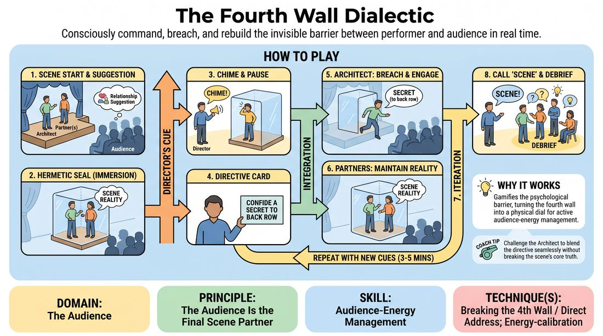

# The Fourth Wall Dialectic

{ .game-hero }

> Consciously command, breach, and rebuild the invisible barrier between performer and audience in real time.

## Overview
A dynamic, directive-driven training drill where a primary performer navigates an active scene while a facilitator uses auditory cues and prompt cards to alter their relationship with the audience. While scene partners maintain the scene's internal reality, the primary performer must fluidly shift between total immersion, direct address, and subtle audience calibration. This creates a live laboratory for testing how physical choices, projection, and eye contact instantly alter room energy.

## What It Trains
- **Domain:** D5 — The Audience
- **Principle(s):** The Audience Is the Final Scene Partner; Play for the Back Row
- **Skill(s):** Room Reading; Audience-Energy Management; Stage Presence & Clarity
- **Technique(s):** Energy-calibration; Reading the suggestion's intent; Tag-running (riding a laugh wave); Landing/cushioning a beat; Breaking the 4th Wall / Direct Address; Cheating out; Projection; Make the choice readable
- **Focus:** skill_drill

**Objective:** To develop a performer's ability to read and manage audience energy, intentionally break and re-establish the fourth wall, and project physical and vocal choices clearly to the back row without losing the scene's narrative thread.

## Setup
Set up a clear stage area facing an audience of non-playing participants. Prepare a set of large index cards with clear, bold audience-interaction directives. Have a bell, chime, or buzzer ready. Cast one primary performer (the 'Architect'), one or two supporting scene partners, and designate the facilitator (or an advanced student) as the 'Director' who holds the chime and cards.

## How to Play
1. The Architect and their supporting scene partners take the stage and obtain a simple, relationship-focused suggestion from the audience to initiate a standard scene.
2. The players begin the scene under a strict 'hermetic seal' (a solid fourth wall), completely immersed in their environment and ignoring the audience's physical presence.
3. At any point, the Director sounds the chime, signaling the Architect to briefly pause their current action and look directly at the Director.
4. The Director holds up an index card displaying a specific audience-interaction directive (such as 'Confide a secret to the back row' or 'Acknowledge a laugh non-verbally').
5. The Architect must immediately and seamlessly integrate this directive into the scene, altering their physical orientation, vocal projection, or focus to engage the audience.
6. The supporting scene partners must maintain the scene's internal logic, reacting naturally to the Architect's behavior without breaking the fourth wall themselves.
7. The Architect continues playing with this new audience relationship until the Director chimes again to introduce a new directive card.
8. After several shifts (approximately 3 to 5 minutes), the Director calls 'scene' to transition to a structured debrief.

## Facilitation Notes
- Coaching Cue: 'Ride the wave!' If the audience laughs, instruct the Architect to hold their next line, maintain eye contact with a spectator, and let the laugh peak before speaking.
- Pitfall: The Architect completely abandons the scene's narrative to perform stand-up. Fix: Remind the player that the scene's stakes must remain real; the audience is a confidant or an invisible force, not a distraction from the plot.
- Coaching Cue: 'Cheat out!' Remind the Architect to open their shoulders and hips 45 degrees toward the audience, making their physical object work visible to the back row even when talking to their partner.
- Pitfall: Supporting partners get confused and start breaking the fourth wall too. Fix: Side-coach the partners to double down on their characters' reality, treating the Architect's audience-facing moments as internal monologues or quirky character quirks.
- Director Timing: Ensure the Director waits for a natural beat or a moment of high/low audience energy before chiming, rather than interrupting a crucial narrative discovery.

## Variations
- The Silent Dialectic: The Architect must execute all audience-directed prompts entirely through non-verbal cues, eye contact, and physical posture, keeping all spoken dialogue strictly within the scene.
- The Tag-Team Wall: Two primary performers receive directives simultaneously, requiring them to coordinate how they split their focus between each other and the audience.
- Audience-Driven Chime: An audience member is given the chime and rings it whenever they feel a shift in the room's energy, prompting the Director to flash the next card.

## Debrief
- For the Architect: How did shifting your focus to the audience affect your physical presence and vocal projection?
- For the Scene Partners: What strategies did you use to keep the scene grounded while your partner was breaking the fourth wall?
- For the Audience: Which directives felt like an organic invitation into the scene, and which felt jarring or disruptive?
- For everyone: How does treating the audience as an active scene partner change the pacing and delivery of your comedy?

## Safety & Inclusion
Ensure that directives involving direct eye contact or playing to specific audience members are executed with respect for personal boundaries. Instruct players to never touch, physically corner, or single out audience members in a way that causes visible discomfort. If an audience member looks away or seems uncomfortable, the performer should immediately shift their focus to a different part of the room.

## Why It Works
This game works because it gamifies the psychological barrier of the fourth wall, turning a conceptual boundary into a physical dial that can be turned up or down. By forcing the primary performer to actively manage the audience's energy while keeping the scene afloat, it builds the muscle memory of 'room reading.' It teaches improvisers that the audience is not a passive wall of darkness, but an active, breathing partner that responds instantly to changes in physical orientation, eye contact, and vocal projection.
