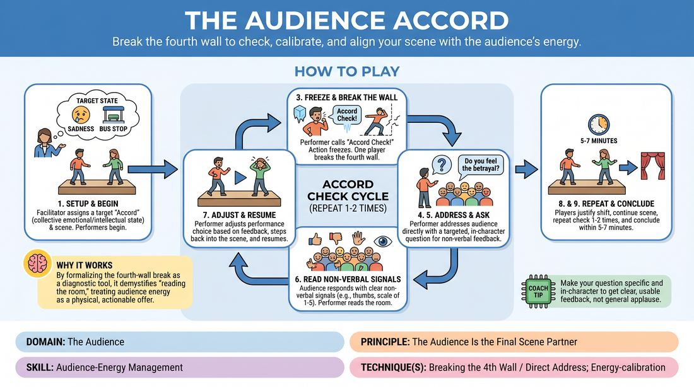

# The Audience Accord

{ .game-hero }

> Break the fourth wall to check, calibrate, and align your scene with the audience's energy.

## Overview
A dynamic scene-work exercise where performers actively cultivate a specific collective emotional or intellectual state within the audience. At key moments, players freeze the action, break the fourth wall, and directly check in with the crowd to read their energy and adjust their performance in real time.

## What It Trains
- **Domain:** D5 — The Audience
- **Principle(s):** The Audience Is the Final Scene Partner; Play for the Back Row
- **Skill(s):** Room Reading; Audience-Energy Management; Stage Presence & Clarity; Vocal Craft; Justification
- **Technique(s):** Breaking the 4th Wall / Direct Address; Energy-calibration; Cheating out; Projection; Make the choice readable; Landing/cushioning a beat
- **Focus:** connection

**Objective:** To master audience-energy management and direct address, training performers to treat the audience as an active co-creative partner whose collective state must be read, respected, and intentionally shifted.

## Setup
A performance space with 1 to 3 players on stage and the remaining participants seated as the active audience. The facilitator selects a target 'Accord' (e.g., Collective Sympathy, Shared Suspicion, or Intellectual Agreement) and displays it clearly for everyone to see.

## How to Play
1. The facilitator assigns a specific 'Audience Accord'—a target collective emotional or intellectual state—and a basic scene suggestion to the on-stage performers.
2. The performers begin a standard scene, focusing on establishing their characters and building a narrative that naturally steers the audience toward the target Accord.
3. At a strategic narrative moment, or when prompted by the facilitator, a performer calls out 'Accord Check!' and all on-stage action immediately freezes.
4. The freezing performer breaks the fourth wall, steps forward, and directly addresses the audience to gauge their current emotional or intellectual alignment with the target Accord.
5. The performer asks a targeted, in-character question to solicit non-verbal feedback (e.g., 'Do you feel the weight of my betrayal, or do you think I am overreacting?').
6. The audience responds using designated non-verbal signals, such as thumbs up/down, nodding, leaning in, or showing a scale of 1 to 5 with their fingers.
7. The performer reads the room, assesses the feedback, and immediately steps back into the scene, resuming the action with an adjusted performance choice (e.g., increasing vulnerability or raising the stakes).
8. The players must seamlessly justify this sudden shift in character behavior within the reality of the scene.
9. The scene continues, repeating the 'Accord Check' cycle one or two more times before concluding within five to seven minutes.

## Facilitation Notes
- Side-coaching cue: Encourage performers to ask highly specific questions during the check rather than a generic 'How am I doing?' to get actionable feedback.
- Pitfall: The audience gives mixed or chaotic feedback. Fix: Have the facilitator step in to standardize the response, asking the audience to show a clear 1-to-5 finger rating.
- Side-coaching cue: Remind players to 'play for the back row' by projecting their direct address clearly and making their physical adjustments readable to the entire room.
- Pitfall: Performers break character completely during the check. Fix: Coach them to maintain their character's perspective and voice even while breaking the fourth wall.
- Side-coaching cue: Focus on justification. When resuming the scene, immediately find a narrative reason for your character's sudden shift in energy or attitude.

## Variations
- Blind Accord: The audience is secretly assigned the target Accord by the facilitator, and the performers must figure out what it is solely through their Accord Checks and room reading.
- Opposing Accords: In a two-player scene, each performer is secretly assigned a different, competing Accord to cultivate within the audience, turning the scene into a subtle tug-of-war for the crowd's empathy.
- Rapid Fire: Run a fast-paced solo monologue where the performer must hit three different Accords in three minutes, checking in every 60 seconds.

## Debrief
- How did breaking the fourth wall to ask for feedback change your sense of connection to the room?
- What non-verbal cues from the audience were the easiest or hardest to read during the freeze?
- How did you justify your character's sudden shift in behavior after receiving the audience's feedback?
- For the audience: When did you feel the performers were most successful at actively managing and shifting your energy?

## Safety & Inclusion
Ensure the audience understands that non-verbal feedback must remain respectful and supportive. If a performer is exploring a vulnerable emotional state, the audience's feedback should focus on artistic alignment rather than personal judgment.

## Why It Works
By formalizing the fourth-wall break as a diagnostic tool, this game demystifies 'reading the room.' It forces players to step out of their internal narrative loop and treat the audience's real-time energy as a physical, actionable offer. This builds strong habits of vocal projection, physical clarity, and immediate narrative justification.
