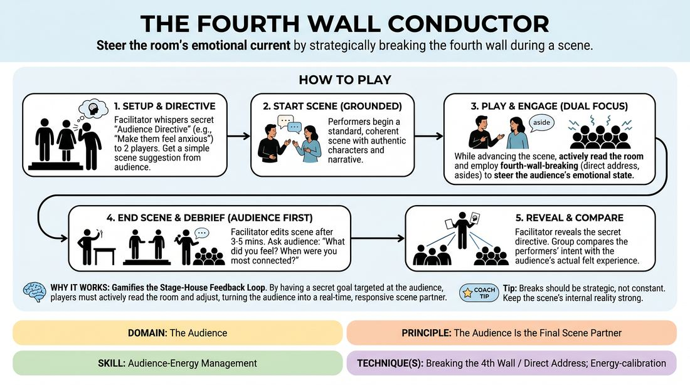

# The Fourth Wall Conductor

{ .game-hero }

> Steer the room's emotional current by strategically breaking the fourth wall during a scene.

## Overview
In this exercise, players perform a standard scene while secretly working to elicit a specific emotional or intellectual response from the audience. By dynamically adjusting their physical orientation, making direct eye contact, and delivering targeted asides, players treat the audience as an active, responsive scene partner. The game culminates in a revealing debrief that compares the performers' intent with the audience's actual experience.

## What It Trains
- **Domain:** D5 — The Audience
- **Principle(s):** The Audience Is the Final Scene Partner; Play for the Back Row
- **Skill(s):** Room Reading; Audience-Energy Management; Stage Presence & Clarity
- **Technique(s):** Energy-calibration; Reading the suggestion's intent; Tag-running (riding a laugh wave); Landing/cushioning a beat; Breaking the 4th Wall / Direct Address; Cheating out; Projection; Make the choice readable
- **Focus:** skill_drill

**Objective:** To develop precise control over the performer-audience relationship, training players to read the room, manage audience energy, and use direct address to intentionally shape the audience's emotional state.

## Setup
An active performance space facing a seated audience (the rest of the workshop group). No props are required. The facilitator prepares a list of secret 'Audience Directives' (e.g., make them feel complicit, make them feel deep pity, make them suspicious of a character).

## How to Play
1. Select two players to step onto the stage and ask the audience for a simple scene suggestion, such as a location or a relationship.
2. Before the scene begins, the facilitator pulls the performers aside and whispers a secret 'Audience Directive'—a specific emotional or psychological state they must evoke in the audience (e.g., 'make the audience feel like they are keeping a secret with you').
3. The performers initiate a standard, grounded scene based on the suggestion, maintaining a coherent narrative and authentic character relationships.
4. While playing the scene, the performers must actively read the room and employ fourth-wall-breaking techniques—such as direct address, subtle asides, knowing glances, and physical cheating out—to guide the audience toward the secret directive.
5. Performers must balance the dual focus of advancing the scene's internal reality while treating the audience as their silent, final scene partner.
6. The facilitator allows the scene to run for three to five minutes, observing how the performers calibrate their energy and projection to reach the back row.
7. The facilitator edits the scene and immediately instructs the performers to remain on stage without revealing their secret directive.
8. The facilitator asks the audience to share what they felt, what impressions they formed, and when they felt most connected to the stage.
9. The facilitator reveals the secret directive, allowing the group to compare the performers' strategic intent with the audience's actual felt experience.

## Facilitation Notes
- Coaching Cue: Encourage players to 'cheat out' physically. Remind them that even intimate, quiet moments must be projected clearly to the back row to maintain connection.
- Pitfall: Players completely abandon the scene's internal logic to pander to the audience. Fix: Side-coach them to ground their choices in the character's reality, using the fourth-wall breaks as strategic extensions of their character's inner thoughts.
- Coaching Cue: 'Read the room!' If a subtle glance doesn't land, adjust the energy, hold the pause longer, or use a direct verbal aside to calibrate the audience's focus.
- Pitfall: The secret directive is too vague or action-oriented (e.g., 'make them laugh'). Fix: Keep directives focused on complex emotional or intellectual states, such as making the audience feel complicit, protective, or suspicious.

## Variations
- The Permeability Dial: The facilitator calls out numbers from 1 to 5 during the scene. 1 represents a completely sealed fourth wall (no audience awareness), while 5 represents total direct address and audience integration, forcing players to transition fluidly between states.
- The Solo Soliloquy: A single player performs a monologue, receiving mid-scene directives from the facilitator to shift the audience's feeling from pity to suspicion to joy using only direct address.

## Debrief
- To the audience: At what specific moment did you feel the target emotion, and what physical or vocal choice triggered that feeling?
- To the performers: How did you balance the needs of the scene partner on stage with the needs of your final scene partner in the seats?
- How did reading the audience's physical cues (silence, shifting, leaning in) help you calibrate your energy and projection?

## Safety & Inclusion
Ensure that directives do not require players to invade the physical space of the audience or make individual audience members feel targeted or unsafe. Establish that direct address should feel like an invitation to connect, not an interrogation.

## Why It Works
This game works because it gamifies the feedback loop between the stage and the house. By giving players a secret objective targeted at the audience's emotional state, it forces them to move past self-consciousness and actively read the room. It transforms the fourth wall from a rigid barrier into a flexible tool for intimacy, projection, and energy management.
