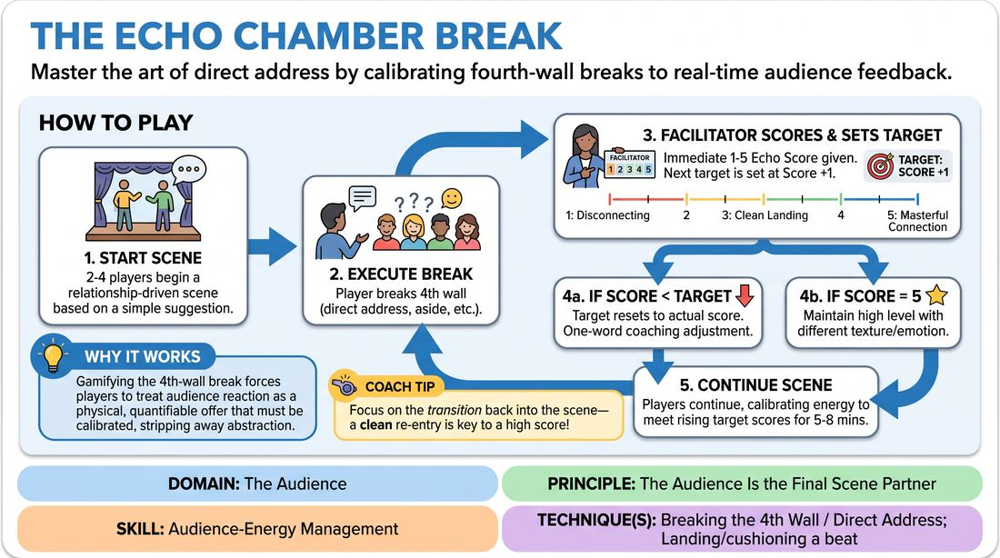

# The Echo Meter

{ .game-hero }

> Master the art of direct address by calibrating fourth-wall breaks to real-time audience feedback.

## Overview
A dynamic training drill where players perform a standard scene but must periodically break the fourth wall to address the audience directly. A facilitator or the audience immediately rates the impact and integration of each break on a 1-to-5 scale, challenging players to constantly read the room and adjust their energy.

## What It Trains
- **Domain:** D5 — The Audience
- **Principle(s):** The Audience Is the Final Scene Partner
- **Skill(s):** Audience-Energy Management; Room Reading; Stage Presence & Clarity
- **Technique(s):** Breaking the 4th Wall / Direct Address; Landing/cushioning a beat; Energy-calibration; Make the choice readable; Tag-running (riding a laugh wave); Projection
- **Focus:** skill_drill

**Objective:** To develop precise audience-energy management and seamless fourth-wall breaks, training players to treat the audience as an active, responsive scene partner.

## At a Glance
| Aspect | Detail |
|---|---|
| Players | 3+ (ideal 6-15) |
| Time | ~15 min |
| Complexity | 3/5 |
| Skill level | competent |
| Energy | medium |
| Physicality | low |
| Modality | in_person |
| Space | moderate |
| Props | Echo Meter Display (placards, whiteboard, or digital display) |
| Audience | required |

## Setup
Set up a performance space with an audience facing the stage. Prepare an Echo Meter display (such as a whiteboard with numbers 1-5, large numbered cards, or a digital slider) visible to both the players and the facilitator.

## How to Play
1. Two to four players step up to perform a standard, relationship-driven scene based on a simple suggestion.
2. At any point, a player may break the fourth wall using direct address, an aside, a rhetorical question, or a conspiratorial look to the audience.
3. Immediately after the break is executed and the player attempts to transition back into the scene, the facilitator displays an Echo Score from 1 to 5.
4. The scoring scale represents the impact: 1 is disconnecting/disruptive, 3 is a clean and effective landing, and 5 is a masterful, transformative connection that elevates the scene.
5. Once a score is given, the facilitator establishes an Escalation Challenge by setting the target for the next break exactly one point higher than the score just received.
6. If a player achieves a 5, the challenge shifts to maintaining that high level of resonance using a different emotional or comedic texture.
7. If a break falls below the target score, the target resets to the actual score received, and the facilitator offers a brief, one-word coaching adjustment.
8. The scene continues for 5 to 8 minutes, with players continuously reading the room and calibrating their energy to meet the rising target scores.

## Facilitation Notes
- Keep scoring lightning-fast: The facilitator must display the score within two seconds of the break's completion to maintain scene momentum.
- Avoid the gimmick trap: Remind players that a fourth-wall break must serve the scene's emotional reality, not just seek cheap laughs.
- Coaching through failure: If a player gets a low score, encourage them to immediately re-ground themselves in the scene's physical environment before trying again.
- Calibrate the audience: Ensure the non-performing players acting as the audience react naturally rather than over-laughing to help their peers.

## Variations
- Audience-Driven Voting: Distribute voting cards (numbered 1-5) to the entire audience, who raise their cards simultaneously after a break, with the facilitator averaging the visual score.
- Targeted Emotional Echoes: The facilitator calls out a specific emotional target for the next break, such as aiming for a collective gasp or seeking shared vulnerability instead of just laughter.
- Silent Calibration: The facilitator updates the visual meter silently, forcing players to rely entirely on visual cues and their own room-reading instincts.

## Debrief
- How did having a visible, real-time score change how you listened to and looked at the audience?
- What made the transition back into the scene (the cushion) successful after a high-scoring break?
- How did you adjust your physical projection and eye contact when trying to raise your score from a 3 to a 4 or 5?

## Safety & Inclusion
Ensure direct address does not single out individual audience members in a way that causes discomfort; focus eye contact across the crowd generally rather than putting one person on the spot.

## Why It Works
By gamifying the fourth-wall break with immediate, quantitative feedback, the game strips away the abstraction of reading a room. It forces players to treat audience reaction as a physical offer that must be accepted, calibrated, and integrated back into the scene's narrative flow.
