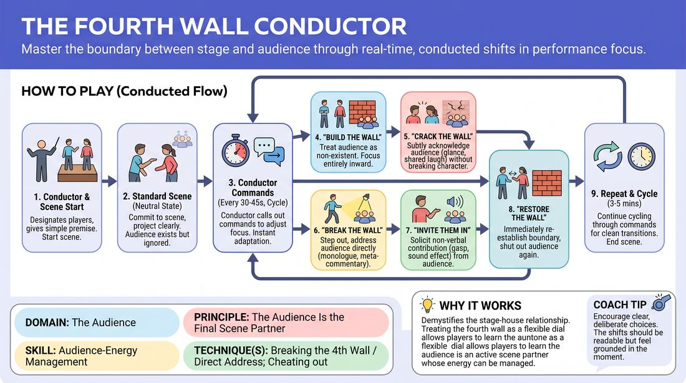

# The Fourth Wall Conductor

{ .game-hero }

> Master the boundary between stage and audience through real-time, conducted shifts in performance focus.

## Overview
A dynamic, conductor-led scene drill where players instantly adjust how they interact with the audience based on real-time side-coaching commands. By actively manipulating the invisible barrier of the fourth wall, performers learn to consciously manage audience energy and transition smoothly between deep character immersion and direct address.

## What It Trains
- **Domain:** D5 — The Audience
- **Principle(s):** The Audience Is the Final Scene Partner; Play for the Back Row
- **Skill(s):** Room Reading; Audience-Energy Management; Stage Presence & Clarity; Active Listening
- **Technique(s):** Breaking the 4th Wall / Direct Address; Cheating out; Projection; Make the choice readable; Energy-calibration; Landing/cushioning a beat
- **Focus:** skill_drill

**Objective:** To develop precise control over audience-energy management and stage presence, specifically training performers to intentionally break, crack, or reinforce the fourth wall to treat the audience as an active scene partner.

## Setup
An open performance space facing an audience of peers. No props or materials are needed. One facilitator or experienced player acts as the Conductor, standing off-stage but clearly visible and audible to the performers. Two to three players step up to perform a scene, while the remaining players act as the active audience.

## How to Play
1. The Conductor obtains a simple, relationship-focused scene premise and designates two or three players to begin the scene.
2. The players start the scene in a standard, neutral state, fully committed to the scene's reality while projecting clearly so the audience can easily follow along.
3. As the scene progresses, the Conductor calls out specific commands to manipulate the fourth wall, requiring the players to instantly adapt their performance style while maintaining the narrative thread.
4. When 'Build the Wall' is called, players must treat the audience as completely non-existent, turning their focus entirely inward to their partner and physical environment while still maintaining vocal projection and physical visibility.
5. When 'Crack the Wall' is called, players must subtly acknowledge the audience without breaking character or speaking directly to them, using a shared glance, a knowing sigh, or a brief facial expression.
6. When 'Break the Wall' is called, players must step out of the scene's reality to address the audience directly with a monologue, meta-commentary, or rhetorical question before seamlessly stepping back into the scene's action.
7. When 'Invite Them In' is called, a player must actively solicit a non-verbal contribution from the audience, such as a collective gasp, a sound effect, or a physical gesture, and immediately integrate that response into the scene's reality.
8. When 'Restore the Wall' is called, players must immediately re-establish the boundary, using physical positioning or intimate dialogue to shut out the audience and refocus entirely on the scene partner.
9. The Conductor continues to cycle through these commands every 30 to 45 seconds, challenging the players to make clean, readable transitions for a total of 3 to 4 minutes.

## Facilitation Notes
- Coaching Cue: 'Make the transition instant!' Encourage players to shift their physical posture and eye contact the exact second a command is called, rather than drifting slowly into it.
- Pitfall & Fix: Players lose the narrative or drop their character's emotional stakes when breaking the wall. Fix: Remind them that direct address should reveal their character's inner truth or heighten the scene's stakes, not abandon them.
- Coaching Cue: 'Play to the back row even when the wall is built.' Remind players that 'Build the Wall' does not mean whispering or turning their backs completely; they must still cheat out and project.
- Pitfall & Fix: The Conductor calls commands too rapidly, leaving no time for a state to land. Fix: Let each state breathe for at least 20 to 30 seconds so players can explore the specific audience dynamic before shifting.

## Variations
- Individual Conduction: The Conductor points to a specific player when calling a command, requiring only that player to shift while their partner maintains a built wall, creating a comedic contrast.
- Audience-Driven Conduction: Instead of a vocal conductor, the audience uses physical cues like standing up or sitting down to signal when the wall should break or build, forcing players to read the room's physical energy.
- The Confessional: When 'Break the Wall' is called, the player must step into a designated spotlight area of the stage to deliver a quick, reality-TV-style confessional before returning to the scene.

## Debrief
- How did changing the state of the fourth wall affect the energy and engagement of the audience?
- Which command felt the most challenging to execute while still keeping the scene's narrative grounded?
- What physical or vocal adjustments did you have to make to ensure the audience still felt included even when the wall was fully built?
- How can we use subtle cracks in the fourth wall to build a stronger partnership with the audience in a standard, unconducted scene?

## Safety & Inclusion
Ensure that when players 'Invite Them In,' they only solicit low-stakes, non-verbal, or collective audience responses (like a sound effect or a show of hands) to avoid putting individual audience members on the spot or causing participation anxiety.

## Why It Works
This game works because it demystifies the relationship between the stage and the house. By treating the fourth wall as a flexible, adjustable dial rather than a rigid barrier, players learn that the audience is an active scene partner whose energy can be dialed up or down. The real-time commands build the muscle memory needed to read a room and consciously adjust projection, eye contact, and intimacy to keep the audience engaged.
