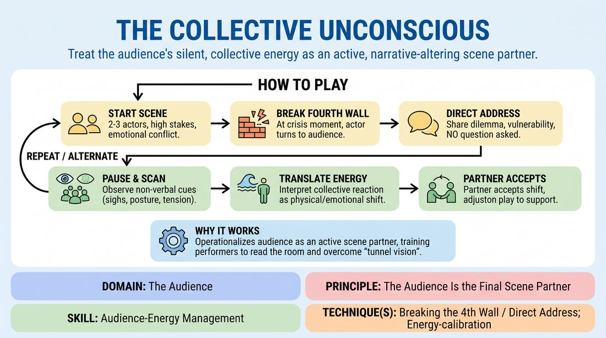

# The Shared Subconscious

{ .game-hero }

> Treat the audience's silent, collective energy as an active, narrative-altering scene partner.

## Overview
A high-level narrative exercise where performers break the fourth wall to share internal dilemmas directly with the audience. Instead of seeking verbal answers, the actors read the room's subtle, non-verbal shifts—such as sighs, posture changes, or tension—and immediately translate that energy into physical or emotional realities that alter the scene. It transforms the audience from passive observers into a dynamic, silent co-creator.

## What It Trains
- **Domain:** D5 — The Audience
- **Principle(s):** The Audience Is the Final Scene Partner; Play for the Back Row; Yes, And; Serve the Story; Vulnerability
- **Skill(s):** Room Reading; Audience-Energy Management; Stage Presence & Clarity; Heightening & Exploration; Offer Reception; Emotional Fluidity
- **Technique(s):** Breaking the 4th Wall / Direct Address; Energy-calibration; Reading the suggestion's intent; Landing/cushioning a beat; Make the choice readable; Endowment-acceptance
- **Focus:** mixed

**Objective:** To develop advanced audience-energy management and room-reading skills by treating the audience's non-verbal reactions as direct, narrative-altering offers.

## Setup
A standard performance space with a clear boundary between the stage and the audience. No props or special materials are required. The audience should be seated close enough for performers to observe subtle physical shifts, facial expressions, and breathing patterns.

## How to Play
1. The facilitator sets up a two- or three-person scene with a high-stakes, emotionally charged premise involving an internal conflict or difficult choice.
2. The performers begin the scene normally, establishing their characters, relationship, and the immediate physical environment behind a traditional fourth wall.
3. When a character reaches a moment of intense internal crisis, doubt, or decision, that performer deliberately breaks the fourth wall, shifting their focus entirely to the audience.
4. The performer speaks directly to the audience, earnestly articulating their character's deepest dilemma or vulnerability without seeking a verbal response.
5. The performer pauses and actively scans the audience, observing subtle non-verbal cues such as collective shifts in posture, held breath, murmurs, or changes in eye contact.
6. The performer interprets this collective reaction as a single, unified force and immediately translates it into a tangible physical or emotional shift within their character.
7. The performer turns back to their scene partner, re-establishing the fourth wall, but carrying this newly integrated physical or emotional reality into the interaction.
8. The scene partner immediately accepts this sudden shift in the character's state, treating it as an absolute truth and adjusting their own play to support the new narrative direction.
9. Performers alternate initiating these direct addresses throughout the scene, allowing the audience's silent feedback to continuously steer the narrative arc.

## Facilitation Notes
- Coaching Cue - Earnestness over Comedy: Remind players that the direct address must be a sincere plea or confession, not a stand-up comedy bit or a meta-joke. The goal is to invite genuine, vulnerable audience resonance.
- Coaching Cue - Read the Micro-Movements: Encourage performers to look for micro-reactions. If the audience leans forward, it indicates high engagement; if they shift back, it indicates tension or discomfort. Use these as direct physical offers.
- Pitfall - Projecting vs. Reading: A common pitfall is when a performer decides what they want to happen before looking at the audience. Fix this by coaching them to pause for a full three seconds in silence to actually receive the room's energy before speaking.
- Pitfall - Partner Abandonment: Sometimes the off-focus partner drops their character while the other addresses the audience. Remind off-focus players to remain active in their physical environment, reacting silently to the shift in their partner's energy.
- Coaching Cue - Physicalize the Shift: Encourage players to make the audience's energy physical. If the room feels heavy, let the character's limbs feel heavy; if the room feels light, let the character stand taller.

## Variations
- The Physical Echo: Instead of speaking, the performer breaks the fourth wall and simply holds eye contact with the audience, letting a silent physical gesture from an audience member dictate their next emotional state.
- The Divided Room: The stage is split, and each performer is assigned a specific half of the audience to read. Their characters' internal conflicts are guided strictly by their respective halves of the room.
- The Silent Witness: One player remains on stage as a silent observer who only interacts by breaking the fourth wall to translate the audience's energy into spoken 'subtext' for the active scene partners.

## Debrief
- How did it feel to treat the audience's silent reactions as concrete, physical offers rather than just passive feedback?
- What specific non-verbal cues from the audience were the easiest to read and translate into narrative action?
- How did the sudden shifts in your partner's emotional state, guided by the audience, change how you listened and reacted?
- In what ways did breaking the fourth wall with vulnerability, rather than humor, affect the room's overall energy?

## Safety & Inclusion
Ensure the audience is briefed beforehand that they are not expected to speak or be put on the spot; their natural, silent reactions are the only contribution needed. This keeps the space low-pressure for introverted audience members. Performers should maintain a respectful distance and avoid direct, aggressive eye contact with any single audience member who seems uncomfortable.

## Why It Works
This game works because it operationalizes the concept of the audience as an active scene partner. By formalizing the transition between playing the scene and reading the room, it trains improvisers to overcome the 'tunnel vision' of performance. It forces players to slow down, cultivate deep stage presence, and use their sensory acuity to calibrate their performance in real-time based on the actual emotional temperature of the room.
