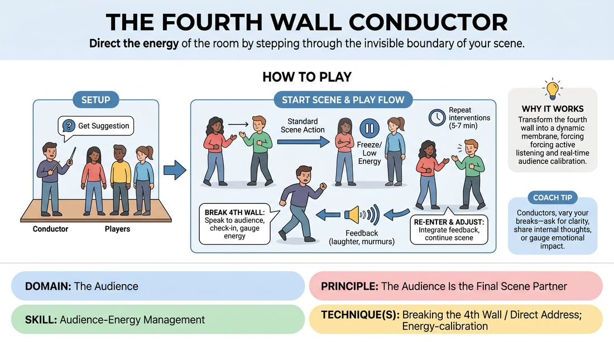

# The Fourth Wall Conductor

{ .game-hero }

> Direct the energy of the room by stepping through the invisible boundary of your scene.

## Overview
In this exercise, a team of players improvises a standard scene, but one designated performer holds the power to pause the internal action and speak directly to the audience. This Conductor uses these deliberate fourth-wall breaks to check in on audience comprehension, adjust the emotional temperature, and gather real-time feedback before stepping back into the scene's reality. The remaining players must hold the scene's integrity, adapting seamlessly to whatever new energy or information the Conductor brings back.

## What It Trains
- **Domain:** D5 — The Audience
- **Principle(s):** The Audience Is the Final Scene Partner; Play for the Back Row
- **Skill(s):** Room Reading; Audience-Energy Management; Stage Presence & Clarity; Active Listening
- **Technique(s):** Energy-calibration; Reading the suggestion's intent; Tag-running (riding a laugh wave); Landing/cushioning a beat; Breaking the 4th Wall / Direct Address; Cheating out; Projection; Make the choice readable
- **Focus:** mixed

**Objective:** To develop a performer's ability to treat the audience as an active, living scene partner. Players learn to read the room's energy, make intentional choices about when to break the fourth wall, and use direct address to manage audience engagement and clarify narrative progression.

## At a Glance
| Aspect | Detail |
|---|---|
| Players | 3+ (ideal 6-15) |
| Time | ~15 min |
| Complexity | 3/5 |
| Skill level | competent |
| Energy | medium |
| Physicality | low |
| Modality | in_person |
| Space | moderate |
| Props | none |
| Audience | required |

## Setup
Arrange the playing space with a clear performance area and an audience area. Gather a group of 6 to 15 players, with 3 to 5 selected to perform in the active scene and the remaining players acting as the live audience. No props or special materials are required.

## How to Play
1. Select 3 to 5 players to step onto the stage, and designate one of them as the Conductor for this round.
2. Explain the premise to the audience: the Conductor will periodically step out of the scene's reality to speak directly to them, and they are encouraged to respond honestly with verbal or non-verbal feedback.
3. Obtain a simple suggestion from the audience to initiate a standard, grounded scene.
4. Begin the scene normally, with all players establishing characters, relationships, and a clear platform.
5. At any point, the Conductor may deliberately break the fourth wall by shifting their physical stance toward the audience, making direct eye contact, and addressing them directly.
6. During the break, the Conductor can ask a clarifying question, share an internal character monologue, check if a plot point landed, or gauge the room's emotional state.
7. While the Conductor addresses the audience, the other performers must freeze or maintain low-energy, silent background activity, keeping their characters' reality intact without breaking character themselves.
8. The Conductor listens to the audience's response (laughter, murmurs, or direct answers) and steps back into the scene, immediately integrating that feedback or energy into their next character choice.
9. Continue the scene for 5 to 7 minutes, allowing the Conductor to make multiple, varied interventions before calling scene.
10. Rotate roles so other players have the opportunity to play the Conductor in subsequent rounds.

## Facilitation Notes
- Side-coaching cue: Encourage the Conductor to maintain their character's emotional perspective even when addressing the audience, rather than dropping into a purely neutral actor voice.
- Pitfall: The Conductor breaks the wall too frequently or as a nervous escape from a difficult scene moment. Fix: Coach them to only break the wall with a specific, constructive purpose, such as clarifying a confusing plot point or riding a wave of laughter.
- Pitfall: Supporting players break character or comment on the Conductor's direct address. Fix: Remind supporting players that they cannot hear the Conductor's address to the audience; they must remain grounded in the scene's reality.
- Side-coaching cue: Remind the Conductor to cheat out and project clearly when addressing the back row, ensuring the entire room feels included in the conversation.

## Variations
- The Silent Conductor: The Conductor can only use non-verbal gestures, facial expressions, and physical posture to check in with and influence the audience's energy.
- Passing the Baton: The role of the Conductor is fluid; any player in the scene can break the fourth wall and become the active Conductor, but only one player may do so at a time.
- The Confessional: The fourth-wall breaks must take the form of rapid, high-stakes internal monologues where the character seeks moral validation or advice from the audience.

## Debrief
- For the Conductor: How did it feel to step out of the scene? What specific cues from the audience prompted you to break the fourth wall?
- For the supporting players: How did you maintain the scene's reality while the Conductor was speaking to the audience? How did you adapt when they returned?
- For the audience: Which fourth-wall breaks made you feel most connected to the story, and which ones felt jarring or unnecessary?
- Overall: How does treating the audience as an active scene partner change the pacing and clarity of an improvised narrative?

## Safety & Inclusion
Ensure that when the Conductor addresses the audience, they do not single out individual audience members in a way that causes discomfort. Establish a rule that audience participation is collective and voluntary, allowing individuals to opt out of direct eye contact or verbal response if they prefer.

## Why It Works
This game works because it demystifies the fourth wall, transforming it from a rigid barrier into a dynamic, semi-permeable membrane. By giving one player the explicit authority to conduct the room, it forces active listening to the audience's subtle physical and vocal cues. It teaches performers that the audience's energy is not a passive byproduct of the show, but a live resource that can be shaped, redirected, and integrated directly into the storytelling process.
