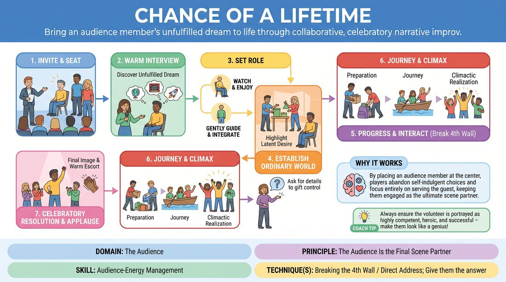

# The Grand Opportunity

{ .game-hero }

> Bring an audience member's unfulfilled dream to life through collaborative, celebratory narrative improv.

## Overview
One audience volunteer is invited onto the stage to share a lifelong dream or unfulfilled ambition. The improvisers then perform a customized, multi-scene narrative that brings this dream to life, treating the volunteer as the honored protagonist. The volunteer remains on stage, occasionally interviewed or integrated directly into the action, making them the ultimate scene partner.

## What It Trains
- **Domain:** D5 — The Audience
- **Principle(s):** The Audience Is the Final Scene Partner; Make Your Partner a Genius; Serve the Story
- **Skill(s):** Audience-Energy Management; Active Gifting; Narrative Architecture; World-Building
- **Technique(s):** Breaking the 4th Wall / Direct Address; Give them the answer; Story Spine; C.R.O.W. (Character, Relationship, Objective, Where)
- **Focus:** narrative

**Objective:** To master audience-energy management and direct address by treating a non-improviser as the hero of the story, using active gifting to build a supportive, celebratory narrative.

## At a Glance
| Aspect | Detail |
|---|---|
| Players | 3+ (ideal 4-6 players) |
| Time | ~10 min |
| Complexity | 3/5 |
| Skill level | competent |
| Energy | medium |
| Physicality | low |
| Modality | in_person |
| Space | moderate |
| Props | none |
| Audience | required |

## Setup
A performance space with a semi-circle of chairs for the players, plus one special guest chair placed center-stage or slightly downstage-right for the audience volunteer. No props are needed, but a clear boundary between the stage and the seated audience is established.

## How to Play
1. The host invites a volunteer from the audience to join the players on stage and seat them in the designated guest chair.
2. The host conducts a brief, warm interview with the volunteer to discover a specific, unfulfilled dream, aspiration, or bucket-list item they have never had the chance to do.
3. Once the dream is established, the host sets the volunteer's role: they can either watch the story unfold as an honored guest or be gently guided through the scenes as the main character.
4. The players initiate the narrative by establishing the ordinary world of the volunteer, highlighting their latent desire for this dream.
5. Players use direct address and fourth-wall breaks to check in with the volunteer, asking for details to actively gift them control over the world-building.
6. The narrative progresses through a clear arc: preparation, the journey, the climactic realization of the dream, and a celebratory resolution.
7. Players ensure the volunteer is always portrayed as highly competent, heroic, and successful, making them look like a genius.
8. The game concludes with a grand, celebratory final image or gesture dedicated to the volunteer, followed by a warm round of applause as they are escorted back to their seat.

## Facilitation Notes
- Side-coaching cue: 'Check in with your hero! Ask them what they see next.'
- Pitfall: Players might make jokes at the volunteer's expense. Fix: Remind players that the goal is radical support and celebration; the volunteer must always be the hero, never the butt of the joke.
- Side-coaching cue: 'Keep the interview brief. Get the dream and start the action immediately.'
- Pitfall: The volunteer feels awkward or frozen. Fix: Use third-person narration or play characters around them to carry the physical and narrative weight, allowing the volunteer to simply react.

## Variations
- The Silent Protagonist: The volunteer is physically placed in the scenes but does not speak; the players interpret their physical gestures and facial expressions as profound dialogue.
- The Director's Cut: The volunteer is given a bell or a buzzer to pause the scene and redirect the players if the story deviates from how they want their dream to look.
- The Flash-Forward: The scene starts 50 years in the future, looking back at the legendary day the volunteer achieved their dream, told through mock-documentary interviews.

## Debrief
- How did having a real audience member on stage change the stakes and energy of your scene work?
- What techniques did you use to make the volunteer feel safe, supported, and heroic?
- How does breaking the fourth wall to ask the volunteer questions help build the narrative world?

## Safety & Inclusion
Ensure the volunteer is fully consenting to come on stage. Never pressure anyone to participate. If the volunteer has mobility or sensory needs, adapt the staging immediately (e.g., bringing the players down to the audience level instead of making the volunteer climb stairs). Establish a clear boundary that the volunteer will not be touched without explicit, in-the-moment consent.

## Why It Works
By placing an audience member at the center of the narrative, players must abandon self-indulgent choices and focus entirely on serving the guest. Breaking the fourth wall to gather details keeps the audience member engaged as the final scene partner, ensuring the energy remains collaborative, warm, and highly celebratory.
