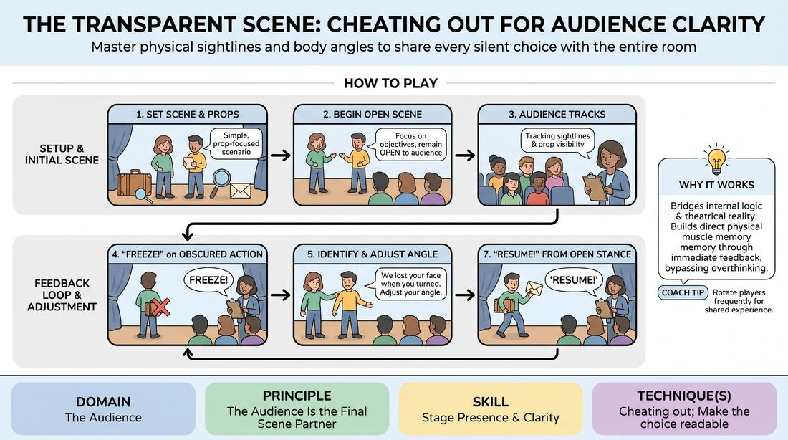

# The Open Frame

{ .game-hero }

> Master physical sightlines and body angles to share every silent choice with the entire room.

## Overview
The Open Frame is an interactive staging drill where players perform short, prop-heavy scenes while a facilitator or peers pause the action to physically adjust body angles and sightlines. By instantly correcting obscured moments, players build physical muscle memory for cheating out and sharing their performance with the audience. The experience transforms abstract staging rules into immediate, felt physical adjustments.

## What It Trains
- **Domain:** D5 — The Audience
- **Principle(s):** The Audience Is the Final Scene Partner; Play for the Back Row
- **Skill(s):** Stage Presence & Clarity; Room Reading; Physicality & Space Work
- **Technique(s):** Cheating out; Make the choice readable; Object work
- **Focus:** skill_drill

**Objective:** To build physical stage presence, spatial awareness, and the habit of cheating out so that subtle emotional beats, physical actions, and prop work remain completely visible and legible to the audience.

## At a Glance
| Aspect | Detail |
|---|---|
| Players | 3+ (ideal 6-12) |
| Time | ~15 min |
| Complexity | 2/5 |
| Skill level | advanced_beginner |
| Energy | medium |
| Physicality | medium |
| Modality | in_person |
| Space | moderate |
| Props | yes |
| Audience | not required |

## Setup
An open performance space with a clearly defined stage area and an audience area. Place a small table on stage with physical props (e.g., a small book, a coin, a letter, a pen, a photograph). The facilitator sits in the center of the audience area, with other players seated around them as active observers.

## How to Play
1. Select two to three players to step onto the stage and assign them a simple, physically-focused scenario involving the provided props (e.g., inspecting a stolen coin or reading a secret letter).
2. Instruct the players to begin the scene, focusing on their characters' objectives while keeping their bodies, faces, and props open to the audience.
3. The facilitator and remaining players watch from the audience area, actively tracking sightlines, physical angles, and prop visibility.
4. Whenever a player turns their back completely, blocks a partner, hides a prop, or masks an emotional reaction, the facilitator calls 'Freeze!'
5. While the players hold their physical positions, the facilitator identifies the obscured element (e.g., 'We lost your face when you looked down' or 'The letter is hidden in your palm').
6. Instruct the frozen players to slowly adjust their physical angles, shift their weight, or tilt the prop until the action is fully visible to the back row, without changing the emotional reality of the scene.
7. Once the adjustment is visually clear, the facilitator calls 'Resume!', and the players continue the scene from their newly adjusted, open positions.
8. Rotate players every three to four minutes, ensuring everyone has a turn to experience the physical adjustments on stage.

## Facilitation Notes
- Side-coaching cue: 'Share your profile with the back wall, not just your partner' or 'Let the audience see the discovery first, then react to your partner.'
- Pitfall: Players feel unnatural cheating out and resist the physical angles. Fix: Remind them that stage reality is a physical illusion; what feels weirdly angled to them looks perfectly natural and engaging to the audience.
- Pitfall: Over-freezing kills the narrative momentum. Fix: Keep the freezes brief and highly physical. Do not let players talk or explain their choices while frozen; simply adjust and resume.
- Coaching tip: Encourage players to exaggerate their physical choices and prop handling initially. It is much easier to scale back an oversized choice than to expand a microscopic one.

## Variations
- Self-Correction (Player-Led): Transition from facilitator-led freezes to player-led adjustments. When a player realizes they are blocking themselves or a prop, they must call 'Adjust!' on themselves, pause, correct their angle, and resume without facilitator intervention.
- The Virtual Lens (Online Adaptation): On a video call, players 'cheat out' to the camera. Instead of turning profile to their physical room, they adjust their distance, angle, and prop placement relative to their webcam so their eyes and actions remain visible to the virtual audience.
- The Silent Frame: Run the entire scene in complete silence, forcing players to rely entirely on physical posture, facial expressions, and prop manipulation to convey the narrative.
- The Moving Target: The facilitator continuously walks around the perimeter of the room during the scene, forcing players to dynamically adjust their angles to stay open to a shifting audience perspective.

## Debrief
- How did it feel physically to cheat out compared to how you normally stand during a scene?
- When we adjusted your body angle, did it change the emotional intensity or focus of the moment for you?
- As an observer, what was the difference in your engagement level before and after a physical adjustment?
- How can we maintain an intimate connection with our scene partner while physically opening up to the back row?

## Safety & Inclusion
Ensure physical adjustments respect players' physical boundaries and mobility levels. If a player has limited mobility, focus on adjusting prop angles, head turns, or seating arrangements rather than demanding complex standing pivots. Always ask for consent before physically touching a player to adjust their posture, or use verbal cues exclusively to guide their adjustments.

## Why It Works
This game works because it bridges the gap between internal character logic and external theatrical reality. By using immediate, physical feedback, it bypasses intellectual overthinking and builds direct muscle memory. Players physically feel the difference between a closed posture and an open, communicative stance, learning that the audience is indeed their final scene partner.
