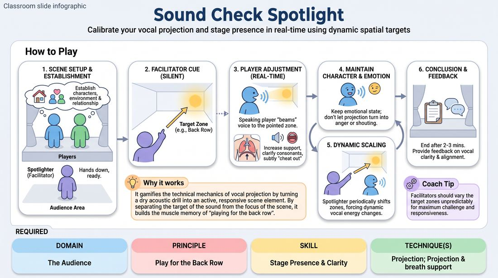

# Vocal Spotlight

{ .game-hero }

> Calibrate your vocal projection and stage presence in real-time using dynamic spatial targets.

## Overview
Two players perform an active scene while a facilitator silently points to different areas of the room. The speaking player must instantly adjust their vocal projection, articulation, and physical orientation to ensure their dialogue perfectly reaches that exact spot. This builds a physical and acoustic connection with the entire performance space without breaking the scene's reality.

## What It Trains
- **Domain:** D5 — The Audience
- **Principle(s):** The Audience Is the Final Scene Partner; Play for the Back Row
- **Skill(s):** Vocal Craft; Room Reading; Audience-Energy Management; Stage Presence & Clarity
- **Technique(s):** Projection & breath support; Energy-calibration; Landing/cushioning a beat; Cheating out; Projection; Make the choice readable
- **Focus:** skill_drill

**Objective:** Develops healthy vocal projection, crisp articulation, and spatial awareness ('playing for the back row') while maintaining emotional connection with a scene partner.

## Setup
An indoor rehearsal or performance space. Identify 4-5 distinct target zones around the room (e.g., front row center, back-left corner, side exit). Two players stand on stage; the facilitator stands in the audience area; other players observe.

## How to Play
1. Select two players to begin a standard, relationship-driven scene based on a simple suggestion.
2. The facilitator stands in the audience area as the 'Spotlighter,' ready to give silent, non-verbal pointing cues.
3. As the scene begins, the players establish their characters, environment, and relationship at a normal conversational volume.
4. Once the scene is established, the Spotlighter silently points to one of the pre-determined target zones in the room.
5. The player currently speaking (or about to speak) must immediately adjust their vocal delivery to 'beam' their voice directly to that pointed zone.
6. To reach the target, the player must increase diaphragmatic support, clarify their consonants, and subtly angle their body ('cheat out') toward the zone while keeping their eyes on their partner.
7. The player must maintain their character's emotional state, ensuring that projecting to a distant corner does not automatically turn their emotion into anger or shouting.
8. The Spotlighter periodically shifts their pointing gesture to different zones, forcing the players to dynamically scale their vocal energy up and down throughout the scene.
9. End the scene after two to three minutes and provide immediate, constructive feedback on vocal clarity and physical alignment.

## Facilitation Notes
- Coaching Cue: 'Support from the core, not the throat!' Remind players to use deep diaphragmatic breathing to project rather than straining their vocal cords.
- Coaching Cue: 'Keep your eyes on your partner, send your voice to the corner!' Prevent players from breaking character to look directly at the target zone.
- Pitfall: Players interpret 'projecting to the back' as a cue to shout angrily. Fix: Challenge them to deliver a quiet, intimate, or sad line that still physically 'travels' to the back wall through crisp articulation and resonance.
- Pitfall: Players lose physical connection and turn their backs on their partner. Fix: Coach them to 'cheat out'—angling their hips and shoulders to open up to the room while maintaining eye contact with their partner.

## Variations
- Acoustic Contrast: The Spotlighter pairs the pointing gesture with a hand height cue (low hand for whisper, high hand for high energy), forcing players to project intimate whispers to the back row.
- Audience Surrogates: Place non-performing players in the target zones. They give a subtle thumbs-up when the dialogue is perfectly clear and a thumbs-down if the volume or clarity drops.
- The Punchline Beam: The Spotlighter only points right before a crucial narrative beat, punchline, or emotional confession, training players to 'cushion' and land key moments.

## Debrief
- How did you balance the internal emotional connection with your partner and the external technical demand of the room?
- What physical adjustments (posture, jaw relaxation, body angling) made your voice carry further with less effort?
- How does ensuring the 'back row' can hear you change your overall stage presence and confidence?

## Safety & Inclusion
Ensure players with vocal limitations or physical differences are supported; emphasize that projection is about resonance, articulation, and body alignment, not raw lung power. Allow players to use physical gestures or micro-pauses to aid clarity if vocal projection is physically challenging.

## Why It Works
It gamifies the technical mechanics of vocal projection by turning a dry acoustic drill into an active, responsive scene element. By separating the target of the sound from the focus of the scene, it builds the muscle memory of 'playing for the back row' while keeping the performance grounded and connected.
