# 🎲 Self-Recovery — games

Games whose primary skill is **Self-Recovery** (`D1.S6`), grouped by technique. Full faceted search on the [Games List](../index.md).

## Core / general

### The Emotional Crucible

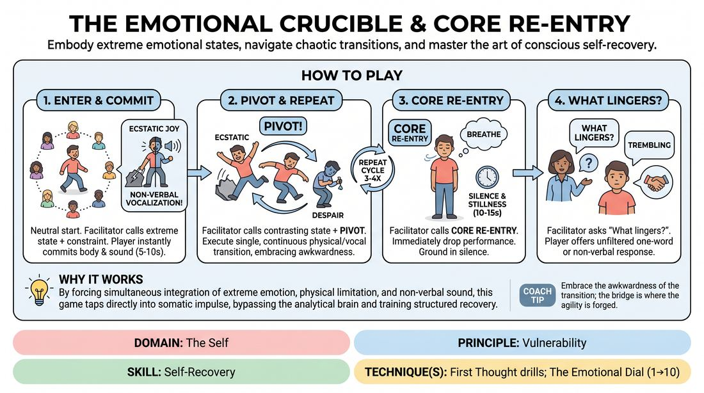{ .cat-game-img loading=lazy }

[Open full game card »](../D1_P3_S6_T0_G003__the-emotional-crucible-core-re-entry.md){target=_blank rel=noopener}

### The Joyful Showdown

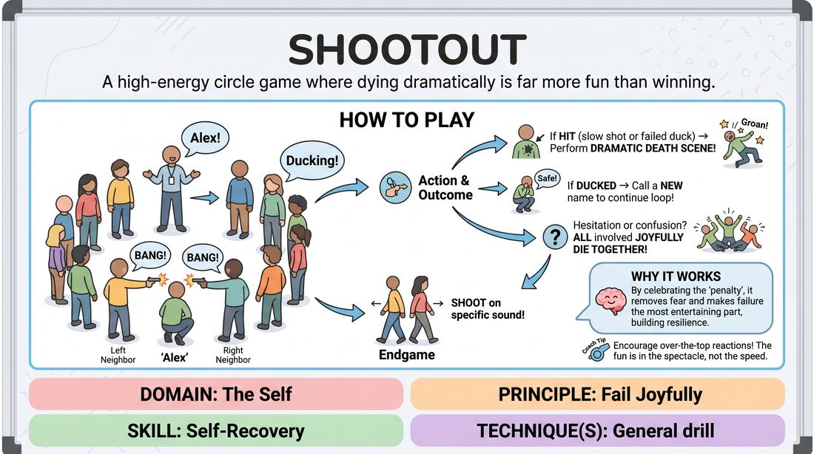{ .cat-game-img loading=lazy }

[Open full game card »](../D1_P2_S6_T0_G1273__shootout.md){target=_blank rel=noopener}

## And that's exactly what I meant

### Exactly What I Meant

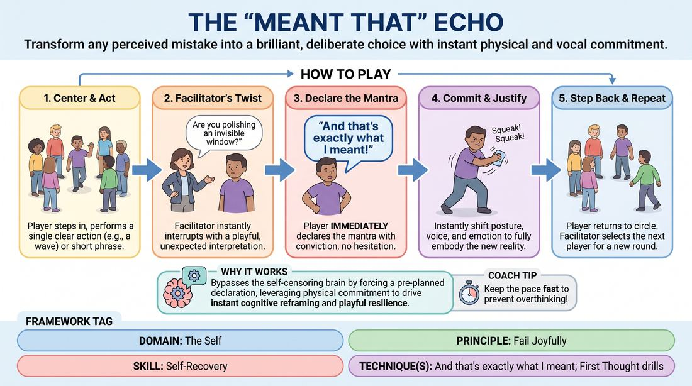{ .cat-game-img loading=lazy }

[Open full game card »](../D1_P2_S6_T1_G534__the-meant-that-echo.md){target=_blank rel=noopener}

### Somatic Surge and Recovery

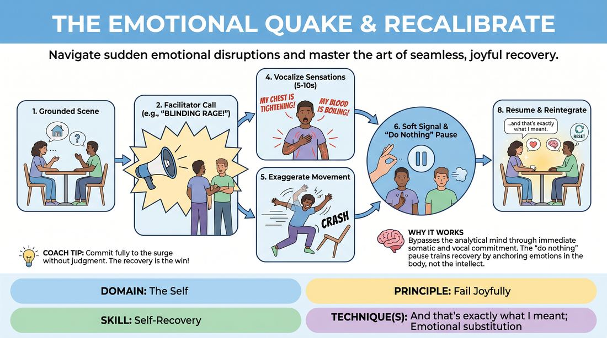{ .cat-game-img loading=lazy }

[Open full game card »](../D1_P2_S6_T1_G052__the-emotional-quake-recalibrate.md){target=_blank rel=noopener}

### The Intentional Ripple

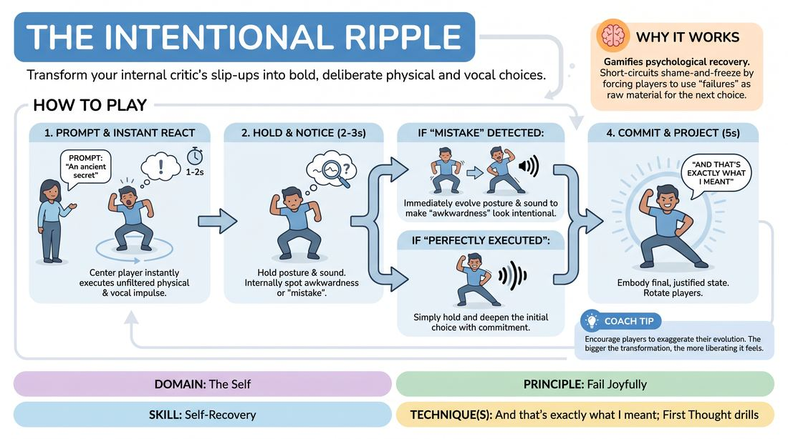{ .cat-game-img loading=lazy }

[Open full game card »](../D1_P2_S6_T1_G046__the-intentional-ripple.md){target=_blank rel=noopener}

### The Pivot Point

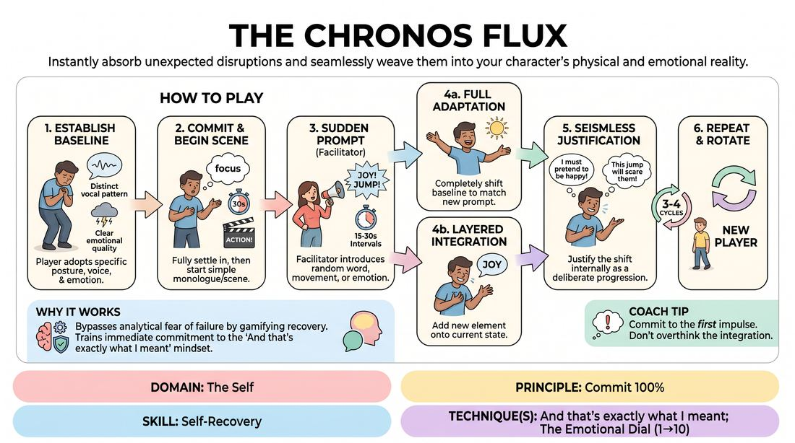{ .cat-game-img loading=lazy }

[Open full game card »](../D1_P1_S6_T1_G310__the-chronos-flux.md){target=_blank rel=noopener}

## Reframe-the-flub reps

### Big Booty

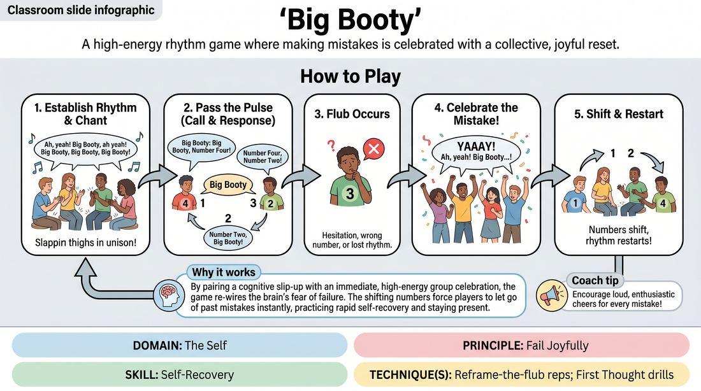{ .cat-game-img loading=lazy }

[Open full game card »](../D1_P2_S6_T2_G643__big-booty.md){target=_blank rel=noopener}

### Epic Drop

{ .cat-game-img loading=lazy }

[Open full game card »](../D1_P2_S6_T2_G1159__loser-ball.md){target=_blank rel=noopener}

### Instant Backup Dancers

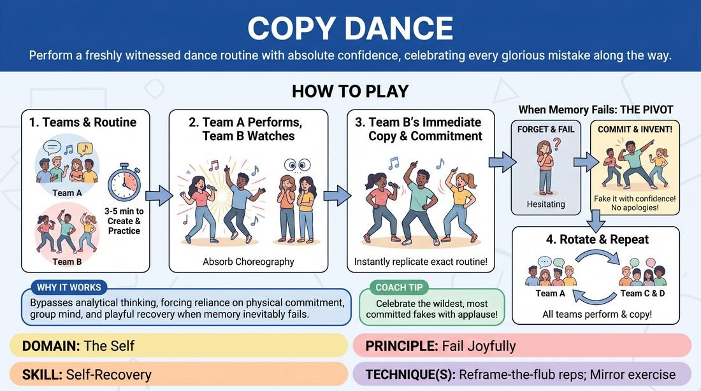{ .cat-game-img loading=lazy }

[Open full game card »](../D1_P2_S6_T2_G677__copy-dance.md){target=_blank rel=noopener}

### My Fault!

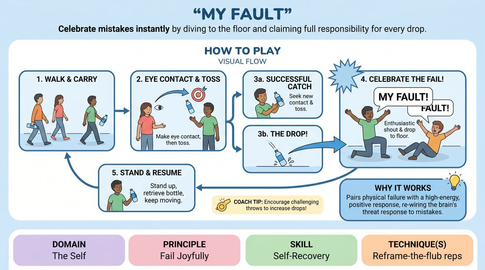{ .cat-game-img loading=lazy }

[Open full game card »](../D1_P2_S6_T2_G1196__my-fault.md){target=_blank rel=noopener}

### One Two Three

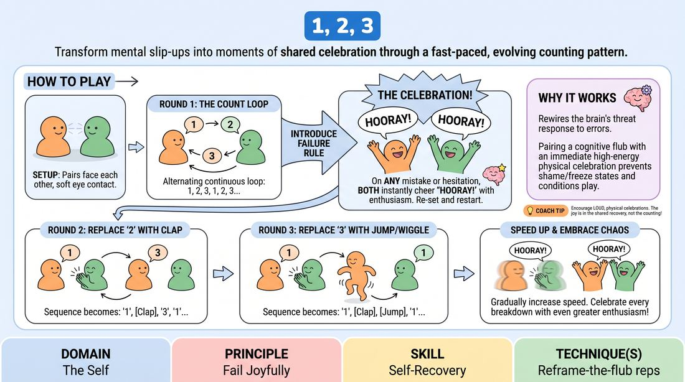{ .cat-game-img loading=lazy }

[Open full game card »](../D1_P2_S6_T2_G619__1-2-3.md){target=_blank rel=noopener}

### Sevens

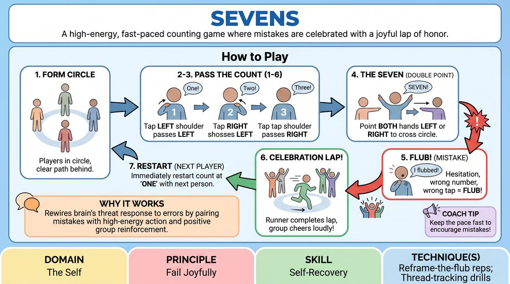{ .cat-game-img loading=lazy }

[Open full game card »](../D1_P2_S6_T2_G832__sevens.md){target=_blank rel=noopener}

### Sync and Celebrate

{ .cat-game-img loading=lazy }

[Open full game card »](../D1_P2_S6_T2_G682__danish-clapping.md){target=_blank rel=noopener}

### The Celebration Pass

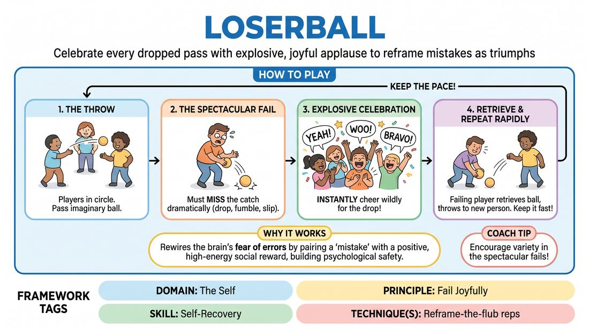{ .cat-game-img loading=lazy }

[Open full game card »](../D1_P2_S6_T2_G761__loserball.md){target=_blank rel=noopener}

### Whisky Mixer

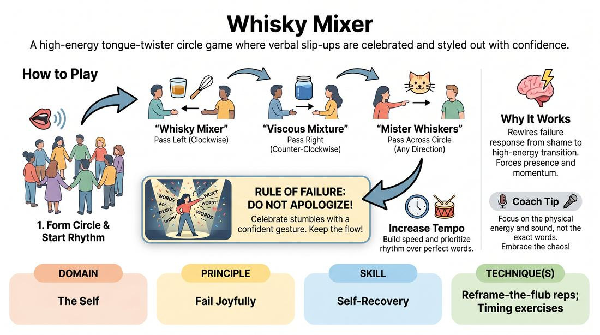{ .cat-game-img loading=lazy }

[Open full game card »](../D1_P2_S6_T2_G888__whisky-mixer.md){target=_blank rel=noopener}

