# 🎲 Active Listening — games

Games whose primary skill is **Active Listening** (`D2.S1`), grouped by technique. Full faceted search on the [Games List](../index.md).

## Core / general

### Blindfolded Scene

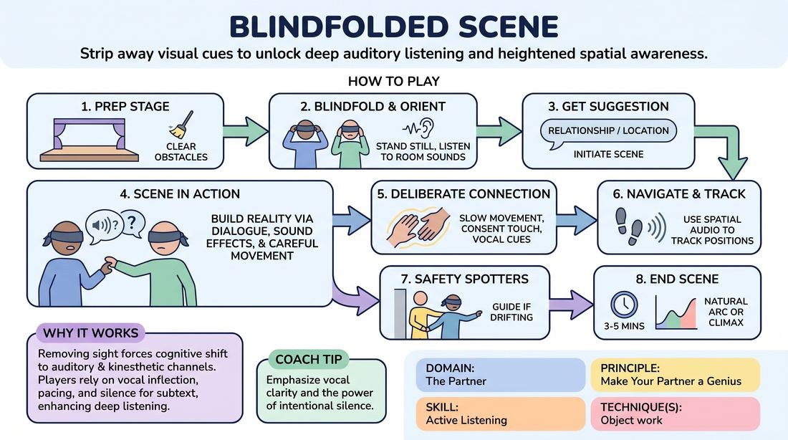{ .cat-game-img loading=lazy }

[Open full game card »](../D2_P3_S1_T0_G967__blindfolded-scene.md){target=_blank rel=noopener}

### Cinematic Dubbing

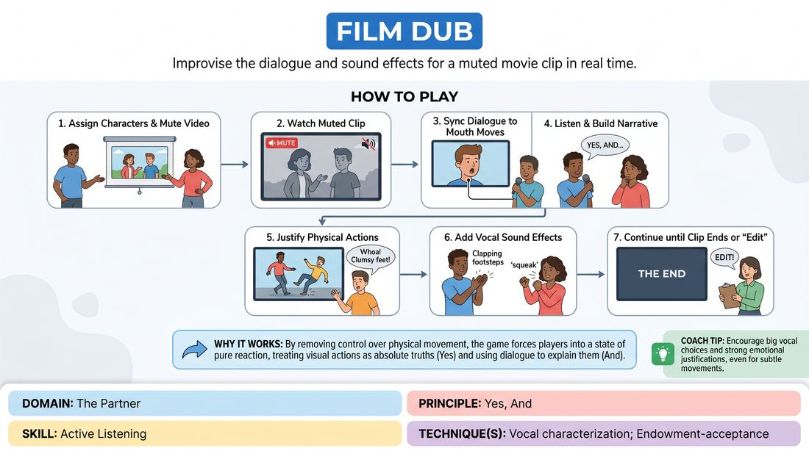{ .cat-game-img loading=lazy }

[Open full game card »](../D2_P2_S1_T0_G702__film-dub.md){target=_blank rel=noopener}

### Collective Definition

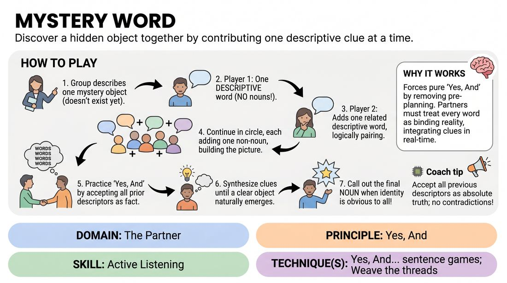{ .cat-game-img loading=lazy }

[Open full game card »](../D2_P2_S1_T0_G1197__mystery-word.md){target=_blank rel=noopener}

### Dubbing

{ .cat-game-img loading=lazy }

[Open full game card »](../D2_P3_S1_T0_G689__dubbing.md){target=_blank rel=noopener}

### Forward and Rewind

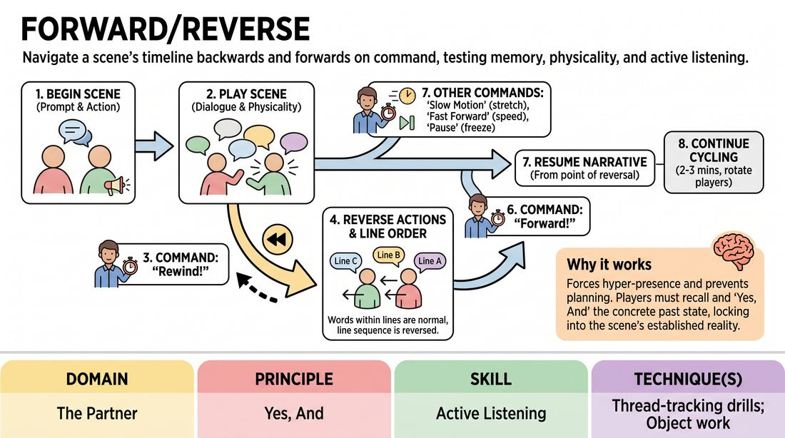{ .cat-game-img loading=lazy }

[Open full game card »](../D2_P2_S1_T0_G707__forward-reverse.md){target=_blank rel=noopener}

### Granular Week

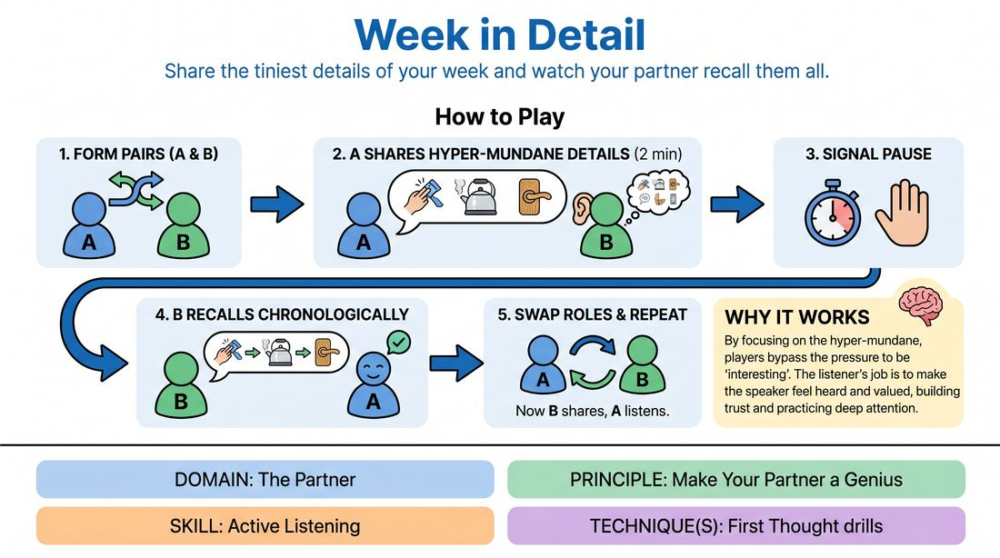{ .cat-game-img loading=lazy }

[Open full game card »](../D2_P3_S1_T0_G882__week-in-detail.md){target=_blank rel=noopener}

### Instruction Manual Die

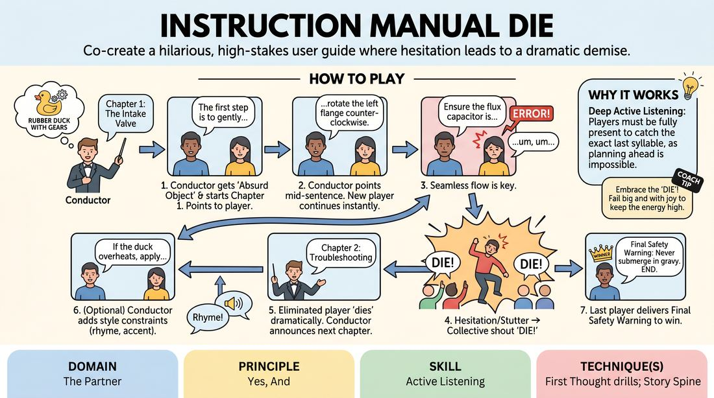{ .cat-game-img loading=lazy }

[Open full game card »](../D2_P2_S1_T0_G740__instruction-manual-die.md){target=_blank rel=noopener}

### Polar Opposites

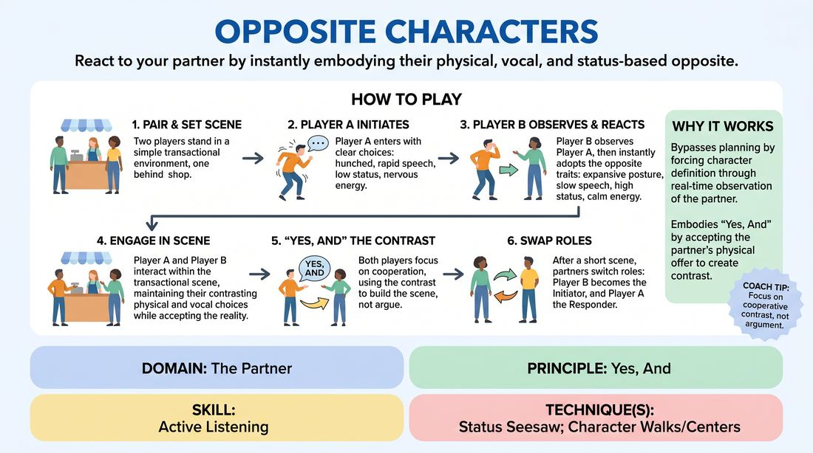{ .cat-game-img loading=lazy }

[Open full game card »](../D2_P2_S1_T0_G1219__opposite-characters.md){target=_blank rel=noopener}

### Rapid Connection Rounds

{ .cat-game-img loading=lazy }

[Open full game card »](../D2_P0_S1_T0_G844__speedy-get-to-know-you.md){target=_blank rel=noopener}

### Satellite Echo

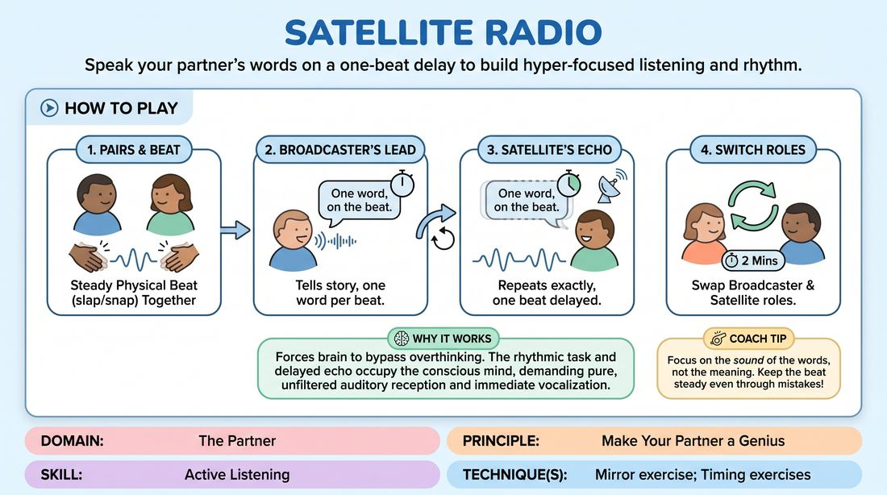{ .cat-game-img loading=lazy }

[Open full game card »](../D2_P3_S1_T0_G1262__satellite-radio.md){target=_blank rel=noopener}

### Scene in the Dark

{ .cat-game-img loading=lazy }

[Open full game card »](../D2_P2_S1_T0_G1264__scene-in-the-dark.md){target=_blank rel=noopener}

### Shared Memory Swap

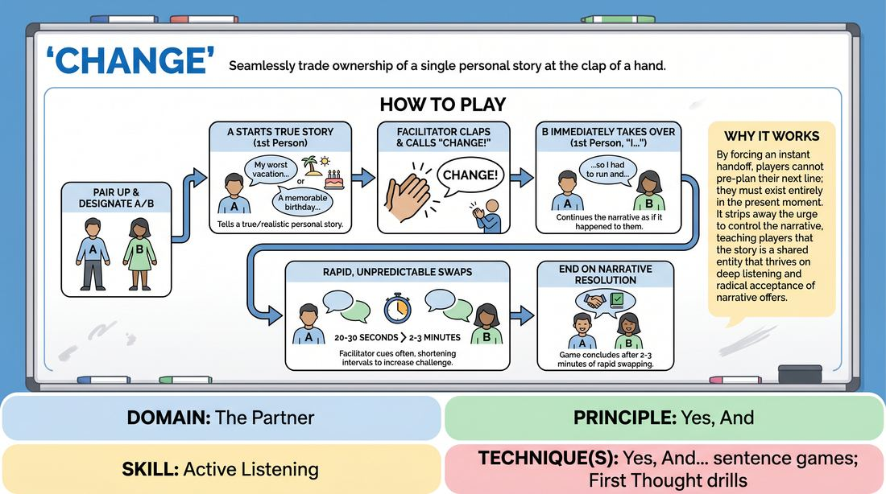{ .cat-game-img loading=lazy }

[Open full game card »](../D2_P2_S1_T0_G655__change.md){target=_blank rel=noopener}

### Simon Says

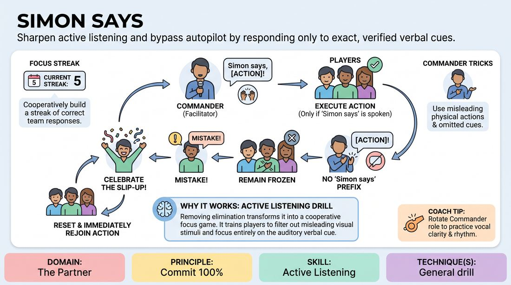{ .cat-game-img loading=lazy }

[Open full game card »](../D2_P0_S1_T0_G1276__simon-says.md){target=_blank rel=noopener}

### Sixty-Second Biography

{ .cat-game-img loading=lazy }

[Open full game card »](../D2_P3_S1_T0_G618__1-minute-story.md){target=_blank rel=noopener}

### Sixty-Second Biography

{ .cat-game-img loading=lazy }

[Open full game card »](../D2_P3_S1_T0_G785__one-minute-life-story.md){target=_blank rel=noopener}

### Snap, Clap, Stamp

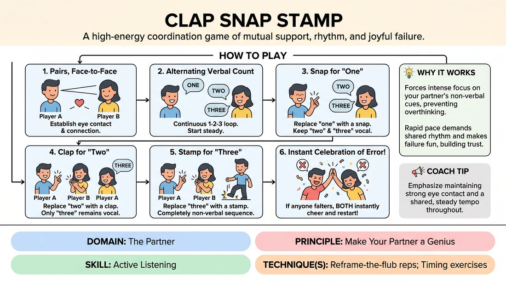{ .cat-game-img loading=lazy }

[Open full game card »](../D2_P3_S1_T0_G989__clap-snap-stamp.md){target=_blank rel=noopener}

### Sonic Beacon

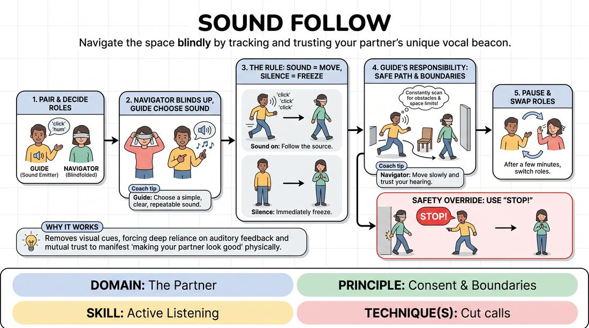{ .cat-game-img loading=lazy }

[Open full game card »](../D2_P1_S1_T0_G842__sound-follow.md){target=_blank rel=noopener}

### Subtext Stream

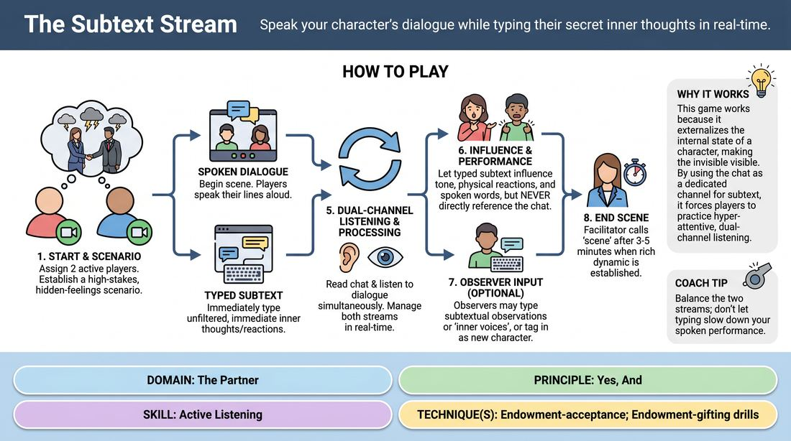{ .cat-game-img loading=lazy }

[Open full game card »](../D2_P2_S1_T0_G501__the-subtext-stream.md){target=_blank rel=noopener}

### The Connected Waltz

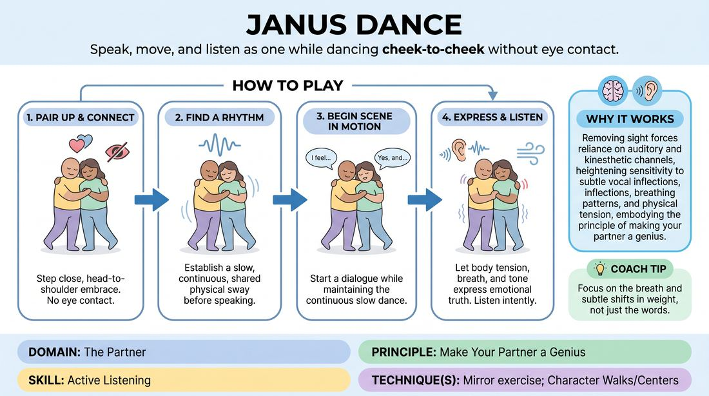{ .cat-game-img loading=lazy }

[Open full game card »](../D2_P3_S1_T0_G1138__janus-dance.md){target=_blank rel=noopener}

### The Five-Second Pause

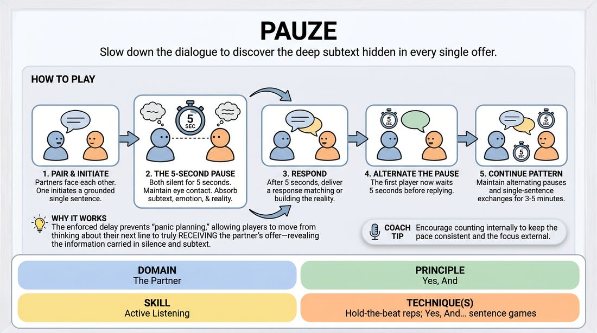{ .cat-game-img loading=lazy }

[Open full game card »](../D2_P2_S1_T0_G1228__pauze.md){target=_blank rel=noopener}

### The Focus Crucible

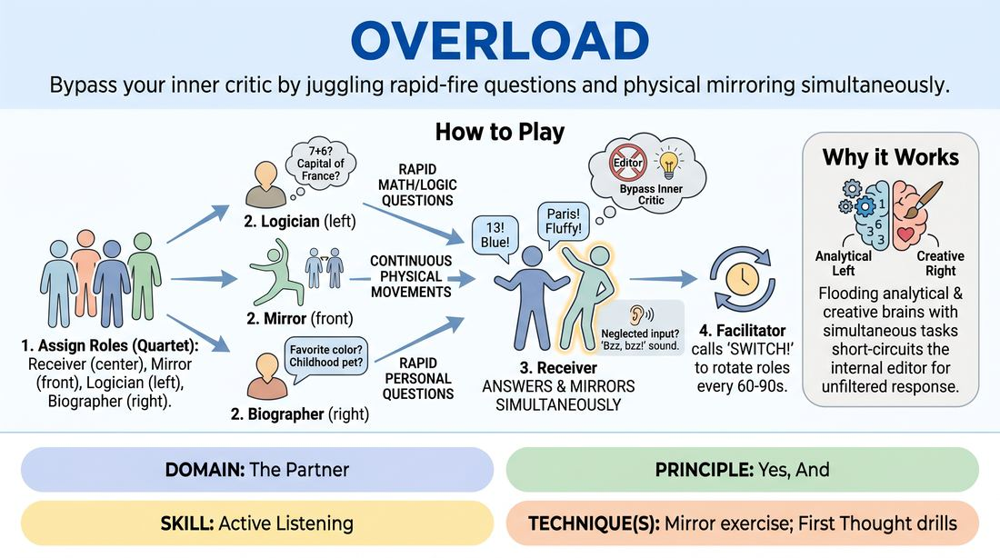{ .cat-game-img loading=lazy }

[Open full game card »](../D2_P2_S1_T0_G1221__overload.md){target=_blank rel=noopener}

### The Guided Traveler

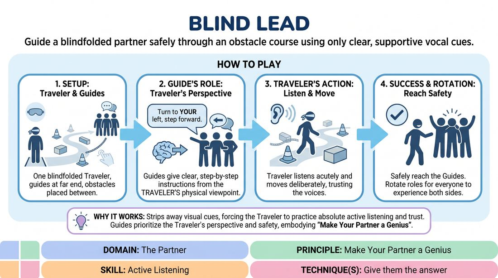{ .cat-game-img loading=lazy }

[Open full game card »](../D2_P3_S1_T0_G963__blind-lead.md){target=_blank rel=noopener}

### The Quirky Dating Show

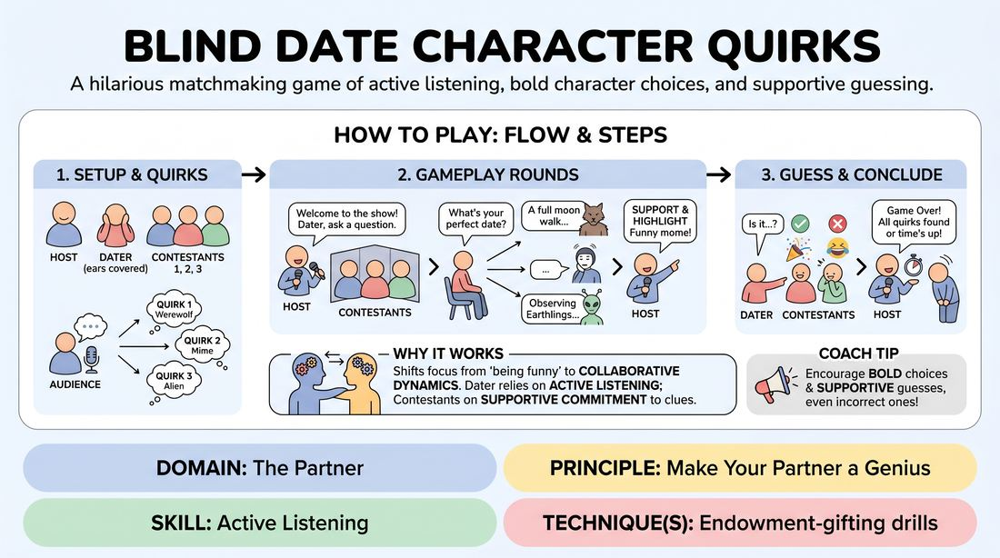{ .cat-game-img loading=lazy }

[Open full game card »](../D2_P3_S1_T0_G644__blind-date-character-quirks.md){target=_blank rel=noopener}

### The Secret Script

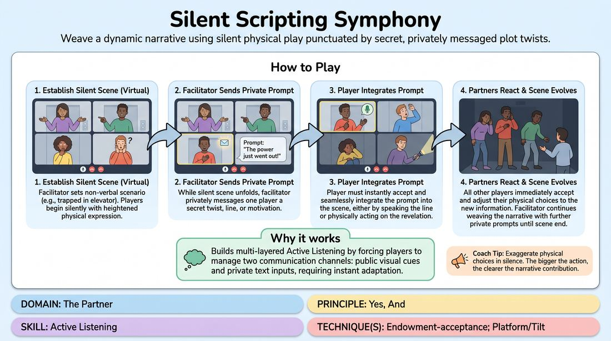{ .cat-game-img loading=lazy }

[Open full game card »](../D2_P2_S1_T0_G139__silent-scripting-symphony.md){target=_blank rel=noopener}

### The Unwitting Hijacker

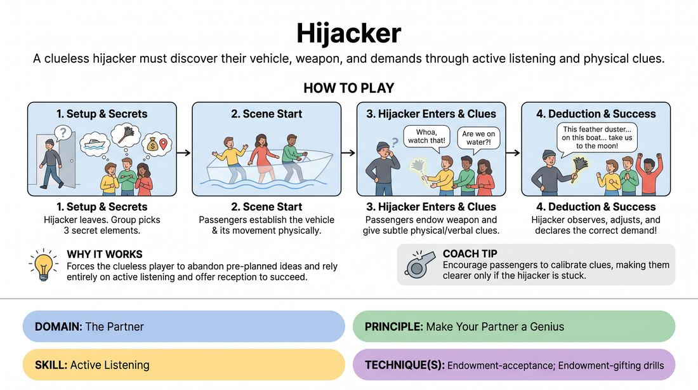{ .cat-game-img loading=lazy }

[Open full game card »](../D2_P3_S1_T0_G1119__hijacker.md){target=_blank rel=noopener}

### What Has Changed

{ .cat-game-img loading=lazy }

[Open full game card »](../D2_P3_S1_T0_G1360__what-has-changed.md){target=_blank rel=noopener}

## Meisner Repetition

### Choreographed Consensus

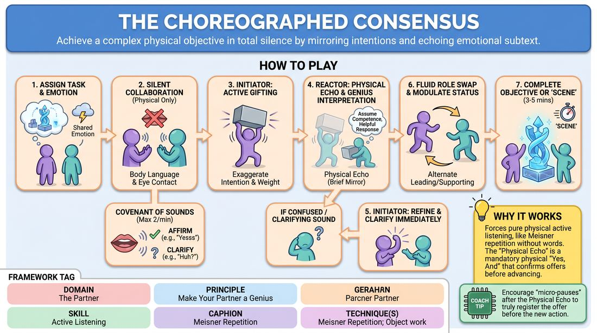{ .cat-game-img loading=lazy }

[Open full game card »](../D2_P3_S1_T1_G309__the-choreographed-consensus.md){target=_blank rel=noopener}

### Echo Dialogue

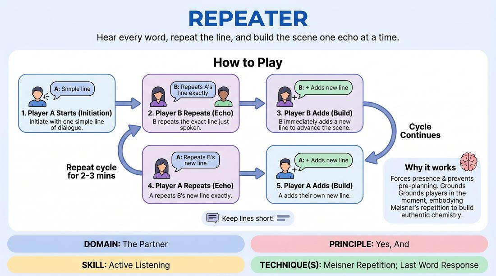{ .cat-game-img loading=lazy }

[Open full game card »](../D2_P2_S1_T1_G1254__repeater.md){target=_blank rel=noopener}

### Echo and Elevate

{ .cat-game-img loading=lazy }

[Open full game card »](../D2_P3_S1_T1_G150__the-resonance-refine-drill.md){target=_blank rel=noopener}

### Resonance Echo

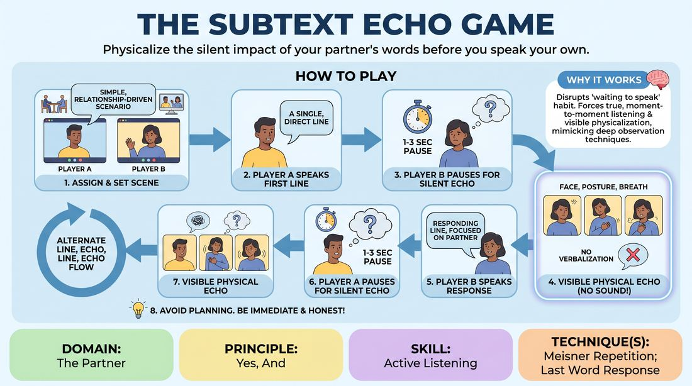{ .cat-game-img loading=lazy }

[Open full game card »](../D2_P2_S1_T1_G095__the-subtext-echo-game.md){target=_blank rel=noopener}

### Resonant Echo

{ .cat-game-img loading=lazy }

[Open full game card »](../D2_P2_S1_T1_G314__the-attuned-echo.md){target=_blank rel=noopener}

### Resonate and Elevate

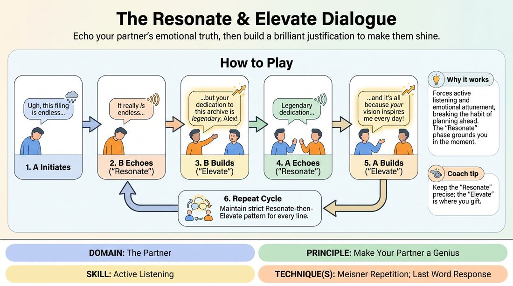{ .cat-game-img loading=lazy }

[Open full game card »](../D2_P3_S1_T1_G256__the-resonate-elevate-dialogue.md){target=_blank rel=noopener}

### Subtext Alchemy

{ .cat-game-img loading=lazy }

[Open full game card »](../D2_P2_S1_T1_G206__the-emotional-alchemist.md){target=_blank rel=noopener}

### Subtextual Alchemy

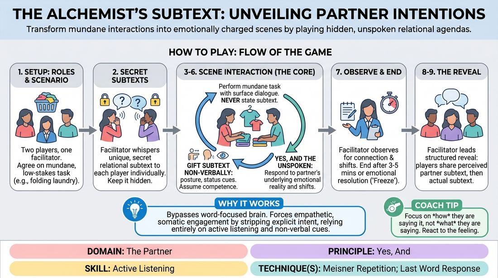{ .cat-game-img loading=lazy }

[Open full game card »](../D2_P2_S1_T1_G324__the-alchemist-s-subtext-unveiling-partner-intentions.md){target=_blank rel=noopener}

### Subtextual Currents

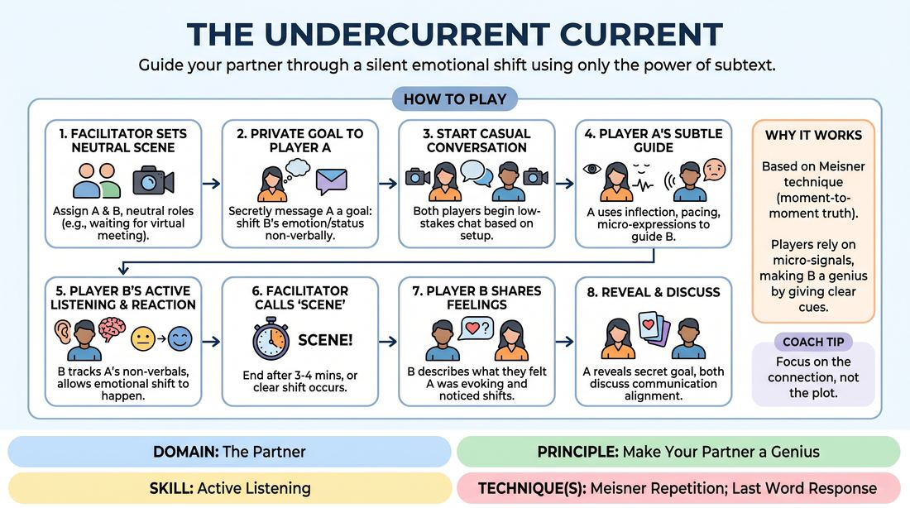{ .cat-game-img loading=lazy }

[Open full game card »](../D2_P3_S1_T1_G172__the-undercurrent-current.md){target=_blank rel=noopener}

### The Attunement Weave

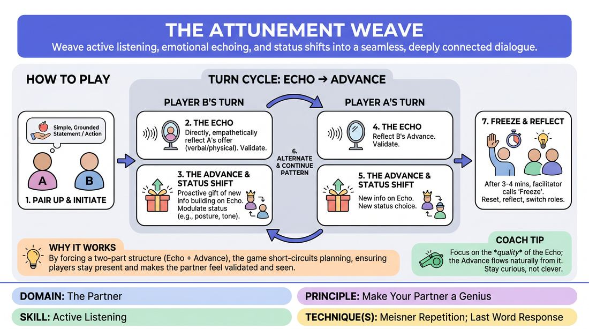{ .cat-game-img loading=lazy }

[Open full game card »](../D2_P3_S1_T1_G547__the-attunement-weave.md){target=_blank rel=noopener}

### The Echo Canvas

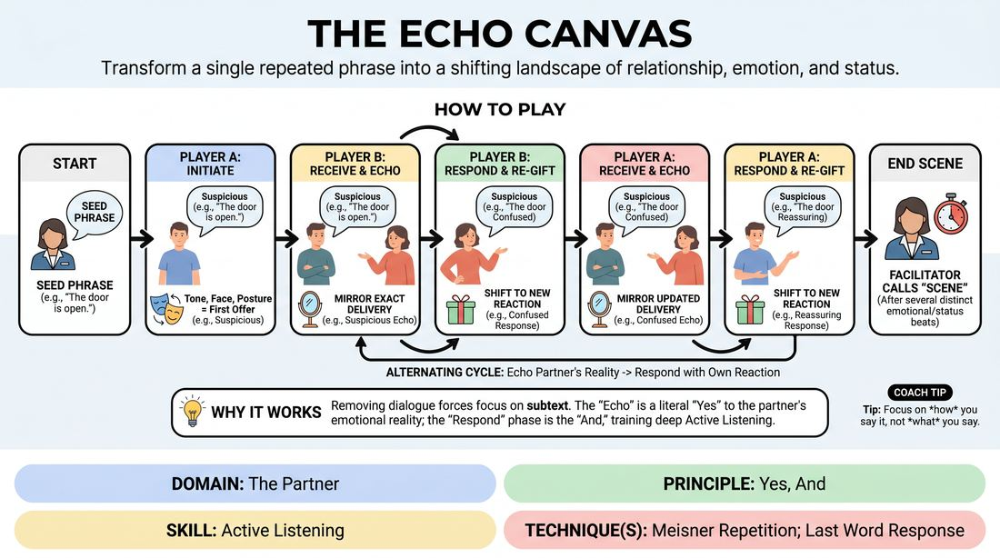{ .cat-game-img loading=lazy }

[Open full game card »](../D2_P2_S1_T1_G380__the-echo-canvas.md){target=_blank rel=noopener}

### The Echo Chain

{ .cat-game-img loading=lazy }

[Open full game card »](../D2_P2_S1_T1_G280__the-echo-chamber-saga.md){target=_blank rel=noopener}

### The Echo Rewind

{ .cat-game-img loading=lazy }

[Open full game card »](../D2_P2_S1_T1_G1330__the-re-run.md){target=_blank rel=noopener}

### The Resonance Weave

{ .cat-game-img loading=lazy }

[Open full game card »](../D2_P3_S1_T1_G544__the-reactive-endowment-weave.md){target=_blank rel=noopener}

### The Status Oracle

{ .cat-game-img loading=lazy }

[Open full game card »](../D2_P3_S1_T1_G048__the-status-oracle-echoes-of-competence.md){target=_blank rel=noopener}

### The Subtext Echo Chamber

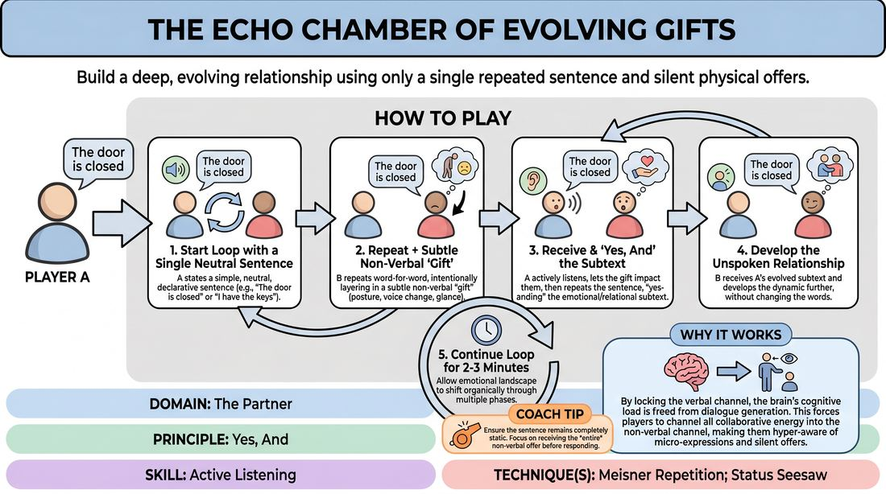{ .cat-game-img loading=lazy }

[Open full game card »](../D2_P2_S1_T1_G211__the-echo-chamber-of-evolving-gifts.md){target=_blank rel=noopener}

### The Symbiotic Pulse

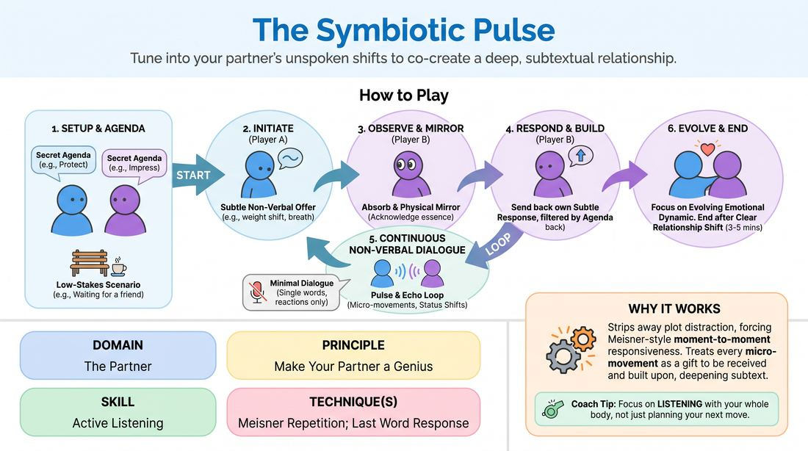{ .cat-game-img loading=lazy }

[Open full game card »](../D2_P3_S1_T1_G006__the-symbiotic-pulse.md){target=_blank rel=noopener}

### The Undercurrent Dialogue

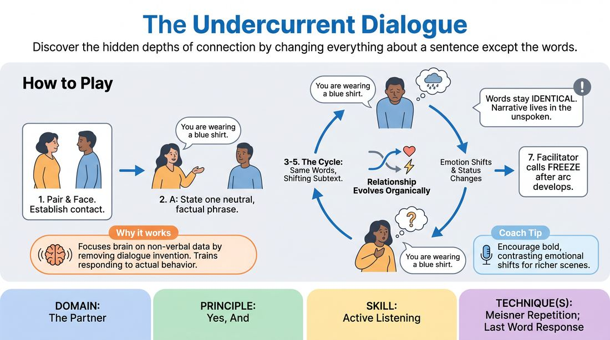{ .cat-game-img loading=lazy }

[Open full game card »](../D2_P2_S1_T1_G495__the-undercurrent-dialogue.md){target=_blank rel=noopener}

### Undercurrents

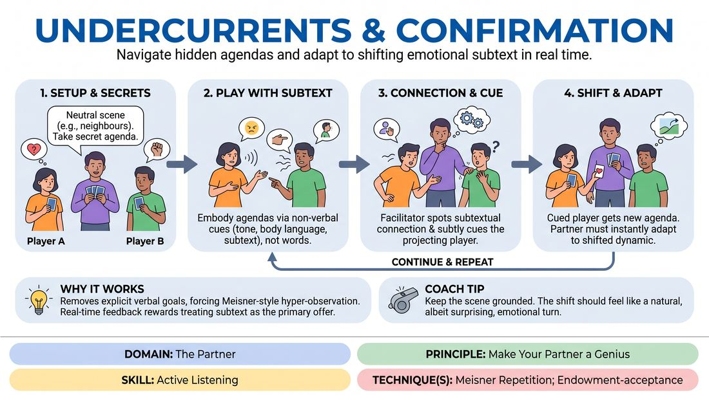{ .cat-game-img loading=lazy }

[Open full game card »](../D2_P3_S1_T1_G522__undercurrents-confirmation.md){target=_blank rel=noopener}

### Watching You, Watching Me

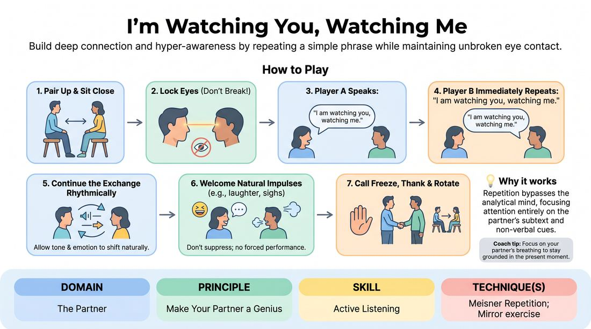{ .cat-game-img loading=lazy }

[Open full game card »](../D2_P3_S1_T1_G737__i-m-watching-you-watching-me.md){target=_blank rel=noopener}

## Last Word Response

### Alphabetical Scene

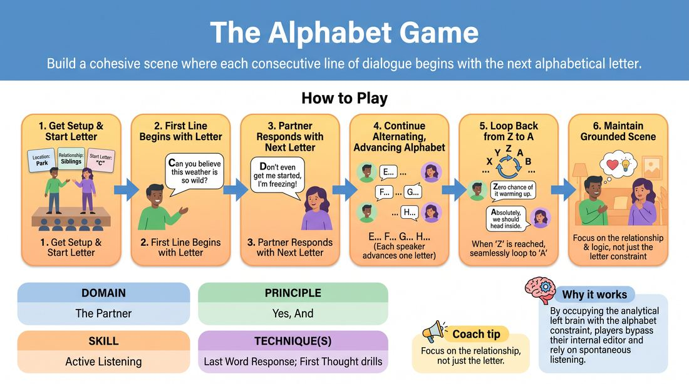{ .cat-game-img loading=lazy }

[Open full game card »](../D2_P2_S1_T2_G866__the-alphabet-game.md){target=_blank rel=noopener}

### Co-Architects of the Unseen

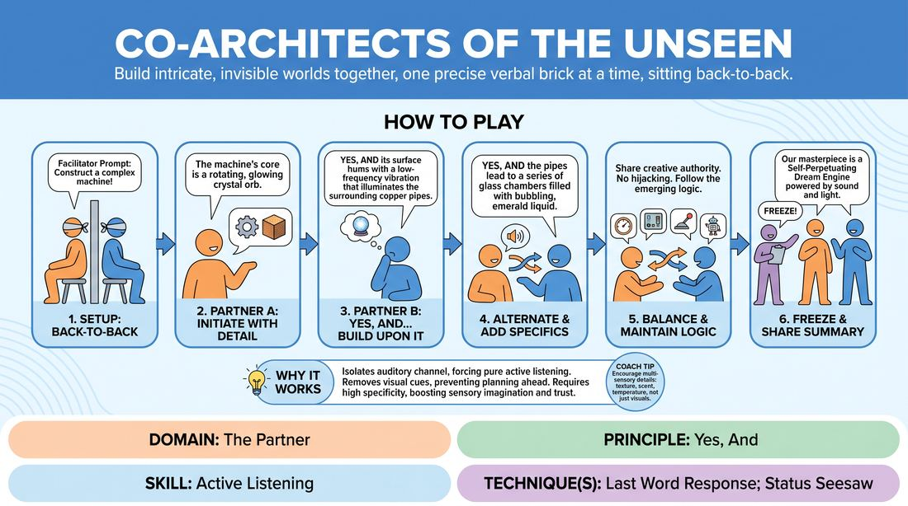{ .cat-game-img loading=lazy }

[Open full game card »](../D2_P2_S1_T2_G475__co-architects-of-the-unseen.md){target=_blank rel=noopener}

### Embodied Echo Cascade

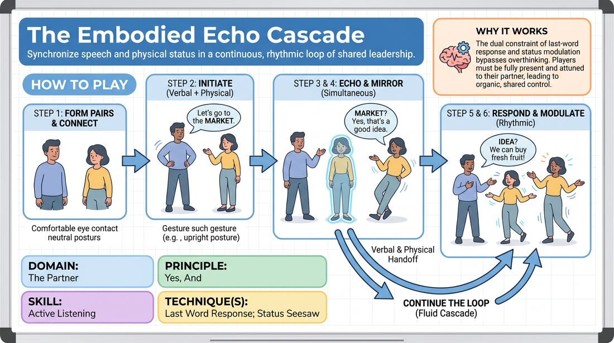{ .cat-game-img loading=lazy }

[Open full game card »](../D2_P2_S1_T2_G577__the-embodied-echo-cascade.md){target=_blank rel=noopener}

### Last Letter Connection

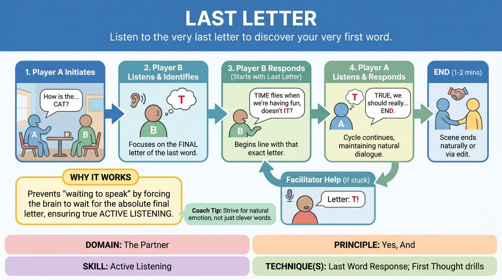{ .cat-game-img loading=lazy }

[Open full game card »](../D2_P2_S1_T2_G755__last-letter.md){target=_blank rel=noopener}

### Last Letter Scene

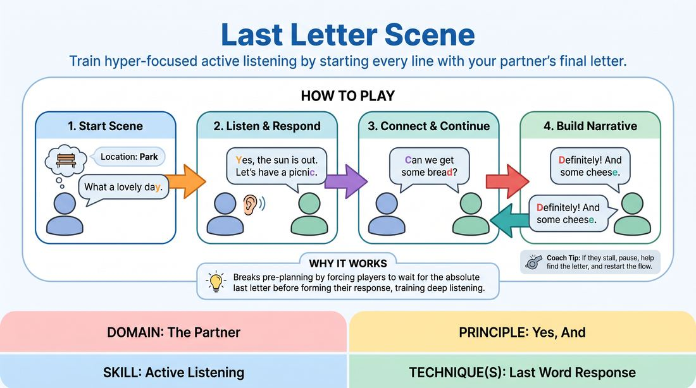{ .cat-game-img loading=lazy }

[Open full game card »](../D2_P2_S1_T2_G1150__last-letter-scene.md){target=_blank rel=noopener}

### Legacy of the Frame

{ .cat-game-img loading=lazy }

[Open full game card »](../D2_P2_S1_T2_G056__the-zoom-lens-legacy.md){target=_blank rel=noopener}

### Narrative Resonance Echo

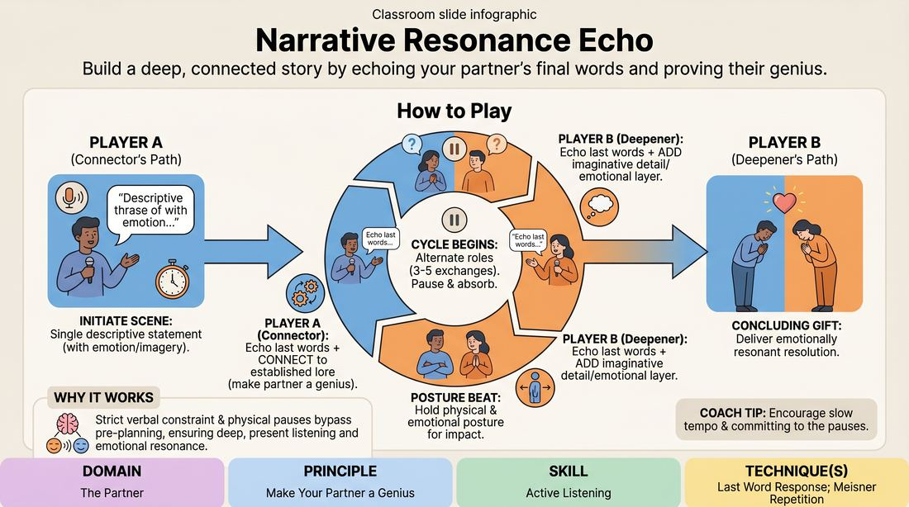{ .cat-game-img loading=lazy }

[Open full game card »](../D2_P3_S1_T2_G259__narrative-resonance-echo.md){target=_blank rel=noopener}

### Poetry Corner

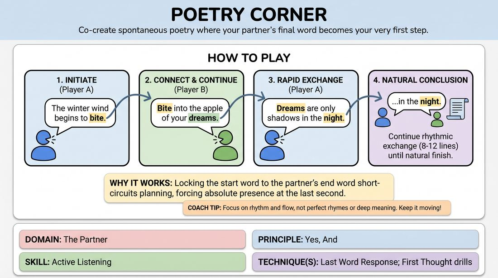{ .cat-game-img loading=lazy }

[Open full game card »](../D2_P2_S1_T2_G1236__poetry-corner.md){target=_blank rel=noopener}

### Rhyming Couplets

{ .cat-game-img loading=lazy }

[Open full game card »](../D2_P2_S1_T2_G1258__rhymes.md){target=_blank rel=noopener}

### Sounds Like a Song

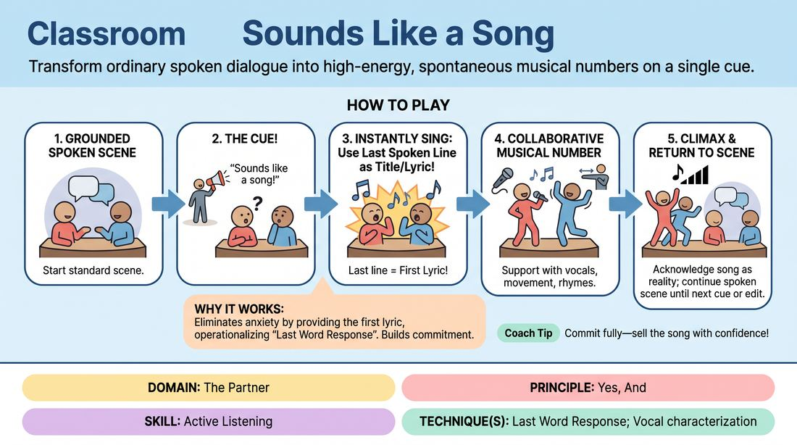{ .cat-game-img loading=lazy }

[Open full game card »](../D2_P2_S1_T2_G1293__sounds-like-a-song.md){target=_blank rel=noopener}

### Story Swap

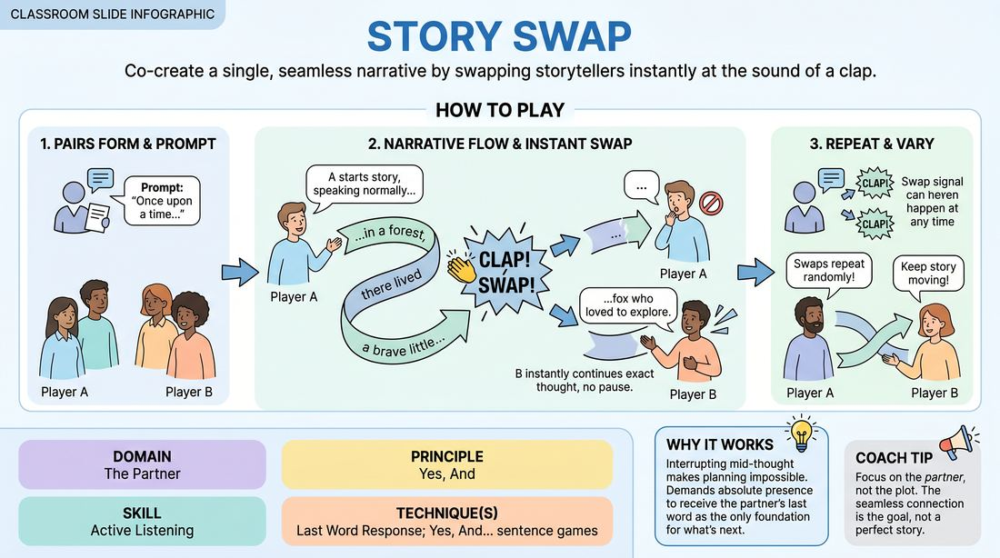{ .cat-game-img loading=lazy }

[Open full game card »](../D2_P2_S1_T2_G853__story-swap.md){target=_blank rel=noopener}

### Subtext Resonance

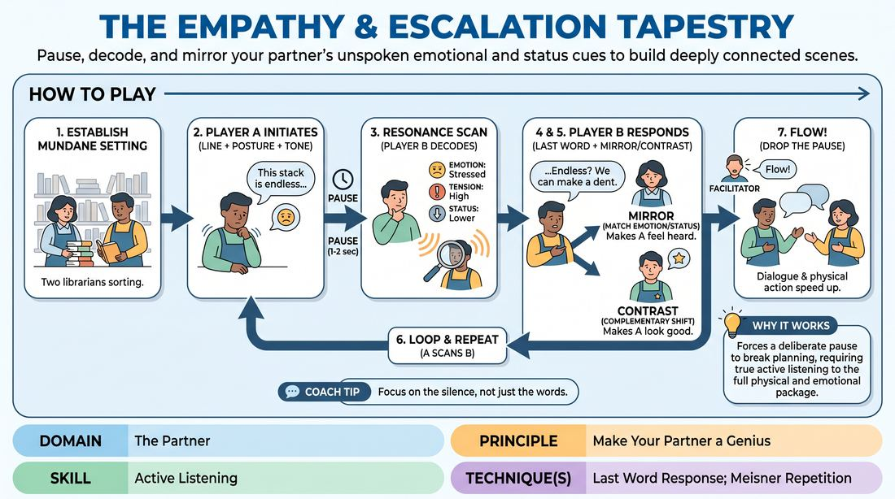{ .cat-game-img loading=lazy }

[Open full game card »](../D2_P3_S1_T2_G242__the-empathy-escalation-tapestry.md){target=_blank rel=noopener}

### The Partner's Prism

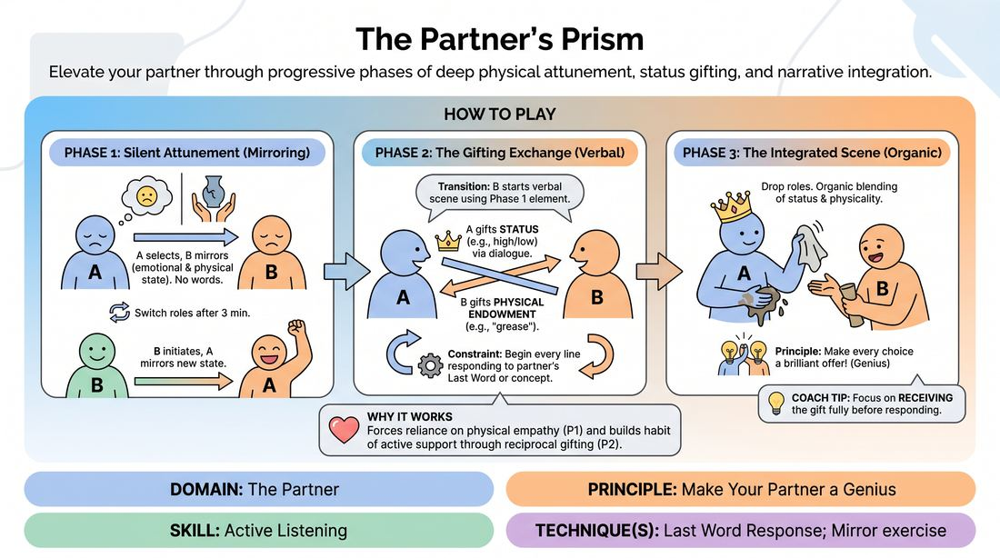{ .cat-game-img loading=lazy }

[Open full game card »](../D2_P3_S1_T2_G334__the-partner-s-prism.md){target=_blank rel=noopener}

### The Ping-Pong Ballad

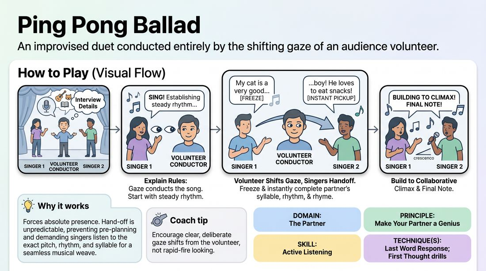{ .cat-game-img loading=lazy }

[Open full game card »](../D2_P3_S1_T2_G1232__ping-pong-ballad.md){target=_blank rel=noopener}

### The Resonance Chronicle

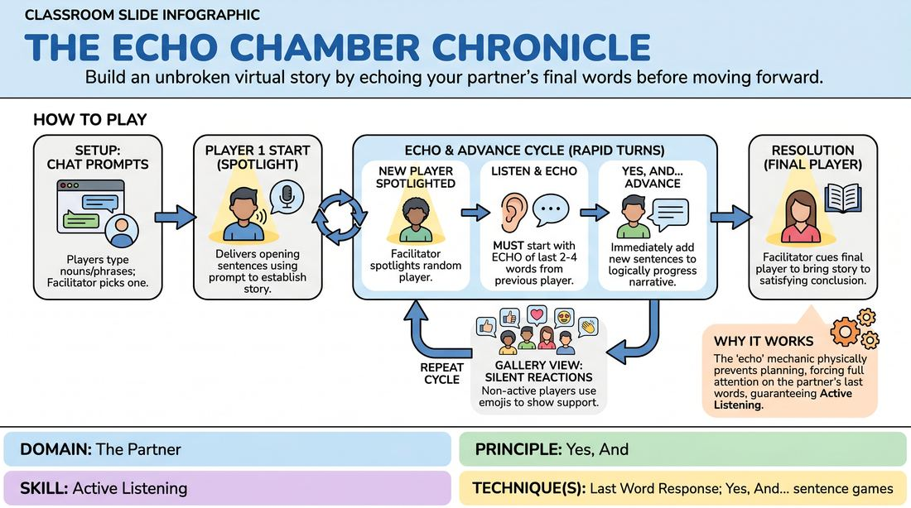{ .cat-game-img loading=lazy }

[Open full game card »](../D2_P2_S1_T2_G071__the-echo-chamber-chronicle.md){target=_blank rel=noopener}

### The Shared Vessel

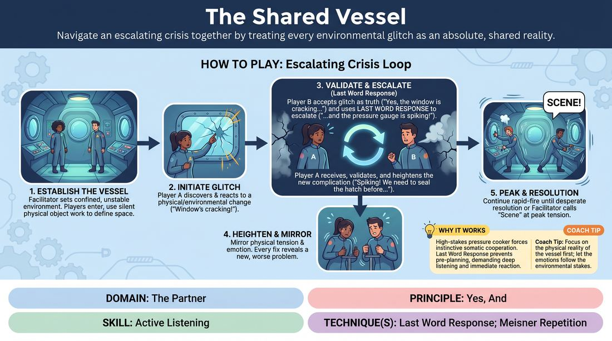{ .cat-game-img loading=lazy }

[Open full game card »](../D2_P2_S1_T2_G131__the-shared-vessel.md){target=_blank rel=noopener}

### Verbatim Echo

{ .cat-game-img loading=lazy }

[Open full game card »](../D2_P2_S1_T2_G523__word-for-word-memory-scene.md){target=_blank rel=noopener}

### Word Thief

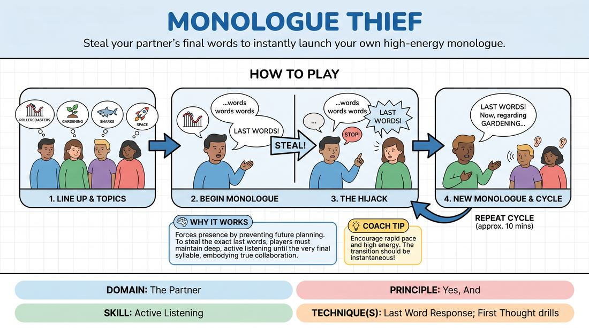{ .cat-game-img loading=lazy }

[Open full game card »](../D2_P2_S1_T2_G1183__monologue-thief.md){target=_blank rel=noopener}

### Word-by-Word Scene

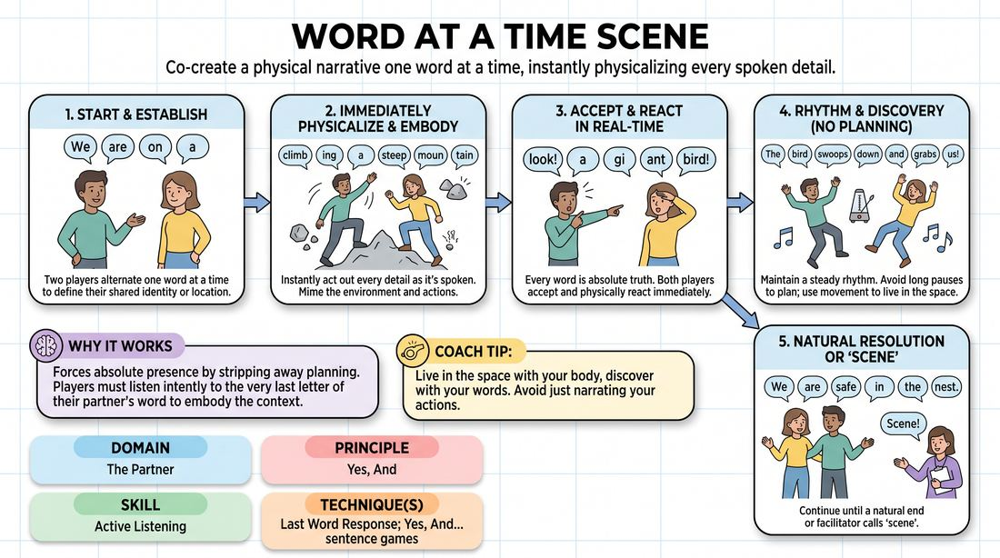{ .cat-game-img loading=lazy }

[Open full game card »](../D2_P2_S1_T2_G1372__word-at-a-time-scene.md){target=_blank rel=noopener}

## Mirror exercise

### The Physical Interpreter

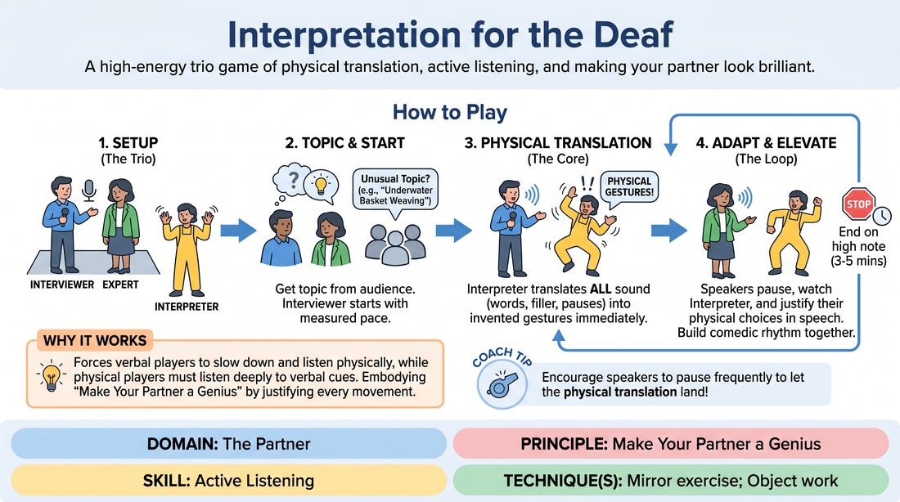{ .cat-game-img loading=lazy }

[Open full game card »](../D2_P3_S1_T1_G1133__interpretation-for-the-deaf.md){target=_blank rel=noopener}

