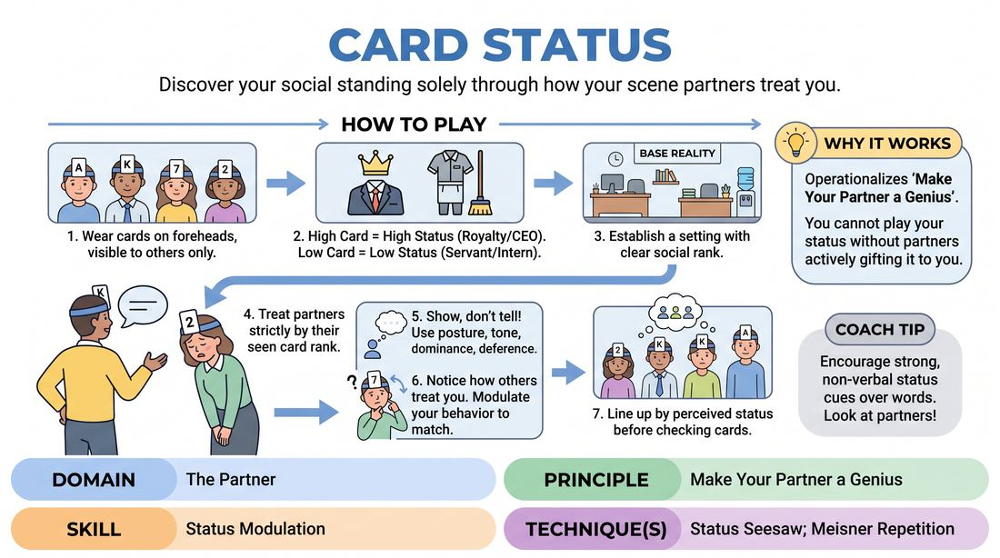
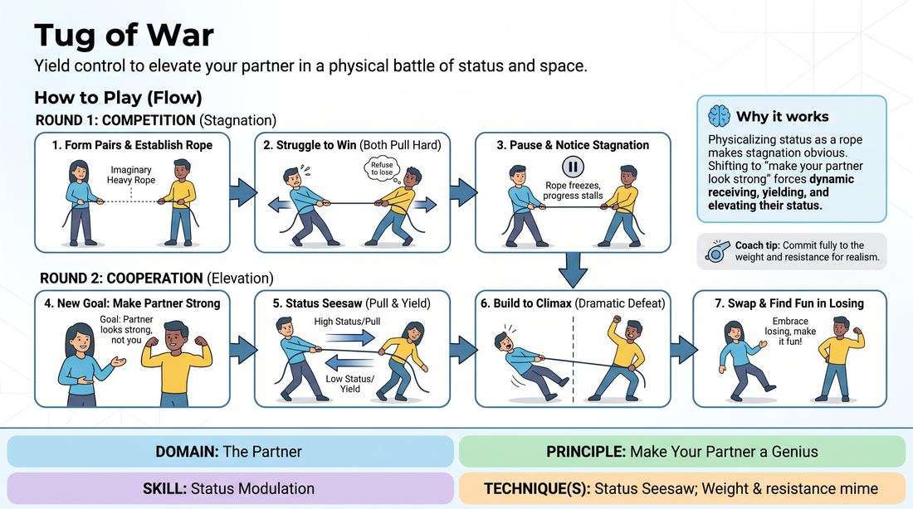
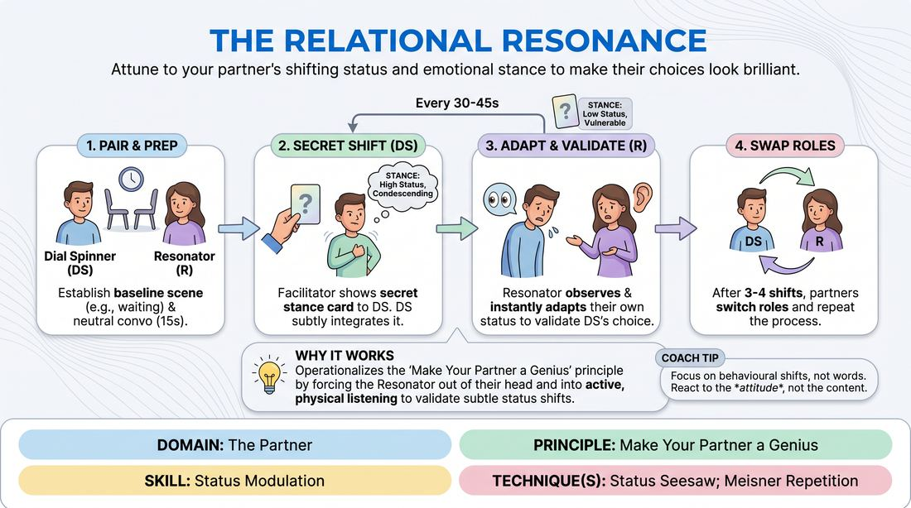
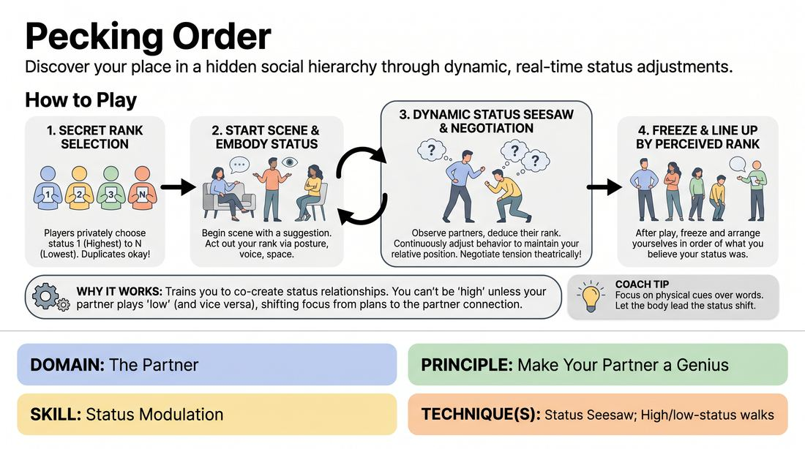
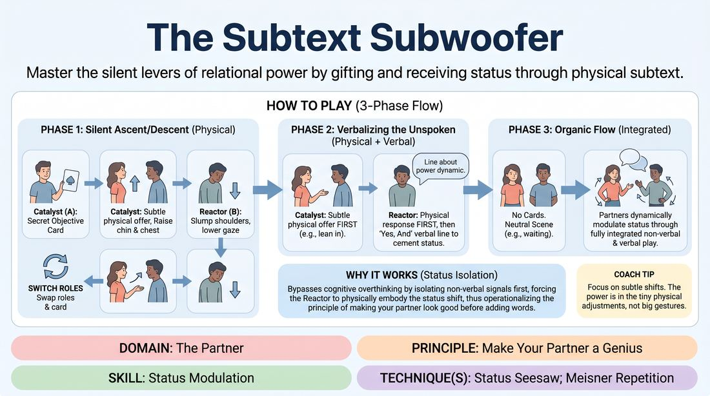
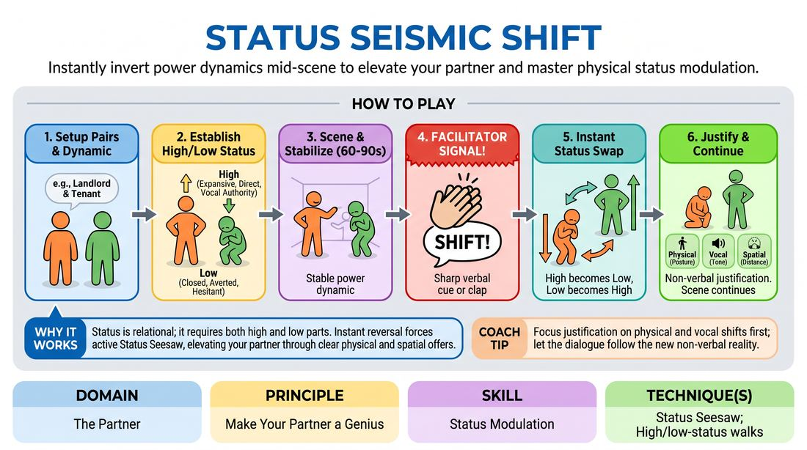
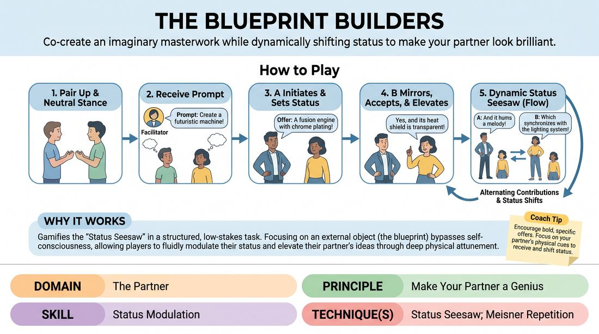
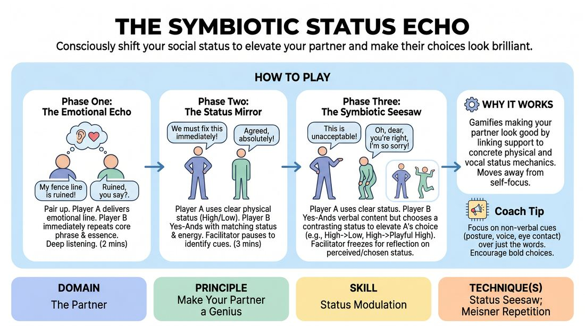
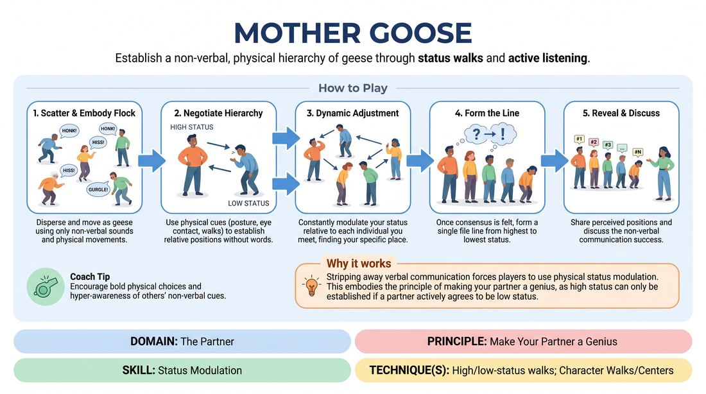

# 🎲 Status Modulation — games

Games whose primary skill is **Status Modulation** (`D2.S2`), grouped by technique. Full faceted search on the [Games List](../index.md).

## Core / general

### Making Faces

{ .cat-game-img loading=lazy }

[Open full game card »](../D2_P3_S2_T0_G1166__making-faces.md){target=_blank rel=noopener}

### Proximity Stakes

{ .cat-game-img loading=lazy }

[Open full game card »](../D2_P2_S2_T0_G1026__distance-game.md){target=_blank rel=noopener}

## Status Seesaw

### Card Status

{ .cat-game-img loading=lazy }

[Open full game card »](../D2_P3_S2_T1_G978__card-status.md){target=_blank rel=noopener}

### Cooperative Tug of War

{ .cat-game-img loading=lazy }

[Open full game card »](../D2_P3_S2_T1_G877__tug-of-war.md){target=_blank rel=noopener}

### Relational Resonance

{ .cat-game-img loading=lazy }

[Open full game card »](../D2_P3_S2_T1_G354__the-relational-resonance.md){target=_blank rel=noopener}

### Secret Status Scale

{ .cat-game-img loading=lazy }

[Open full game card »](../D2_P3_S2_T1_G1229__pecking-order.md){target=_blank rel=noopener}

### Silent Status Seesaw

{ .cat-game-img loading=lazy }

[Open full game card »](../D2_P3_S2_T1_G369__the-silent-choreography-of-influence.md){target=_blank rel=noopener}

### Status Alliances

{ .cat-game-img loading=lazy }

[Open full game card »](../D2_P3_S2_T1_G1055__excluding.md){target=_blank rel=noopener}

### Status Architects

{ .cat-game-img loading=lazy }

[Open full game card »](../D2_P3_S2_T1_G010__the-ascendant-architects.md){target=_blank rel=noopener}

### Status Architects

{ .cat-game-img loading=lazy }

[Open full game card »](../D2_P3_S2_T1_G021__the-subtext-subwoofer.md){target=_blank rel=noopener}

### Status Architects

{ .cat-game-img loading=lazy }

[Open full game card »](../D2_P3_S2_T1_G024__resonance-weave-status-cadence.md){target=_blank rel=noopener}

### Status Architects

{ .cat-game-img loading=lazy }

[Open full game card »](../D2_P3_S2_T1_G554__status-architects-collaborative-shift.md){target=_blank rel=noopener}

### Status Seesaw Shift

{ .cat-game-img loading=lazy }

[Open full game card »](../D2_P3_S2_T1_G570__status-seismic-shift.md){target=_blank rel=noopener}

### Status Weave

{ .cat-game-img loading=lazy }

[Open full game card »](../D2_P2_S2_T1_G459__the-status-weave.md){target=_blank rel=noopener}

### The Blueprint Builders

{ .cat-game-img loading=lazy }

[Open full game card »](../D2_P3_S2_T1_G197__the-blueprint-builders.md){target=_blank rel=noopener}

### The Living Blueprint

{ .cat-game-img loading=lazy }

[Open full game card »](../D2_P2_S2_T1_G277__the-living-blueprint.md){target=_blank rel=noopener}

### The Pink Slip Script

{ .cat-game-img loading=lazy }

[Open full game card »](../D2_P3_S2_T1_G1380__you-re-fired.md){target=_blank rel=noopener}

### The Sovereign's Snap

{ .cat-game-img loading=lazy }

[Open full game card »](../D2_P3_S2_T1_G822__royal-status-game.md){target=_blank rel=noopener}

### The Status Seesaw Echo

{ .cat-game-img loading=lazy }

[Open full game card »](../D2_P3_S2_T1_G194__the-symbiotic-status-echo.md){target=_blank rel=noopener}

## High/low-status walks

### Status Spectrum Party

{ .cat-game-img loading=lazy }

[Open full game card »](../D2_P3_S2_T2_G847__status-party.md){target=_blank rel=noopener}

### The Pecking Order

{ .cat-game-img loading=lazy }

[Open full game card »](../D2_P3_S2_T2_G1190__mother-goose.md){target=_blank rel=noopener}

