# 🎲 Single-Partner Empathy & Mirroring — games

Games whose primary skill is **Single-Partner Empathy & Mirroring** (`D2.S3`), grouped by technique. Full faceted search on the [Games List](../index.md).

## Mirror exercise

### Character Echo

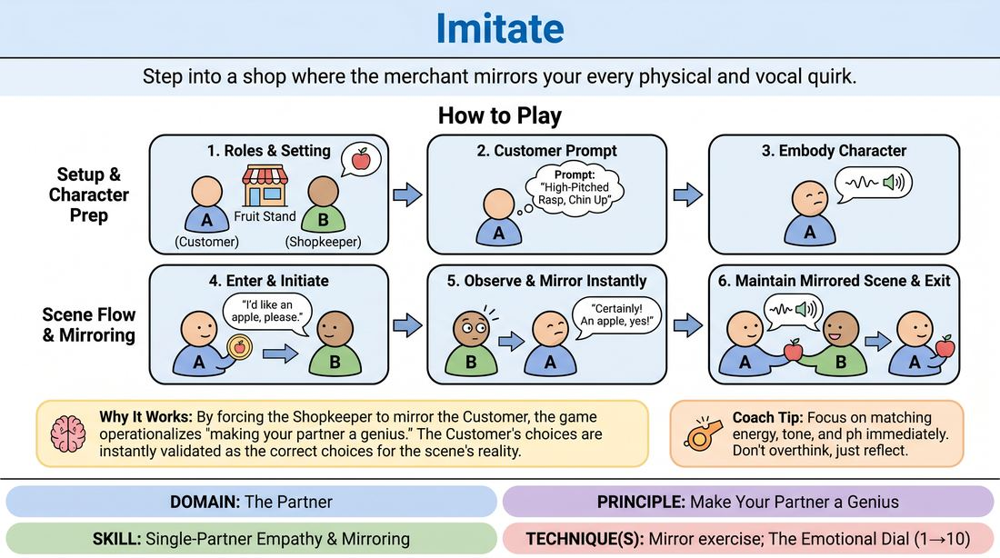{ .cat-game-img loading=lazy }

[Open full game card »](../D2_P3_S3_T1_G1129__imitate.md){target=_blank rel=noopener}

### Character Mirror Circle

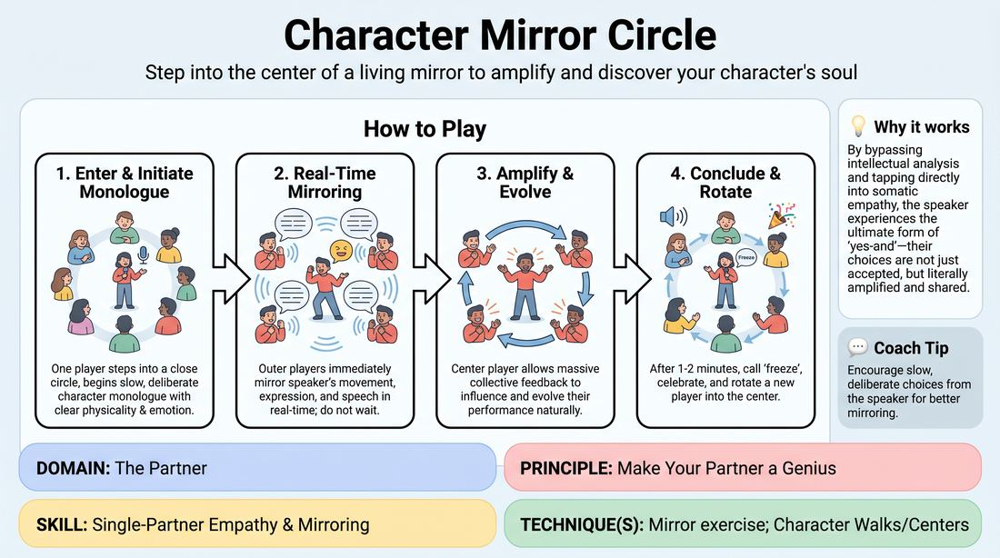{ .cat-game-img loading=lazy }

[Open full game card »](../D2_P3_S3_T1_G659__character-mirror-circle.md){target=_blank rel=noopener}

### Character Swap

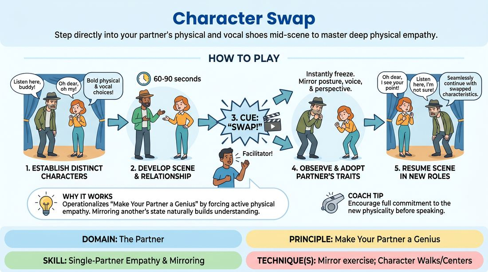{ .cat-game-img loading=lazy }

[Open full game card »](../D2_P3_S3_T1_G983__character-swap.md){target=_blank rel=noopener}

### Complementary Shapes

{ .cat-game-img loading=lazy }

[Open full game card »](../D2_P2_S3_T1_G997__complete-bodies.md){target=_blank rel=noopener}

### Cosmic Groove Relay

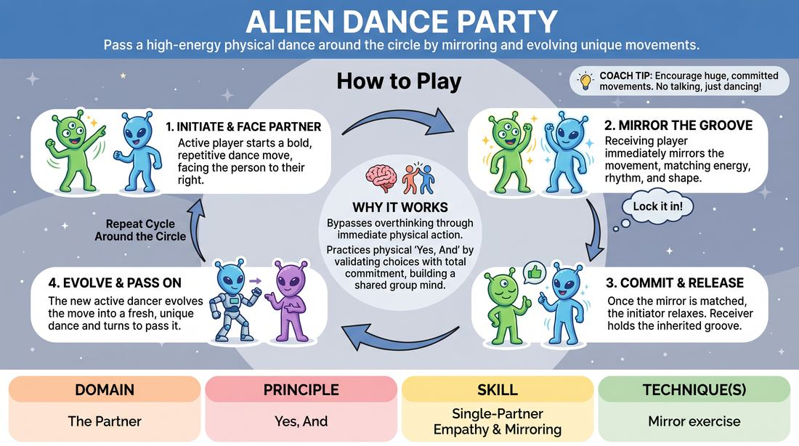{ .cat-game-img loading=lazy }

[Open full game card »](../D2_P2_S3_T1_G922__alien-dance-party.md){target=_blank rel=noopener}

### Dual-Channel Echo Mirror

{ .cat-game-img loading=lazy }

[Open full game card »](../D2_P3_S3_T1_G953__bidirectional-satellite-tv.md){target=_blank rel=noopener}

### Echo Mirror

{ .cat-game-img loading=lazy }

[Open full game card »](../D2_P3_S3_T1_G1263__satellite-tv.md){target=_blank rel=noopener}

### Exaggeration Circle

{ .cat-game-img loading=lazy }

[Open full game card »](../D2_P2_S3_T1_G1054__exaggeration-circle.md){target=_blank rel=noopener}

### Fingertip Guide

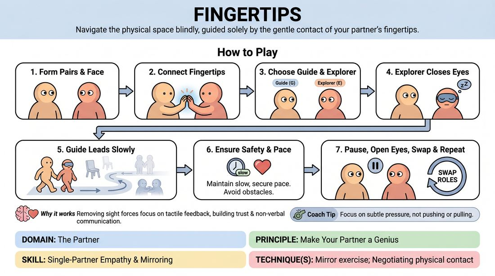{ .cat-game-img loading=lazy }

[Open full game card »](../D2_P3_S3_T1_G1067__fingertips.md){target=_blank rel=noopener}

### Gait Mirror

{ .cat-game-img loading=lazy }

[Open full game card »](../D2_P3_S3_T1_G920__aerobics.md){target=_blank rel=noopener}

### Ksss

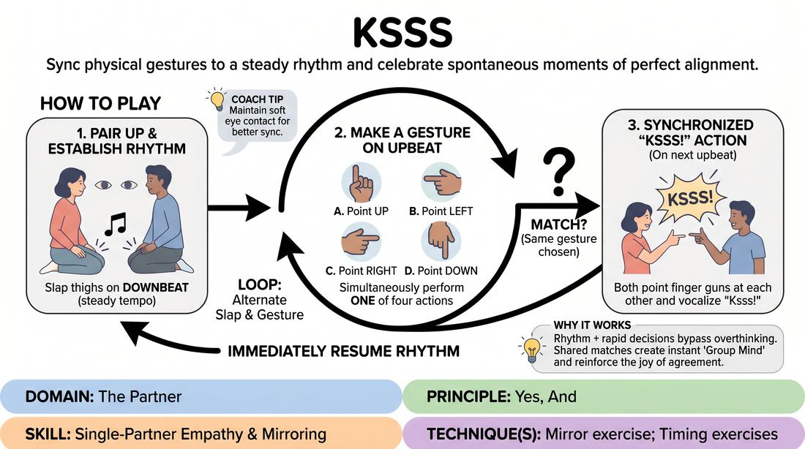{ .cat-game-img loading=lazy }

[Open full game card »](../D2_P2_S3_T1_G1147__ksss.md){target=_blank rel=noopener}

### Linked Mirror Lines

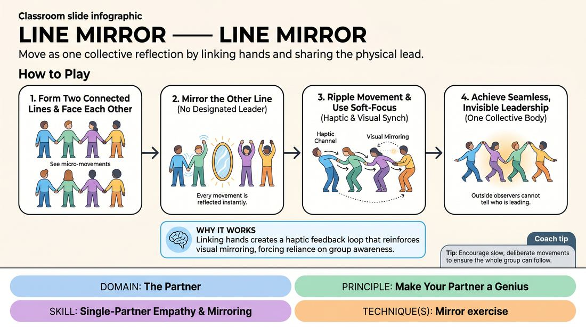{ .cat-game-img loading=lazy }

[Open full game card »](../D2_P3_S3_T1_G1156__line-mirror.md){target=_blank rel=noopener}

### Magnetic Palm

{ .cat-game-img loading=lazy }

[Open full game card »](../D2_P3_S3_T1_G992__columbian-hypnosis.md){target=_blank rel=noopener}

### Magnetic Palms

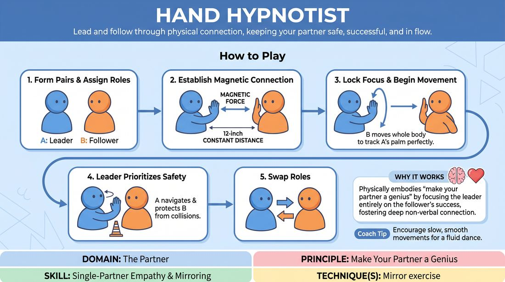{ .cat-game-img loading=lazy }

[Open full game card »](../D2_P3_S3_T1_G723__hand-hypnotist.md){target=_blank rel=noopener}

### Peas in a Pod

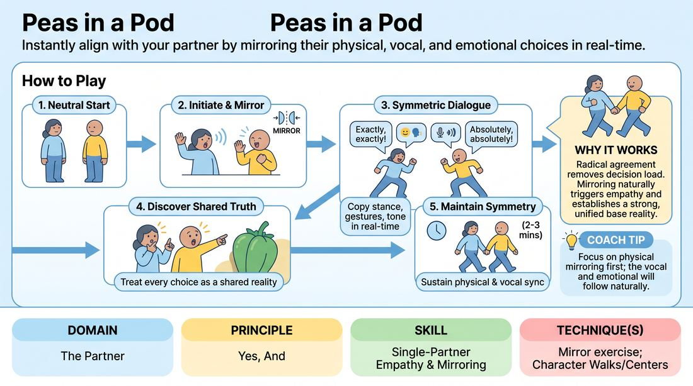{ .cat-game-img loading=lazy }

[Open full game card »](../D2_P2_S3_T1_G798__peas-in-a-pod.md){target=_blank rel=noopener}

### Persona Swap

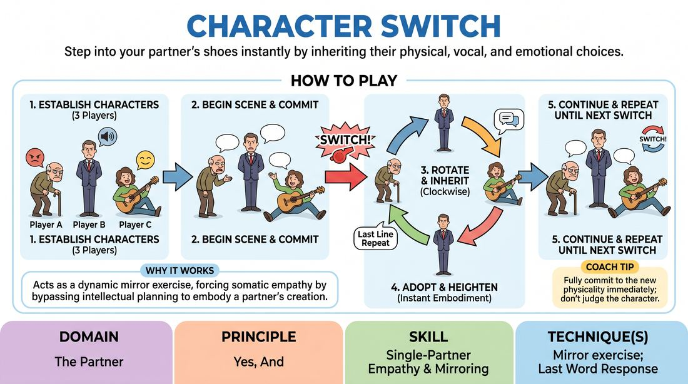{ .cat-game-img loading=lazy }

[Open full game card »](../D2_P2_S3_T1_G662__character-switch.md){target=_blank rel=noopener}

### Reflective Convergence

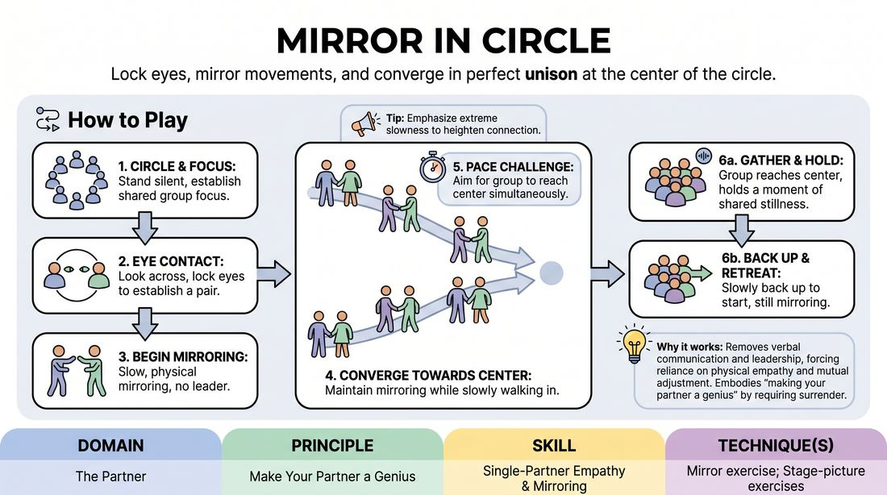{ .cat-game-img loading=lazy }

[Open full game card »](../D2_P3_S3_T1_G1181__mirror-in-circle.md){target=_blank rel=noopener}

### Resonance Circle

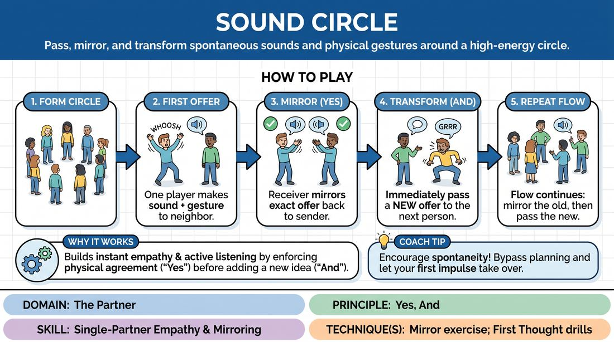{ .cat-game-img loading=lazy }

[Open full game card »](../D2_P2_S3_T1_G1291__sound-circle.md){target=_blank rel=noopener}

### Resonance Weaving

{ .cat-game-img loading=lazy }

[Open full game card »](../D2_P3_S3_T1_G135__the-resonance-weave.md){target=_blank rel=noopener}

### Resonant Attunement

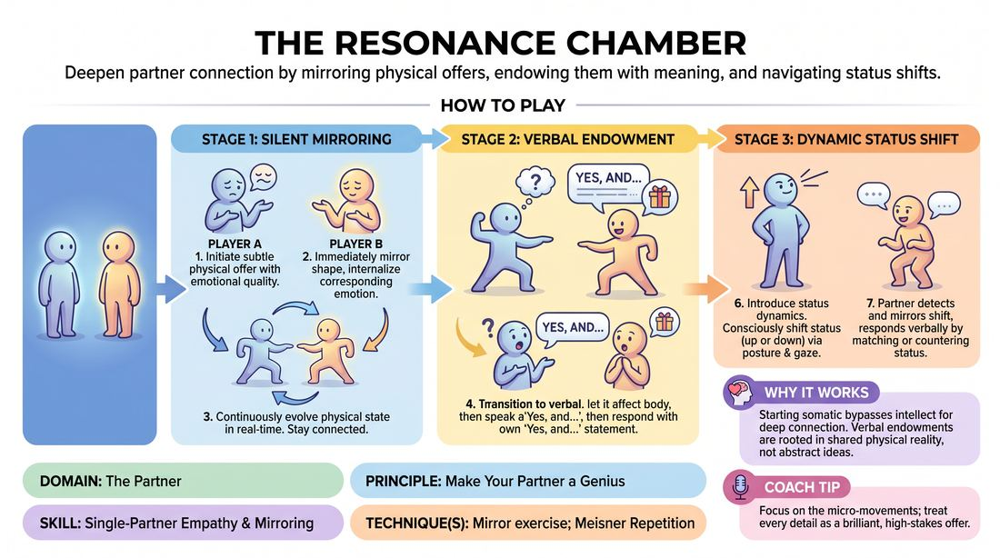{ .cat-game-img loading=lazy }

[Open full game card »](../D2_P3_S3_T1_G284__the-resonance-chamber.md){target=_blank rel=noopener}

### Role Swap

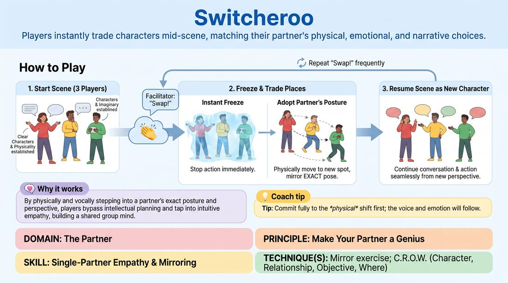{ .cat-game-img loading=lazy }

[Open full game card »](../D2_P3_S3_T1_G1316__switcheroo.md){target=_blank rel=noopener}

### Scene Replication

{ .cat-game-img loading=lazy }

[Open full game card »](../D2_P2_S3_T1_G826__scene-repeater.md){target=_blank rel=noopener}

### Shared Gravity

{ .cat-game-img loading=lazy }

[Open full game card »](../D2_P3_S3_T1_G036__collective-construct.md){target=_blank rel=noopener}

### Somatic Echo

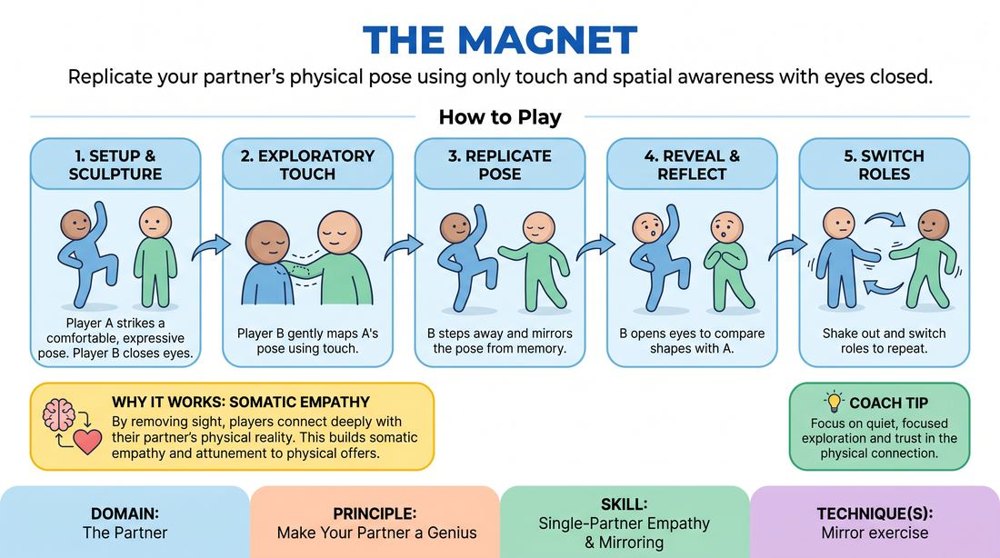{ .cat-game-img loading=lazy }

[Open full game card »](../D2_P3_S3_T1_G1328__the-magnet.md){target=_blank rel=noopener}

### Somatic Resonance

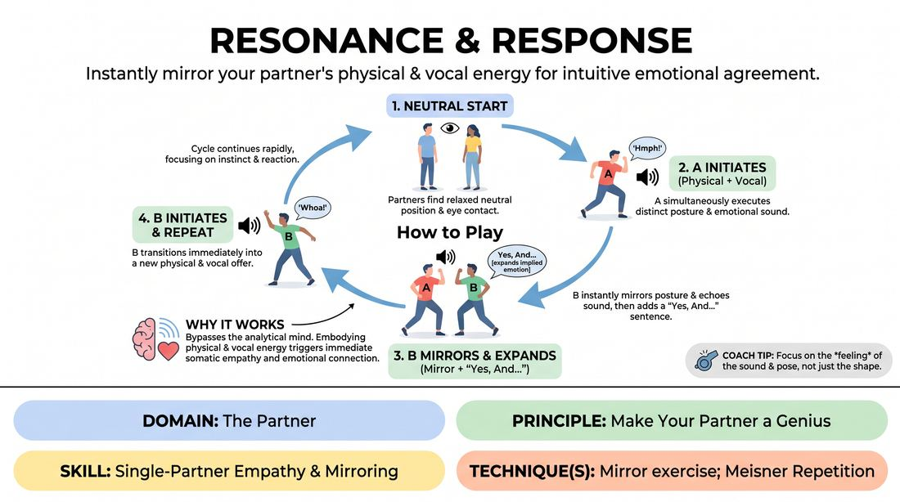{ .cat-game-img loading=lazy }

[Open full game card »](../D2_P3_S3_T1_G301__resonance-response.md){target=_blank rel=noopener}

### Somatic Resonance Matrix

{ .cat-game-img loading=lazy }

[Open full game card »](../D2_P3_S3_T1_G438__the-neuro-sync-attunement-matrix.md){target=_blank rel=noopener}

### Sound Ball

{ .cat-game-img loading=lazy }

[Open full game card »](../D2_P2_S3_T1_G840__sound-ball.md){target=_blank rel=noopener}

### Sound and Motion Mirror

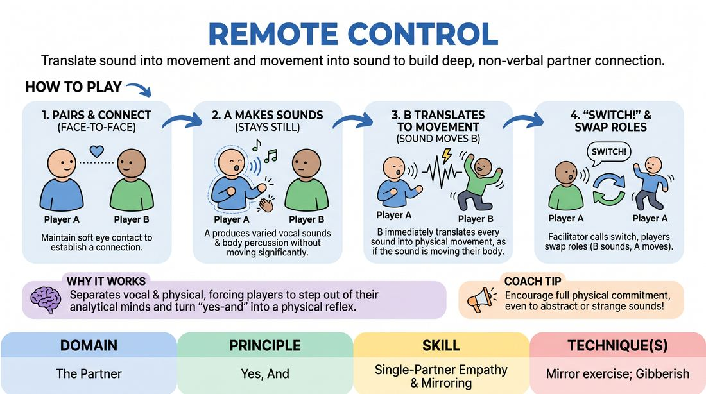{ .cat-game-img loading=lazy }

[Open full game card »](../D2_P2_S3_T1_G1251__remote-control.md){target=_blank rel=noopener}

### Spine Sync

{ .cat-game-img loading=lazy }

[Open full game card »](../D2_P3_S3_T1_G940__back-dancing.md){target=_blank rel=noopener}

### Symphony of Coincidences

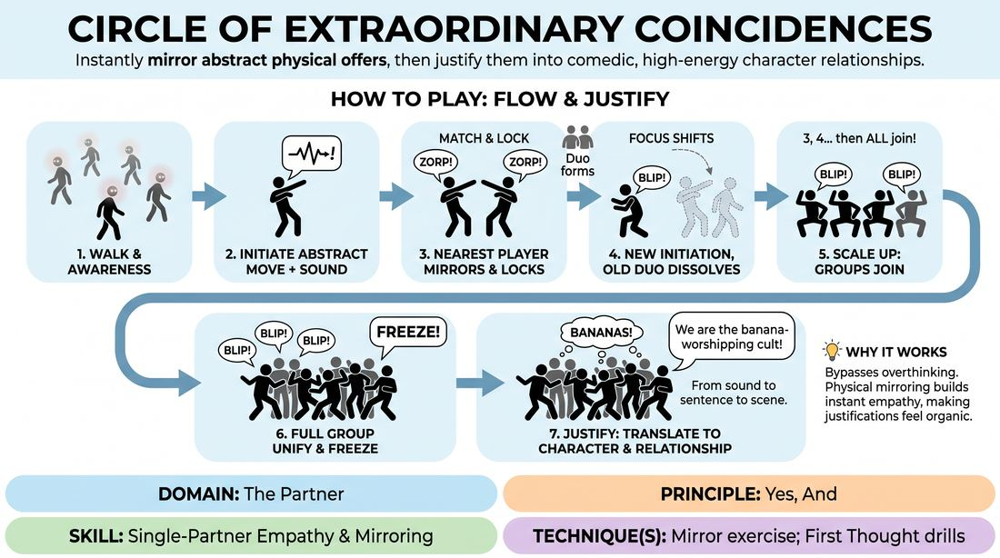{ .cat-game-img loading=lazy }

[Open full game card »](../D2_P2_S3_T1_G666__circle-of-extraordinary-coincidences.md){target=_blank rel=noopener}

### Synchronous Story Weave

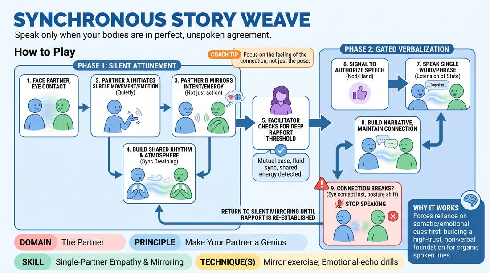{ .cat-game-img loading=lazy }

[Open full game card »](../D2_P3_S3_T1_G111__synchronous-story-weave.md){target=_blank rel=noopener}

### The Attunement Loop

{ .cat-game-img loading=lazy }

[Open full game card »](../D2_P2_S3_T1_G533__the-harmonic-flux.md){target=_blank rel=noopener}

### The Distorted Mirror

{ .cat-game-img loading=lazy }

[Open full game card »](../D2_P2_S3_T1_G1027__distorting-mirror.md){target=_blank rel=noopener}

### The Echo Chamber

{ .cat-game-img loading=lazy }

[Open full game card »](../D2_P2_S3_T1_G768__mimic.md){target=_blank rel=noopener}

### The Emotional Current Walk

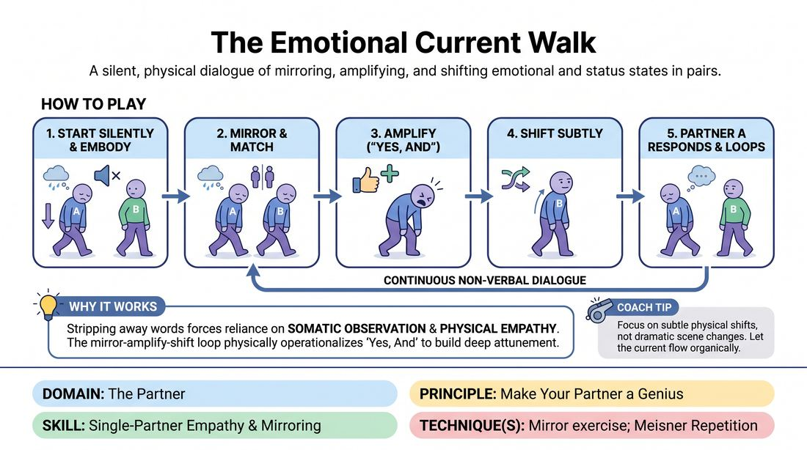{ .cat-game-img loading=lazy }

[Open full game card »](../D2_P3_S3_T1_G483__the-emotional-current-walk.md){target=_blank rel=noopener}

### The Empathetic Echo

{ .cat-game-img loading=lazy }

[Open full game card »](../D2_P3_S3_T1_G472__the-empath-s-echo.md){target=_blank rel=noopener}

### The Living Clay Mirror

{ .cat-game-img loading=lazy }

[Open full game card »](../D2_P3_S3_T1_G1314__swedish-sculptors.md){target=_blank rel=noopener}

### The Mirror

{ .cat-game-img loading=lazy }

[Open full game card »](../D2_P3_S3_T1_G770__mirroring.md){target=_blank rel=noopener}

### The Mirror Exercise

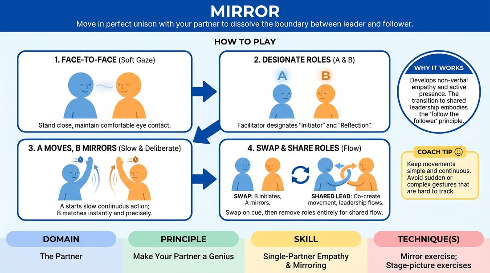{ .cat-game-img loading=lazy }

[Open full game card »](../D2_P3_S3_T1_G1180__mirror.md){target=_blank rel=noopener}

### The Mutation Circle

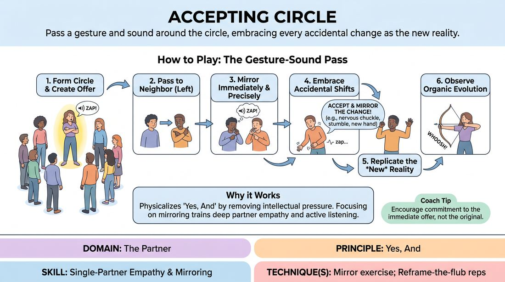{ .cat-game-img loading=lazy }

[Open full game card »](../D2_P2_S3_T1_G916__accepting-circle.md){target=_blank rel=noopener}

### The Resonance Chamber

{ .cat-game-img loading=lazy }

[Open full game card »](../D2_P3_S3_T1_G250__the-resonance-chamber.md){target=_blank rel=noopener}

### The Resonant Thread

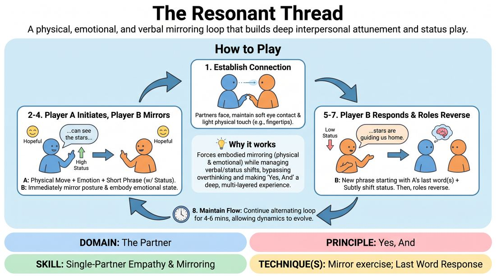{ .cat-game-img loading=lazy }

[Open full game card »](../D2_P2_S3_T1_G530__the-resonant-thread.md){target=_blank rel=noopener}

### The Silent Sculptor

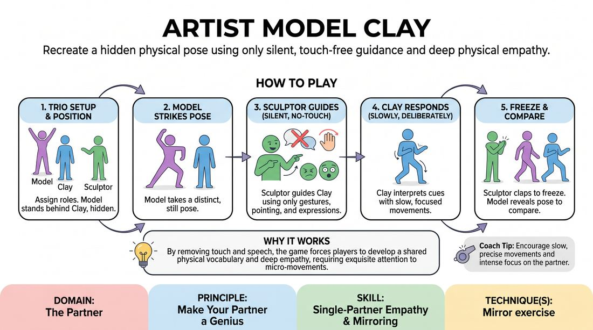{ .cat-game-img loading=lazy }

[Open full game card »](../D2_P3_S3_T1_G933__artist-model-clay.md){target=_blank rel=noopener}

### Unison Voice

{ .cat-game-img loading=lazy }

[Open full game card »](../D2_P3_S3_T1_G786__one-voice.md){target=_blank rel=noopener}

### Yippee Connection

{ .cat-game-img loading=lazy }

[Open full game card »](../D2_P2_S3_T1_G906__yipee.md){target=_blank rel=noopener}

## Emotional-echo drills

### Attunement Waves

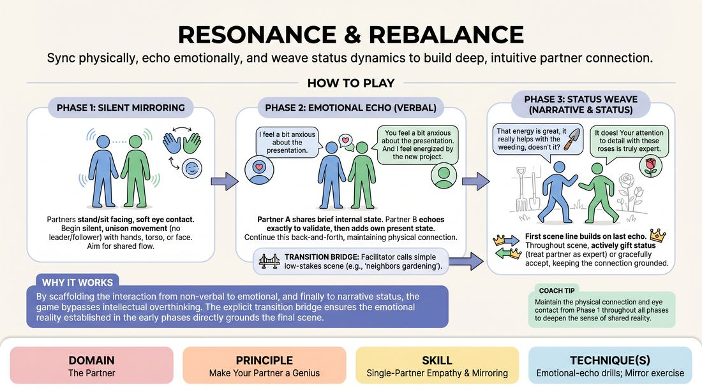{ .cat-game-img loading=lazy }

[Open full game card »](../D2_P3_S3_T2_G336__resonance-rebalance.md){target=_blank rel=noopener}

### Echo and Align

{ .cat-game-img loading=lazy }

[Open full game card »](../D2_P3_S3_T2_G392__resonance-realignment.md){target=_blank rel=noopener}

### Echo and Seed

{ .cat-game-img loading=lazy }

[Open full game card »](../D2_P2_S3_T2_G442__silent-echoes-seeds.md){target=_blank rel=noopener}

### Echoes of the Unspoken

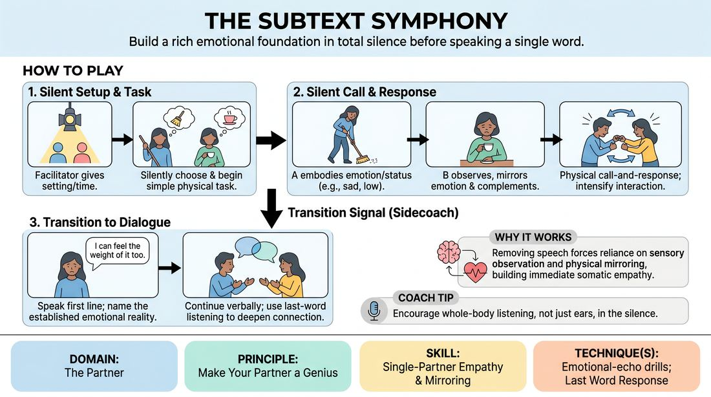{ .cat-game-img loading=lazy }

[Open full game card »](../D2_P3_S3_T2_G390__the-subtext-symphony.md){target=_blank rel=noopener}

### Emotional Alchemy

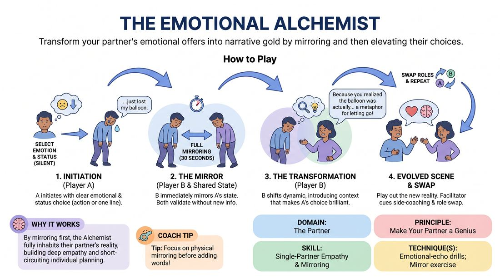{ .cat-game-img loading=lazy }

[Open full game card »](../D2_P3_S3_T2_G141__the-emotional-alchemist.md){target=_blank rel=noopener}

### Emotional Architects

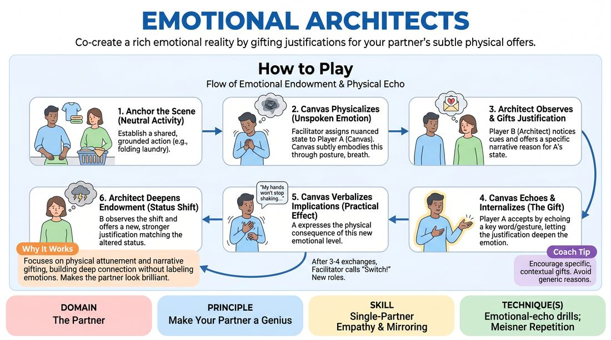{ .cat-game-img loading=lazy }

[Open full game card »](../D2_P3_S3_T2_G287__emotional-architects.md){target=_blank rel=noopener}

### Emotional Echo Chambers

{ .cat-game-img loading=lazy }

[Open full game card »](../D2_P2_S3_T2_G371__synchronicity-scapes-the-echo-emote-narrative.md){target=_blank rel=noopener}

### Emotional Resonance Relay

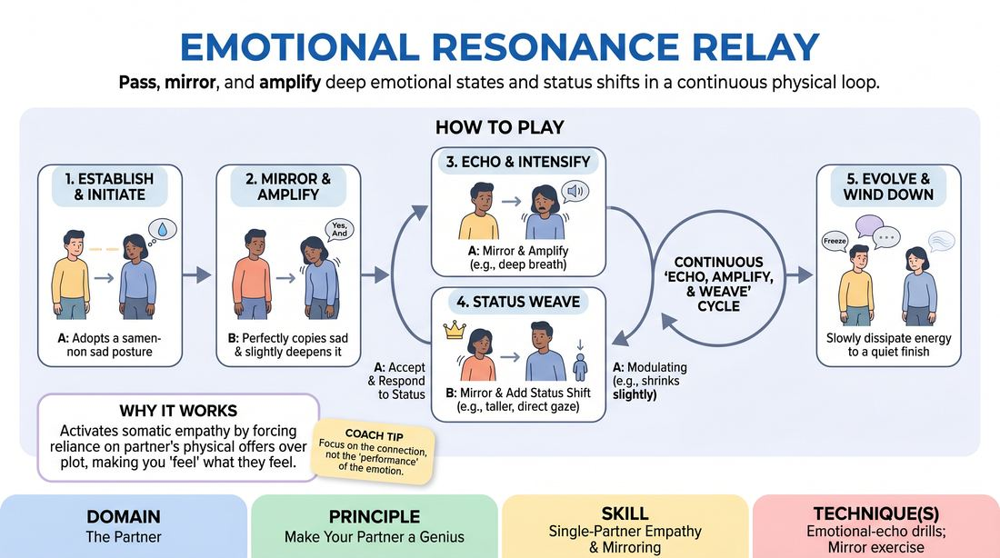{ .cat-game-img loading=lazy }

[Open full game card »](../D2_P3_S3_T2_G593__emotional-resonance-relay.md){target=_blank rel=noopener}

### Emotional Whirlwind Pivot

{ .cat-game-img loading=lazy }

[Open full game card »](../D2_P2_S3_T2_G466__emotional-whirlwind-pivot.md){target=_blank rel=noopener}

### I Love You

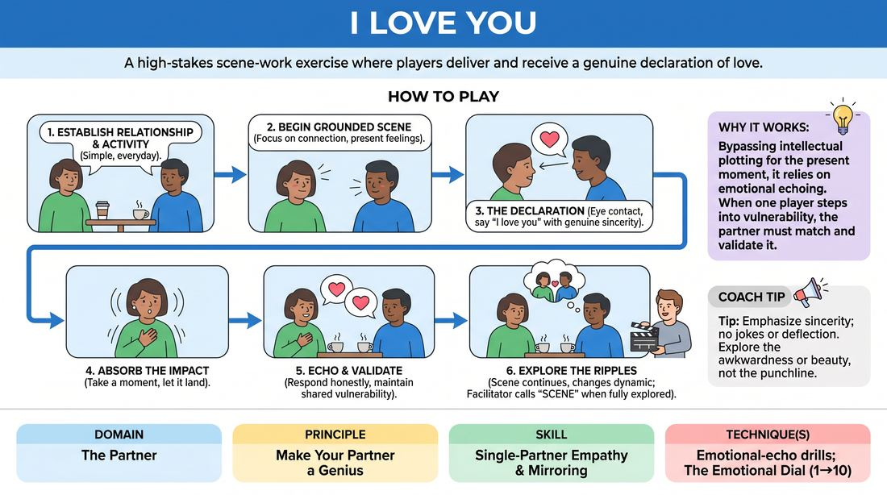{ .cat-game-img loading=lazy }

[Open full game card »](../D2_P3_S3_T2_G732__i-love-you.md){target=_blank rel=noopener}

### Object and Essence

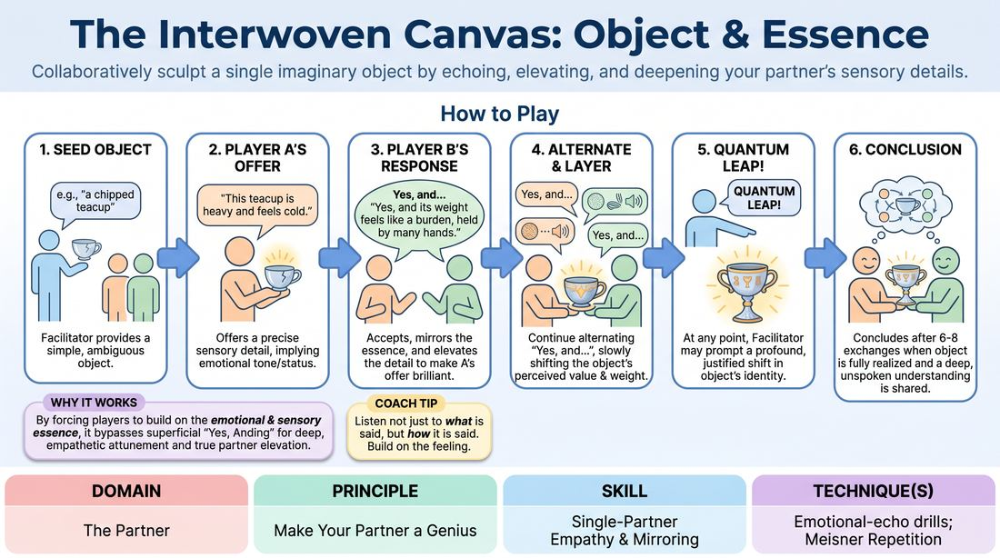{ .cat-game-img loading=lazy }

[Open full game card »](../D2_P3_S3_T2_G268__the-interwoven-canvas-object-essence.md){target=_blank rel=noopener}

### Resonance Architects

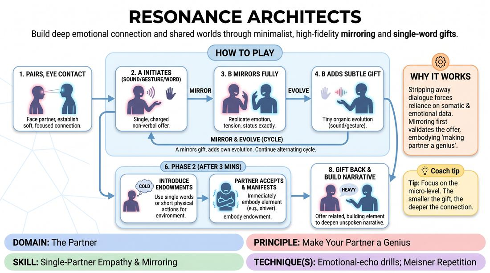{ .cat-game-img loading=lazy }

[Open full game card »](../D2_P3_S3_T2_G118__resonance-architects.md){target=_blank rel=noopener}

### Resonance Weave

{ .cat-game-img loading=lazy }

[Open full game card »](../D2_P3_S3_T2_G420__resonance-weave.md){target=_blank rel=noopener}

### Resonant Echo

{ .cat-game-img loading=lazy }

[Open full game card »](../D2_P3_S3_T2_G181__resonant-echo.md){target=_blank rel=noopener}

### Resonant Echoes

{ .cat-game-img loading=lazy }

[Open full game card »](../D2_P2_S3_T2_G372__synaptic-sync.md){target=_blank rel=noopener}

### Resonant Echoes

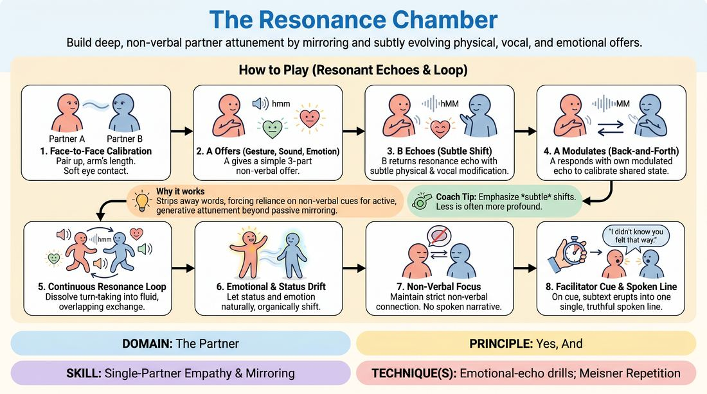{ .cat-game-img loading=lazy }

[Open full game card »](../D2_P2_S3_T2_G574__the-resonance-chamber.md){target=_blank rel=noopener}

### Resonant Echoes

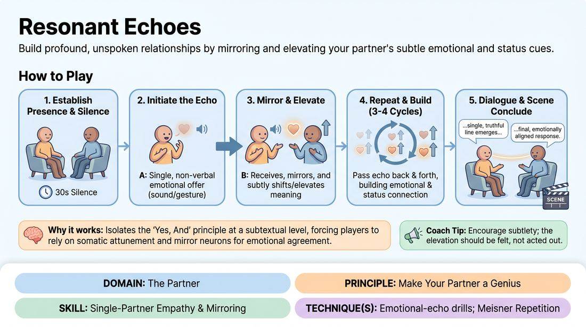{ .cat-game-img loading=lazy }

[Open full game card »](../D2_P3_S3_T2_G079__resonant-echoes.md){target=_blank rel=noopener}

### Resonant Echoes

{ .cat-game-img loading=lazy }

[Open full game card »](../D2_P3_S3_T2_G581__the-resonance-chamber.md){target=_blank rel=noopener}

### Resonant Mirror

{ .cat-game-img loading=lazy }

[Open full game card »](../D2_P2_S3_T2_G1046__emotional-mirror.md){target=_blank rel=noopener}

### Silent Resonance Pairs

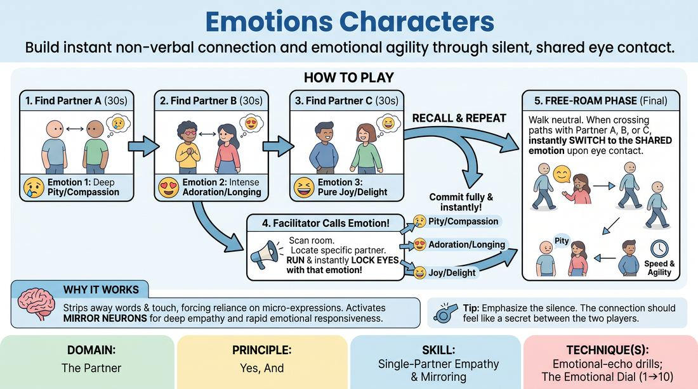{ .cat-game-img loading=lazy }

[Open full game card »](../D2_P2_S3_T2_G1048__emotions-characters.md){target=_blank rel=noopener}

### The Echo and Elevate Exchange

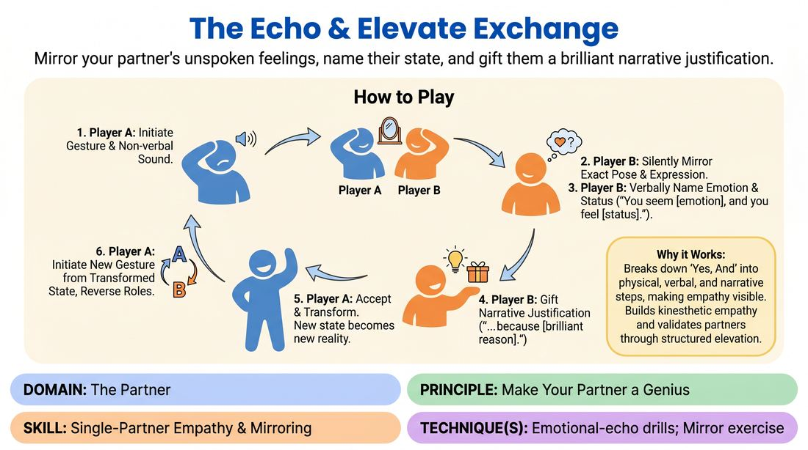{ .cat-game-img loading=lazy }

[Open full game card »](../D2_P3_S3_T2_G099__the-echo-elevate-exchange.md){target=_blank rel=noopener}

### The Emotional Echo Chamber

{ .cat-game-img loading=lazy }

[Open full game card »](../D2_P2_S3_T2_G156__the-emotional-echo-chamber.md){target=_blank rel=noopener}

### The Hitchhiker

{ .cat-game-img loading=lazy }

[Open full game card »](../D2_P3_S3_T2_G1120__hitch-hiker.md){target=_blank rel=noopener}

### The Resonance Chamber

{ .cat-game-img loading=lazy }

[Open full game card »](../D2_P3_S3_T2_G053__the-harmonic-resonance-chamber.md){target=_blank rel=noopener}

### The Resonance Chamber

{ .cat-game-img loading=lazy }

[Open full game card »](../D2_P3_S3_T2_G107__the-echo-chamber-endowment.md){target=_blank rel=noopener}

### The Resonance Chamber

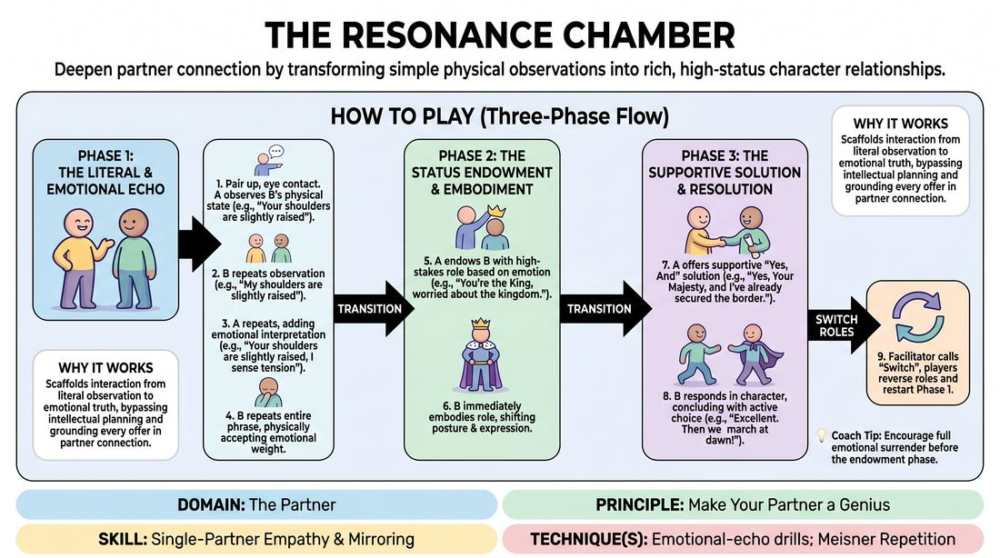{ .cat-game-img loading=lazy }

[Open full game card »](../D2_P3_S3_T2_G219__the-resonance-chamber.md){target=_blank rel=noopener}

### The Resonance Chamber

{ .cat-game-img loading=lazy }

[Open full game card »](../D2_P3_S3_T2_G513__the-emotional-amplifier-a-e-r-sacred-echo-edition.md){target=_blank rel=noopener}

### The Resonance Loop

{ .cat-game-img loading=lazy }

[Open full game card »](../D2_P3_S3_T2_G584__the-emotional-echo-chamber.md){target=_blank rel=noopener}

### The Resonance Weave

{ .cat-game-img loading=lazy }

[Open full game card »](../D2_P3_S3_T2_G358__resonance-weave-the-subtextual-symphony.md){target=_blank rel=noopener}

### The Silent Attunement Loop

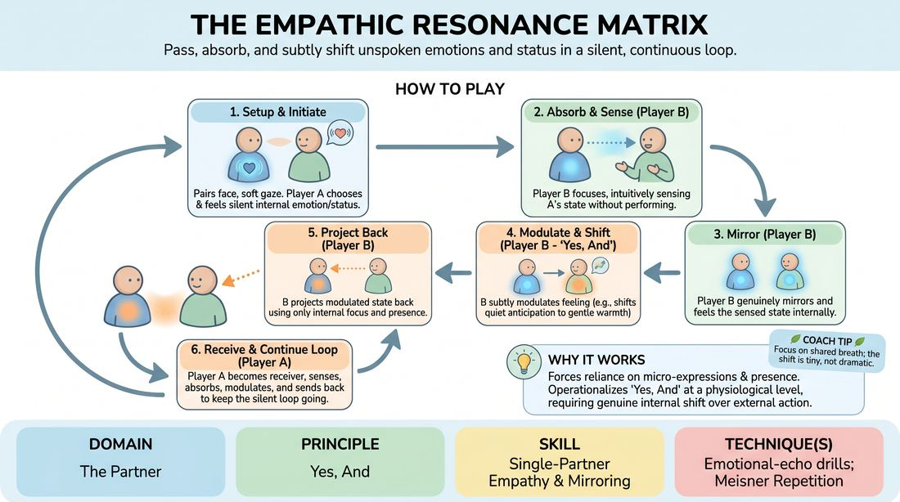{ .cat-game-img loading=lazy }

[Open full game card »](../D2_P2_S3_T2_G084__the-empathic-resonance-matrix.md){target=_blank rel=noopener}

### The Symbiotic Current

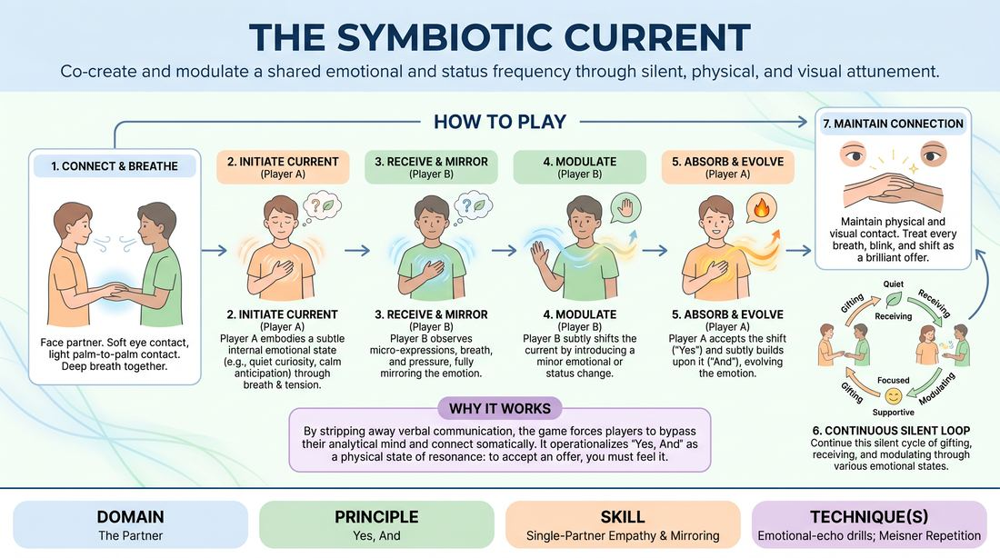{ .cat-game-img loading=lazy }

[Open full game card »](../D2_P2_S3_T2_G063__the-symbiotic-current.md){target=_blank rel=noopener}

### You Look, You Seem

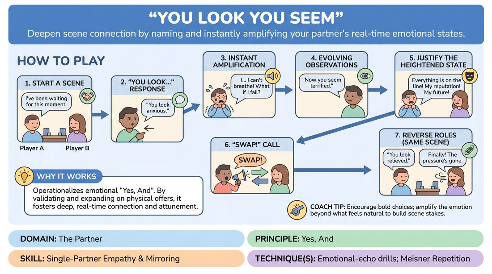{ .cat-game-img loading=lazy }

[Open full game card »](../D2_P2_S3_T2_G908__you-look-you-seem.md){target=_blank rel=noopener}

