# 🎲 Boundary Navigation — games

Games whose primary skill is **Boundary Navigation** (`D2.S6`), grouped by technique. Full faceted search on the [Games List](../index.md).

## Core / general

### Consent Sculpture Ensemble

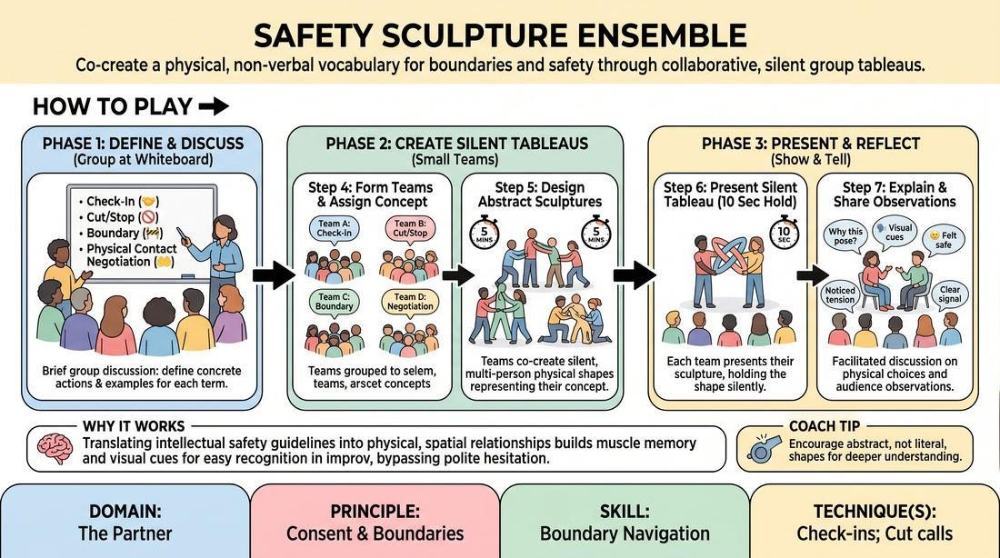{ .cat-game-img loading=lazy }

[Open full game card »](../D2_P1_S6_T0_G600__safety-sculpture-ensemble.md){target=_blank rel=noopener}

## Check-ins

### Boundary Archetypes

{ .cat-game-img loading=lazy }

[Open full game card »](../D2_P1_S6_T1_G597__boundary-archetypes-the-navigator-s-challenge.md){target=_blank rel=noopener}

### Boundary Blitz

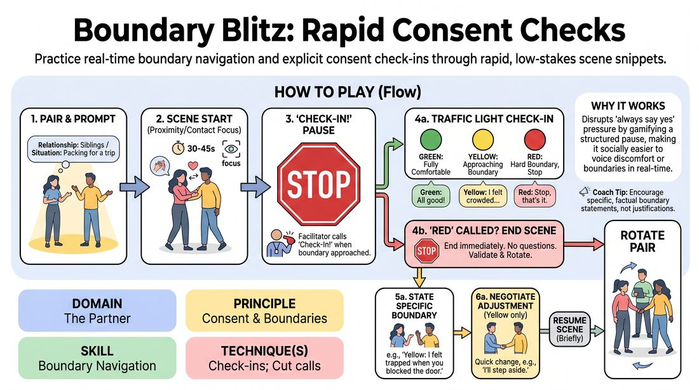{ .cat-game-img loading=lazy }

[Open full game card »](../D2_P1_S6_T1_G223__boundary-blitz-rapid-consent-checks.md){target=_blank rel=noopener}

### Boundary Blueprints

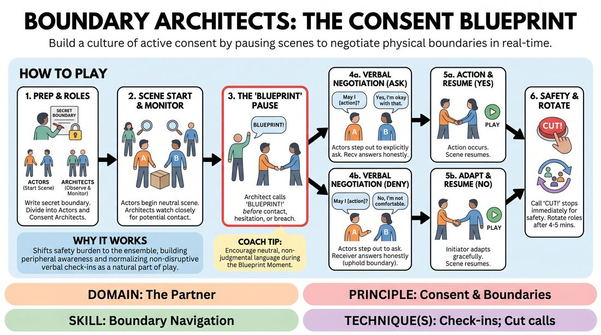{ .cat-game-img loading=lazy }

[Open full game card »](../D2_P1_S6_T1_G104__boundary-architects-the-consent-blueprint.md){target=_blank rel=noopener}

### Boundary Braille

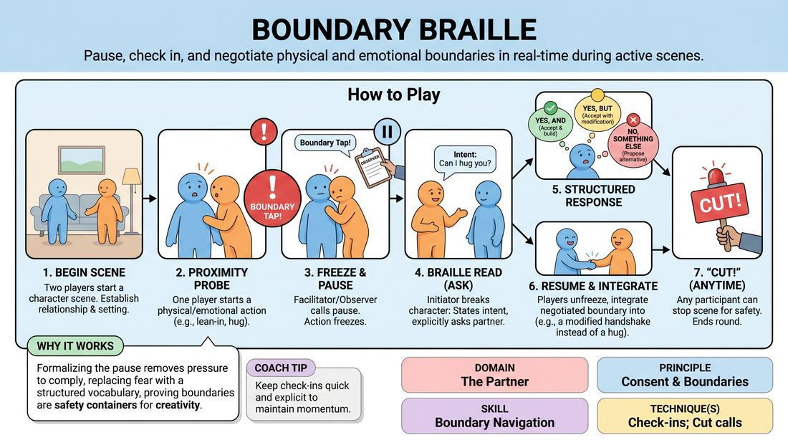{ .cat-game-img loading=lazy }

[Open full game card »](../D2_P1_S6_T1_G244__boundary-braille.md){target=_blank rel=noopener}

### Boundary Bridges

{ .cat-game-img loading=lazy }

[Open full game card »](../D2_P1_S6_T1_G335__boundary-bridge-builders.md){target=_blank rel=noopener}

### Boundary Cartographers

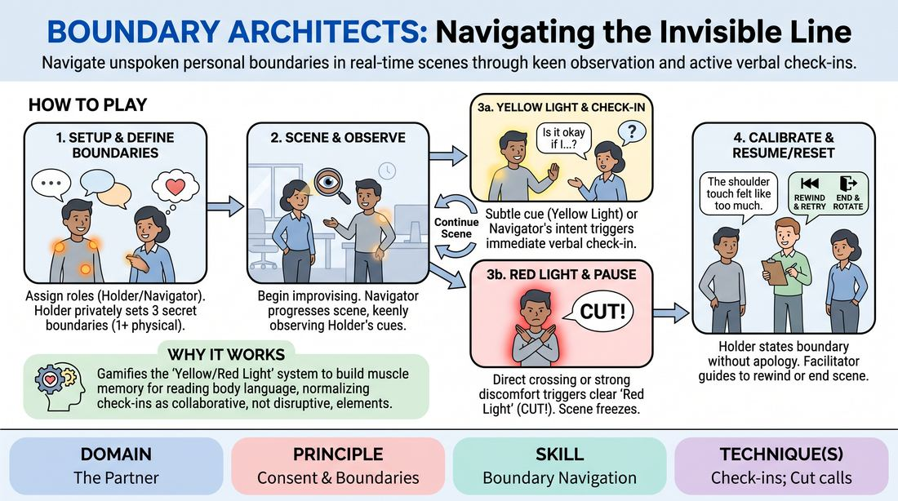{ .cat-game-img loading=lazy }

[Open full game card »](../D2_P1_S6_T1_G258__boundary-architects-navigating-the-invisible-line.md){target=_blank rel=noopener}

### Boundary Cartography

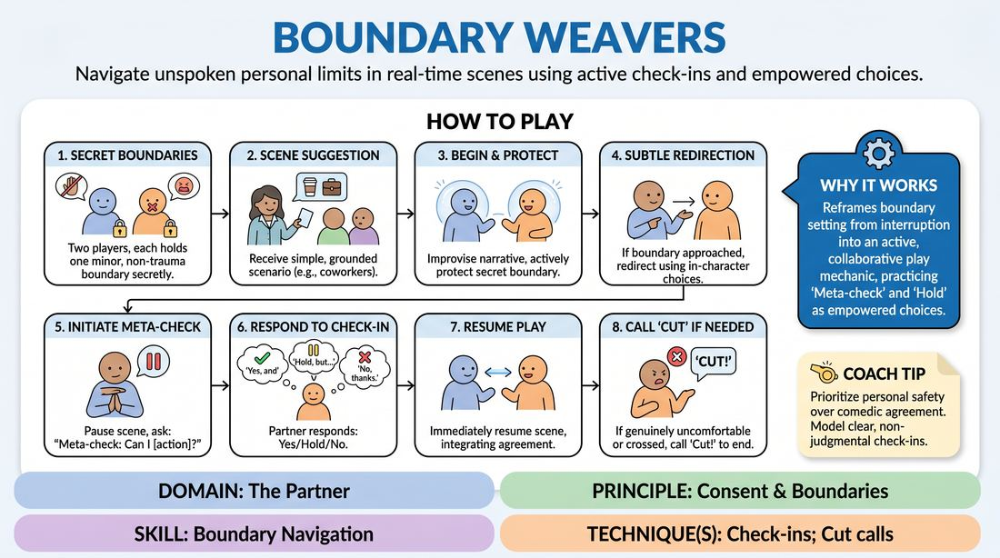{ .cat-game-img loading=lazy }

[Open full game card »](../D2_P1_S6_T1_G524__boundary-weavers.md){target=_blank rel=noopener}

### Boundary Echoes

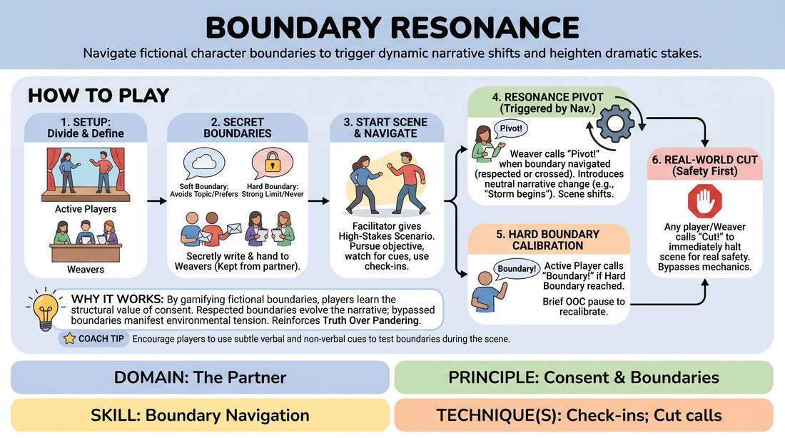{ .cat-game-img loading=lazy }

[Open full game card »](../D2_P1_S6_T1_G609__boundary-resonance.md){target=_blank rel=noopener}

### Boundary Swap

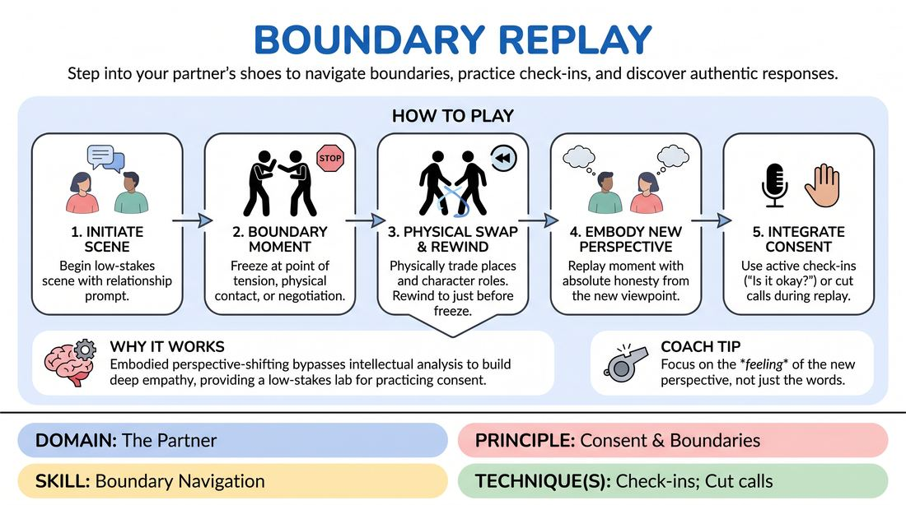{ .cat-game-img loading=lazy }

[Open full game card »](../D2_P1_S6_T1_G398__boundary-replay.md){target=_blank rel=noopener}

### Boundary Zones

{ .cat-game-img loading=lazy }

[Open full game card »](../D2_P1_S6_T1_G125__navigating-the-zones.md){target=_blank rel=noopener}

### Check-In and Pivot

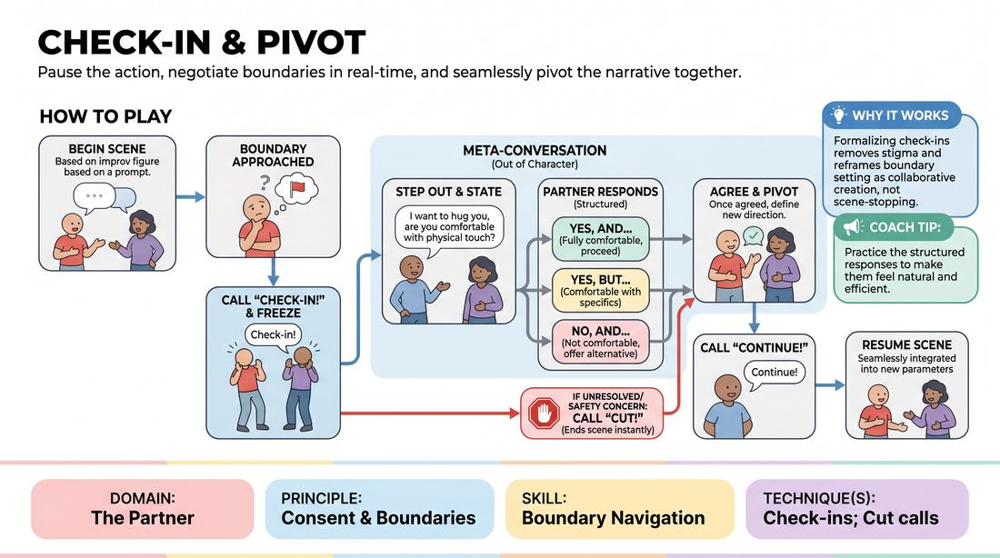{ .cat-game-img loading=lazy }

[Open full game card »](../D2_P1_S6_T1_G202__check-in-pivot.md){target=_blank rel=noopener}

### Consent Architects

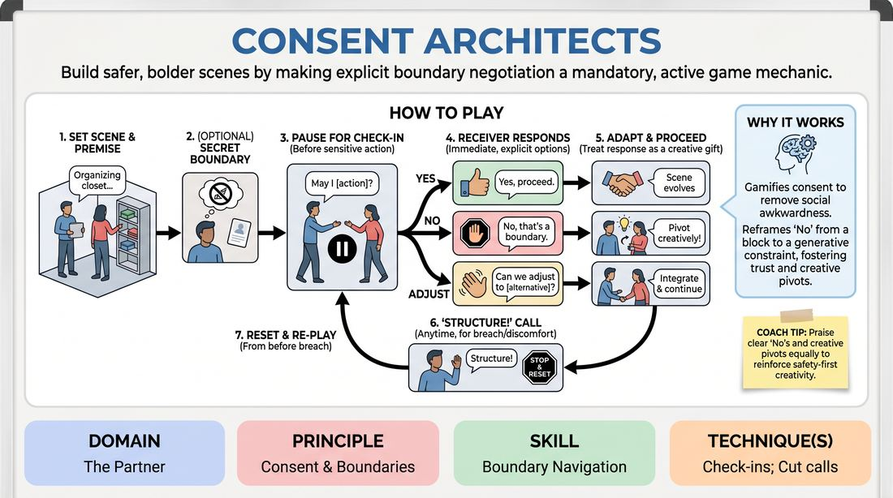{ .cat-game-img loading=lazy }

[Open full game card »](../D2_P1_S6_T1_G043__consent-architects.md){target=_blank rel=noopener}

### Consent Coins

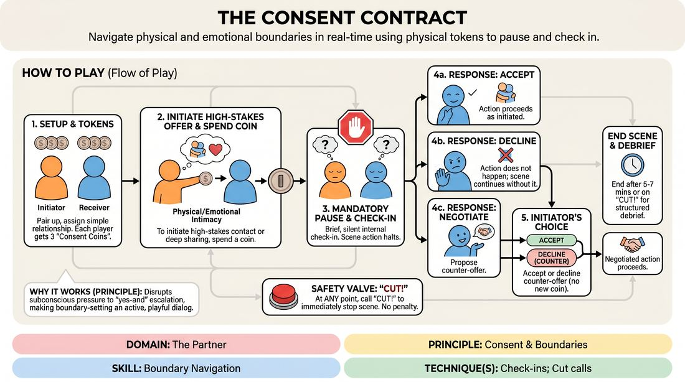{ .cat-game-img loading=lazy }

[Open full game card »](../D2_P1_S6_T1_G162__the-consent-contract.md){target=_blank rel=noopener}

### Consent Currency

{ .cat-game-img loading=lazy }

[Open full game card »](../D2_P1_S6_T1_G029__boundary-braids.md){target=_blank rel=noopener}

### Container Co-Pilots

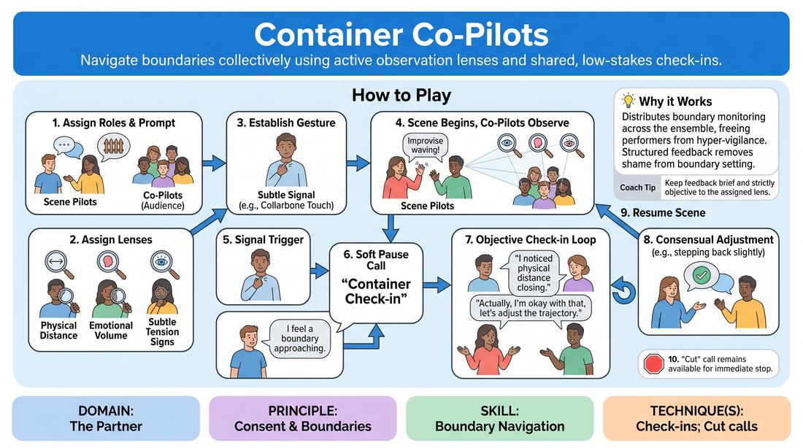{ .cat-game-img loading=lazy }

[Open full game card »](../D2_P1_S6_T1_G370__container-co-pilots.md){target=_blank rel=noopener}

### Dynamic Boundaries

{ .cat-game-img loading=lazy }

[Open full game card »](../D2_P1_S6_T1_G082__the-shifting-sands-of-consent.md){target=_blank rel=noopener}

### Dynamic Calibration

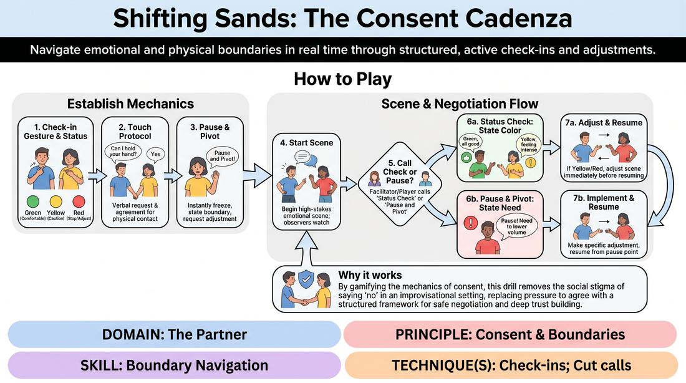{ .cat-game-img loading=lazy }

[Open full game card »](../D2_P1_S6_T1_G097__shifting-sands-the-consent-cadenza.md){target=_blank rel=noopener}

### Harmonic Boundaries

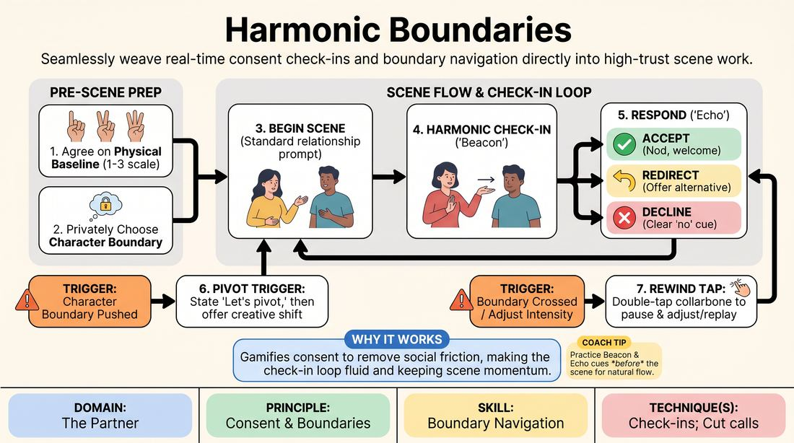{ .cat-game-img loading=lazy }

[Open full game card »](../D2_P1_S6_T1_G572__harmonic-boundaries.md){target=_blank rel=noopener}

### Hidden Thresholds

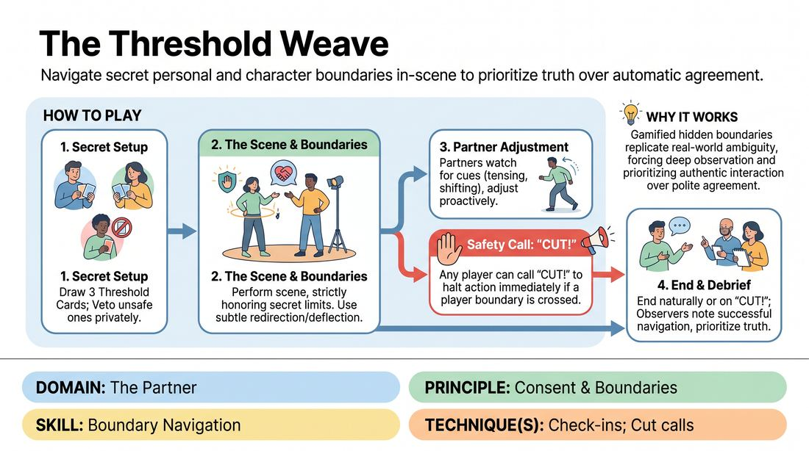{ .cat-game-img loading=lazy }

[Open full game card »](../D2_P1_S6_T1_G236__the-threshold-weave.md){target=_blank rel=noopener}

### Navigated Realities

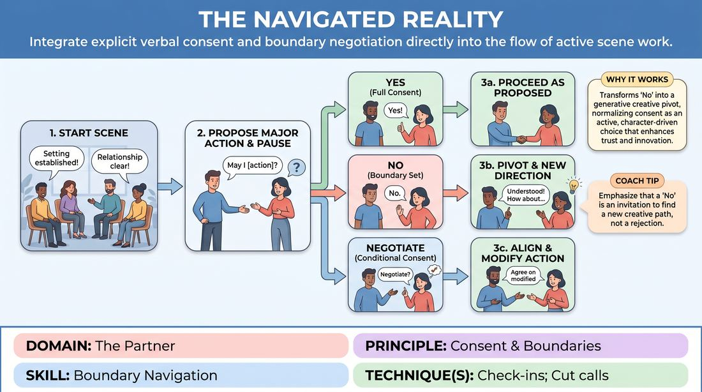{ .cat-game-img loading=lazy }

[Open full game card »](../D2_P1_S6_T1_G215__the-navigated-reality.md){target=_blank rel=noopener}

### Navigating the Grey

{ .cat-game-img loading=lazy }

[Open full game card »](../D2_P1_S6_T1_G490__intent-impact-the-grey-area.md){target=_blank rel=noopener}

### Peer Check-In Allies

{ .cat-game-img loading=lazy }

[Open full game card »](../D2_P1_S6_T1_G898__workshop-buddies.md){target=_blank rel=noopener}

### Relational Blueprint

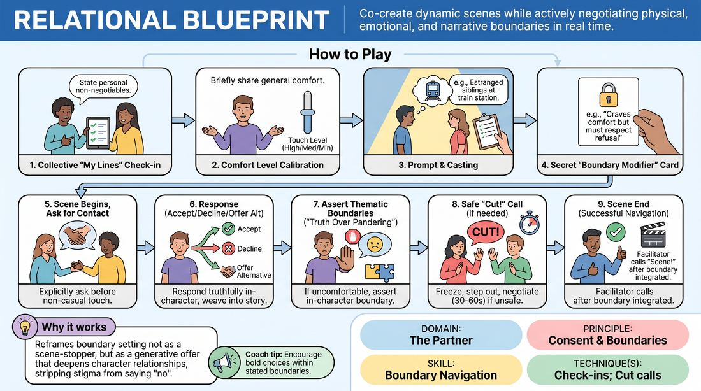{ .cat-game-img loading=lazy }

[Open full game card »](../D2_P1_S6_T1_G009__relational-blueprint.md){target=_blank rel=noopener}

### Resonant Boundaries

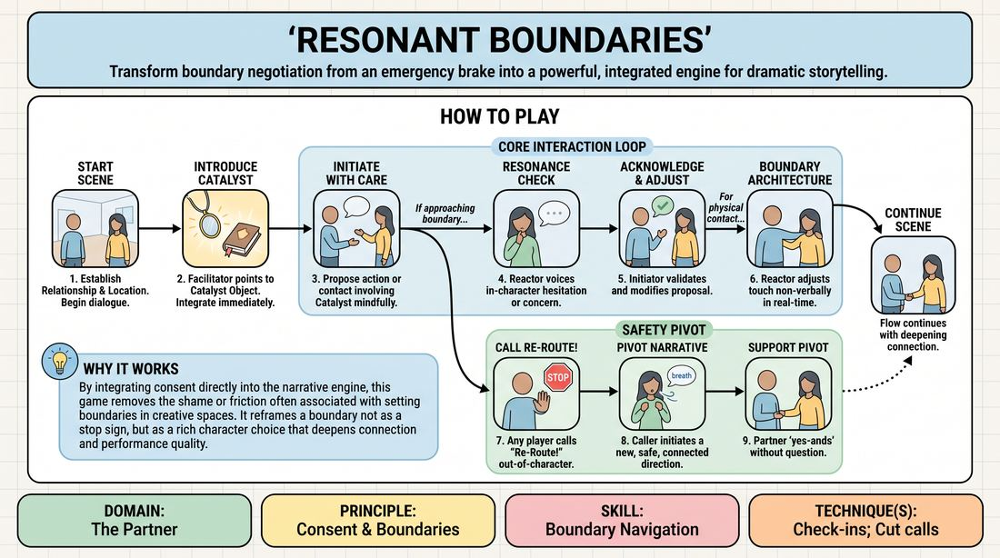{ .cat-game-img loading=lazy }

[Open full game card »](../D2_P1_S6_T1_G613__resonant-boundaries.md){target=_blank rel=noopener}

### Rewind and Reframe

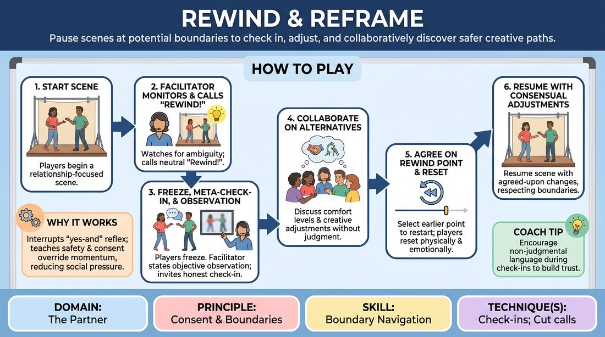{ .cat-game-img loading=lazy }

[Open full game card »](../D2_P1_S6_T1_G421__rewind-reframe.md){target=_blank rel=noopener}

### The Aligned Architects

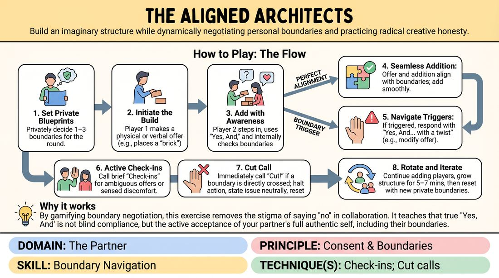{ .cat-game-img loading=lazy }

[Open full game card »](../D2_P1_S6_T1_G427__the-aligned-architects.md){target=_blank rel=noopener}

### The Attunement Chamber

{ .cat-game-img loading=lazy }

[Open full game card »](../D2_P1_S6_T1_G580__the-resonance-chamber.md){target=_blank rel=noopener}

### The Boundary Architect

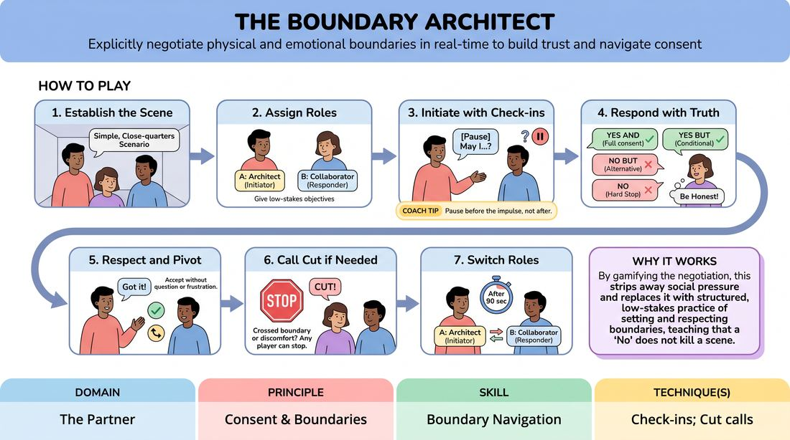{ .cat-game-img loading=lazy }

[Open full game card »](../D2_P1_S6_T1_G454__the-boundary-architect.md){target=_blank rel=noopener}

### The Boundary Barometer

{ .cat-game-img loading=lazy }

[Open full game card »](../D2_P1_S6_T1_G477__resonance-scene-the-boundary-barometer.md){target=_blank rel=noopener}

### The Boundary Compass

{ .cat-game-img loading=lazy }

[Open full game card »](../D2_P1_S6_T1_G148__the-consent-compass.md){target=_blank rel=noopener}

### The Boundary Compass

{ .cat-game-img loading=lazy }

[Open full game card »](../D2_P1_S6_T1_G443__the-consent-navigator.md){target=_blank rel=noopener}

### The Boundary Threshold

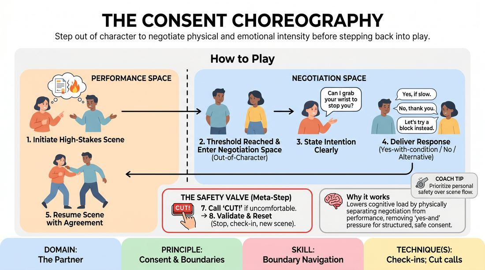{ .cat-game-img loading=lazy }

[Open full game card »](../D2_P1_S6_T1_G434__the-consent-choreography.md){target=_blank rel=noopener}

### The Boundary Threshold

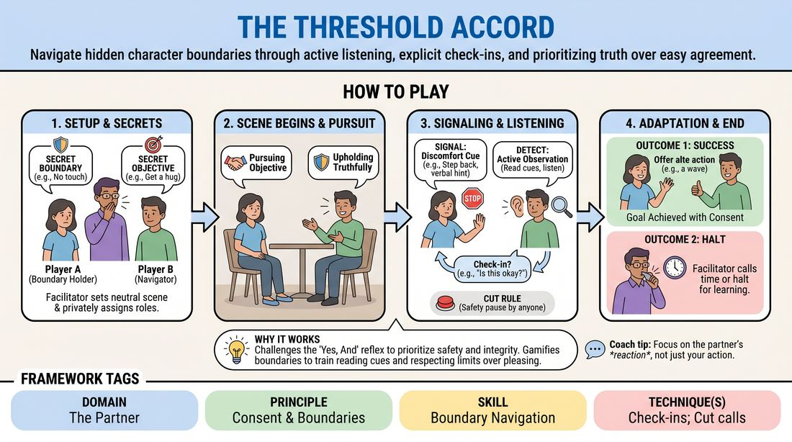{ .cat-game-img loading=lazy }

[Open full game card »](../D2_P1_S6_T1_G606__the-threshold-accord.md){target=_blank rel=noopener}

### The Comfort Curve

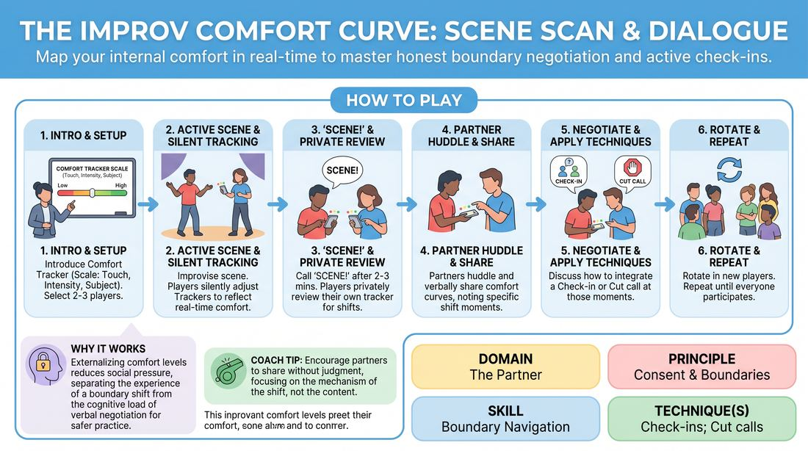{ .cat-game-img loading=lazy }

[Open full game card »](../D2_P1_S6_T1_G589__the-improv-comfort-curve-scene-scan-dialogue.md){target=_blank rel=noopener}

### The Consent Canvas

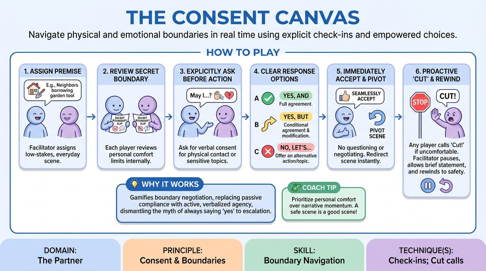{ .cat-game-img loading=lazy }

[Open full game card »](../D2_P1_S6_T1_G344__the-consent-canvas.md){target=_blank rel=noopener}

### The Consent Canvas

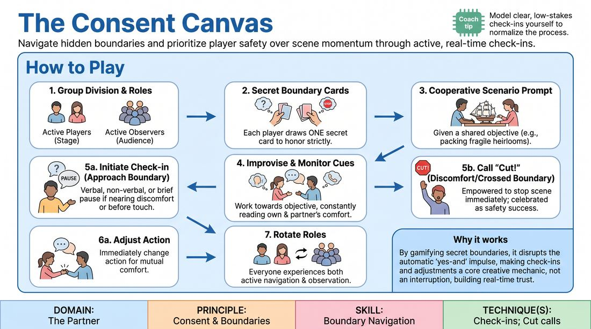{ .cat-game-img loading=lazy }

[Open full game card »](../D2_P1_S6_T1_G548__the-consent-canvas.md){target=_blank rel=noopener}

### The Consent Compass

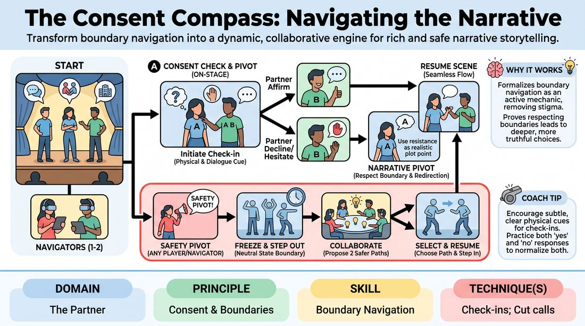{ .cat-game-img loading=lazy }

[Open full game card »](../D2_P1_S6_T1_G113__the-consent-compass-navigating-the-narrative.md){target=_blank rel=noopener}

### The Consent Compass

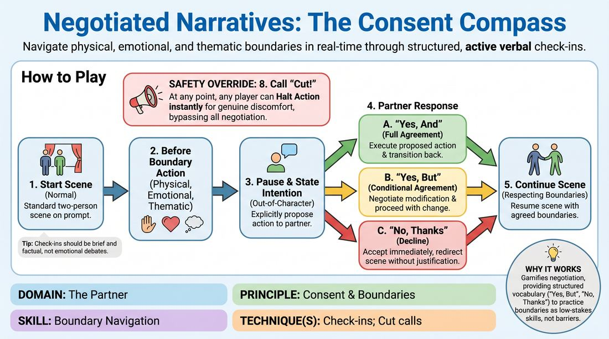{ .cat-game-img loading=lazy }

[Open full game card »](../D2_P1_S6_T1_G363__negotiated-narratives-the-consent-compass.md){target=_blank rel=noopener}

### The Consent Compass

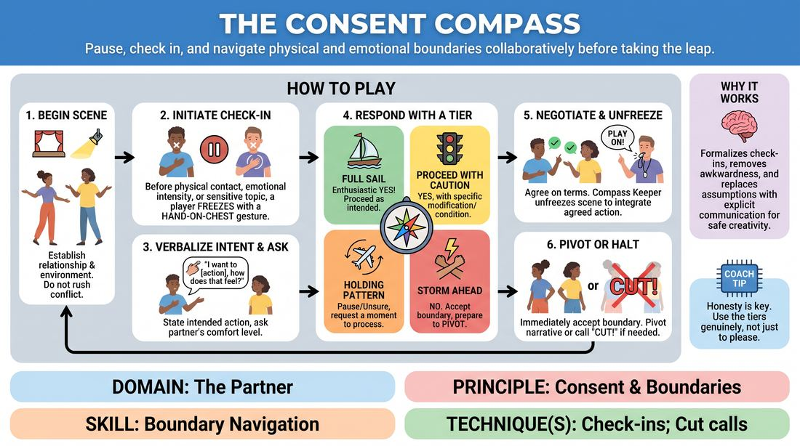{ .cat-game-img loading=lazy }

[Open full game card »](../D2_P1_S6_T1_G463__the-consent-compass.md){target=_blank rel=noopener}

### The Consent Compass

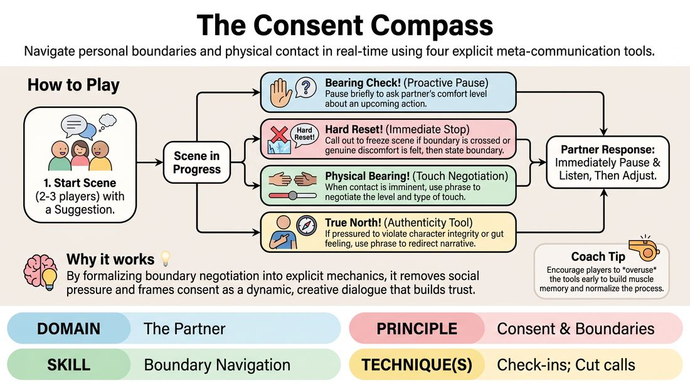{ .cat-game-img loading=lazy }

[Open full game card »](../D2_P1_S6_T1_G594__the-consent-compass.md){target=_blank rel=noopener}

### The Consent Crucible

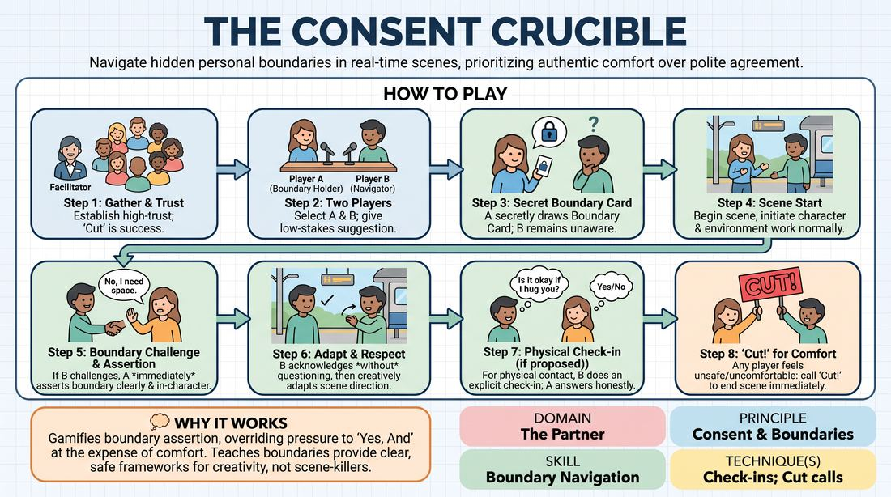{ .cat-game-img loading=lazy }

[Open full game card »](../D2_P1_S6_T1_G604__the-consent-crucible.md){target=_blank rel=noopener}

### The Consent Current

{ .cat-game-img loading=lazy }

[Open full game card »](../D2_P1_S6_T1_G173__threshold-play-the-consent-current.md){target=_blank rel=noopener}

### The Consent Navigator

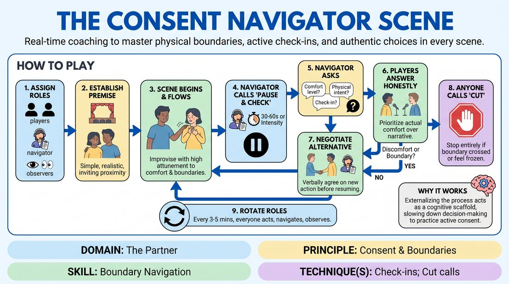{ .cat-game-img loading=lazy }

[Open full game card »](../D2_P1_S6_T1_G184__the-consent-navigator-scene.md){target=_blank rel=noopener}

### The Consent Prism

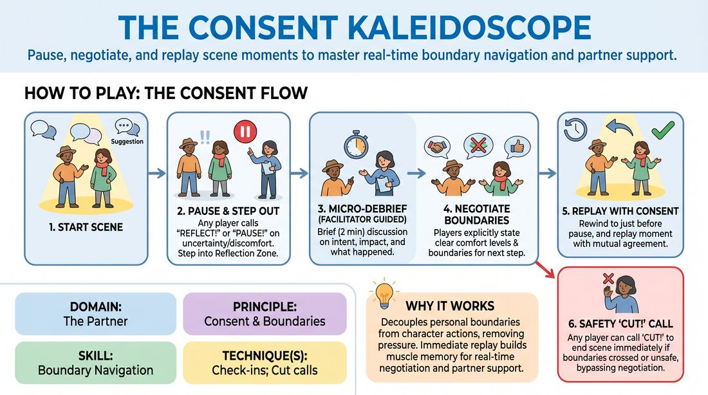{ .cat-game-img loading=lazy }

[Open full game card »](../D2_P1_S6_T1_G091__the-consent-kaleidoscope.md){target=_blank rel=noopener}

### The Consent Stone

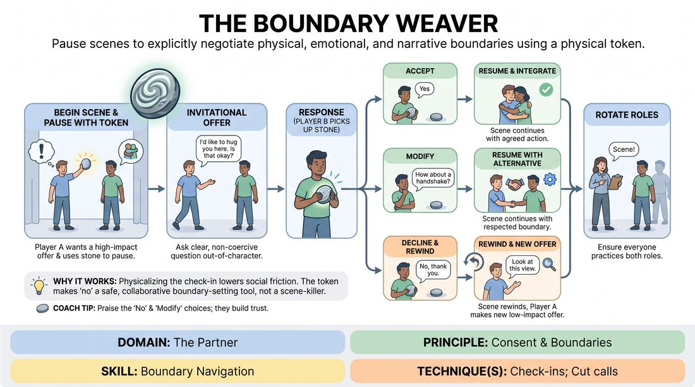{ .cat-game-img loading=lazy }

[Open full game card »](../D2_P1_S6_T1_G238__the-boundary-weaver.md){target=_blank rel=noopener}

### The Consent Weave

{ .cat-game-img loading=lazy }

[Open full game card »](../D2_P1_S6_T1_G276__the-consent-weave.md){target=_blank rel=noopener}

### The Invisible Blueprint

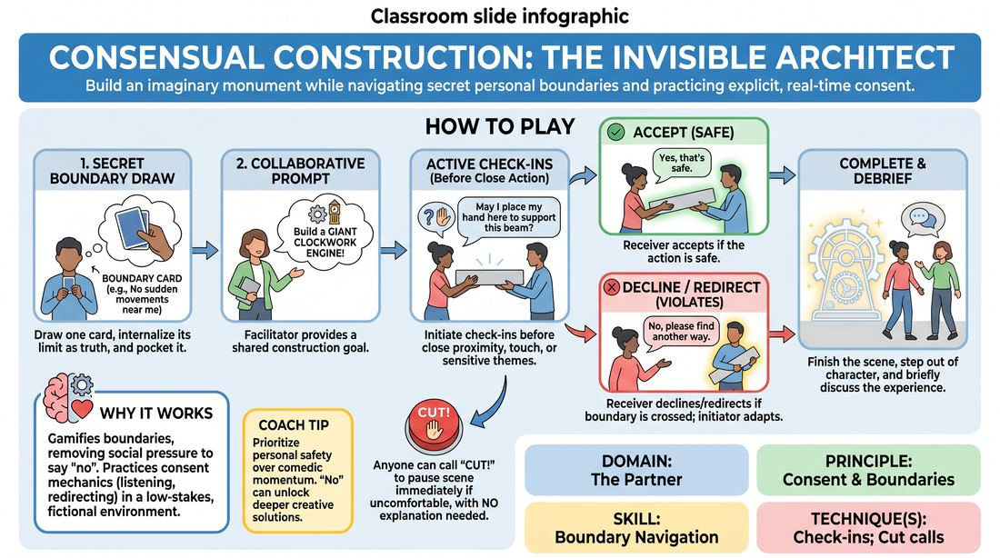{ .cat-game-img loading=lazy }

[Open full game card »](../D2_P1_S6_T1_G174__consensual-construction-the-invisible-architect.md){target=_blank rel=noopener}

### The Living Agreement

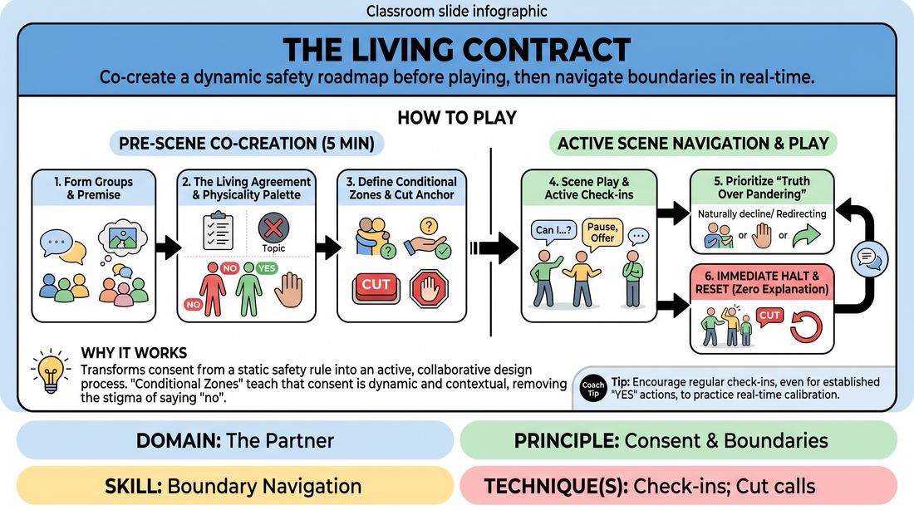{ .cat-game-img loading=lazy }

[Open full game card »](../D2_P1_S6_T1_G143__the-living-contract.md){target=_blank rel=noopener}

### The Negotiated Scene

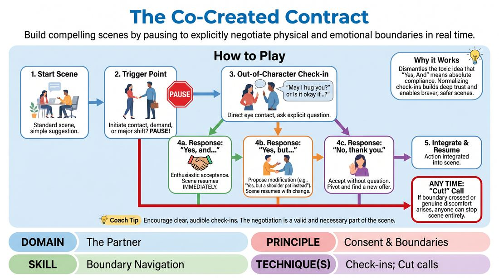{ .cat-game-img loading=lazy }

[Open full game card »](../D2_P1_S6_T1_G070__the-co-created-contract.md){target=_blank rel=noopener}

### The Negotiation Canvas

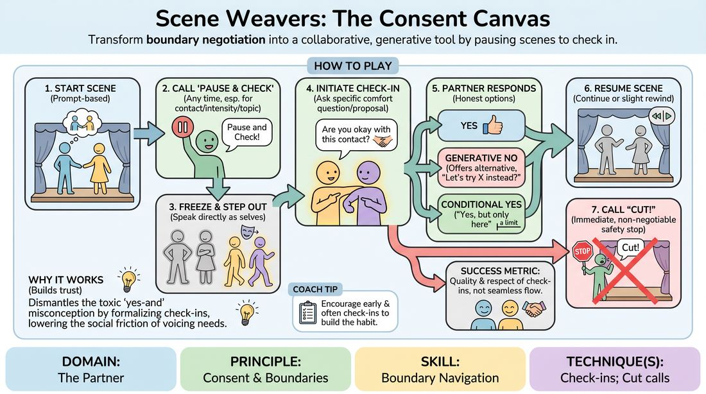{ .cat-game-img loading=lazy }

[Open full game card »](../D2_P1_S6_T1_G323__scene-weavers-the-consent-canvas.md){target=_blank rel=noopener}

### The Resonance Chamber

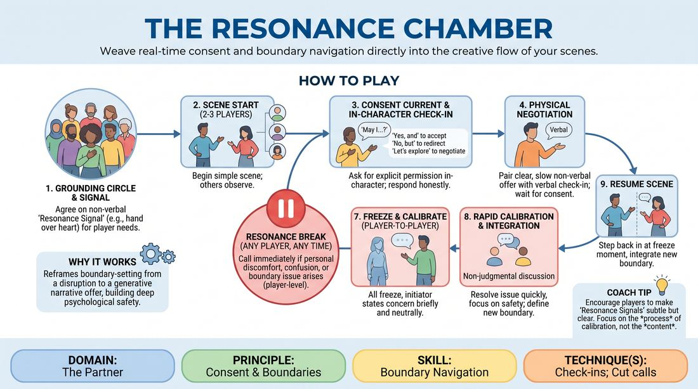{ .cat-game-img loading=lazy }

[Open full game card »](../D2_P1_S6_T1_G396__the-resonance-chamber.md){target=_blank rel=noopener}

### The Resonance Weave

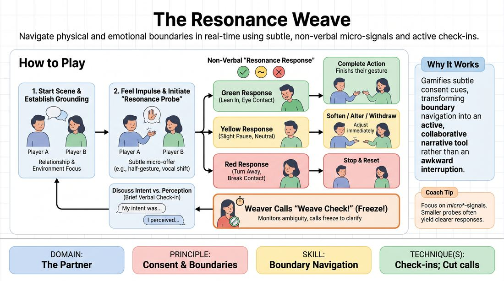{ .cat-game-img loading=lazy }

[Open full game card »](../D2_P1_S6_T1_G564__the-resonance-weave.md){target=_blank rel=noopener}

### The Ripple Signal

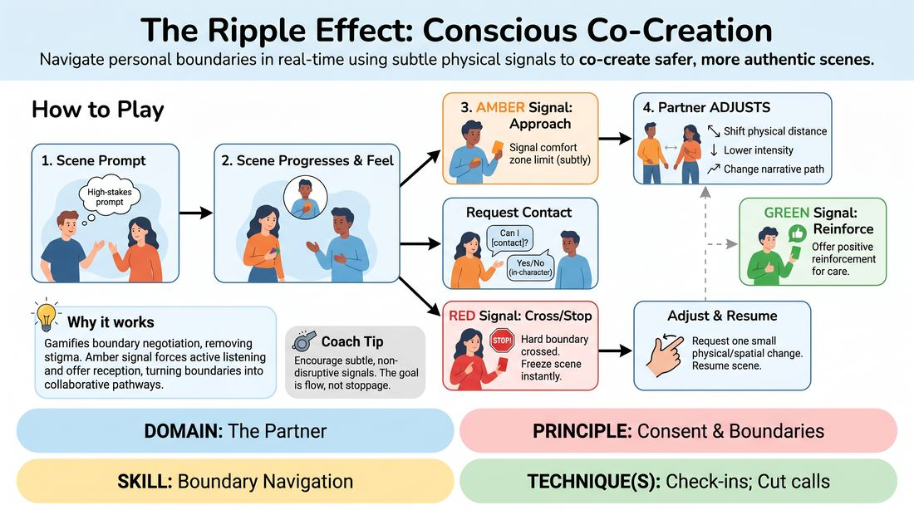{ .cat-game-img loading=lazy }

[Open full game card »](../D2_P1_S6_T1_G193__the-ripple-effect-conscious-co-creation.md){target=_blank rel=noopener}

### The Scene Treaty

{ .cat-game-img loading=lazy }

[Open full game card »](../D2_P1_S6_T1_G591__the-co-creation-contract.md){target=_blank rel=noopener}

### The Truth Check-In

{ .cat-game-img loading=lazy }

[Open full game card »](../D2_P1_S6_T1_G611__the-authenticity-test.md){target=_blank rel=noopener}

### The Unfolding Accord

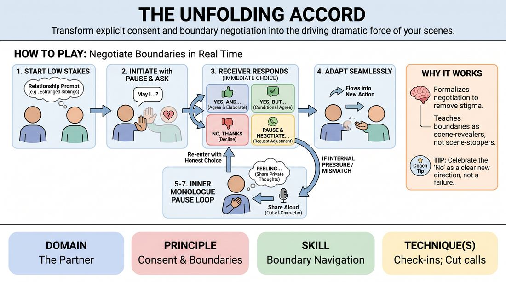{ .cat-game-img loading=lazy }

[Open full game card »](../D2_P1_S6_T1_G521__the-unfolding-accord.md){target=_blank rel=noopener}

### Threshold Navigation

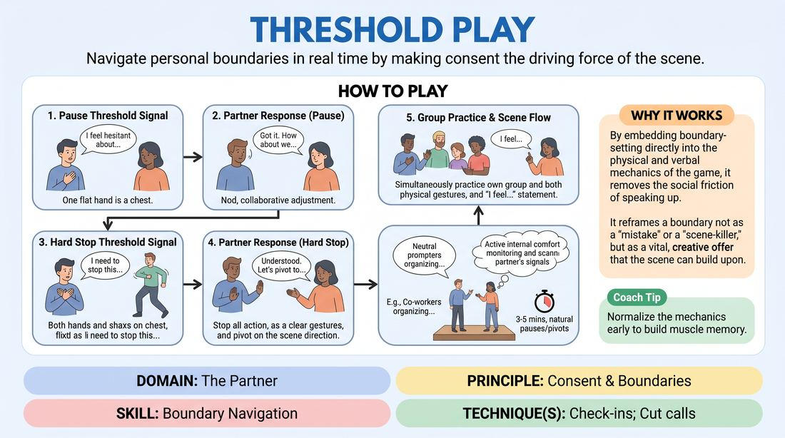{ .cat-game-img loading=lazy }

[Open full game card »](../D2_P1_S6_T1_G041__threshold-play.md){target=_blank rel=noopener}

## Cut calls

### Boundary Canvas

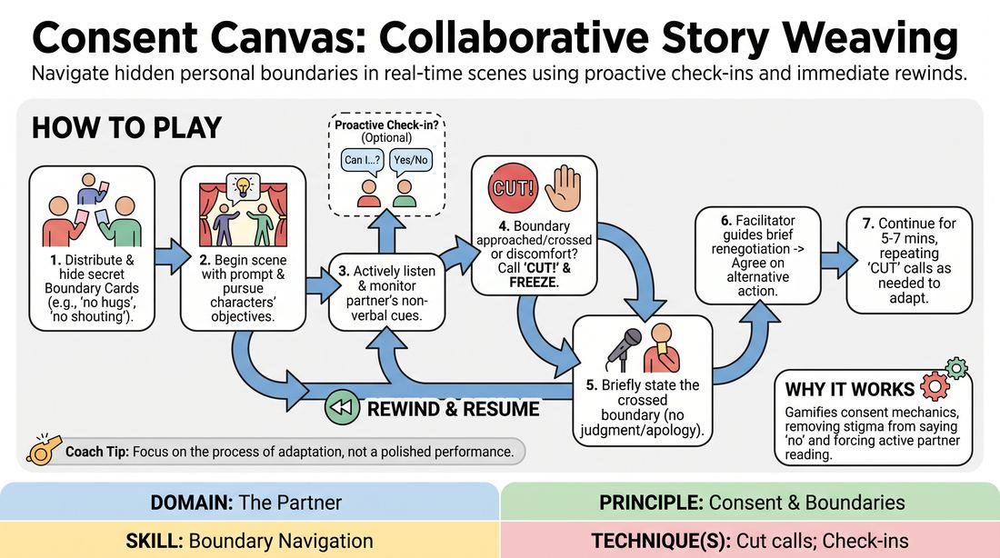{ .cat-game-img loading=lazy }

[Open full game card »](../D2_P1_S6_T2_G015__consent-canvas-collaborative-story-weaving.md){target=_blank rel=noopener}

### Boundary Compass

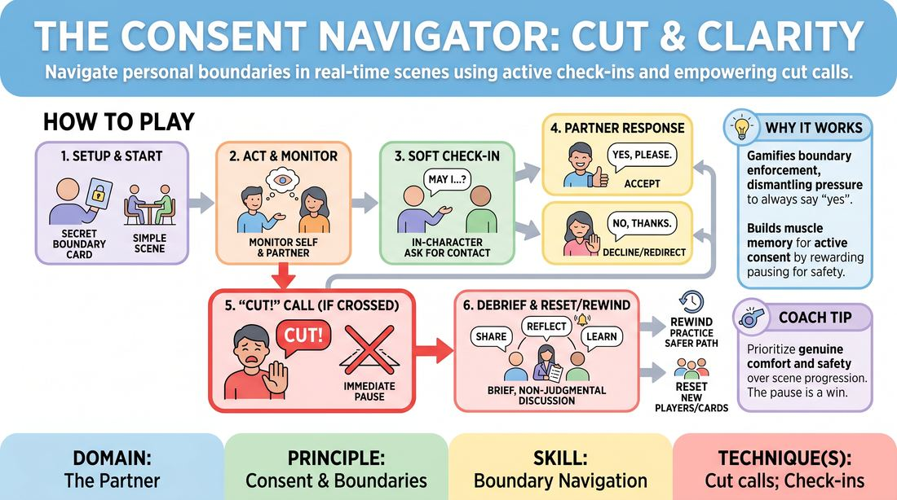{ .cat-game-img loading=lazy }

[Open full game card »](../D2_P1_S6_T2_G199__the-consent-navigator-cut-clarity.md){target=_blank rel=noopener}

### Boundary Crossroads

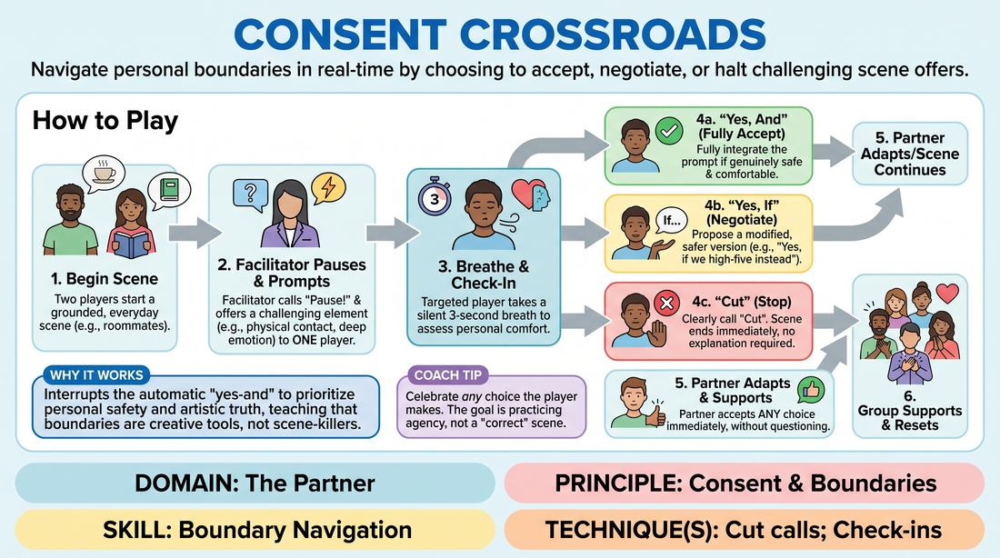{ .cat-game-img loading=lazy }

[Open full game card »](../D2_P1_S6_T2_G265__consent-crossroads.md){target=_blank rel=noopener}

### Boundary Unpack

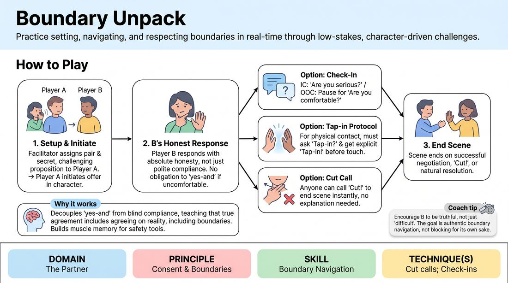{ .cat-game-img loading=lazy }

[Open full game card »](../D2_P1_S6_T2_G388__boundary-unpack.md){target=_blank rel=noopener}

### Echoes of Accord

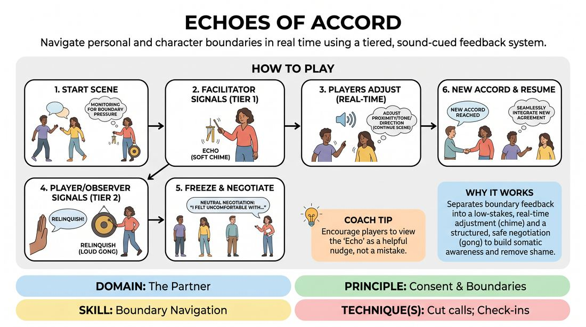{ .cat-game-img loading=lazy }

[Open full game card »](../D2_P1_S6_T2_G405__echoes-of-accord.md){target=_blank rel=noopener}

### Intentional Intersections

{ .cat-game-img loading=lazy }

[Open full game card »](../D2_P1_S6_T2_G120__the-intent-imbroglio.md){target=_blank rel=noopener}

### Pause and Pivot

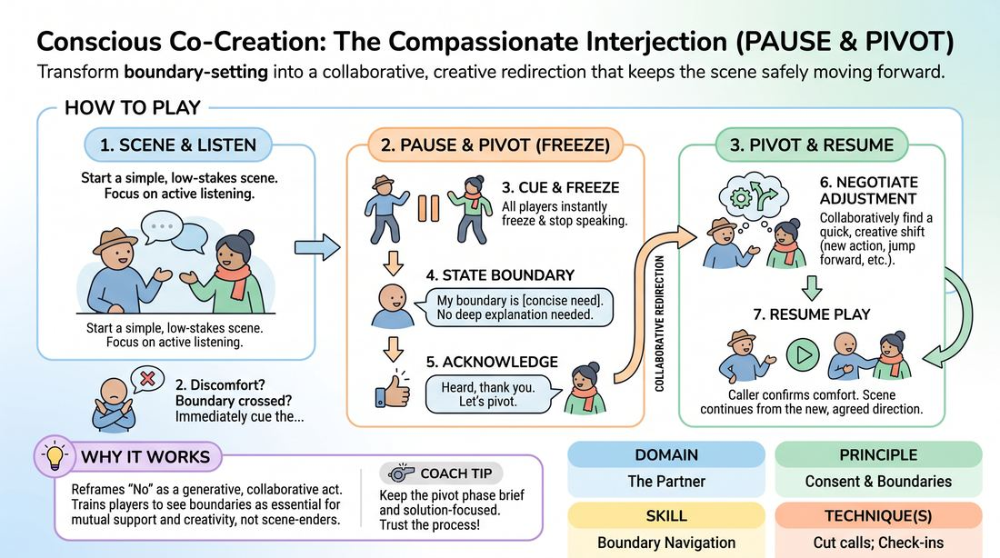{ .cat-game-img loading=lazy }

[Open full game card »](../D2_P1_S6_T2_G307__conscious-co-creation-the-compassionate-interjection-pause-p.md){target=_blank rel=noopener}

### Safety Net Scenarios

{ .cat-game-img loading=lazy }

[Open full game card »](../D2_P1_S6_T2_G305__the-safetynet-scenarios.md){target=_blank rel=noopener}

### The Boundary Crucible

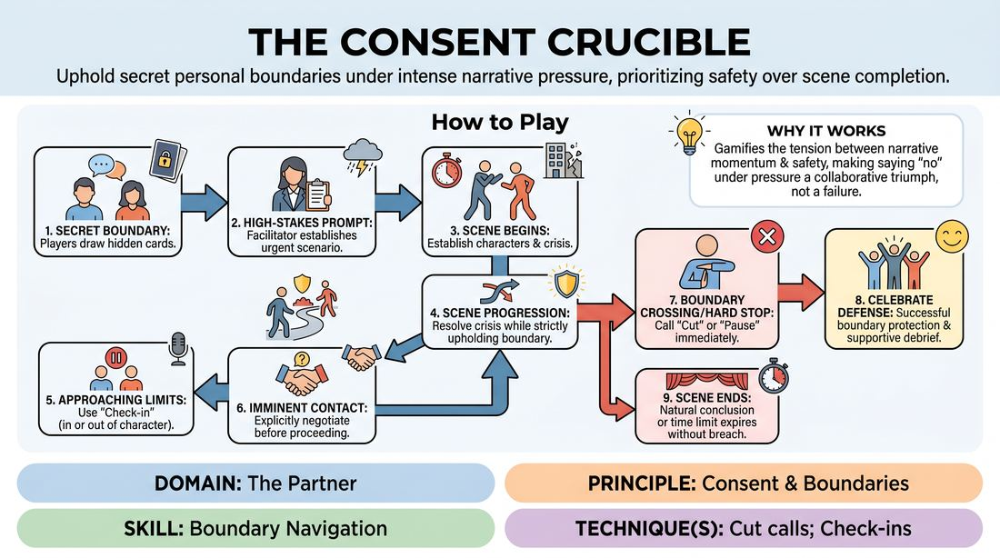{ .cat-game-img loading=lazy }

[Open full game card »](../D2_P1_S6_T2_G568__the-consent-crucible.md){target=_blank rel=noopener}

### The Boundary Dance

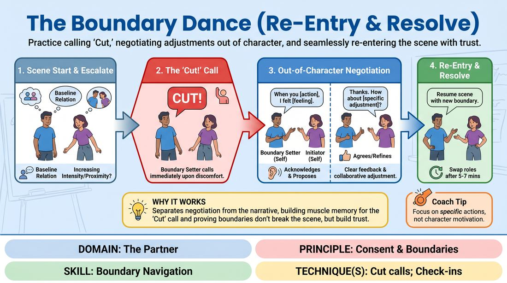{ .cat-game-img loading=lazy }

[Open full game card »](../D2_P1_S6_T2_G059__the-boundary-dance-re-entry-resolve.md){target=_blank rel=noopener}

### The Boundary Lab

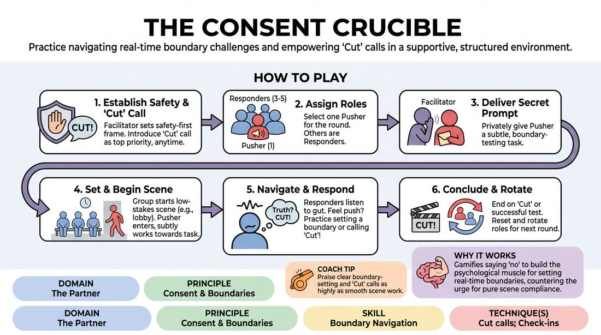{ .cat-game-img loading=lazy }

[Open full game card »](../D2_P1_S6_T2_G607__the-consent-crucible.md){target=_blank rel=noopener}

### The Calibration Scene

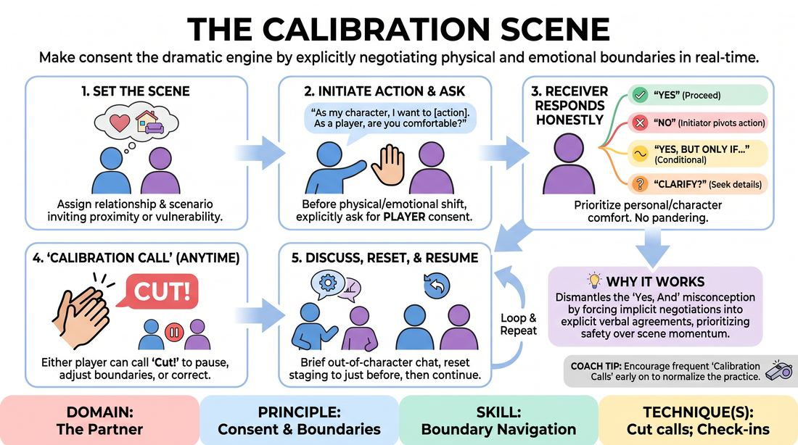{ .cat-game-img loading=lazy }

[Open full game card »](../D2_P1_S6_T2_G001__the-calibration-scene.md){target=_blank rel=noopener}

### The Consent Replay

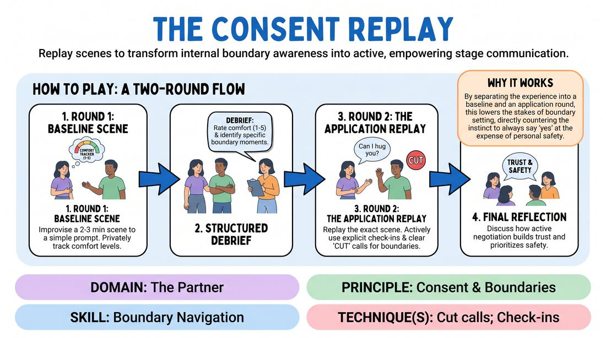{ .cat-game-img loading=lazy }

[Open full game card »](../D2_P1_S6_T2_G498__the-consent-replay.md){target=_blank rel=noopener}

### The Mindful Replay

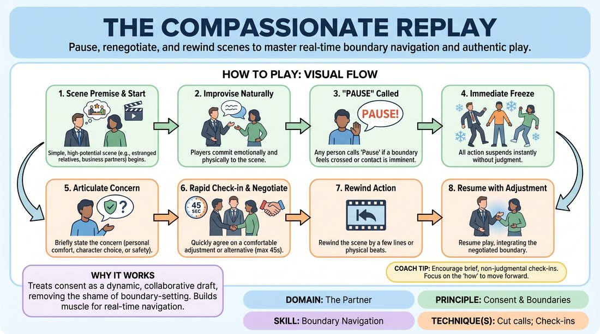{ .cat-game-img loading=lazy }

[Open full game card »](../D2_P1_S6_T2_G351__the-compassionate-replay.md){target=_blank rel=noopener}

### The Mindful Scene Container

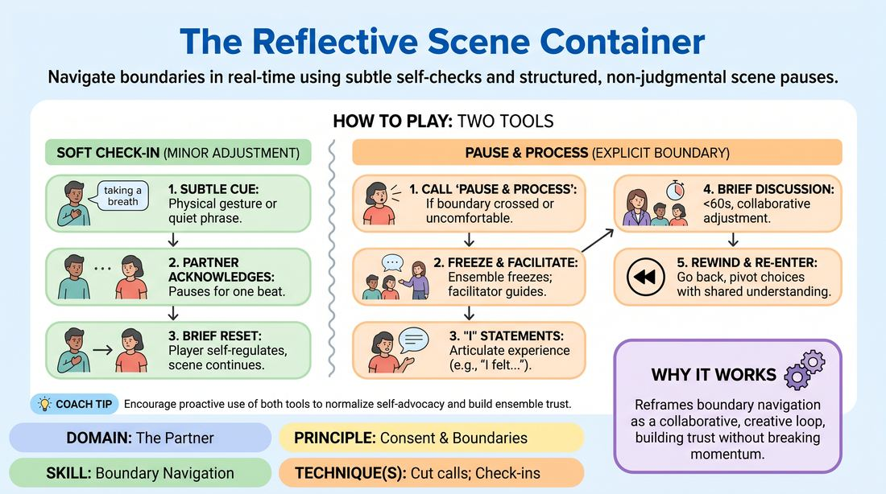{ .cat-game-img loading=lazy }

[Open full game card »](../D2_P1_S6_T2_G134__the-reflective-scene-container.md){target=_blank rel=noopener}

### The Rewind Re-Route

{ .cat-game-img loading=lazy }

[Open full game card »](../D2_P1_S6_T2_G088__the-re-direct-rewind.md){target=_blank rel=noopener}

### The Silent Line

{ .cat-game-img loading=lazy }

[Open full game card »](../D2_P1_S6_T2_G615__threshold-weaver.md){target=_blank rel=noopener}

### The Trigger Protocol

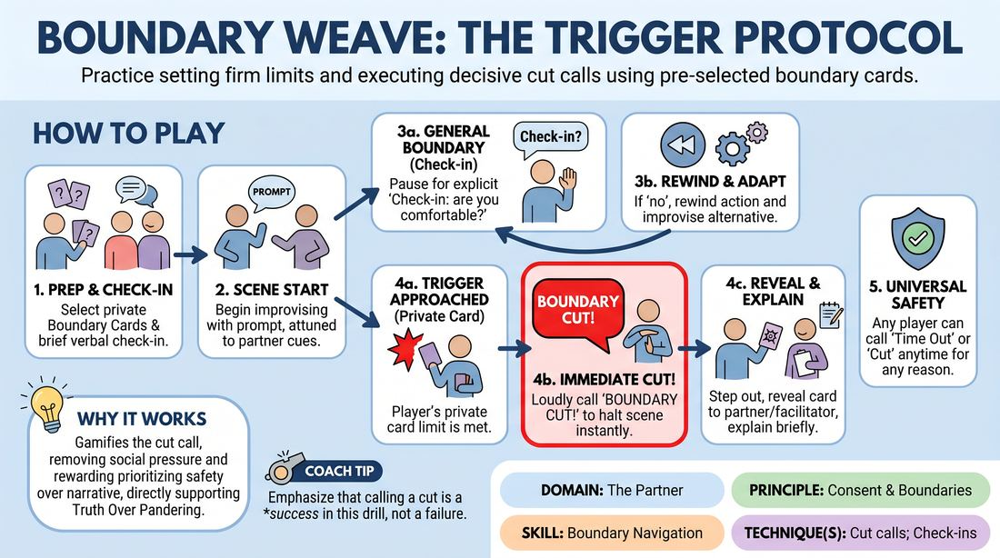{ .cat-game-img loading=lazy }

[Open full game card »](../D2_P1_S6_T2_G552__boundary-weave-the-trigger-protocol.md){target=_blank rel=noopener}

### The Unseen Threads

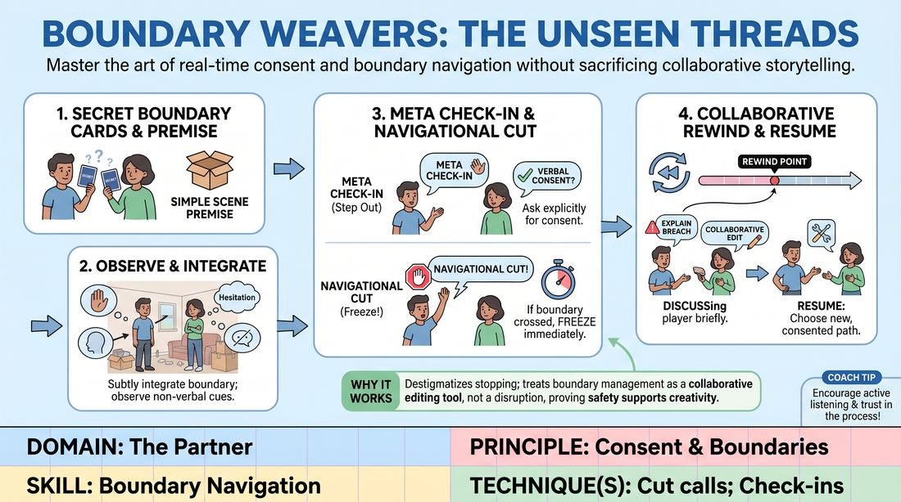{ .cat-game-img loading=lazy }

[Open full game card »](../D2_P1_S6_T2_G050__boundary-weavers-the-unseen-threads.md){target=_blank rel=noopener}

### Threshold and Response

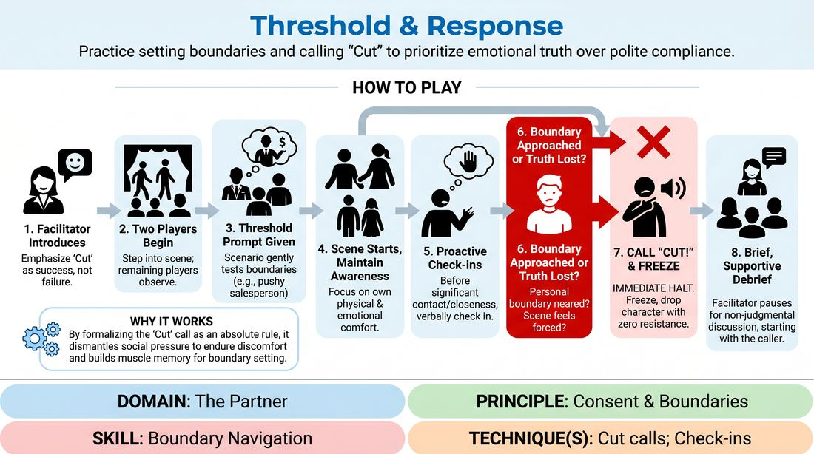{ .cat-game-img loading=lazy }

[Open full game card »](../D2_P1_S6_T2_G507__threshold-response.md){target=_blank rel=noopener}

## Negotiating physical contact

### Boundary Ballet

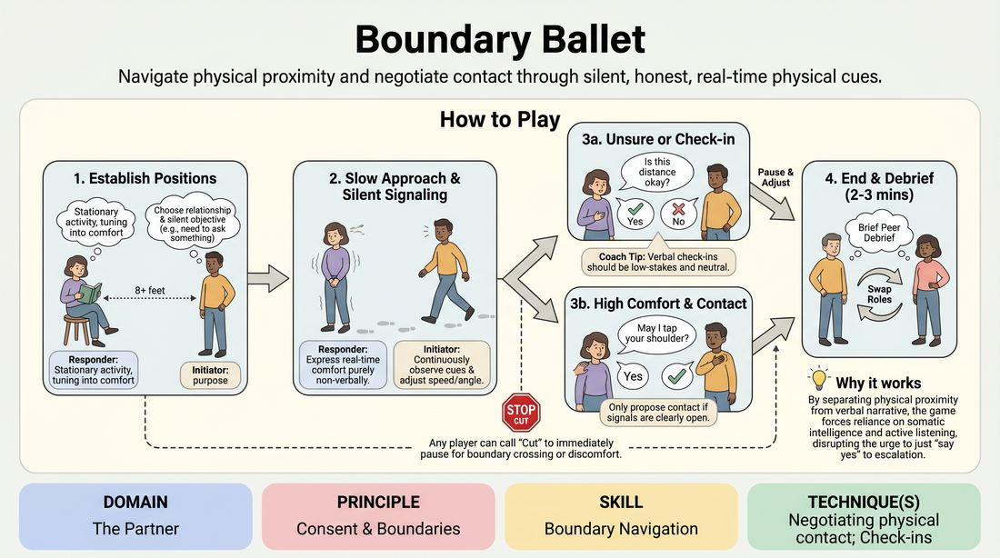{ .cat-game-img loading=lazy }

[Open full game card »](../D2_P1_S6_T3_G468__boundary-ballet.md){target=_blank rel=noopener}

### Boundary Co-Pilot

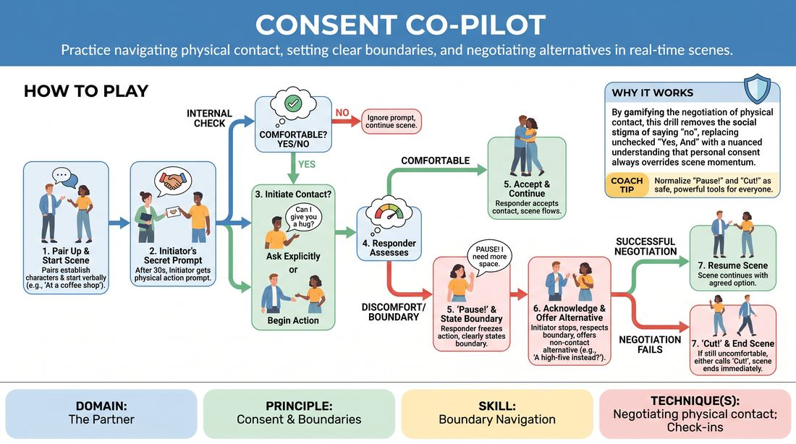{ .cat-game-img loading=lazy }

[Open full game card »](../D2_P1_S6_T3_G279__consent-co-pilot.md){target=_blank rel=noopener}

### Bridges and Boundaries

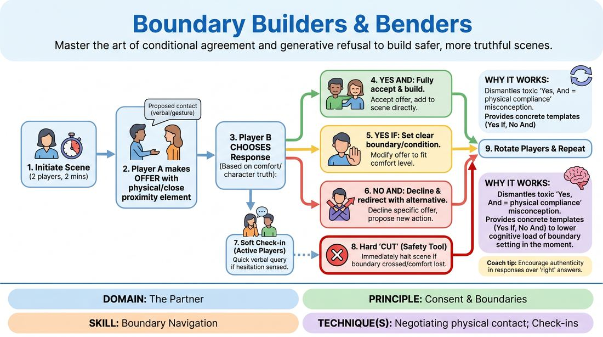{ .cat-game-img loading=lazy }

[Open full game card »](../D2_P1_S6_T3_G153__boundary-builders-benders.md){target=_blank rel=noopener}

### Invitation Engine

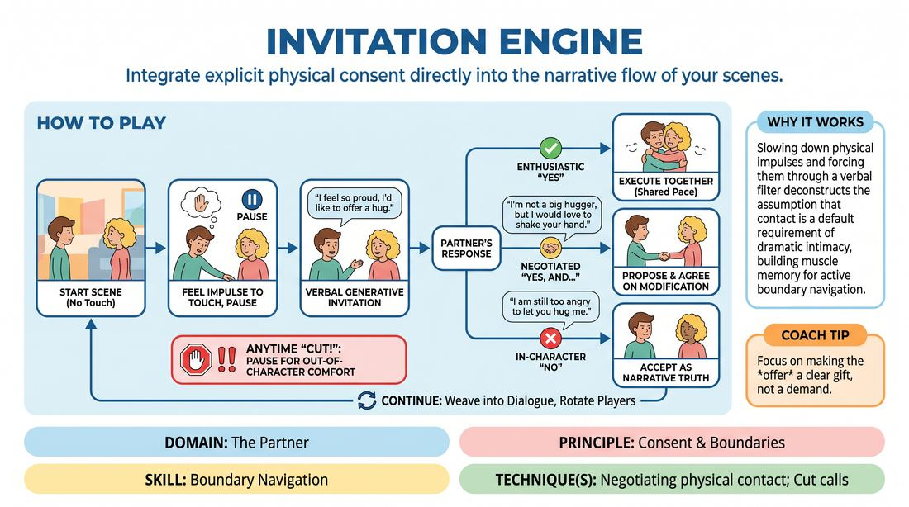{ .cat-game-img loading=lazy }

[Open full game card »](../D2_P1_S6_T3_G293__invitation-engine.md){target=_blank rel=noopener}

### The Agreement Blueprint

{ .cat-game-img loading=lazy }

[Open full game card »](../D2_P1_S6_T3_G575__interaction-blueprint-the-art-of-explicit-agreement.md){target=_blank rel=noopener}

### The Boundary Bazaar

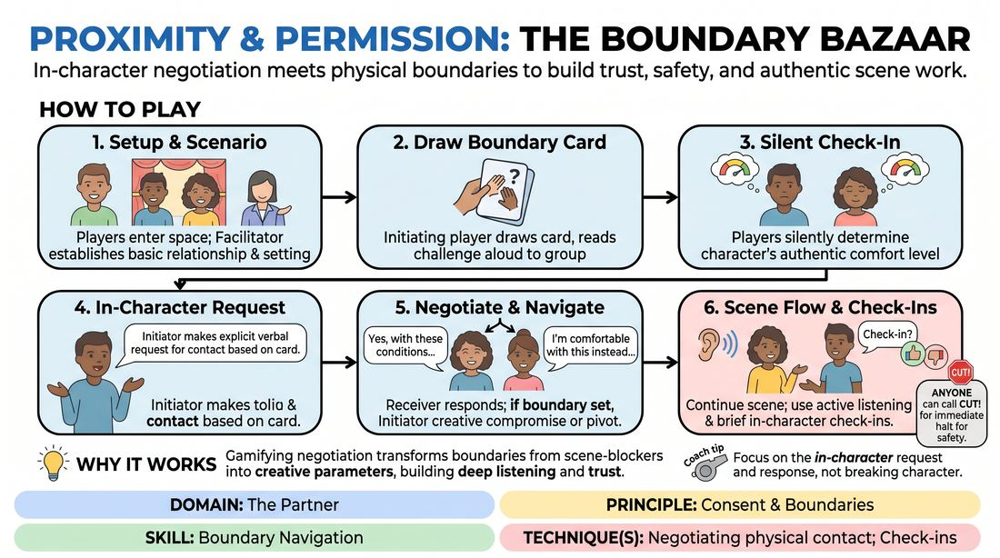{ .cat-game-img loading=lazy }

[Open full game card »](../D2_P1_S6_T3_G538__proximity-permission-the-boundary-bazaar.md){target=_blank rel=noopener}

### The Boundary Canvas

{ .cat-game-img loading=lazy }

[Open full game card »](../D2_P1_S6_T3_G414__the-consent-canvas.md){target=_blank rel=noopener}

### The Boundary Compass

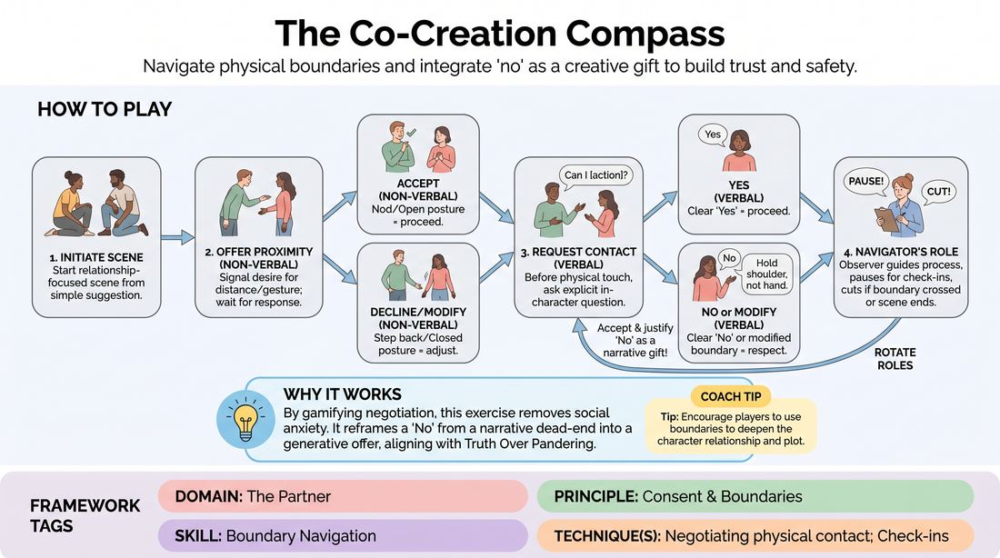{ .cat-game-img loading=lazy }

[Open full game card »](../D2_P1_S6_T3_G583__the-co-creation-compass.md){target=_blank rel=noopener}

### The Co-Authored Journey

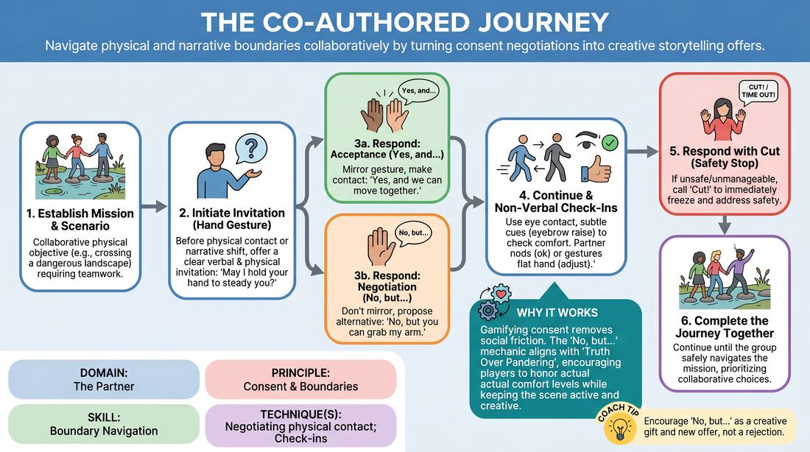{ .cat-game-img loading=lazy }

[Open full game card »](../D2_P1_S6_T3_G449__the-co-authored-journey.md){target=_blank rel=noopener}

### The Consent Compass

{ .cat-game-img loading=lazy }

[Open full game card »](../D2_P1_S6_T3_G286__consent-co-pilot.md){target=_blank rel=noopener}

### The Consent Connection

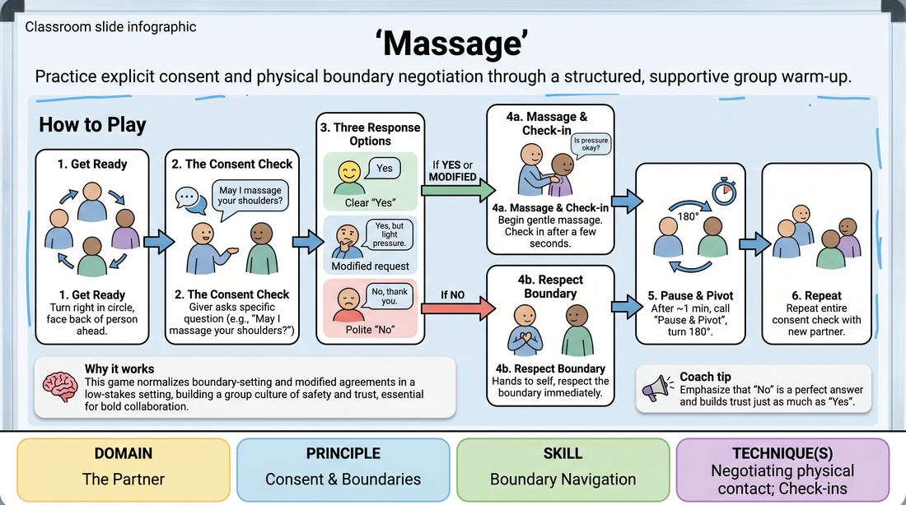{ .cat-game-img loading=lazy }

[Open full game card »](../D2_P1_S6_T3_G1174__massage.md){target=_blank rel=noopener}

### The Contact Compass

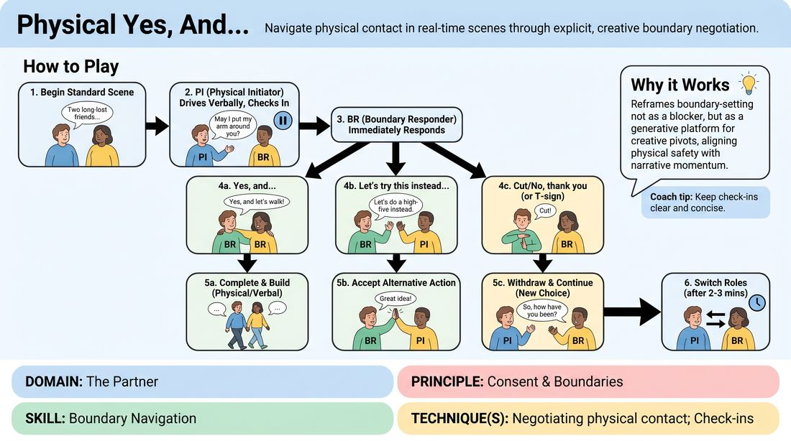{ .cat-game-img loading=lazy }

[Open full game card »](../D2_P1_S6_T3_G253__physical-yes-and.md){target=_blank rel=noopener}

### The Invisible Choreographer

{ .cat-game-img loading=lazy }

[Open full game card »](../D2_P1_S6_T3_G333__the-invisible-choreographer.md){target=_blank rel=noopener}

### The Invisible Labyrinth

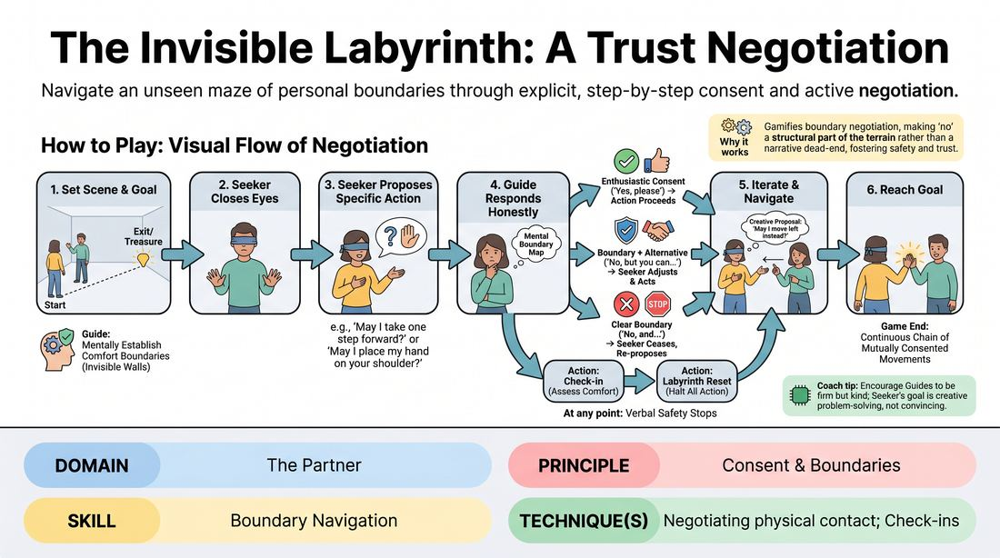{ .cat-game-img loading=lazy }

[Open full game card »](../D2_P1_S6_T3_G359__the-invisible-labyrinth-a-trust-negotiation.md){target=_blank rel=noopener}

### The Mindful Knot

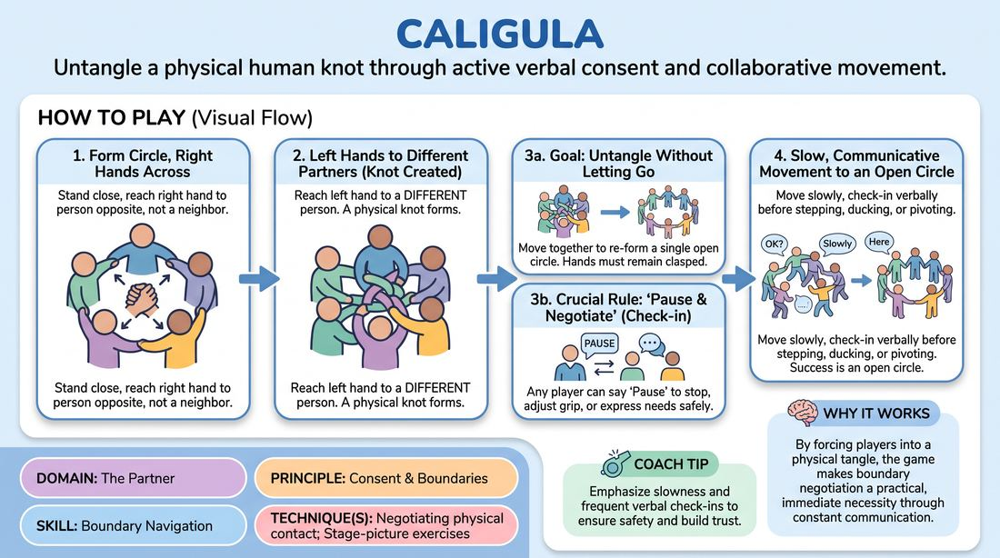{ .cat-game-img loading=lazy }

[Open full game card »](../D2_P1_S6_T3_G649__caligula.md){target=_blank rel=noopener}

### The Negotiated Passage

{ .cat-game-img loading=lazy }

[Open full game card »](../D2_P1_S6_T3_G515__the-negotiated-passage.md){target=_blank rel=noopener}

### The Physical Agreement Drill

{ .cat-game-img loading=lazy }

[Open full game card »](../D2_P1_S6_T3_G602__the-consent-choreography-technical-drill.md){target=_blank rel=noopener}

### The Proximity Protocol

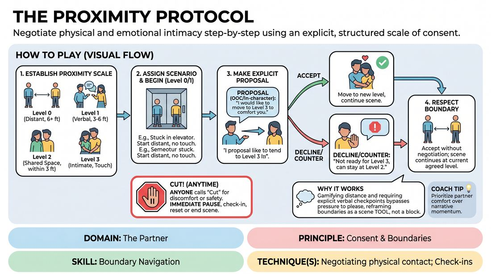{ .cat-game-img loading=lazy }

[Open full game card »](../D2_P1_S6_T3_G218__the-proximity-protocol.md){target=_blank rel=noopener}

### The Shared Blueprint

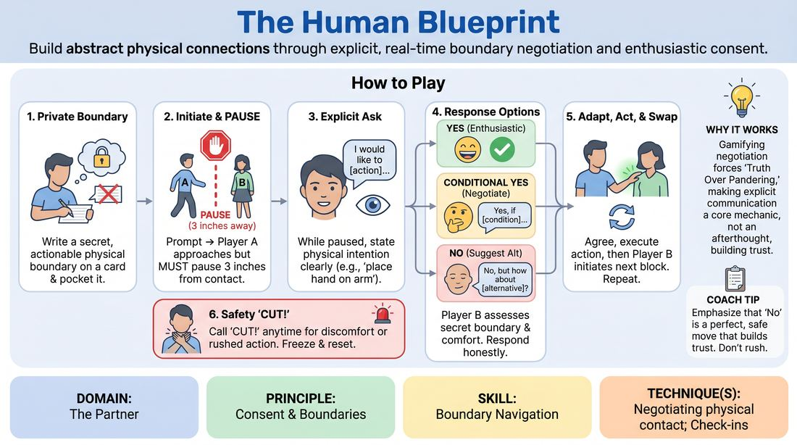{ .cat-game-img loading=lazy }

[Open full game card »](../D2_P1_S6_T3_G027__the-human-blueprint.md){target=_blank rel=noopener}

### The Touch Protocol

{ .cat-game-img loading=lazy }

[Open full game card »](../D2_P1_S6_T3_G531__scene-weaver-s-protocol.md){target=_blank rel=noopener}

### The Touchstone Scene

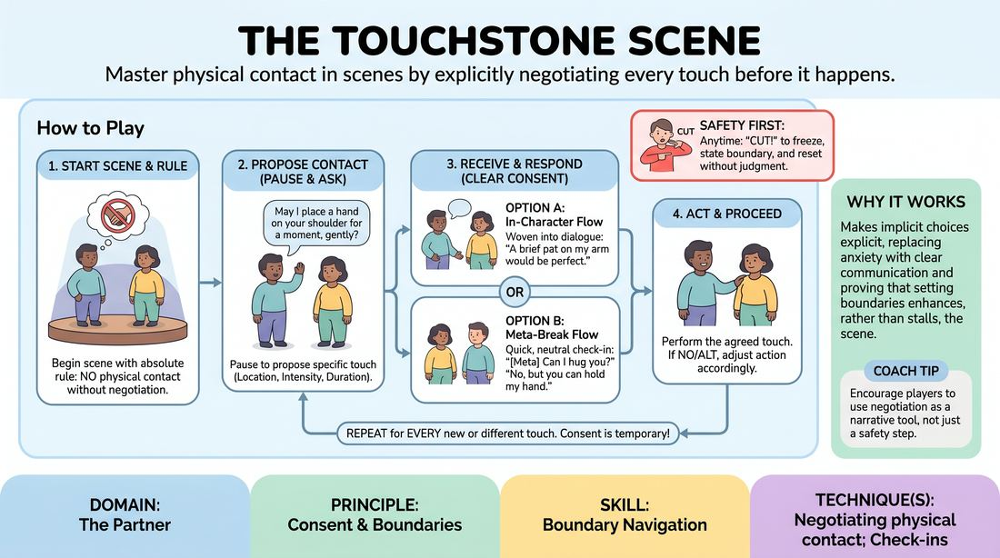{ .cat-game-img loading=lazy }

[Open full game card »](../D2_P1_S6_T3_G488__the-touchstone-scene.md){target=_blank rel=noopener}

### Threshold Negotiators

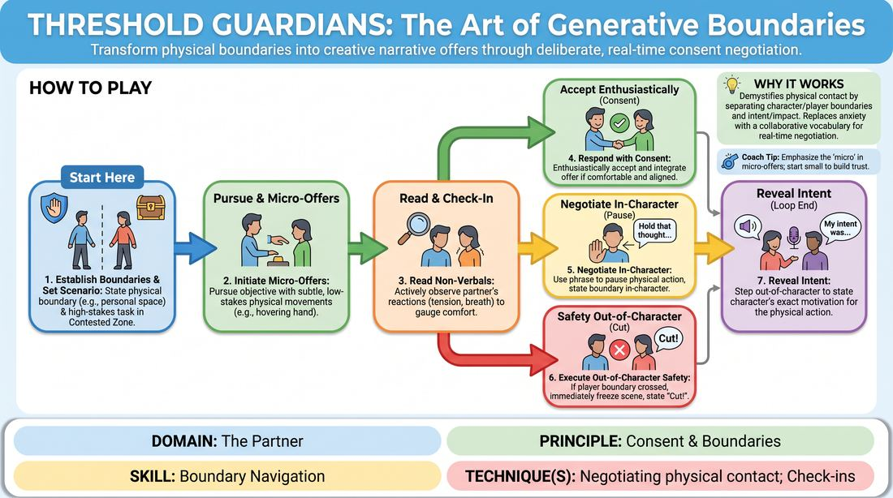{ .cat-game-img loading=lazy }

[Open full game card »](../D2_P1_S6_T3_G320__threshold-guardians-the-art-of-generative-boundaries.md){target=_blank rel=noopener}

### Threshold and Touchstone

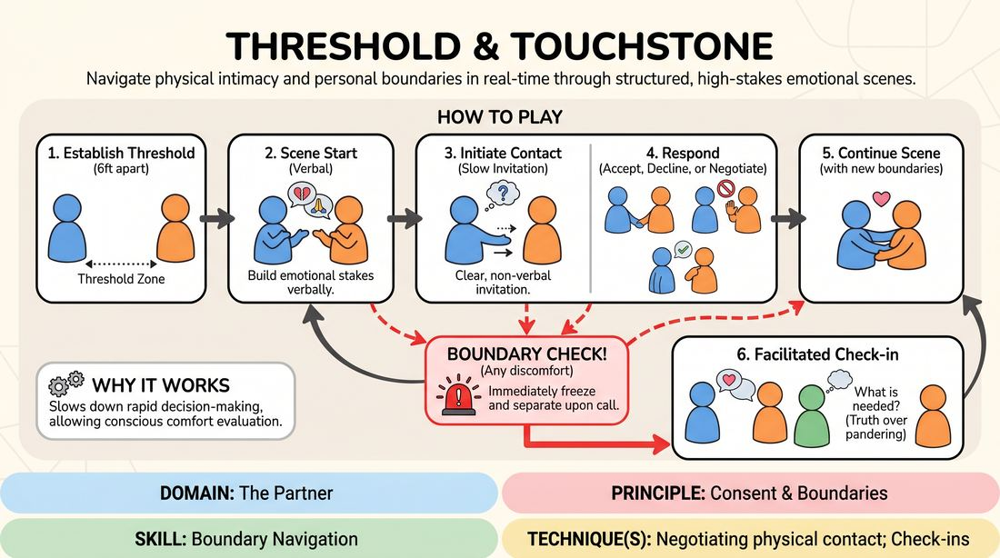{ .cat-game-img loading=lazy }

[Open full game card »](../D2_P1_S6_T3_G383__threshold-touchstone.md){target=_blank rel=noopener}

