# 🎲 Pacing & Rhythm — games

Games whose primary skill is **Pacing & Rhythm** (`D4.S4`), grouped by technique. Full faceted search on the [Games List](../index.md).

## Edits (Sweep, Tag-Out, Sound/Light)

### Association Edits

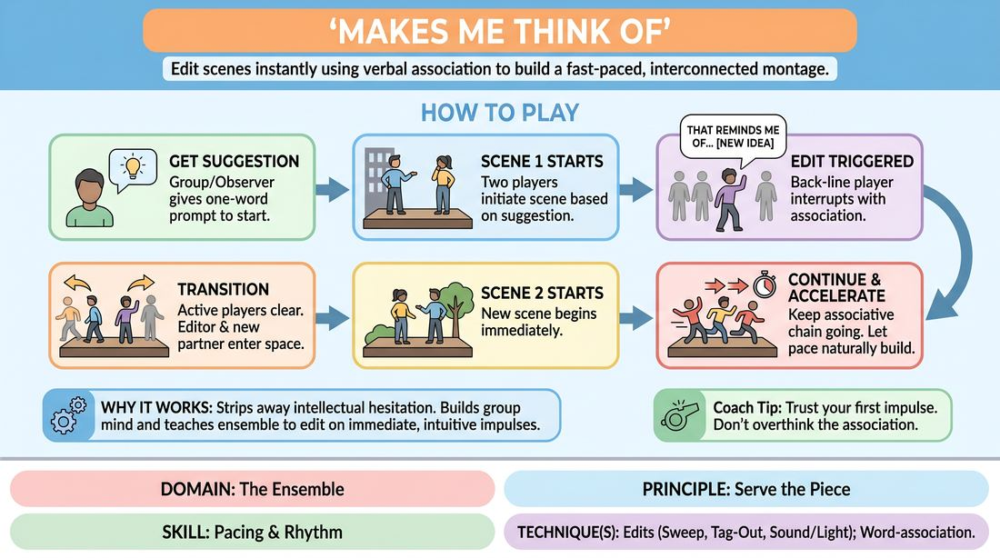{ .cat-game-img loading=lazy }

[Open full game card »](../D4_P3_S4_T1_G1165__makes-me-think-of.md){target=_blank rel=noopener}

### Cinematic Cut

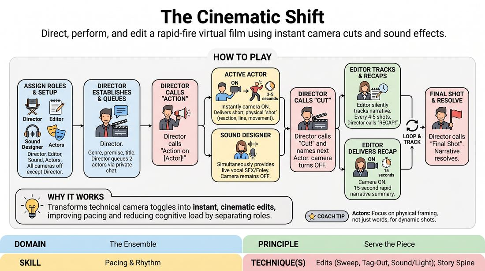{ .cat-game-img loading=lazy }

[Open full game card »](../D4_P3_S4_T1_G112__the-cinematic-shift.md){target=_blank rel=noopener}

### Cut and Splice

{ .cat-game-img loading=lazy }

[Open full game card »](../D4_P3_S4_T1_G1009__cut.md){target=_blank rel=noopener}

### Ensemble Snap

{ .cat-game-img loading=lazy }

[Open full game card »](../D4_P1_S4_T1_G511__sync-snap.md){target=_blank rel=noopener}

### Follow the Leaver

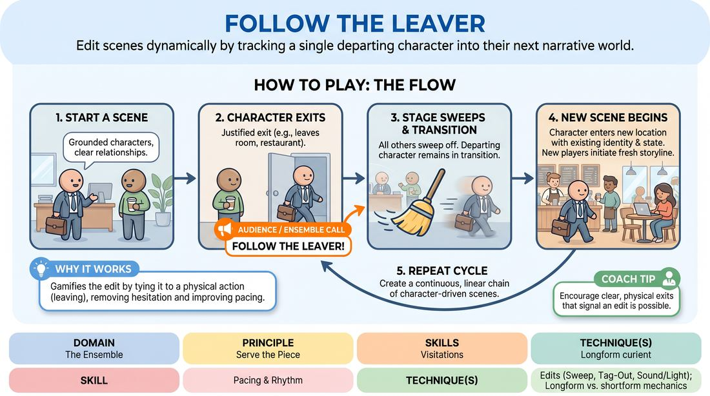{ .cat-game-img loading=lazy }

[Open full game card »](../D4_P3_S4_T1_G1073__follow-the-leaver.md){target=_blank rel=noopener}

### Follow the Leaver

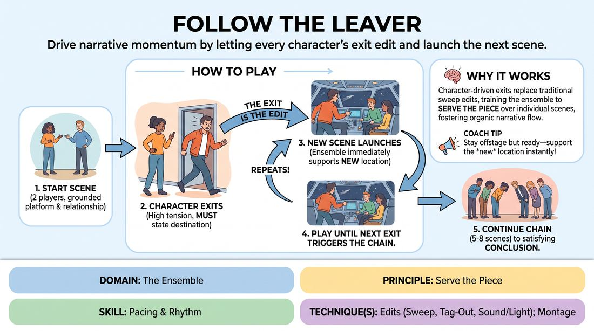{ .cat-game-img loading=lazy }

[Open full game card »](../D4_P3_S4_T1_G706__follow-the-leaver.md){target=_blank rel=noopener}

### Hyperlink Roulette

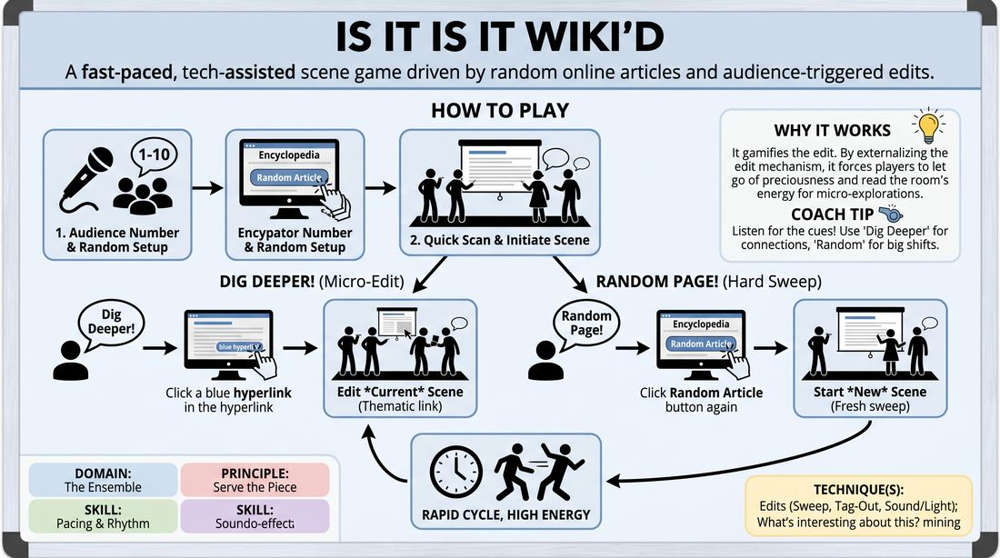{ .cat-game-img loading=lazy }

[Open full game card »](../D4_P3_S4_T1_G743__is-it-is-it-wiki-d.md){target=_blank rel=noopener}

### Keep and Move On

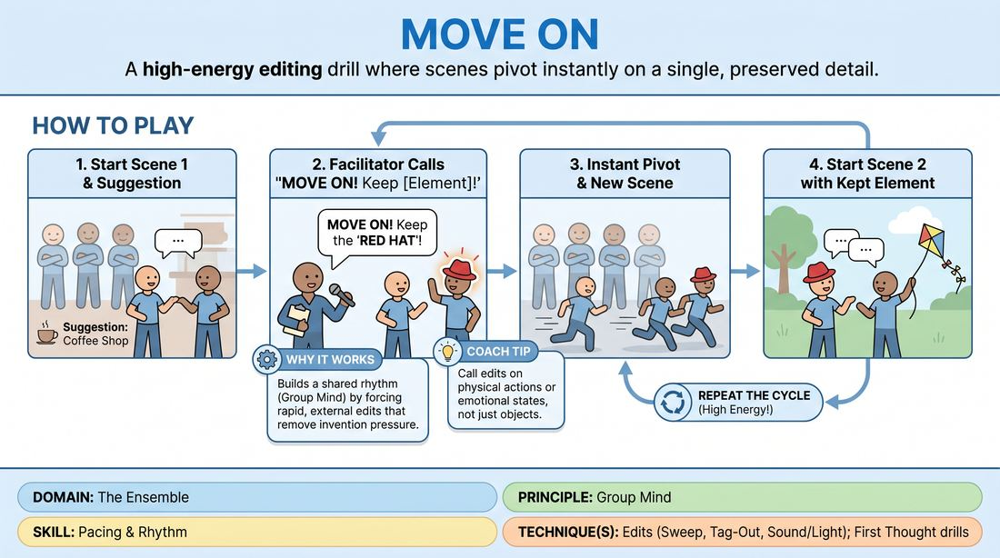{ .cat-game-img loading=lazy }

[Open full game card »](../D4_P1_S4_T1_G772__move-on.md){target=_blank rel=noopener}

### Meanwhile

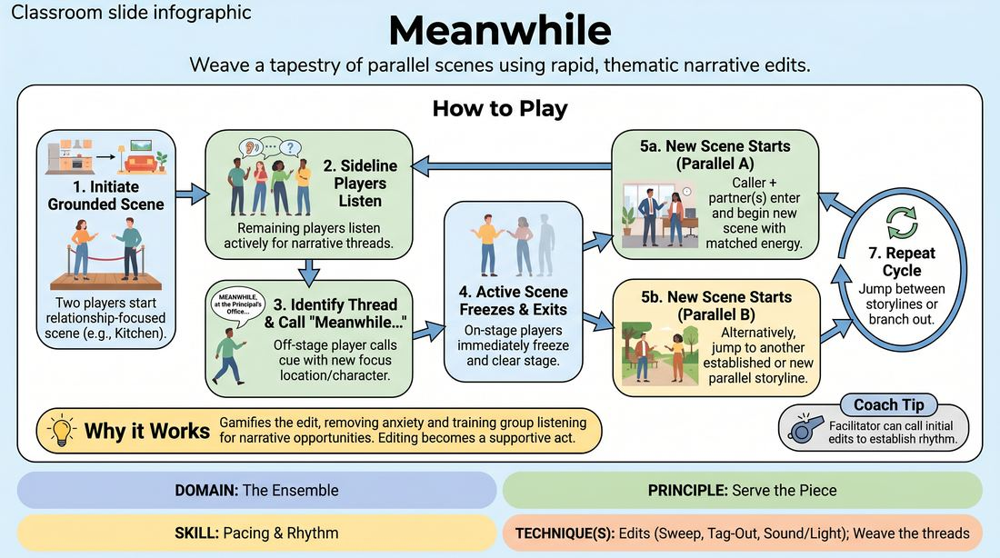{ .cat-game-img loading=lazy }

[Open full game card »](../D4_P3_S4_T1_G764__meanwhile.md){target=_blank rel=noopener}

### My Movie, My Movie

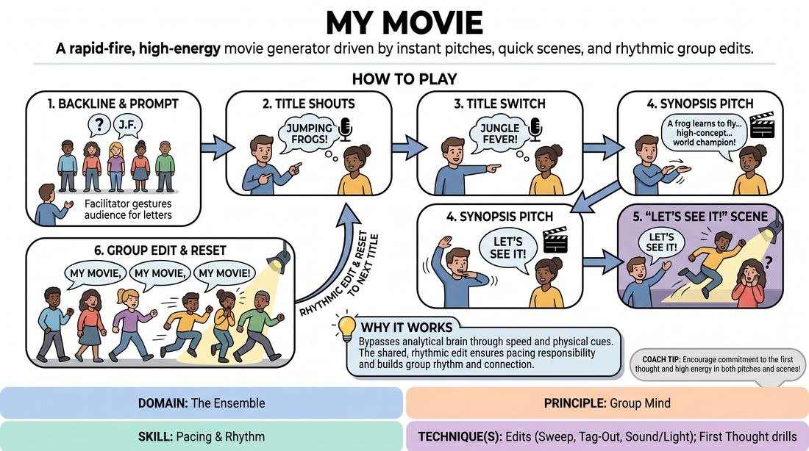{ .cat-game-img loading=lazy }

[Open full game card »](../D4_P1_S4_T1_G776__my-movie.md){target=_blank rel=noopener}

### Rapid Backstory Montage

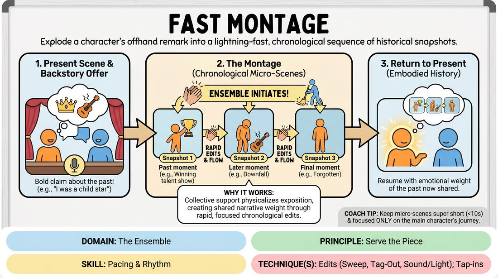{ .cat-game-img loading=lazy }

[Open full game card »](../D4_P3_S4_T1_G1063__fast-montage.md){target=_blank rel=noopener}

### Resonance Bridges

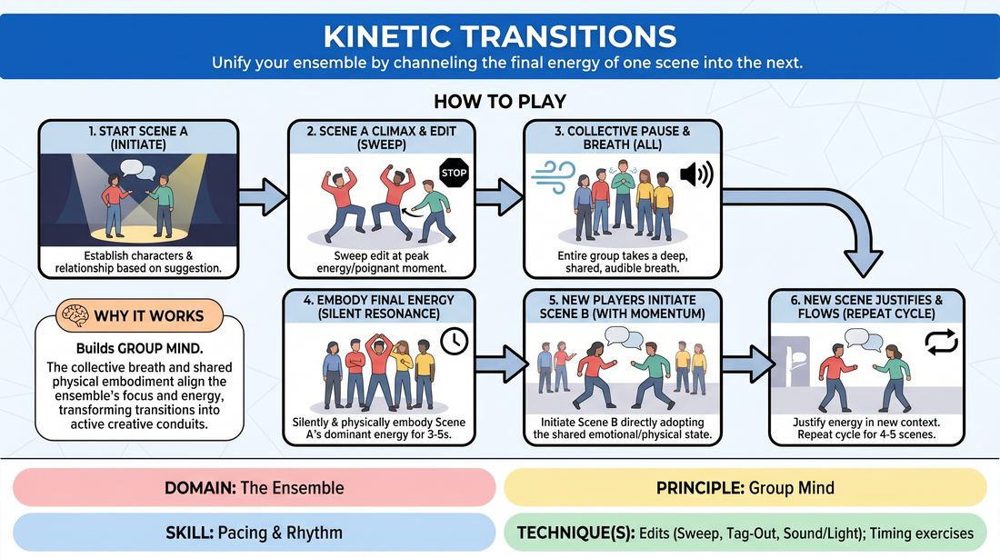{ .cat-game-img loading=lazy }

[Open full game card »](../D4_P1_S4_T1_G196__kinetic-transitions.md){target=_blank rel=noopener}

### Rhythmic Resonance

{ .cat-game-img loading=lazy }

[Open full game card »](../D4_P1_S4_T1_G288__rhythm-resonance.md){target=_blank rel=noopener}

### Sonic Dial

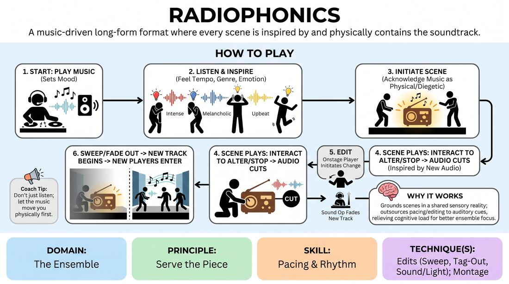{ .cat-game-img loading=lazy }

[Open full game card »](../D4_P3_S4_T1_G1247__radiophonics.md){target=_blank rel=noopener}

### Split Focus

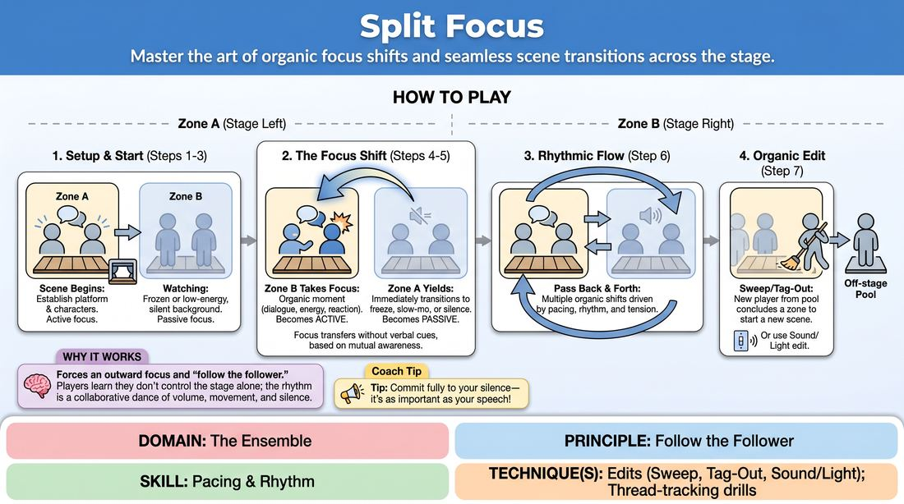{ .cat-game-img loading=lazy }

[Open full game card »](../D4_P2_S4_T1_G1296__split-focus.md){target=_blank rel=noopener}

### The Endurance Relay

{ .cat-game-img loading=lazy }

[Open full game card »](../D4_P1_S4_T1_G1036__dry-cleaning-bag-of-death.md){target=_blank rel=noopener}

### The Pattern Weaver

{ .cat-game-img loading=lazy }

[Open full game card »](../D4_P1_S4_T1_G311__the-ensemble-game-weaver.md){target=_blank rel=noopener}

### The Relay Edit

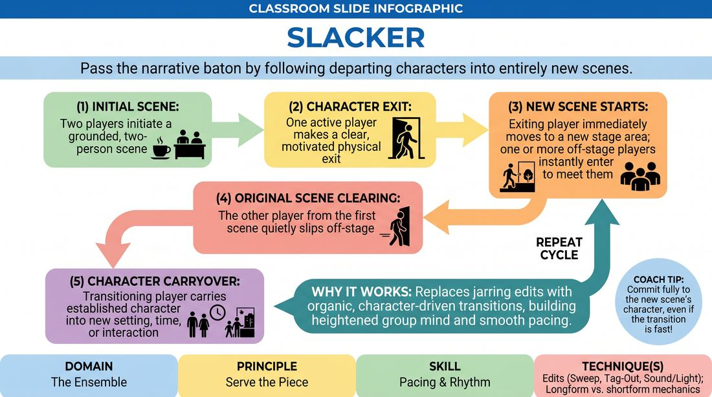{ .cat-game-img loading=lazy }

[Open full game card »](../D4_P3_S4_T1_G1280__slacker.md){target=_blank rel=noopener}

### The Tag-Out Edit

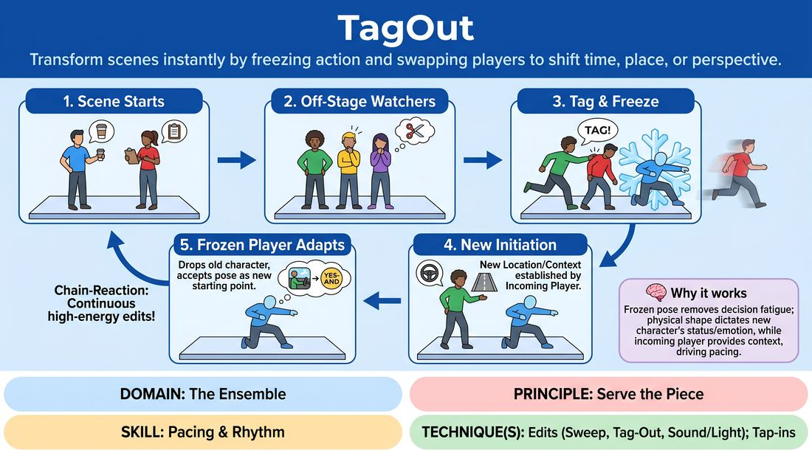{ .cat-game-img loading=lazy }

[Open full game card »](../D4_P3_S4_T1_G1319__tagout.md){target=_blank rel=noopener}

## Timing exercises

### Alphabet Volley

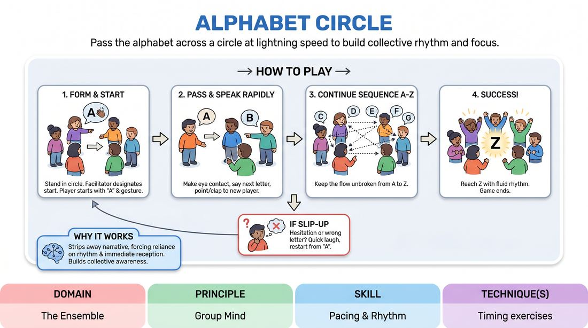{ .cat-game-img loading=lazy }

[Open full game card »](../D4_P1_S4_T2_G926__alphabet-circle.md){target=_blank rel=noopener}

### Big Booty

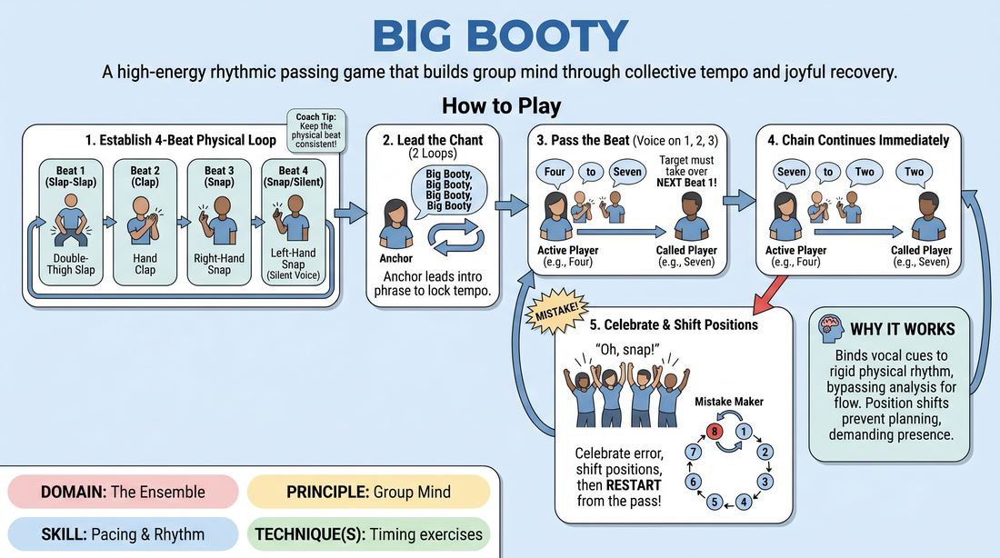{ .cat-game-img loading=lazy }

[Open full game card »](../D4_P1_S4_T2_G955__big-booty.md){target=_blank rel=noopener}

### Big Fish, Small Fish

{ .cat-game-img loading=lazy }

[Open full game card »](../D4_P1_S4_T2_G956__big-fish-small-fish.md){target=_blank rel=noopener}

### Energy Scale 1 to 10

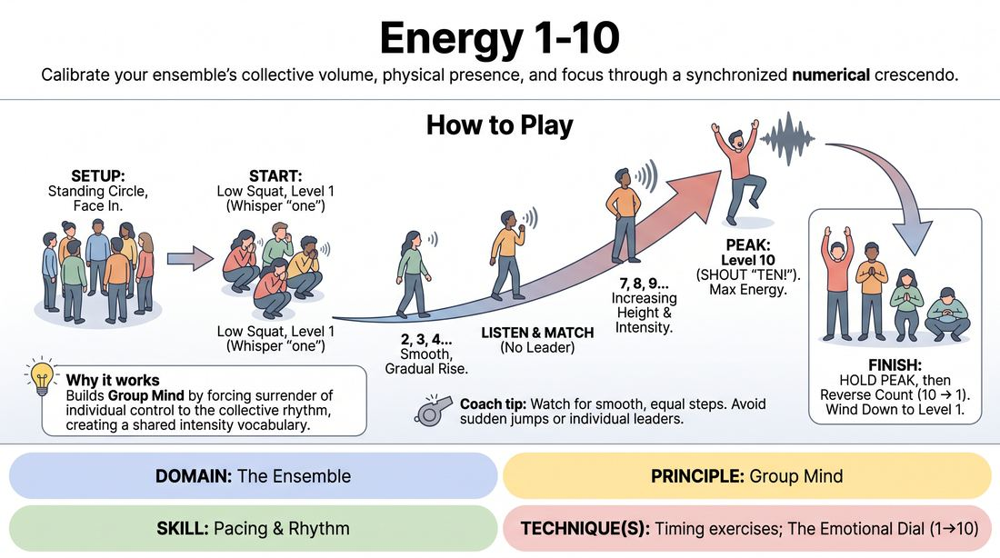{ .cat-game-img loading=lazy }

[Open full game card »](../D4_P1_S4_T2_G1050__energy-1-10.md){target=_blank rel=noopener}

### Grandmother's Steps

{ .cat-game-img loading=lazy }

[Open full game card »](../D4_P1_S4_T2_G718__grandmother-s-footsteps.md){target=_blank rel=noopener}

### Ha So Ka

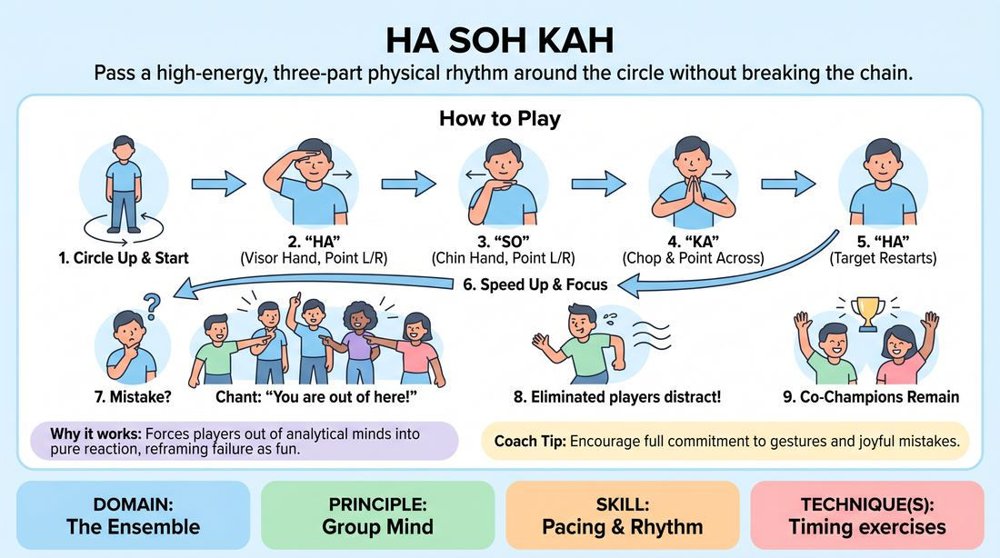{ .cat-game-img loading=lazy }

[Open full game card »](../D4_P1_S4_T2_G1108__ha-soh-kah.md){target=_blank rel=noopener}

### Half-Life Story

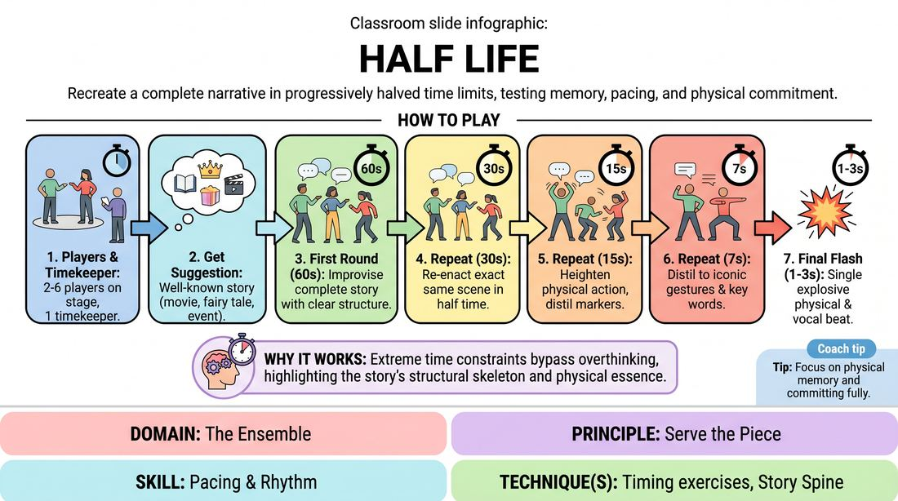{ .cat-game-img loading=lazy }

[Open full game card »](../D4_P3_S4_T2_G722__half-life.md){target=_blank rel=noopener}

### Improvised Choir

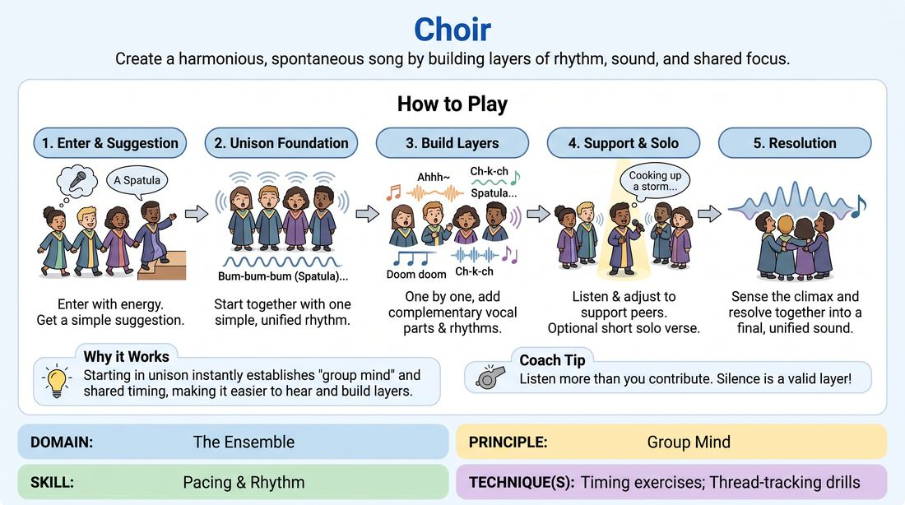{ .cat-game-img loading=lazy }

[Open full game card »](../D4_P1_S4_T2_G665__choir.md){target=_blank rel=noopener}

### One-Word Song

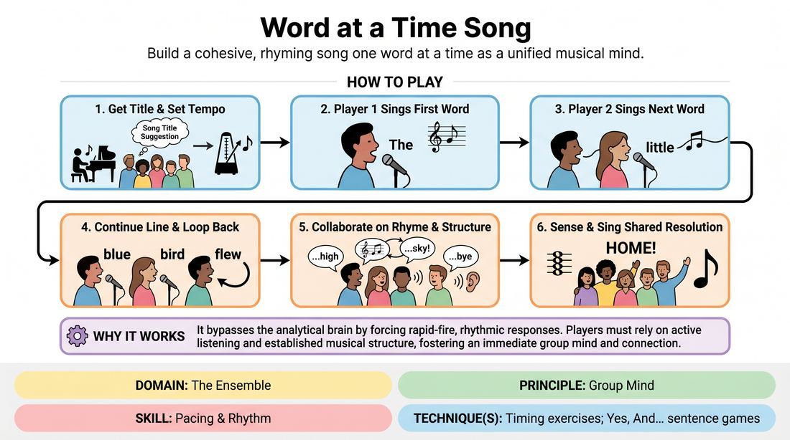{ .cat-game-img loading=lazy }

[Open full game card »](../D4_P1_S4_T2_G1373__word-at-a-time-song.md){target=_blank rel=noopener}

### Pass Yes

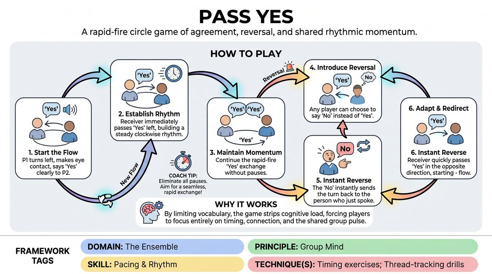{ .cat-game-img loading=lazy }

[Open full game card »](../D4_P1_S4_T2_G1226__pass-yes.md){target=_blank rel=noopener}

### Pass the Pulse

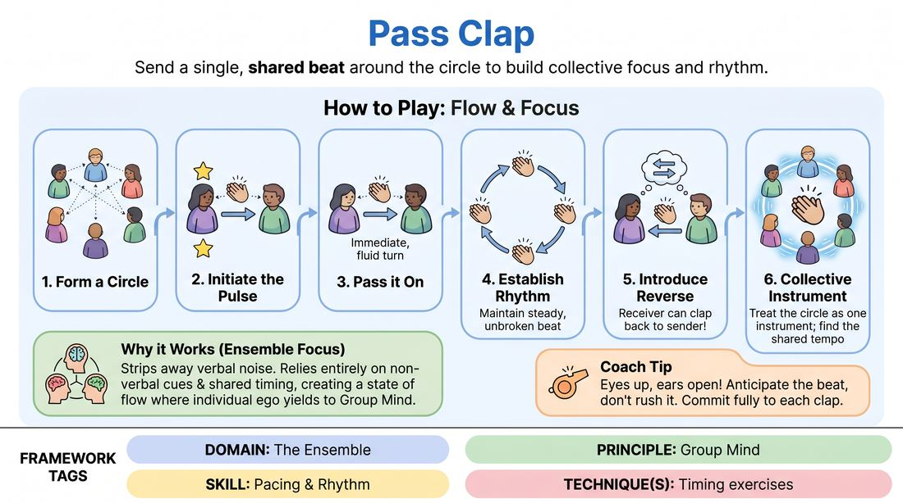{ .cat-game-img loading=lazy }

[Open full game card »](../D4_P1_S4_T2_G1225__pass-clap.md){target=_blank rel=noopener}

### Physical Countdown Scenes

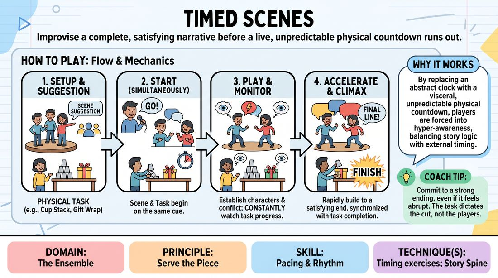{ .cat-game-img loading=lazy }

[Open full game card »](../D4_P3_S4_T2_G1339__timed-scenes.md){target=_blank rel=noopener}

### Popcorn

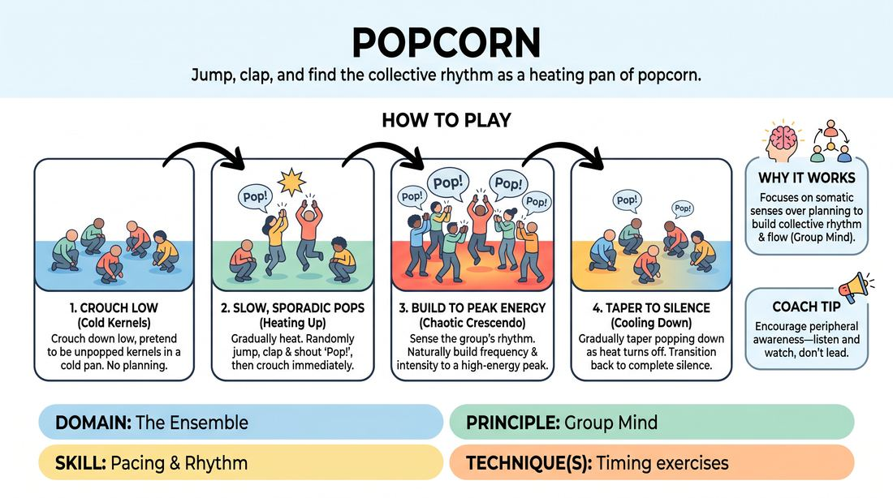{ .cat-game-img loading=lazy }

[Open full game card »](../D4_P1_S4_T2_G1239__popcorn.md){target=_blank rel=noopener}

### Remote Control Playback

{ .cat-game-img loading=lazy }

[Open full game card »](../D4_P1_S4_T2_G820__rewind-fast-forward.md){target=_blank rel=noopener}

### Rhythm Slap

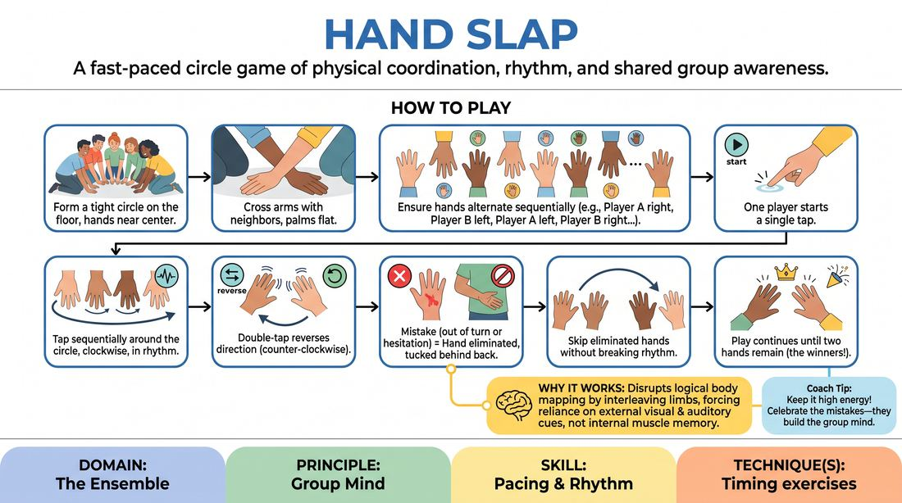{ .cat-game-img loading=lazy }

[Open full game card »](../D4_P1_S4_T2_G1110__hand-slap.md){target=_blank rel=noopener}

### Rhythmic Number Pass

{ .cat-game-img loading=lazy }

[Open full game card »](../D4_P1_S4_T2_G998__concentration-circle.md){target=_blank rel=noopener}

### Samurai Circle

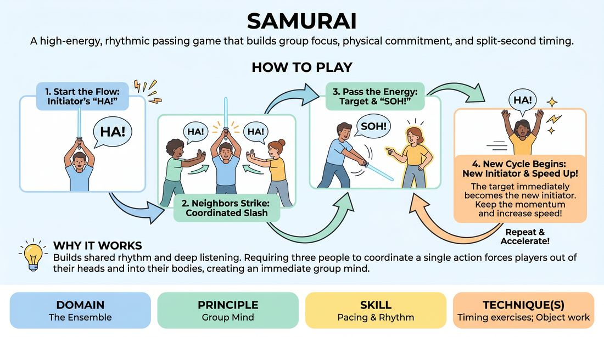{ .cat-game-img loading=lazy }

[Open full game card »](../D4_P1_S4_T2_G1261__samurai.md){target=_blank rel=noopener}

### Shared Count

{ .cat-game-img loading=lazy }

[Open full game card »](../D4_P1_S4_T2_G1203__no-doubles-1-10.md){target=_blank rel=noopener}

### Simultaneous Worlds

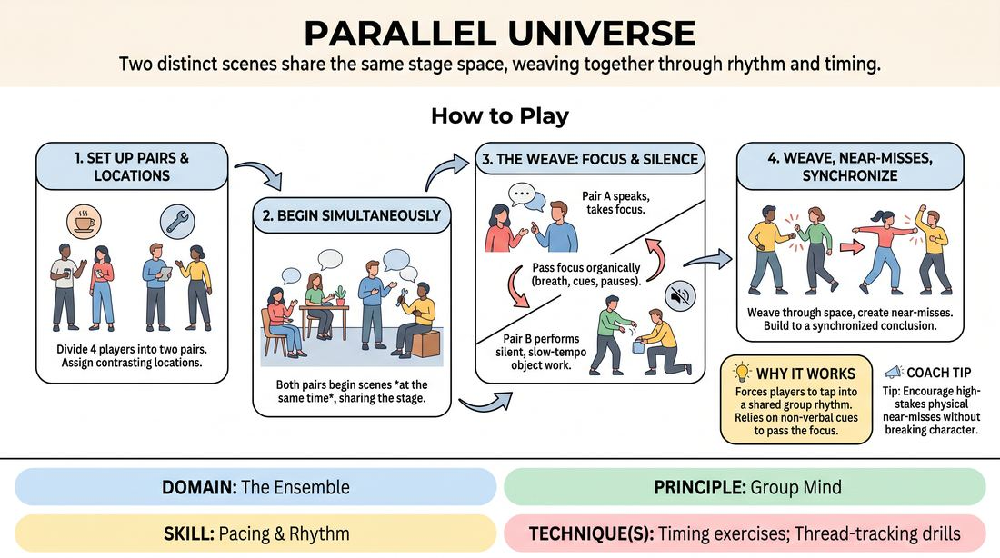{ .cat-game-img loading=lazy }

[Open full game card »](../D4_P1_S4_T2_G1223__parallel-universe.md){target=_blank rel=noopener}

### Stereo Loop

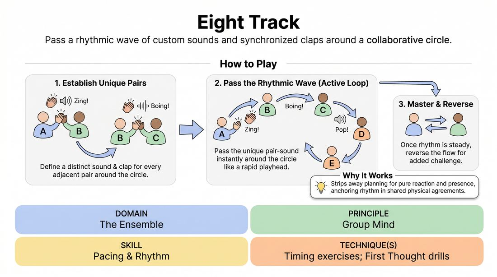{ .cat-game-img loading=lazy }

[Open full game card »](../D4_P1_S4_T2_G692__eight-track.md){target=_blank rel=noopener}

### Synchronized Clap

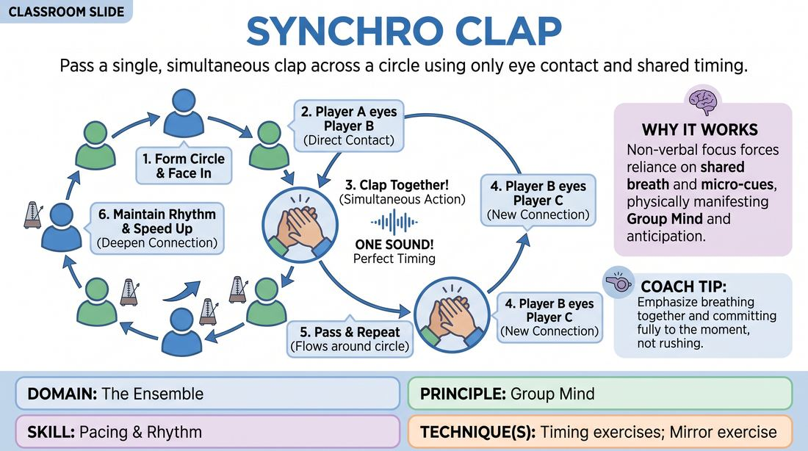{ .cat-game-img loading=lazy }

[Open full game card »](../D4_P1_S4_T2_G1318__synchro-clap.md){target=_blank rel=noopener}

### Synchronized Pulse

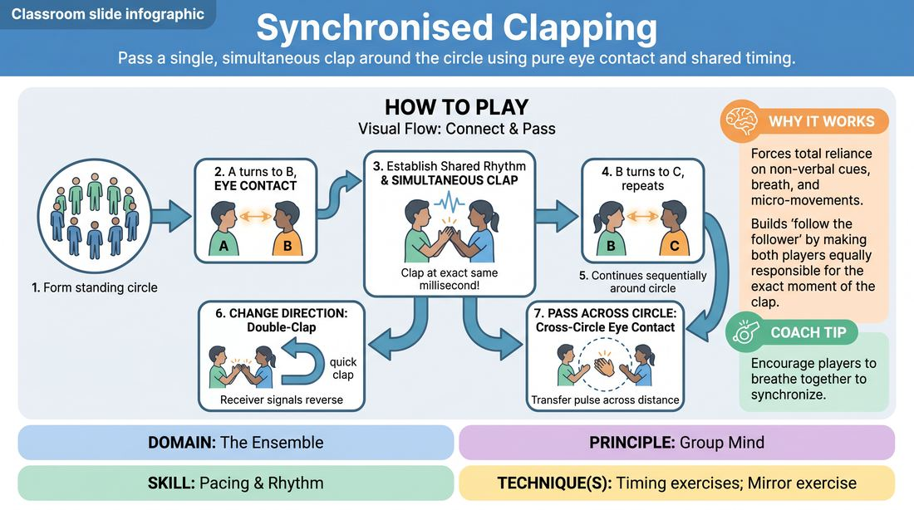{ .cat-game-img loading=lazy }

[Open full game card »](../D4_P1_S4_T2_G857__synchronised-clapping.md){target=_blank rel=noopener}

### The Cadence Pass

{ .cat-game-img loading=lazy }

[Open full game card »](../D4_P1_S4_T2_G685__diddly-dum.md){target=_blank rel=noopener}

### The Cookie Jar Rhythm

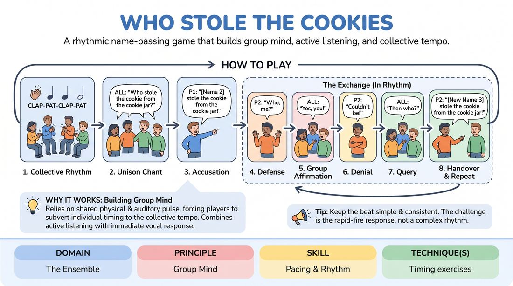{ .cat-game-img loading=lazy }

[Open full game card »](../D4_P1_S4_T2_G1364__who-stole-the-cookies.md){target=_blank rel=noopener}

### The Duck Chorus

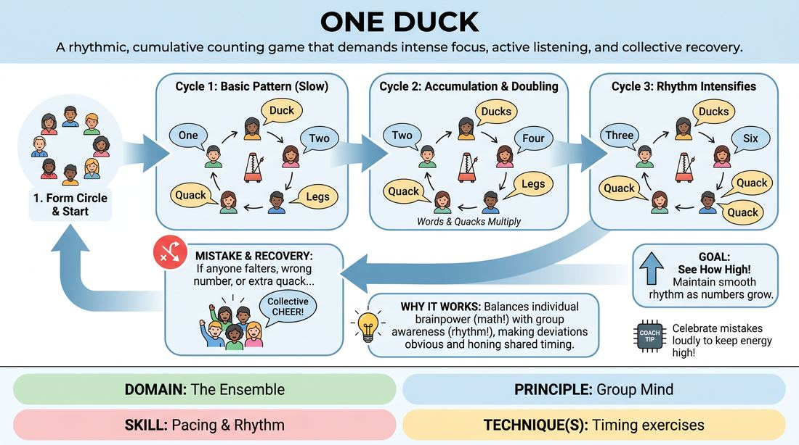{ .cat-game-img loading=lazy }

[Open full game card »](../D4_P1_S4_T2_G1211__one-duck.md){target=_blank rel=noopener}

### The Ensemble Current

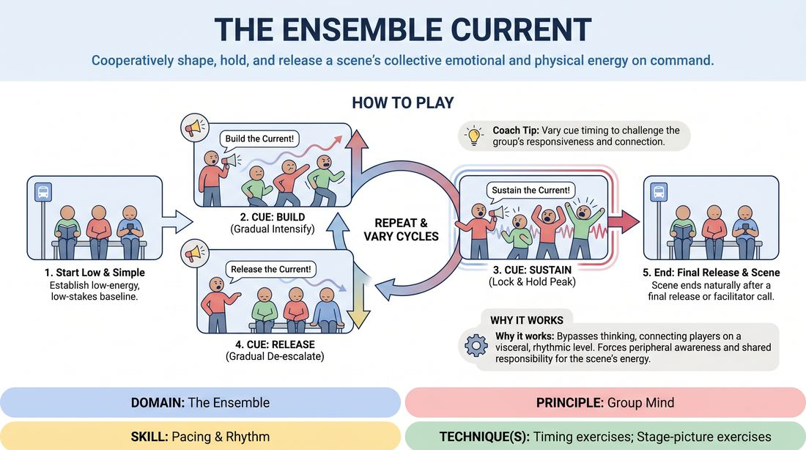{ .cat-game-img loading=lazy }

[Open full game card »](../D4_P1_S4_T2_G540__the-ensemble-current.md){target=_blank rel=noopener}

### The Folk Song Quartet

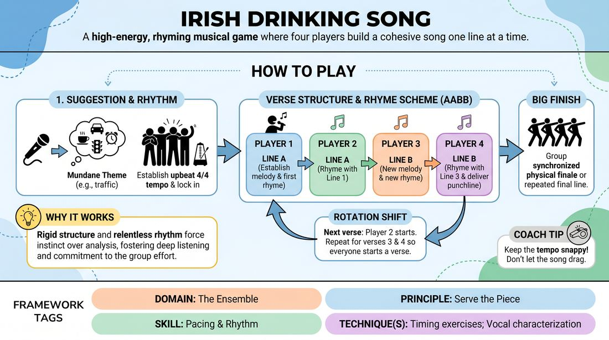{ .cat-game-img loading=lazy }

[Open full game card »](../D4_P3_S4_T2_G1137__irish-drinking-song.md){target=_blank rel=noopener}

### The Four-Step Cadence

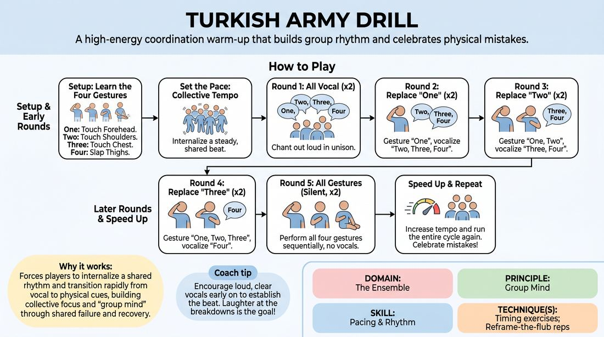{ .cat-game-img loading=lazy }

[Open full game card »](../D4_P1_S4_T2_G1347__turkish-army-drill.md){target=_blank rel=noopener}

### The Invisible Jump Rope

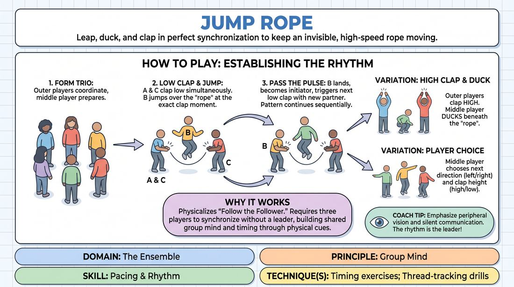{ .cat-game-img loading=lazy }

[Open full game card »](../D4_P1_S4_T2_G749__jump-rope.md){target=_blank rel=noopener}

### The Pulse

{ .cat-game-img loading=lazy }

[Open full game card »](../D4_P1_S4_T2_G1299__squeezer.md){target=_blank rel=noopener}

### The Rhythmic Conveyor Belt

{ .cat-game-img loading=lazy }

[Open full game card »](../D4_P2_S4_T2_G921__ali-baba-and-the-40-thieves.md){target=_blank rel=noopener}

### The Run-Run Song

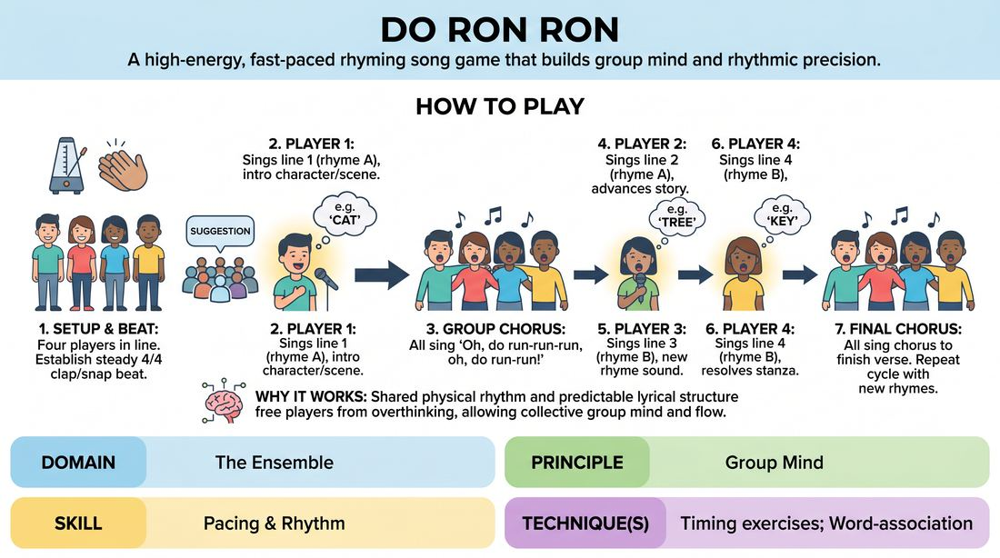{ .cat-game-img loading=lazy }

[Open full game card »](../D4_P1_S4_T2_G1028__do-ron-ron.md){target=_blank rel=noopener}

### The Seamless Oracle

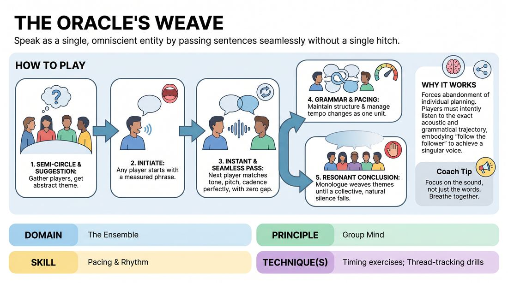{ .cat-game-img loading=lazy }

[Open full game card »](../D4_P1_S4_T2_G578__the-oracle-s-weave.md){target=_blank rel=noopener}

### The Shakeout Countdown

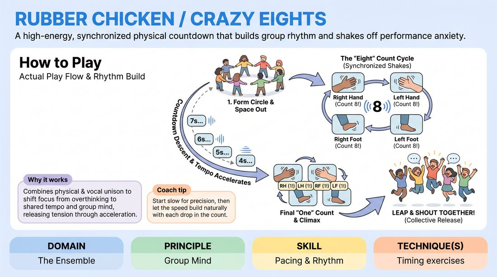{ .cat-game-img loading=lazy }

[Open full game card »](../D4_P1_S4_T2_G823__rubber-chicken-crazy-eights.md){target=_blank rel=noopener}

### The Tempo Conductor

{ .cat-game-img loading=lazy }

[Open full game card »](../D4_P1_S4_T2_G536__the-rhythmic-collective.md){target=_blank rel=noopener}

### Unison Cypher

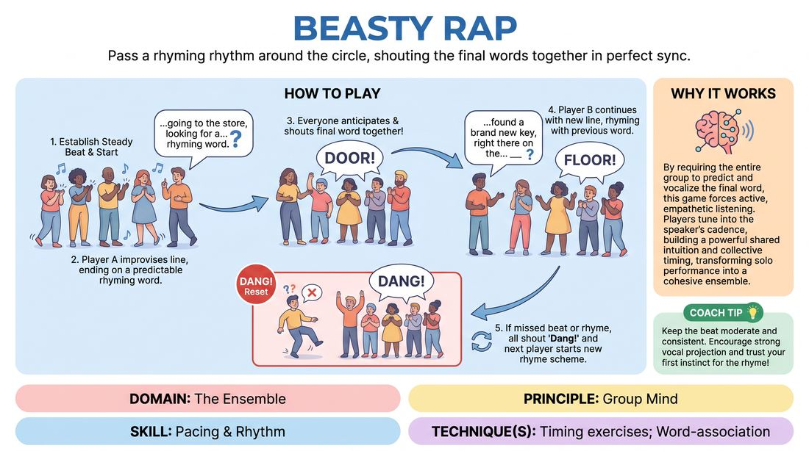{ .cat-game-img loading=lazy }

[Open full game card »](../D4_P1_S4_T2_G949__beasty-rap.md){target=_blank rel=noopener}

### Vocal Arpeggio

{ .cat-game-img loading=lazy }

[Open full game card »](../D4_P1_S4_T2_G637__arpeggio.md){target=_blank rel=noopener}

### What's Going On

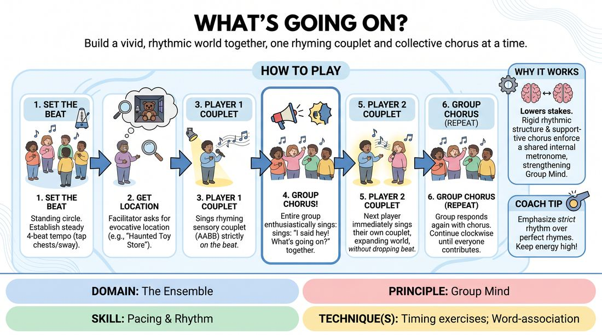{ .cat-game-img loading=lazy }

[Open full game card »](../D4_P1_S4_T2_G886__what-s-going-on.md){target=_blank rel=noopener}

