# 🎲 Room Reading — games

Games whose primary skill is **Room Reading** (`D5.S1`), grouped by technique. Full faceted search on the [Games List](../index.md).

## Core / general

### The Reaction Strike

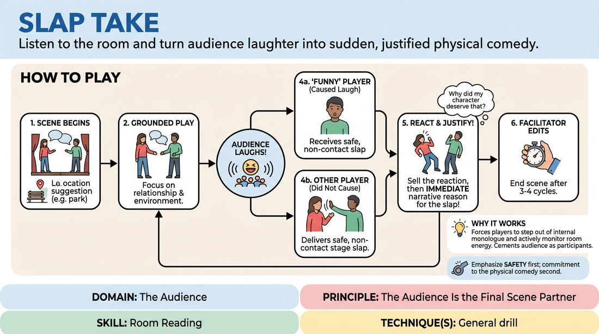{ .cat-game-img loading=lazy }

[Open full game card »](../D5_P1_S1_T0_G1281__slap-take.md){target=_blank rel=noopener}

## Energy-calibration

### Acoustic Calibration

{ .cat-game-img loading=lazy }

[Open full game card »](../D5_P1_S1_T1_G350__the-audience-ecosystem-training-protocol.md){target=_blank rel=noopener}

### Audience Pulse

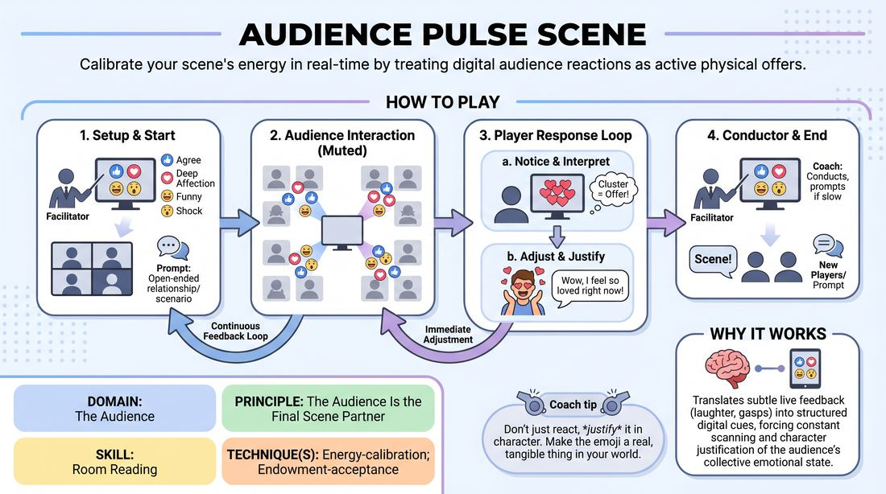{ .cat-game-img loading=lazy }

[Open full game card »](../D5_P1_S1_T1_G300__audience-pulse-scene.md){target=_blank rel=noopener}

### Audience Pulse

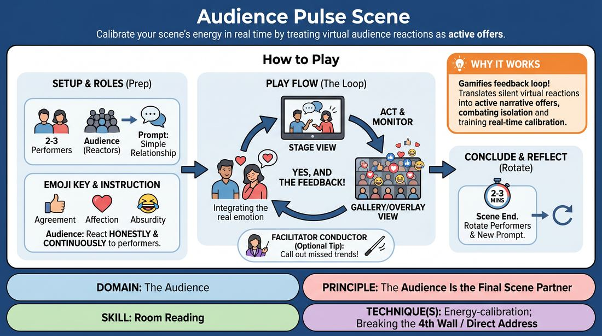{ .cat-game-img loading=lazy }

[Open full game card »](../D5_P1_S1_T1_G312__audience-pulse-scene.md){target=_blank rel=noopener}

### Audience Pulse Check

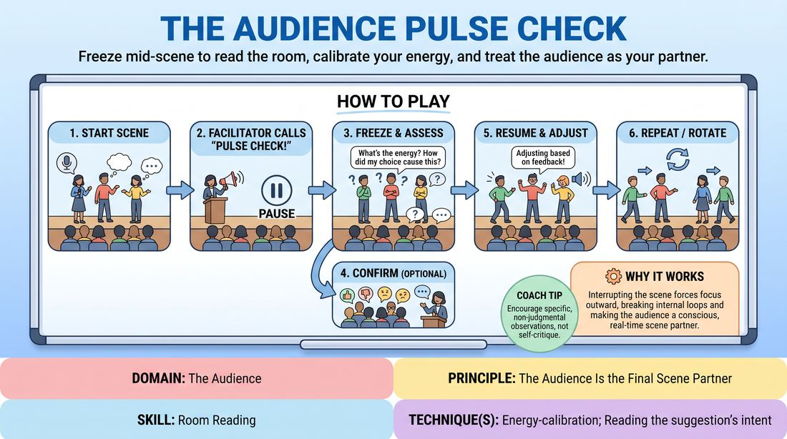{ .cat-game-img loading=lazy }

[Open full game card »](../D5_P1_S1_T1_G161__the-audience-pulse-check.md){target=_blank rel=noopener}

### Complaints Department

{ .cat-game-img loading=lazy }

[Open full game card »](../D5_P1_S1_T1_G675__complaints-department.md){target=_blank rel=noopener}

### Finger Applause

{ .cat-game-img loading=lazy }

[Open full game card »](../D5_P1_S1_T1_G1066__finger-applause.md){target=_blank rel=noopener}

### More or Less

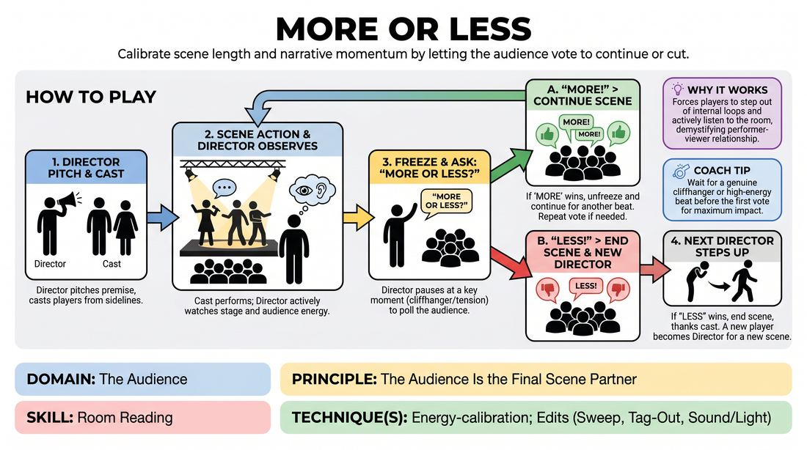{ .cat-game-img loading=lazy }

[Open full game card »](../D5_P1_S1_T1_G1188__more-or-less.md){target=_blank rel=noopener}

### Resonance Chamber

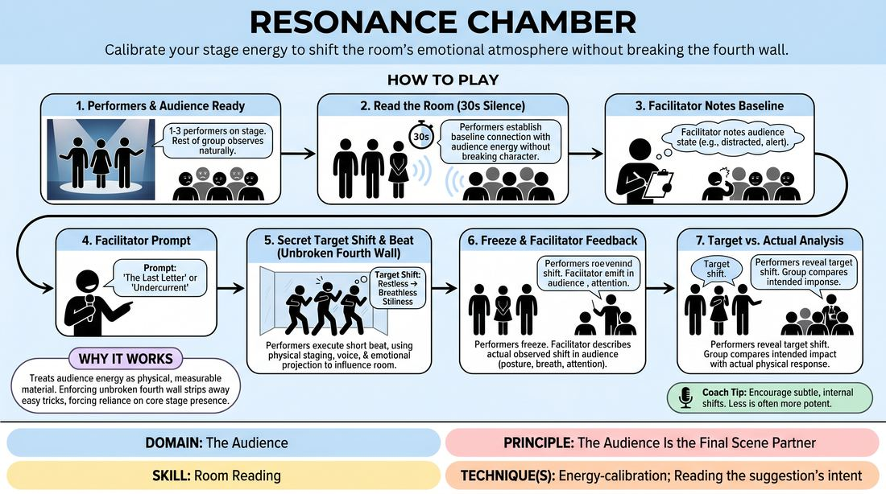{ .cat-game-img loading=lazy }

[Open full game card »](../D5_P1_S1_T1_G357__resonance-chamber.md){target=_blank rel=noopener}

### The Audience Conductor

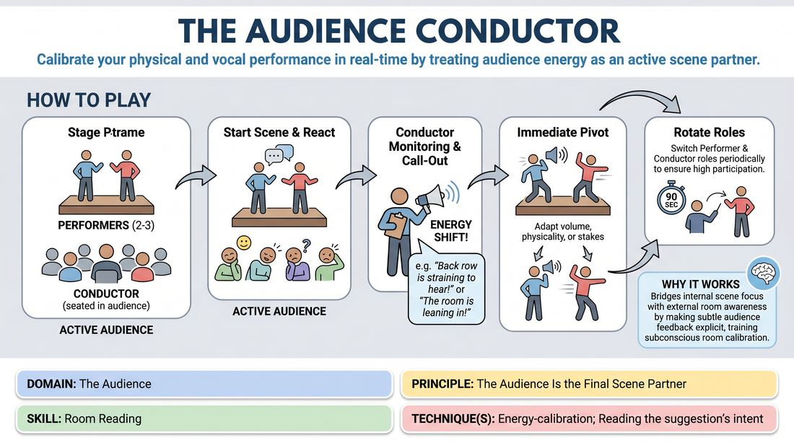{ .cat-game-img loading=lazy }

[Open full game card »](../D5_P1_S1_T1_G331__the-audience-conductor.md){target=_blank rel=noopener}

### The Conducted Chant

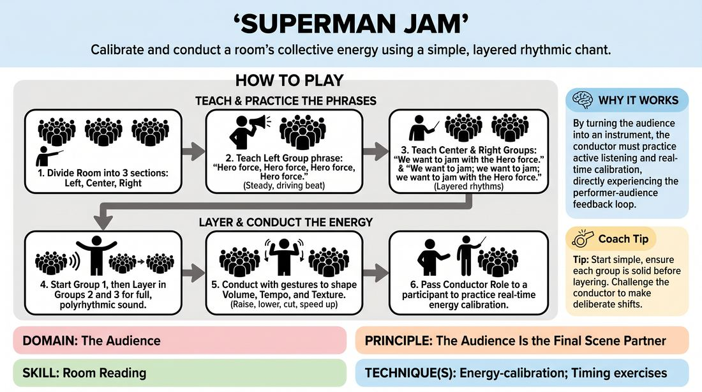{ .cat-game-img loading=lazy }

[Open full game card »](../D5_P1_S1_T1_G1310__superman-jam.md){target=_blank rel=noopener}

### The Conductor's Contract

{ .cat-game-img loading=lazy }

[Open full game card »](../D5_P1_S1_T1_G252__the-conductor-s-contract.md){target=_blank rel=noopener}

### The Confidant's Echo

{ .cat-game-img loading=lazy }

[Open full game card »](../D5_P1_S1_T1_G260__the-echo-chamber-the-confidant.md){target=_blank rel=noopener}

### The Elastic Membrane

{ .cat-game-img loading=lazy }

[Open full game card »](../D5_P1_S1_T1_G177__the-elastic-wall.md){target=_blank rel=noopener}

### The Feedback Agreement

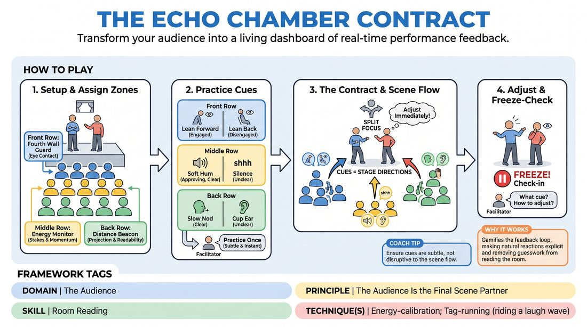{ .cat-game-img loading=lazy }

[Open full game card »](../D5_P1_S1_T1_G061__the-echo-chamber-contract.md){target=_blank rel=noopener}

### The Fourth Wall Accord

{ .cat-game-img loading=lazy }

[Open full game card »](../D5_P1_S1_T1_G016__the-audience-accord.md){target=_blank rel=noopener}

### The Fourth Wall Conductor

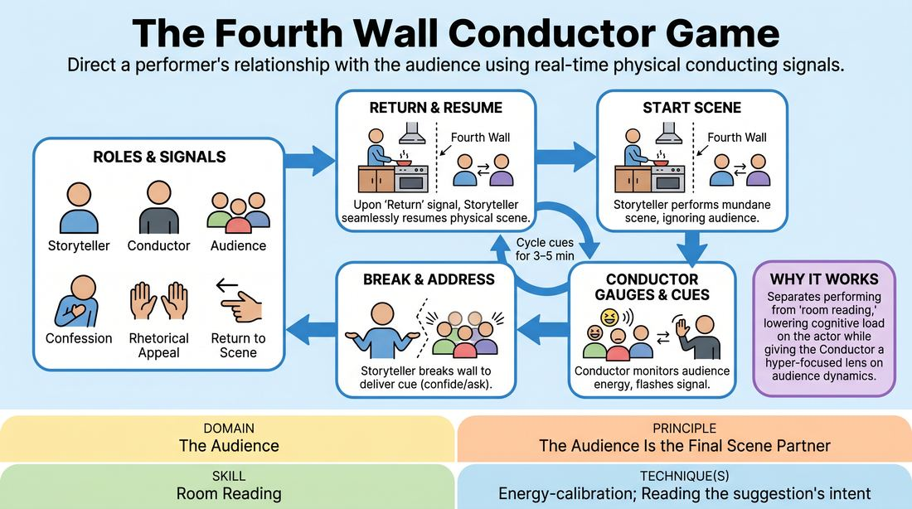{ .cat-game-img loading=lazy }

[Open full game card »](../D5_P1_S1_T1_G339__the-fourth-wall-conductor-game.md){target=_blank rel=noopener}

### The Invisible Tether

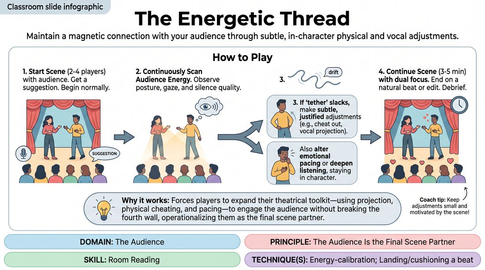{ .cat-game-img loading=lazy }

[Open full game card »](../D5_P1_S1_T1_G532__the-energetic-thread.md){target=_blank rel=noopener}

### The Resonance Calibration

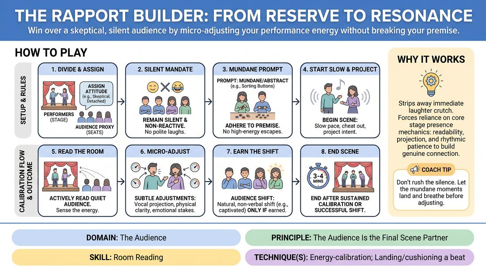{ .cat-game-img loading=lazy }

[Open full game card »](../D5_P1_S1_T1_G313__the-rapport-builder-from-reserve-to-resonance.md){target=_blank rel=noopener}

### The Resonance Chamber

{ .cat-game-img loading=lazy }

[Open full game card »](../D5_P1_S1_T1_G325__the-emotional-resonance-chamber.md){target=_blank rel=noopener}

### The Resonance Conductor

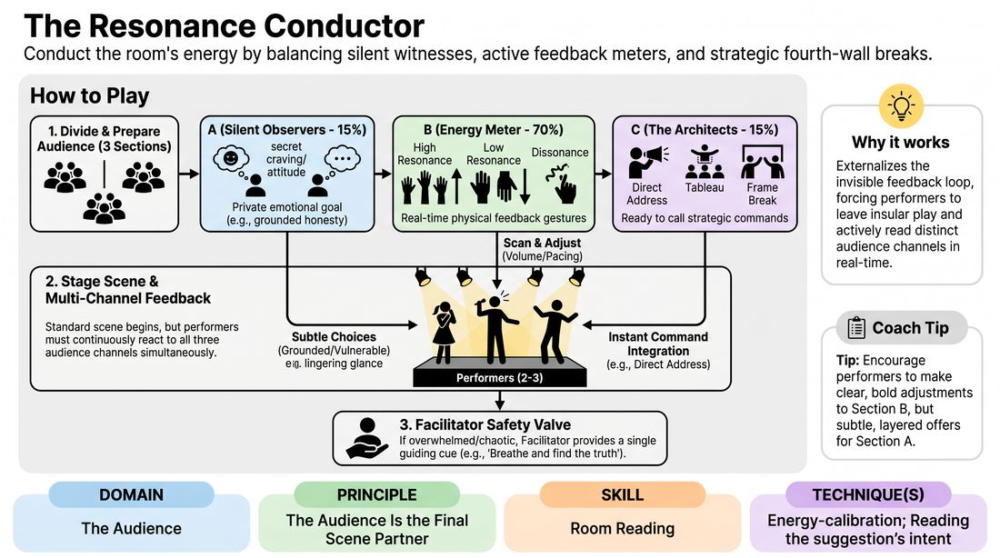{ .cat-game-img loading=lazy }

[Open full game card »](../D5_P1_S1_T1_G563__the-resonance-conductor.md){target=_blank rel=noopener}

### The Resonance Dial

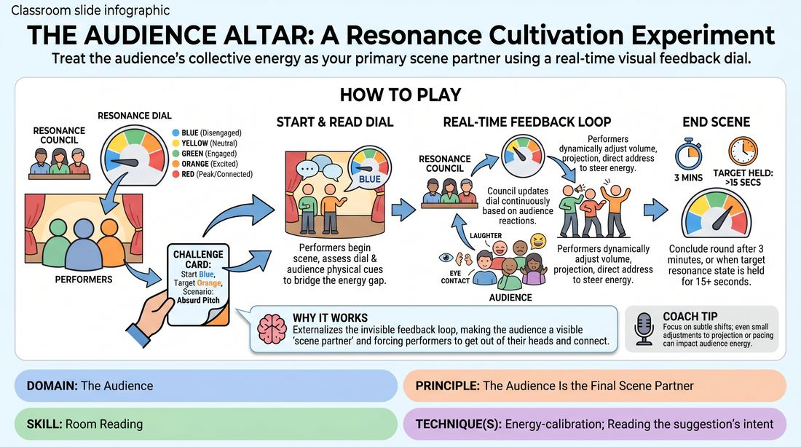{ .cat-game-img loading=lazy }

[Open full game card »](../D5_P1_S1_T1_G044__the-audience-altar-a-resonance-cultivation-experiment.md){target=_blank rel=noopener}

### The Resonance Dial

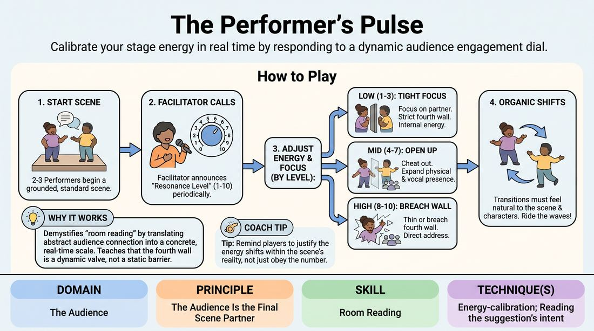{ .cat-game-img loading=lazy }

[Open full game card »](../D5_P1_S1_T1_G054__the-performer-s-pulse.md){target=_blank rel=noopener}

### The Sentient Space

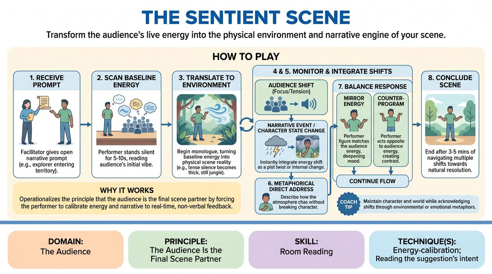{ .cat-game-img loading=lazy }

[Open full game card »](../D5_P1_S1_T1_G500__the-sentient-scene.md){target=_blank rel=noopener}

### The Silent Auditor

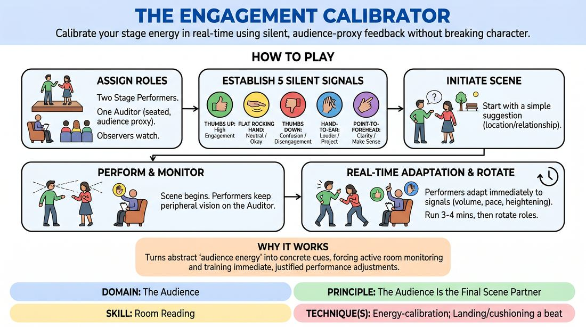{ .cat-game-img loading=lazy }

[Open full game card »](../D5_P1_S1_T1_G282__the-engagement-calibrator.md){target=_blank rel=noopener}

### The Silent Confessional

{ .cat-game-img loading=lazy }

[Open full game card »](../D5_P1_S1_T1_G541__the-inner-compass-confessional.md){target=_blank rel=noopener}

### The Silent Council

{ .cat-game-img loading=lazy }

[Open full game card »](../D5_P1_S1_T1_G271__the-silent-council.md){target=_blank rel=noopener}

### The Silent Weathervane

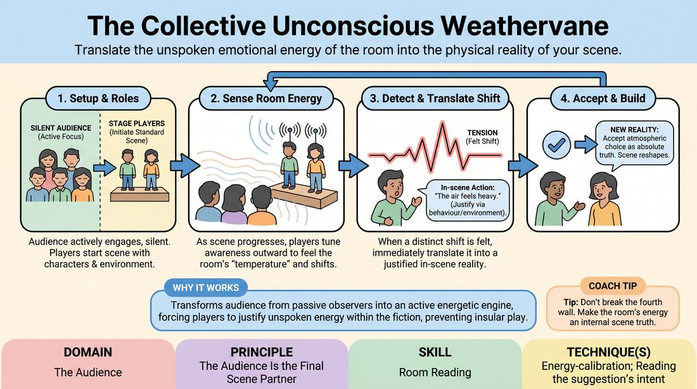{ .cat-game-img loading=lazy }

[Open full game card »](../D5_P1_S1_T1_G479__the-collective-unconscious-weathervane.md){target=_blank rel=noopener}

## Reading the suggestion's intent

### Audience Cartographers

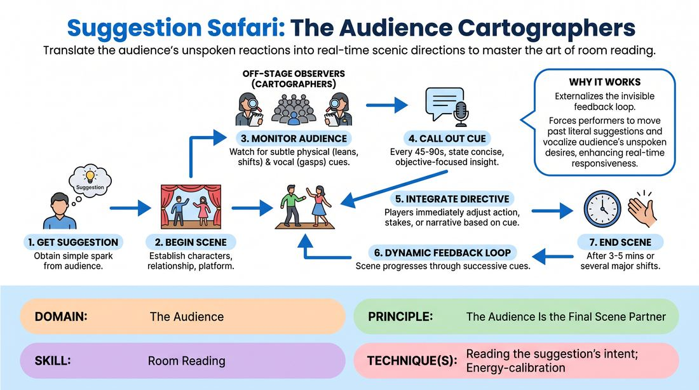{ .cat-game-img loading=lazy }

[Open full game card »](../D5_P1_S1_T2_G422__suggestion-safari-the-audience-cartographers.md){target=_blank rel=noopener}

### Ding Dong

{ .cat-game-img loading=lazy }

[Open full game card »](../D5_P1_S1_T2_G1020__ding-dong.md){target=_blank rel=noopener}

### The Echo Chamber

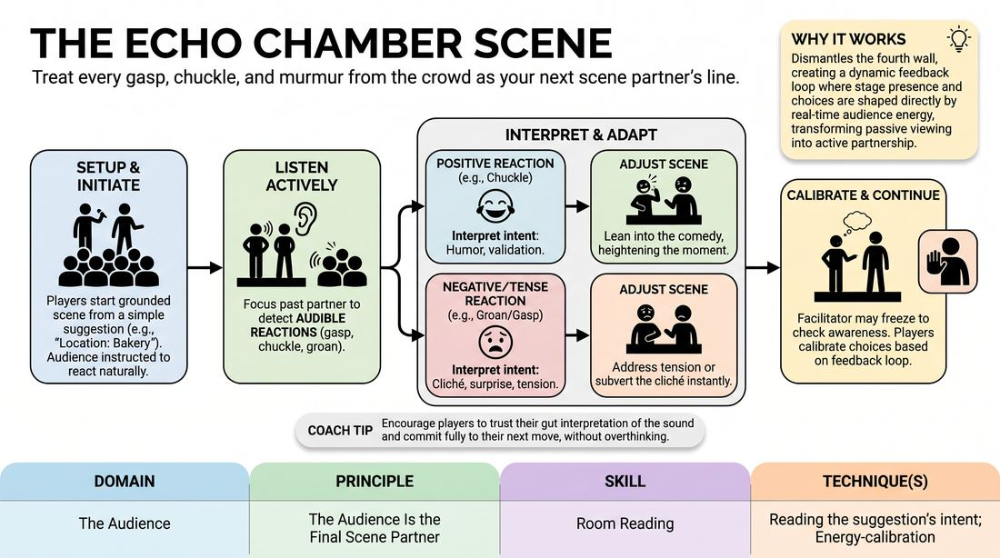{ .cat-game-img loading=lazy }

[Open full game card »](../D5_P1_S1_T2_G345__the-echo-chamber-scene.md){target=_blank rel=noopener}

### The Intent Architect

{ .cat-game-img loading=lazy }

[Open full game card »](../D5_P1_S1_T2_G298__the-intent-architect-reading-audience-intent.md){target=_blank rel=noopener}

### The Oracle's Eye

{ .cat-game-img loading=lazy }

[Open full game card »](../D5_P1_S1_T2_G401__the-oracle-s-gaze.md){target=_blank rel=noopener}

