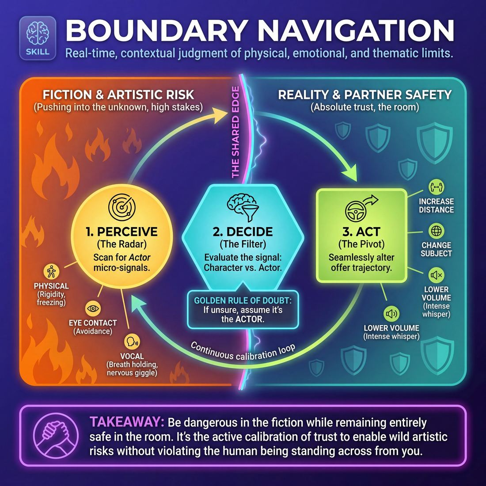

# Week 01 — Welcome & the Safety Container
> *Safety is the container Yes-And lives inside — consent overrides agreement.*

| Course | Week | Domain | Focus | Stage |
|---|---|---|---|---|
| Foundations — The Brave Beginner | 1/16 | D2 — The Partner | `D2.S6` — Boundary Navigation | Novice → Advanced Beginner |

!!! warning "Layer 0 — Safety & Consent first"
    The consent container is taught before anything else and re-affirmed here. The rule of consent overrides the rule of agreement.

## ⏱️ Session flow (60 minutes)

| Time | Block |
|---|---|
| 0:00–0:05 | Arrival & safety check-in |
| 0:05–0:15 | Warm-up game |
| 0:15–0:27 | **1. Today's theory** |
| 0:27–0:52 | **2. Today's games** |
| 0:52–1:00 | **3. Reflection & debrief** |

## 1. 🧠 Today's theory

**Focus:** `D2.S6` — Boundary Navigation  
**Maturity goal today:** Novice: aware safety matters; practise check-ins and the 'Cut' call in exercises.

{ .infographic }

- **The big idea:** Safety is the container Yes-And lives inside — consent overrides agreement.
- **Where you are on the path:** Novice: aware safety matters; practise check-ins and the 'Cut' call in exercises.
- **The one cue to coach:** *“You can always say 'Cut.' Nothing happens without a yes.”*

!!! abstract "📖 Go deeper"
    Read the full write-up: [Boundary Navigation](../../content/02_the-partner/02_S6__boundary-navigation.md)

## 2. 🎲 Today's games

#### Warm-up — Peer Check-In Allies

> Establish safe, consensual peer connections to anchor support and reflection throughout a workshop.

`Players 2+` · `~5 min` · `Complexity 1/5` · `Energy medium` · `Props: none`

**Trains:** Boundary Navigation · _connection_

[Open the full game card »](../../games/D2_P1_S6_T1_G898__workshop-buddies.md)

#### Core game — The Consent Connection

> Practice explicit consent and physical boundary negotiation through a structured, supportive group warm-up.

`Players 3+` · `~3 min` · `Complexity 1/5` · `Energy low` · `Props: none`

**Trains:** Boundary Navigation · _connection_

[Open the full game card »](../../games/D2_P1_S6_T3_G1174__massage.md)

??? note "🎒 Backup games — if you have time, or a game falls flat"
    *Swap-ins drawn from the same maturity band; not part of the timed hour.*
    - **[Consent Architects](../../games/D2_P1_S6_T1_G043__consent-architects.md)** — `3–5` · `~15m` · `Cx 2/5` · `Energy medium` · _Boundary Navigation_
    - **[The Boundary Compass](../../games/D2_P1_S6_T1_G148__the-consent-compass.md)** — `2+` · `~15m` · `Cx 2/5` · `Energy low` · _Boundary Navigation_

## 3. 💭 Self-reflection

**Deepen your improv**
1. How did it feel to explicitly negotiate your physical boundaries before creating your greeting?
2. Did having a designated ally change how supported you felt during challenging exercises?

**Beyond the stage**
3. Psychological safety is the container that makes risk possible. Where — on a team, in a family — is the container missing, and what one act would help build it?

---
*Next:* [W02 — The First Thought Is a Gift](week-02.md) ➡️
