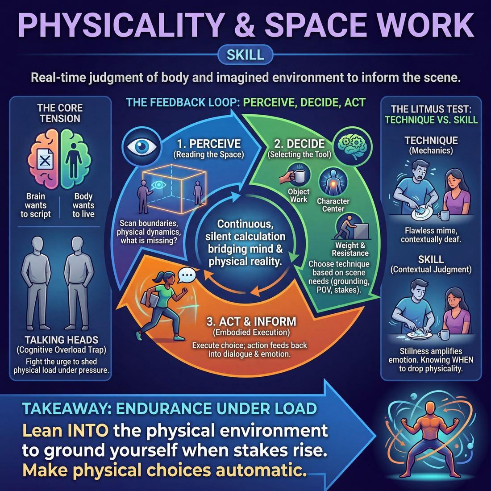
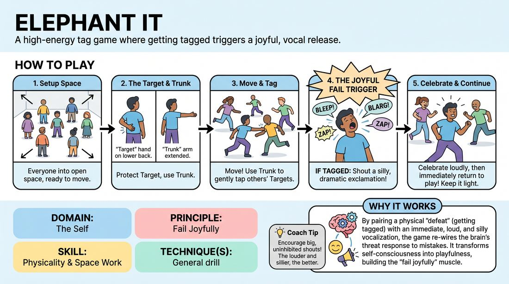
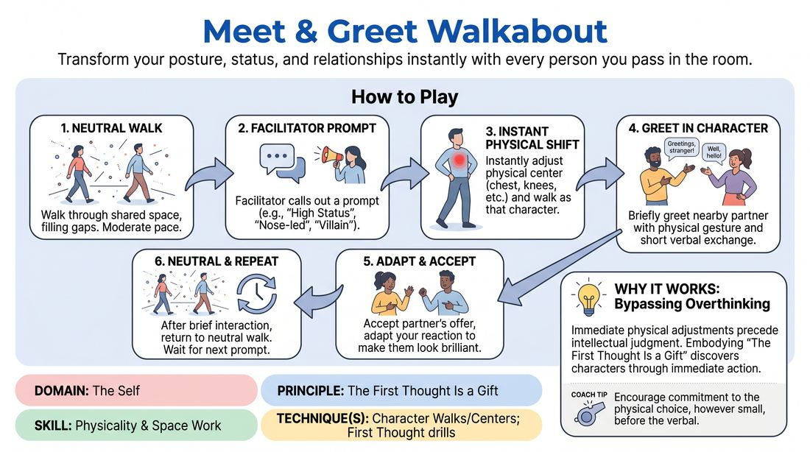

# Week 04 — Your Body Speaks
> *Character lives in how you move and hold space.*

| Course | Week | Domain | Focus | Stage |
|---|---|---|---|---|
| Foundations — The Brave Beginner | 4/16 | D1 — The Self | `D1.S3` — Physicality & Space Work | Novice → Advanced Beginner |

## ⏱️ Session flow (60 minutes)

| Time | Block |
|---|---|
| **0:00–0:05** | 🤝 Arrival & safety check-in |
| **0:05–0:15** | 🔥 Warm-up — *Trunk Tag* |
| **0:15–0:27** | 🧠 Theory — *Physicality & Space Work* |
| **0:27–0:52** | 🎲 Game 1 — *Walkabout Greetings* |
| **0:52–1:00** | 💭 Reflection & debrief |

## 1. 🧠 Today's theory

**Focus:** `D1.S3` — Physicality & Space Work  
**Maturity goal today:** Novice → Adv. Beginner: character walks/centers; basic object work.

{ .infographic }

- **The big idea:** Character lives in how you move and hold space.
- **Where you are on the path:** Novice → Adv. Beginner: character walks/centers; basic object work.
- **The one cue to coach:** *“Lead with a body part. Let the walk find the character.”*

!!! abstract "📖 Go deeper"
    Read the full write-up: [Physicality & Space Work](../../content/01_the-self/01_S3__physicality-and-space-work.md)

## 2. 🎲 Today's games

#### Warm-up — Trunk Tag

> A high-energy tag game where getting tagged triggers a joyful, vocal release.

{ .infographic }

`Players 3+` · `~3 min` · `Complexity 1/5` · `Energy high` · `Props: none`

**Trains:** Physicality & Space Work · _connection_

**How to play**

1. Instruct all players to stand in the open space with plenty of room to move safely.
2. Have each player place one hand flat against their own lower back, palm facing outward; this hand is their 'target.'
3. Have players extend their other arm forward to act as their 'trunk' (the tagging instrument).
4. Explain the objective: players must move around the space attempting to gently tap other players' target hands with their trunk, while simultaneously protecting their own target hand.
5. Establish the 'failure trigger': whenever a player's target hand is tapped, they must instantly shout a loud, dramatic exclamation (such as a silly made-up word, a safe pseudo-swear, or a theatrical gasp).
6. Emphasize that getting tagged is not a loss, but a cue to celebrate loudly and immediately return to play.
7. Start the game with a clear signal, encouraging players to keep moving, stay light on their feet, and maintain a playful spirit.
8. Call 'freeze' after 1 to 2 minutes, as the game is highly physical and exhausting.

[Open the full game card »](../../games/D1_P2_S3_T0_G694__elephant-it.md){target=_blank rel=noopener}

#### Core game — Walkabout Greetings

> Transform your posture, status, and relationships instantly with every person you pass in the room.

{ .infographic }

`Players 4+` · `~5 min` · `Complexity 1/5` · `Energy medium` · `Props: none`

**Trains:** Physicality & Space Work · _connection_

**How to play**

1. Instruct all players to begin walking around the room at a moderate pace, filling the empty spaces and avoiding walking in a simple circle.
2. Explain that you will call out a specific relationship, social status, or character archetype.
3. Upon hearing the prompt, players must instantly adjust their physical center (e.g., leading with the chest, nose, or knees) and walk as that character.
4. When players make eye contact with someone nearby, they must briefly greet them in character using both physical gestures and a short verbal exchange.
5. Encourage players to accept whatever characterization their partner presents, instantly adapting their own reaction to make their partner look brilliant.
6. After a few moments of interaction, call out 'Keep moving' to prompt players to return to a neutral walk before the next prompt.
7. Introduce a new prompt with a different physical or status dynamic, repeating the cycle for several rounds.

[Open the full game card »](../../games/D1_P4_S3_T1_G766__meet-greet-walkabout.md){target=_blank rel=noopener}

??? note "🎒 Backup games — if you have time, or a game falls flat"
    *Swap-ins drawn from the same maturity band; not part of the timed hour.*
    - **[Evolution](../../games/D1_P2_S3_T1_G1053__evolution.md){target=_blank rel=noopener}** — `4+` · `~5m` · `Cx 1/5` · `Energy high` · _Physicality & Space Work_
    - **[Leading Centers](../../games/D1_P1_S3_T1_G1074__follow-your-nose.md){target=_blank rel=noopener}** — `3+` · `~5m` · `Cx 1/5` · `Energy medium` · _Physicality & Space Work_

## 3. 💭 Self-reflection

**Deepen your improv**
1. How did making a loud, silly sound change your reaction to getting tagged?
2. How did you balance focusing on your target (defense) while looking for opportunities to tag (offense)?

**Beyond the stage**
3. Your posture and walk broadcast status and mood before you say a word. What does your body say when you enter a meeting room — and is that what you intend?

---
⬅️ *Previous:* [W03 — The Emotional Dial](week-03.md)  ·  *Next:* [W05 — Finding Your Voice](week-05.md) ➡️
