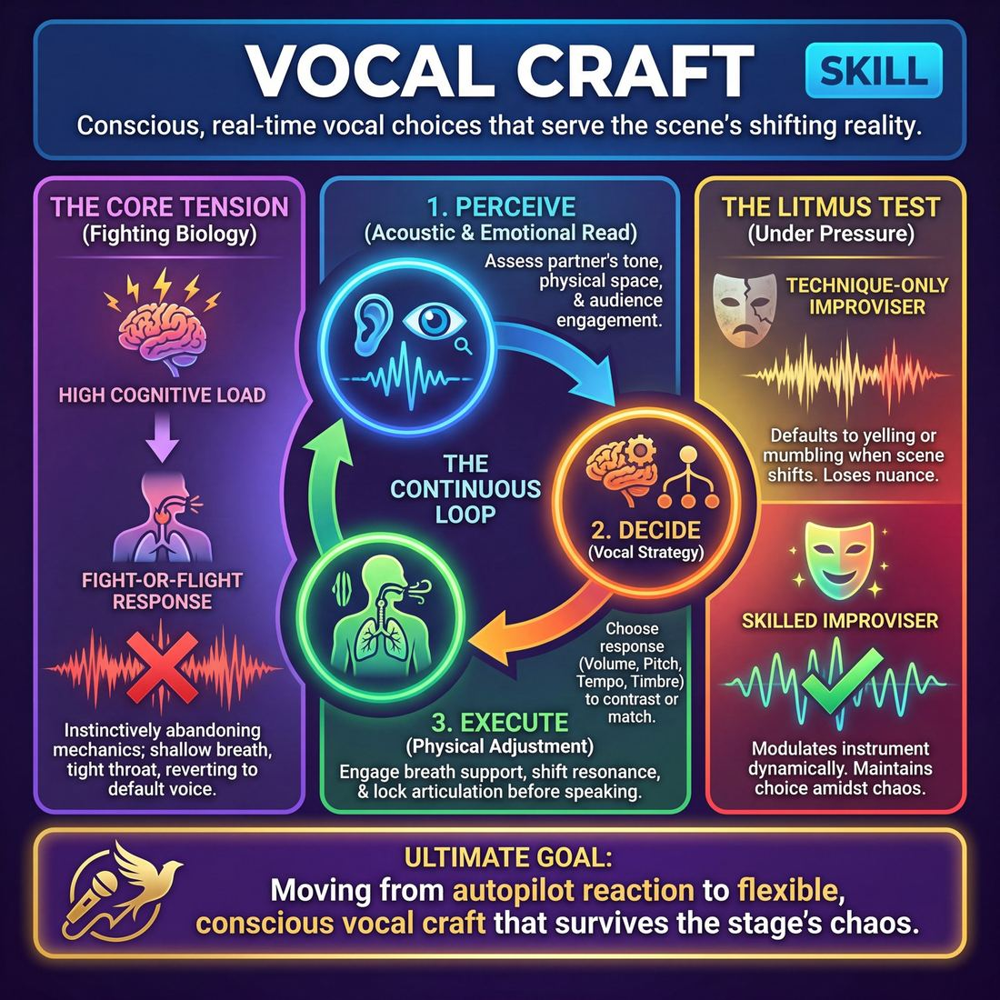

# Week 05 — Finding Your Voice
> *The voice is an instrument — project, support, characterise.*

| Course | Week | Domain | Focus | Stage |
|---|---|---|---|---|
| Foundations — The Brave Beginner | 5/16 | D1 — The Self | `D1.S4` — Vocal Craft | Novice → Advanced Beginner |

## ⏱️ Session flow (60 minutes)

| Time | Block |
|---|---|
| 0:00–0:05 | Arrival & safety check-in |
| 0:05–0:15 | Warm-up game |
| 0:15–0:27 | **1. Today's theory** |
| 0:27–0:52 | **2. Today's games** |
| 0:52–1:00 | **3. Reflection & debrief** |

## 1. 🧠 Today's theory

**Focus:** `D1.S4` — Vocal Craft  
**Maturity goal today:** Adv. Beginner: project on command; one distinct character voice.

{ .infographic }

- **The big idea:** The voice is an instrument — project, support, characterise.
- **Where you are on the path:** Adv. Beginner: project on command; one distinct character voice.
- **The one cue to coach:** *“Play to the back row. Breathe, then speak.”*

!!! abstract "📖 Go deeper"
    Read the full write-up: [Vocal Craft](../../content/01_the-self/01_S4__vocal-craft.md)

## 2. 🎲 Today's games

#### Warm-up — The Rallying Cry

> Unleash bold vocal characterizations to deliver high-energy, absurdly inspiring messages to the group.

`Players 3+` · `~5 min` · `Complexity 1/5` · `Energy high` · `Props: none`

**Trains:** Vocal Craft · _connection_

[Open the full game card »](../../games/D1_P1_S4_T2_G771__motivational-speaker.md)

#### Core game — Primal Echo

> Unleash full-body vocalizations and physical gestures to build group energy and uninhibited commitment.

`Players 3+` · `~5 min` · `Complexity 1/5` · `Energy high` · `Props: none`

**Trains:** Vocal Craft · _connection_

[Open the full game card »](../../games/D1_P1_S4_T1_G1243__primal-screams.md)

??? note "🎒 Backup games — if you have time, or a game falls flat"
    *Swap-ins drawn from the same maturity band; not part of the timed hour.*
    - **[Vocal Resonance Ripple](../../games/D1_P4_S4_T2_G316__the-echo-chamber-of-self.md)** — `6–12` · `~15m` · `Cx 2/5` · `Energy medium` · _Vocal Craft_
    - **[Arnie's Cinema](../../games/D1_P1_S4_T2_G636__arnie.md)** — `2–6` · `~5m` · `Cx 2/5` · `Energy high` · _Vocal Craft_

## 3. 💭 Self-reflection

**Deepen your improv**
1. How did committing to a strong vocal character change your physical presence and confidence on stage?
2. What did it feel like to play to the back row, and how did the audience's high-energy support affect your performance?

**Beyond the stage**
3. Where do you drop your volume or energy when you feel uncertain — in presentations, on calls? What would 'playing to the back row' look like there?

---
⬅️ *Previous:* [W04 — Your Body Speaks](week-04.md)  ·  *Next:* [W06 — Fail Joyfully & Recover](week-06.md) ➡️
