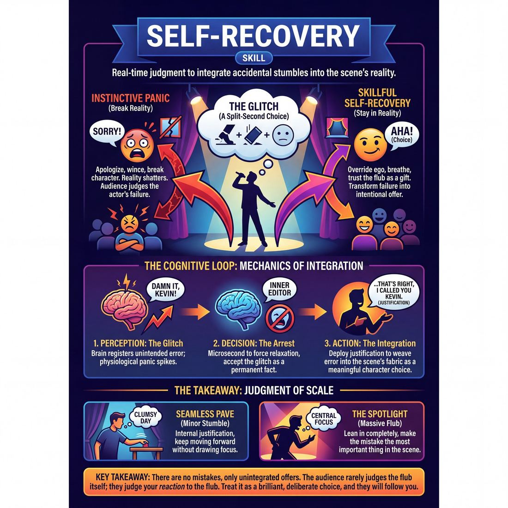

# Week 06 — Fail Joyfully & Recover
> *There are no mistakes, only choices not yet justified.*

| Course | Week | Domain | Focus | Stage |
|---|---|---|---|---|
| Foundations — The Brave Beginner | 6/16 | D1 — The Self | `D1.S6` — Self-Recovery | Novice → Advanced Beginner |

## ⏱️ Session flow (60 minutes)

| Time | Block |
|---|---|
| **0:00–0:05** | 🤝 Arrival & safety check-in |
| **0:05–0:15** | 🔥 Warm-up — *One Two Three* |
| **0:15–0:27** | 🧠 Theory — *Self-Recovery* |
| **0:27–0:52** | 🎲 Game 1 — *The Celebration Pass* |
| **0:52–1:00** | 💭 Reflection & debrief |

## 1. 🧠 Today's theory

**Focus:** `D1.S6` — Self-Recovery  
**Also touches:** `D1.S5` — Silence & Stillness  
**Maturity goal today:** Adv. Beginner: reframe a flub with 'and that's exactly what I meant.'

{ .infographic }

- **The big idea:** There are no mistakes, only choices not yet justified.
- **Where you are on the path:** Adv. Beginner: reframe a flub with 'and that's exactly what I meant.'
- **The one cue to coach:** *“Take a bow for the mistake. Then justify it.”*

!!! abstract "📖 Go deeper"
    Read the full write-up: [Self-Recovery](../../content/01_the-self/01_S6__self-recovery.md)
    · [Silence & Stillness](../../content/01_the-self/01_S5__silence-and-stillness.md)

## 2. 🎲 Today's games

#### Warm-up — One Two Three

> Transform mental slip-ups into moments of shared celebration through a fast-paced, evolving counting pattern.

{ .infographic }

`Players 2+` · `~5 min` · `Complexity 1/5` · `Energy high` · `Props: none`

**Trains:** Self-Recovery · _connection_

**How to play**

1. Instruct pairs to stand facing each other, maintaining soft eye contact.
2. Begin Round 1: Players take turns counting from 1 to 3 in a continuous loop (Player A says '1', Player B says '2', Player A says '3', Player B says '1', and so on).
3. Introduce the Failure Rule: Whenever anyone hesitates, says the wrong number, or breaks the rhythm, both players must instantly throw their hands in the air, yell 'Woohoo!' or 'Yes!', high-five, and immediately restart the count at 1.
4. Once pairs establish a steady rhythm, pause the group and introduce Round 2: Replace the number '2' with a single clap. The sequence is now '1', [Clap], '3', '1', [Clap], '3'.
5. After a minute of play, introduce Round 3: Keep the clap for '2', and replace the number '3' with a small jump or a hip-wiggle. The sequence is now '1', [Clap], [Jump].
6. Encourage players to increase their speed gradually, leaning into the chaos and celebrating every single breakdown with equal or greater enthusiasm.

[Open the full game card »](../../games/D1_P2_S6_T2_G619__1-2-3.md){target=_blank rel=noopener}

#### Core game — The Celebration Pass

> Celebrate every dropped pass with explosive, joyful applause to reframe mistakes as triumphs.

{ .infographic }

`Players 3+` · `~5 min` · `Complexity 1/5` · `Energy high` · `Props: none`

**Trains:** Self-Recovery · _connection_

**How to play**

1. Gather the group into a standing circle with enough space to make throwing and catching gestures.
2. Introduce an imaginary ball of any size, weight, or texture, and demonstrate throwing it to another player.
3. Explain the core rule: whenever the ball is thrown to you, you must attempt to catch it but fail spectacularly, letting it drop, bounce away, or slip through your fingers.
4. Instruct the rest of the group that the moment a drop occurs, everyone must instantly erupt into massive, enthusiastic cheers, applause, and celebration as if a world record was just broken.
5. After the drop and the celebration, the player who dropped the ball must joyfully retrieve it, re-establish eye contact with a new player, and throw it to them.
6. Keep the pace rapid, ensuring the ball moves quickly from person to person so everyone gets multiple opportunities to fail and be celebrated.

[Open the full game card »](../../games/D1_P2_S6_T2_G761__loserball.md){target=_blank rel=noopener}

??? note "🎒 Backup games — if you have time, or a game falls flat"
    *Swap-ins drawn from the same maturity band; not part of the timed hour.*
    - **[The Frozen Path](../../games/D1_P1_S5_T1_G981__catch-em.md){target=_blank rel=noopener}** — `3+` · `~5m` · `Cx 1/5` · `Energy medium` · _Silence & Stillness_
    - **[Epic Drop](../../games/D1_P2_S6_T2_G1159__loser-ball.md){target=_blank rel=noopener}** — `3+` · `~5m` · `Cx 1/5` · `Energy high` · _Self-Recovery_

## 3. 💭 Self-reflection

**Deepen your improv**
1. How did your physical energy change when you started celebrating your mistakes instead of apologizing for them?
2. What did you notice about your level of focus and connection with your partner as the game got more complex?

**Beyond the stage**
3. Recall a recent mistake you tried to hide. How might 'and that's exactly what I meant' — owning and reframing it — have served you better than concealment?

---
⬅️ *Previous:* [W05 — Finding Your Voice](week-05.md)  ·  *Next:* [W07 — Really Listening](week-07.md) ➡️
